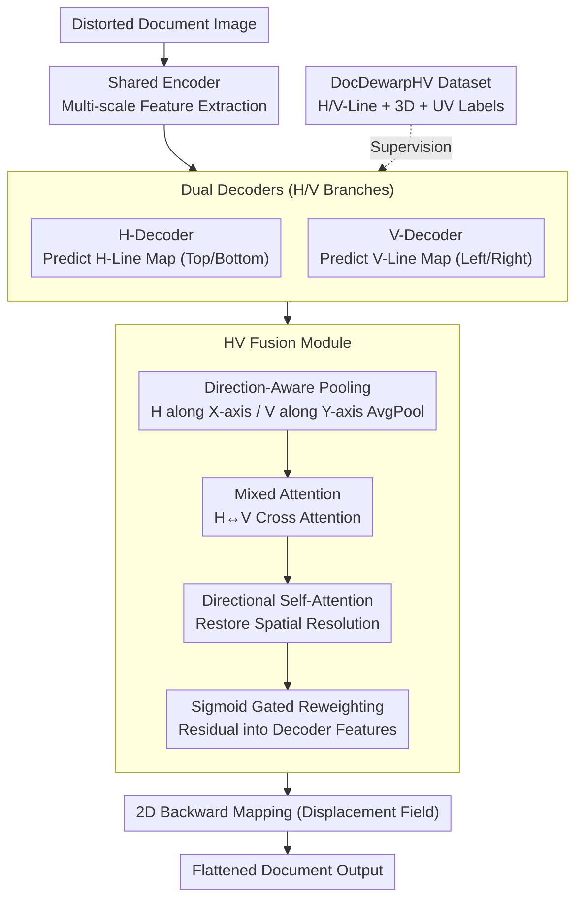

# D2Dewarp: Dual Dimensions Geometric Representation Learning Based Document Image Dewarping

**Conference**: CVPR 2026  
**arXiv**: [2507.08492](https://arxiv.org/abs/2507.08492)  
**Code**: [Available](https://github.com/xiaomore/D2Dewarp)  
**Area**: Self-Supervised Learning / Document Image Understanding  
**Keywords**: Document Dewarping, Dual Dimension, Geometric Lines, UNet, HV Fusion

## TL;DR

Ours introduces D2Dewarp, the first dewarping method to learn document geometric representations from both horizontal and vertical dimensions. A UNet with dual decoders predicts horizontal lines (top/bottom boundaries of text lines/tables) and vertical lines (left/right boundaries) separately. The HV Fusion Module integrates features from both directions via mixed attention. Additionally, the DocDewarpHV dataset, containing 114K images with dual-dimension annotations, is constructed to support this framework.

## Background & Motivation

### 1. Background

Document Image Dewarping aims to restore curved or crumpled document images to a flat state, serving as a critical preprocessing step for OCR and document analysis. Existing methods are categorized into: (i) 3D coordinate regression (e.g., DewarpNet); (ii) 2D optical flow/displacement field methods (e.g., DocTr); (iii) geometric line-based methods (e.g., RDGR), which provide geometric constraints by predicting text line boundaries.

### 2. Limitations of Prior Work

- **Focus on horizontal lines only**: Methods like RDGR utilize only horizontal geometric lines (upper/lower text boundaries), completely ignoring vertical structural information.
- **Neglected vertical distortion**: Vertical bending is significant in scenarios like book gutters, table column boundaries, and multi-column layouts, yet no method explicitly models it.
- **Insufficient feature fusion**: Even if both horizontal and vertical features are extracted, the lack of an effective cross-fusion mechanism prevents the full utilization of complementary information.
- **Lack of annotated data**: Existing datasets (Doc3D, DocUNet) do not provide vertical line annotations, limiting the feasibility of dual-dimension learning.

### 3. Key Challenge

Document distortion is inherently a 2D spatial deformation, but existing methods rely on 1D (horizontal) geometric constraints, leading to fundamental information incompleteness.

### 4. Goal

To leverage geometric structural information from both horizontal and vertical dimensions simultaneously to guide document dewarping, supported by a specialized dataset.

### 5. Key Insight

Starting from dual-dimension geometric representation learning: learn structural features of horizontal and vertical lines separately, then fuse complementary information from both directions via an attention mechanism to generate high-quality deformation mappings.

## Method

### Overall Architecture

Document dewarping addresses how to "flatten" a distorted photograph. D2Dewarp's core premise is that document curvature is a 2D problem; horizontal text lines are insufficient when vertical table columns and binding lines are also warped. It utilizes a UNet architecture: an image enters a shared encoder to extract multi-scale features, then branches into two decoders—one for the H-Line Map (horizontal) and one for the V-Line Map (vertical). These decoders exchange information through the HV Fusion Module at intermediate layers. The model finally outputs a 2D backward mapping (displacement field), directing each distorted pixel to its correct position in a flat document. Geometric lines serve as both signals and constraints, anchoring abstract "deformation" to concrete structural boundaries. This training is enabled by the newly created DocDewarpHV dataset.

### Key Designs

**1. Dual Decoders: Decoupled Learning of H and V Geometric Lines**

Previous methods like RDGR only predicted horizontal lines—the boundaries for text lines, table rows, or paragraphs—reflecting vertical bending. However, vertical structures like table columns and book gutters (V-Lines) also carry crucial curvature information. D2Dewarp splits the path after the shared encoder into H-Decoder and V-Decoder. This prevents geometric features from interfering within a single path, allowing each branch to focus on its specific directional bending pattern.

**2. HV Fusion Module: Explicit Cross-Directional Feature Interaction**

Since horizontal and vertical warping are physically coupled, an explicit exchange of context is required. Unlike simple concatenation, HV Fusion uses a four-step process: **Direction-Aware Pooling** (AvgPool along the X-axis for H and Y-axis for V to reduce redundant dimensions); **Mixed Attention** (cross-attention between pooled H/V features); **X/Y Self-Attention** to restore spatial resolution; and **Sigmoid Gating** to reweight and merge fused features back into the decoder. This "pool-then-cross" approach is more computationally efficient and directionally focused than standard global attention.

**3. DocDewarpHV Dataset: Filling the Gap in Vertical Annotations**

Existing datasets like Doc3D only provide horizontal annotations. Ours constructs DocDewarpHV using Blender to render flat documents onto curved 3D meshes, automatically extracting geometric H and V boundary lines. Each image includes 3D coordinates, UV mapping, H-Line maps, and V-Line maps. With 114,000 images (512×512), it surpasses Doc3D in both scale and annotation diversity, covering text-only, tabular, and mixed layouts.

### Loss & Training

The total loss is a weighted sum of reconstruction loss and line prediction loss:

$$\mathcal{L} = \alpha \cdot \mathcal{L}_{\text{rec}} + \mathcal{L}_{\text{line}}$$

- **$\mathcal{L}_{\text{rec}}$ (Reconstruction Loss)**: L1 loss calculating pixel-level differences between predicted backward mapping and GT displacement fields.
- **$\mathcal{L}_{\text{line}}$ (Line Prediction Loss)**: Weighted BCE loss for H-Line and V-Line maps. Positive samples (line pixels) are weighted to mitigate extreme class imbalance (lines usually occupy < 5% of pixels).
- **Weight $\alpha$**: Hyperparameter to balance reconstruction and structural constraints.

Training config: Adam optimizer, learning rate 1e-4, batch size 16, 300 epochs. Trained on DocDewarpHV and tested on DocUNet, DIR300, and WarpDoc benchmarks.

## Key Experimental Results

### Main Results

**Table 1: Comparison on DocUNet Benchmark (130 real distorted documents)**

| Method | MS-SSIM↑ | LD↓ | CER↓ |
|------|----------|-----|------|
| DewarpNet | 0.4735 | 8.39 | 0.4210 |
| DocTr | 0.5105 | 7.76 | 0.3561 |
| DocGeoNet | 0.5040 | 7.71 | 0.3806 |
| RDGR | 0.5224 | 7.61 | 0.3343 |
| RecDocNet | 0.5198 | 7.42 | 0.3482 |
| **D2Dewarp (Ours)** | **0.5387** | **7.18** | **0.3127** |

**Table 2: Comparison on DIR300 Benchmark (300 documents)**

| Method | MS-SSIM↑ | LD↓ |
|------|----------|-----|
| DewarpNet | 0.4868 | 8.98 |
| DocTr | 0.5241 | 7.94 |
| RDGR | 0.5356 | 7.63 |
| **D2Dewarp (Ours)** | **0.5521** | **7.28** |

### Ablation Study

**Table 4: Core Component Ablation (DocUNet Benchmark)**

| Configuration | MS-SSIM↑ | LD↓ |
|------|----------|-----|
| Baseline (Single Decoder + H-Line only) | 0.5224 | 7.61 |
| + V-Line Branch (Dual Decoder, no fusion) | 0.5298 | 7.42 |
| + Simple Concat Fusion | 0.5315 | 7.36 |
| + HV Fusion Module (Full) | **0.5387** | **7.18** |

### Key Findings

1. **Dual dimensions significantly outperform single dimension**: Adding the V-Line branch alone (even without fusion) improves MS-SSIM from 0.5224 to 0.5298, confirming the importance of vertical geometric information.
2. **Fusion mechanism is critical**: The HV Fusion Module contributes an additional 0.72% MS-SSIM gain over simple concatenation, proving direction-aware design is superior to naive attention.
3. **Consistently SOTA across three benchmarks**: Ours leads in all metrics (MS-SSIM, LD, CER) on DocUNet, DIR300, and WarpDoc.
4. **Substantial OCR improvement**: CER decreased by 6.5% compared to RDGR on DocUNet, indicating that higher dewarping quality directly benefits downstream recognition.

## Highlights & Insights

- **Addressing a neglected blind spot**: While document distortion is 2D, prior works relied on 1D constraints. D2Dewarp identifies and solves this fundamental limitation.
- **End-to-end dual-dimension learning**: The architecture ensures efficiency while achieving directional feature complementarity.
- **Dataset contribution**: DocDewarpHV (114K images) is a vital contribution to the community, removing the bottleneck of missing vertical line labels.
- **Direction-aware attention**: Pooling along corresponding axes before cross-attention is more efficient and geometrically meaningful than standard global attention.

## Limitations & Future Work

- Domain gap between 3D rendered data and real-world distributions may still limit generalization.
- H-Line and V-Line definitions rely on regular structures (text, tables); performance might degrade for handwritten or highly irregular layouts.
- Dual decoders increase parameter count and FLOPs by approximately 40%, potentially limiting mobile deployment.
- HV Fusion is currently fixed at specific layers; future work could explore multi-scale fusion.

## Related Work & Insights

- **RDGR [Li et al.]**: A baseline using horizontal text lines; D2Dewarp extends this from 1D to 2D.
- **DewarpNet [Das et al.]**: First end-to-end deep learning method using 3D coordinates; D2Dewarp demonstrates that geometric lines can be more effective than raw 3D coordinates.
- **Doc3D [Das et al.]**: Standard dataset for dewarping; DocDewarpHV improves upon it with V-Line labels and a larger scale.
- **Insight**: Directional decoupling can be extended to other tasks, such as layout analysis (simultaneous horizontal/vertical cutting) or table recognition (modeling row and column lines separately).

## Rating

- Novelty: ⭐⭐⭐⭐ First systematic introduction of dual-dimension modeling.
- Experimental Thoroughness: ⭐⭐⭐⭐⭐ Comprehensive evaluation across three benchmarks and detailed ablations.
- Writing Quality: ⭐⭐⭐⭐ Clear structure with intuitive visualizations.
- Value: ⭐⭐⭐⭐ Significant contribution via the DocDewarpHV dataset.

<!-- RELATED:START -->

## Related Papers

- [\[CVPR 2026\] Text-Phase Synergy Network with Dual Priors for Unsupervised Cross-Domain Image Retrieval](text-phase_synergy_network_with_dual_priors_for_unsupervised_cross-domain_image_.md)
- [\[ICCV 2025\] A Token-level Text Image Foundation Model for Document Understanding (TokenFD/TokenVL)](../../ICCV2025/self_supervised/a_tokenlevel_text_image_foundation_model_for_document_unders.md)
- [\[ICLR 2026\] CARL: Camera-Agnostic Representation Learning for Spectral Image Analysis](../../ICLR2026/self_supervised/carl_camera-agnostic_representation_learning_for_spectral_image_analysis.md)
- [\[CVPR 2026\] Dual-Estimator: Decoupling Global and Local Semantic Shift for Drift Compensation in Class-Incremental Learning](dual-estimator_decoupling_global_and_local_semantic_shift_for_drift_compensation.md)
- [\[CVPR 2026\] DGS: Dual Gradient and Semantic-Shift Guided Low-Rank Adaptation for Class Incremental Learning](dgs_dual_gradient_and_semantic-shift_guided_low-rank_adaptation_for_class_increm.md)

<!-- RELATED:END -->
