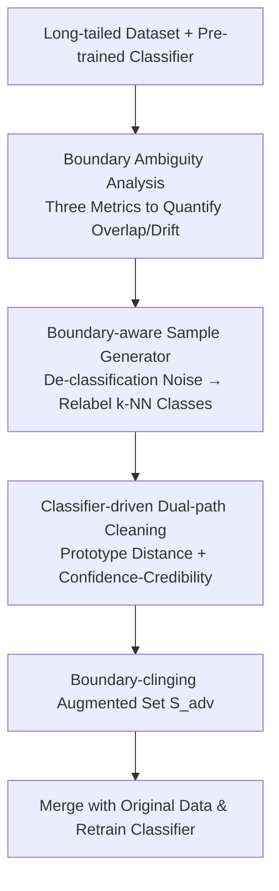

# Decision Boundary-aware Generation for Long-tailed Learning

**Conference**: CVPR 2026  
**arXiv**: [2605.01468](https://arxiv.org/abs/2605.01468)  
**Code**: https://github.com/keepdigitalabc-svg/DBG (Available)  
**Area**: Long-tailed Learning / Generative Data Augmentation / Diffusion Models  
**Keywords**: Long-tailed Recognition, Decision Boundary, Diffusion Generative Augmentation, Adversarial Examples, Data Cleaning

## TL;DR
Aiming at the problem where using "diffusion models + head-to-tail feature transfer" to supplement long-tail data implicitly leaks head-class features into tail-classes and blurs decision boundaries, this paper first quantifies "boundary ambiguity" using three metrics. It then proposes DBG: using adversarial de-classification noise to push samples near the decision boundary and relabeling them with the $k$ most confusable classes, followed by a classifier-driven dual-path cleaning to discard harmful samples. On CIFAR-LT, DBG consistently reduces inter-class overlap and improves tail-class and overall accuracy for all generative baselines.

## Background & Motivation
**Background**: Long-tailed data causes the classifier's decision boundaries to bias toward head classes and compress tail classes, leading to poor tail-class accuracy. A major recent approach is using diffusion models for generative augmentation to supplement tail samples, further introducing **head-to-tail transfer**—borrowing features from data-rich head classes to synthesize tail samples. This mitigates the "bias toward head classes" inherited by the generator from long-tailed data, making the decision space more uniform.

**Limitations of Prior Work**: These methods focus solely on "making the decision space more uniform" but rarely analyze the side effects of head-to-tail transfer. This paper points out that while balancing the decision space, head-to-tail transfer introduces **latent, uncontrolled non-local feature leakage**—head features mix into tail samples, causing class distributions to become entangled, resulting in **inter-class overlap** and **tail drift**. The result is a "more uniform but highly overlapping" decision space, where the benefits of tail-class learning are negated. The authors name this problem **boundary ambiguity**.

**Key Challenge**: Uniformity and separability are being conflated. Head-to-tail transfer only optimizes the balance of class distributions while sacrificing inter-class separability; however, it is the latter that truly determines classification difficulty. Without a balanced reference, leaked features are difficult to decouple.

**Goal**: (1) Transform the phenomenon of "boundary ambiguity," previously only a qualitative observation, **into a measurable quantity**; (2) Design a generation scheme to actively supplement effective samples **near the boundary** to "re-sharpen" the decision boundaries blurred by leaked features.

**Key Insight**: Rather than "smearing" tail classes with head features (transfer), it is better to take a different perspective—since the problem lies at the boundary, **create samples directly near the boundary**. Drawing from adversarial attacks, adversarial noise can push samples across decision boundaries while maintaining visual semantics, which is ideal for generating informative samples "clinging to the boundary."

**Core Idea**: Use adversarial "de-classification + relabeling to nearest neighbor classes" to generate boundary samples, then use a classifier to clean out harmful generated samples, thereby repairing the decision space to be "both uniform and separable" while supplementing data.

## Method

### Overall Architecture
The input to DBG is a long-tailed dataset and a classifier pre-trained on it; the output is an augmented set of "boundary-clinging" samples $S_{adv}$, used as a plug-and-play auxiliary training set merged with the original data $\mathcal{D}_{\mathrm{aug}}=\mathcal{D}\cup\{(x,\tilde{y}):x\in S_{adv}\}$ to retrain the classifier. The pipeline consists of three steps: first, use **Boundary Ambiguity Analysis** (three metrics) to diagnose why head-to-tail transfer is harmful; second, use a **Boundary-aware Sample Generator** to create boundary samples; finally, use **Classifier-driven Dual-path Cleaning** to filter out harmful samples. The former is for diagnosis, while the latter two are the core components of DBG.

### Key Designs

**1. Quantitative Metrics for Boundary Ambiguity: Turning "Blurred Boundaries" into Measurable Numbers**

Previously, one could only qualitatively state that "head-to-tail transfer blurs boundaries" without proof or comparison. The authors design three complementary metrics to measure the uniformity and separability of the decision space. **Inter-class overlap degree**: Project $L_2$ normalized test features onto a unit hypersphere $y=z/\|z\|_2$, fit a von Mises–Fisher density $p_c(y)=C_d(\kappa_c)\exp(\kappa_c\mu_c^\top y)$ for each class, and use the Bhattacharyya coefficient $\widehat{\mathrm{BC}}(c,c')=\log(\frac{1}{m}\sum_i\sqrt{p_c(y)p_{c'}(y)})$ to measure overlap; lower BC means better separability. **Outlier rate**: Calculate the intra-class nearest neighbor distance $d_i^{(c)}$ for each test sample; samples exceeding a normalized threshold $\lambda$ are marked as outliers $o_i^{(c)}=\mathbb{I}[s_i^{(c)}>\lambda]$. The class outlier rate $\eta_c=\frac{1}{n_c}\sum_i o_i^{(c)}$ reflects intra-class distribution drift. **Generation confidence**: Use a modified CFG guidance $\hat{\varepsilon}_{tm}=(1-s)\varepsilon_\theta(x_t,y_t,t)+s\,\varepsilon_\theta(x_t,y_d,t)$ to generate mixed target $y_t$ and distractor $y_d$ classes, then feed them to a balanced classifier to check confidence $Conf=\ell_{y_t}(x_g)$ and credibility $Cred=p_{(1)}-p_{(d)}$; lower values indicate heavier feature entanglement. Experiments confirm: introducing head-to-tail transfer increases inter-class overlap, raises outlier rates (especially for tail classes), and decreases generation confidence—three pieces of evidence confirming "head-to-tail transfer is a double-edged sword."

**2. Boundary-aware Sample Generator: De-classification to the Boundary, then Relabeling to Nearest Classes**

To supplement boundary information, the generator operates in two stages. **Conditional noising**: First, use random noise to push samples to a middle timestep $x_m=\sqrt{\bar\alpha_m}x_0+\sqrt{1-\bar\alpha_m}\hat\epsilon_r$ ($m=T/2$, facilitating deep class feature modification). Then, under the guidance of the **source label $y_{sl}$**, iterate $K=T/10$ steps to predict and suppress class-specific noise $\hat\varepsilon_c=\varepsilon_\theta(x_t,y_{sl},t)$—this step balances between "erasing class-specific features to pull samples toward the boundary" and "not drifting too far from the source manifold." **Conditional denoising**: Use standard CFG for reverse denoising $x_{t-1}=\sqrt{\bar\alpha_{t-1}}\hat{x}_0+\sqrt{1-\bar\alpha_{t-1}}\hat\varepsilon_t(x_t,t,\tilde{y})$, but the **relabeling target $\tilde{y}$ is chosen from the $k$ classes most confusable with the ground truth $x_0$**: $\tilde{y}=\arg\max_{c\in\mathcal{C}_k(x_0)}f(x_0)$, where $\mathcal{C}_k(x_0)=\mathrm{TopK}(f(x_0),k)$, $k=\lfloor C/w\rfloor$ ($C$ is the total class count, $w$ is a stability weight). Samples generated this way are near boundaries without major semantic jumps, feeding the classifier the most "need-to-be-reinforced" confusing boundaries. Compared to head-to-tail transfer which crudely smothers tail classes with head features, this targetedly supplements **boundaries** rather than **class centers**.

**3. Classifier-driven Dual-path Cleaning: Discarding "Harmful Hard Samples" Produced by the Generator**

The generator inherits bias from long-tailed data, and its feature space is not aligned with the classifier, producing adversarial samples with incorrect class features. These hard samples, instead of providing accurate boundary supervision, further destroy boundaries. Cleaning uses two **parallel** branches. **Prototype-distance filtering**: Train a classifier $f_\theta$ on source long-tailed data using logit adjustment loss, calculate normalized prototypes $\mu_k=\frac{1}{N_k}\sum \tilde{z}(x_i)$ for each class, and then calculate the cosine distance $d_c(\hat{x}_0)=1-\langle \tilde{z}(\hat{x}_0),\mu_k\rangle$ of each generated sample to the target class prototype. Samples falling outside the class-adaptive acceptance interval $[(1-l)d_c^l,(1+h)d_c^h]$ (extreme outliers or those too far from the boundary) are discarded. **Confidence-credibility filtering**: Calculate confidence and credibility using Eq. 7 (using the second-highest prediction for the distractor class) with a class-specific threshold $a$. **Samples are deleted only when they are misclassified into a class that is neither the source nor the target with high confidence and credibility**—this rule is deliberately insensitive to long-tail bias, avoiding the accidental deletion of already scarce tail samples. The remaining $S_{adv}$ after dual-path cleaning serves as the plug-and-play auxiliary set to repair boundaries.

### Loss & Training
DBG does not change the classifier's loss function; it is a data-level plug-and-play solution. After cleaning, $S_{adv}$ is merged with the original long-tailed data for standard retraining. Hyperparameters: $w=3$, $l=0.02$, $h=0.05$ (CIFAR), confidence threshold $a$ linearly annealed from 0.9 to 0.5, and outlier threshold $\lambda$ averaged over 5 values in $[2.5, 3.0]$. Classifier backbones: ResNet-32 (200 epochs, batch 128, initial lr 0.1, $\times 0.1$ at 160/180 epochs) and ViT-B/16 (100 epochs, batch 32, lr $1\times10^{-4}$, weight decay 0.01).

## Key Experimental Results

### Main Results
DBG is applied as a plug-and-play auxiliary set on four generative baselines (CBDM-based, CBDM, OCLT, DiffuLT). Results are reported for CIFAR100-LT / CIFAR10-LT across two backbones and three imbalance ratios (10/100/200), showing Head/Med/Tail/All Top-1 accuracy. Below are representative results for ResNet-32 on CIFAR100-LT with an imbalance ratio of 100 (%):

| Baseline | Head | Med | Tail | All | +DBG All |
|----------|------|-----|------|-----|----------|
| CBDM-based | 66.30 | 52.85 | 25.93 | 48.81 | **50.37** |
| CBDM | 69.10 | 53.75 | 28.60 | 50.81 | **51.21** |
| OCLT | 68.70 | 52.38 | 25.73 | 49.28 | **50.25** |
| DiffuLT | 68.10 | 51.20 | 29.37 | 49.72 | **51.07** |

Overall improvement is more robustly measured by the "Average across all datasets (AVG column)": on ResNet-32/CIFAR100-LT, CBDM-based + DBG improves by an average of ↑1.57, and DiffuLT ↑0.60. For ViT-B/16, the gains are more pronounced, with CBDM-based + DBG ↑1.93 and DiffuLT ↑2.00 on CIFAR100-LT. The improvement mainly lies in tail classes (e.g., CBDM-based tail accuracy 25.93→26.72, DiffuLT ratio-200 tail accuracy 19.13→19.43), confirming that "boundary-clinging samples primarily strengthen tail-class separability."

| Backbone / Dataset | CBDM-based+DBG | DiffuLT+DBG |
|---------------|----------------|-------------|
| ResNet-32 / CIFAR100-LT (AVG) | ↑1.57 | ↑0.60 |
| ResNet-32 / CIFAR10-LT (AVG) | ↑0.65 | ↑0.30 |
| ViT-B/16 / CIFAR100-LT (AVG) | ↑1.93 | ↑2.00 |
| ViT-B/16 / CIFAR10-LT (AVG) | ↑1.61 | ↑1.51 |

The only negative result is ResNet-32 + CBDM on CIFAR10-LT with AVG ↓0.13—authors explain that CBDM already possesses strong tail-bias loss that balances tail classes well, squeezing out DBG's marginal gain, though the overall decision space remains superior. ⚠️ Note when comparing that different backbones/ratios have different difficulties; AVG is an average across three ratios and cannot be compared directly to single "All" results.

### Ablation Study
On CIFAR100-LT, imbalance ratio 100, ResNet-32, retraining the classifier from scratch, sequentially removing Generation (Gen.), Prototype-distance filtering (PD.), and Confidence-credibility filtering (CC.):

| Config | Head | Med | Tail | All | Description |
|------|------|-----|------|-----|------|
| Standard Training (No Aug) | 64.1 | 35.6 | 8.6 | 36.1 | LT Baseline |
| CBDM-based | 66.3 | 52.8 | 25.9 | 48.8 | Generative Baseline |
| Gen. only | 66.4 | 50.5 | 23.2 | 47.0 | Gen without cleaning; performance drops |
| Gen.+PD. | 69.2 | 52.7 | 27.6 | 50.1 | With prototype distance filtering |
| Gen.+CC. | 68.4 | 48.9 | 23.5 | 47.1 | With only confidence-credibility filtering |
| Full (Gen.+PD.+CC.) | **70.1** | **53.4** | **26.7** | **50.4** | Full DBG |

### Key Findings
- **Cleaning is essential, not optional**: Generation without cleaning (Gen. only) yields an All-acc of 47.0, lower than CBDM-based's 48.8—uncleaned adversarial samples truly destroy boundaries. Only with both filters does it reach 50.4.
- **Prototype-distance filtering contributes most**: Gen.+PD. alone reaches 50.1, while Gen.+CC. only reaches 47.1. Removing PD causes the sharpest drop, indicating that "discarding outliers/samples too far from the boundary" is the primary driver of cleaning.
- **Hyperparameter robustness**: Minor changes in $h$ and $l$ (Table 6) have minimal impact on overall accuracy (Overall between 49.3–50.4); authors claim these are optimal values and the method is robust.
- **Quantitative verification of boundary quality**: After injecting DBG data, inter-class overlap and outlier rates consistently decrease across baselines. t-SNE also shows increased inter-class distance and more compact intra-class distributions, proving boundaries are "sharpened."

## Highlights & Insights
- **Converting blurred concepts into measurable metrics, then driving design via metrics**: The three metrics (vMF+BC overlap, nearest-neighbor outlier rate, modified CFG generation confidence) serve as both diagnostic tools and acceptance criteria. The scientific loop of "proving the problem exists, then solving it targetely" is very complete; this measurement framework can be reused for "health checks" in any generative long-tail work.
- **New use for adversarial attacks**: Adversarial noise is typically used for attacks or robustness evaluation; here it is reversed into a tool to "precisely push samples to decision boundaries." Relabeling toward Top-K confusing classes means specifically reinforcing the boundaries where the classifier struggles most, which is more purposeful than the blind smearing of head-to-tail transfer.
- **The decoupled "Generation + Cleaning" logic is transferable**: The generator focuses solely on creation while the cleaner focuses on screening. The cleaner is deliberately designed to be insensitive to long-tail bias (using class-aware thresholds and only deleting high-confidence misclassifications to third-party classes). This paradigm of "loose generation, conservative cleaning, without re-introducing bias" has significant reference value for any augmentation task with varying generation quality.

## Limitations & Future Work
- Authors admit that the long-tail bias inherited by the diffusion model itself still weakens the effectiveness of DBG-generated samples—the source bias is not fundamentally cured; DBG is a downstream remedy.
- Experiments are validated only on small datasets (CIFAR10/100-LT), lacking evidence from large-scale long-tail benchmarks like ImageNet-LT or iNaturalist; generalization evidence is relatively weak. The magnitude of improvement is generally small (most AVG improvements are <1%, with occasional negative results on CBDM).
- Several hyperparameters ($w/l/h/a/\lambda$) are introduced; while $h$ and $l$ are claimed to be insensitive, per-class adaptive intervals and confidence threshold annealing still require tuning, and the multi-stage pipeline of generation + cleaning + retraining has non-negligible computational overhead.
- Future work: Authors plan to study adaptive cleaning and adaptation for fine-tuning based methods to further repair tail decision boundaries. Potential extensions include making the "three metrics" differentiable rewards for training rather than just ex-post augmentation tools.

## Related Work & Insights
- **vs. Head-to-tail Transfer methods (DiffuLT / Shao et al.)**: These synthesize tail classes using head features for a "uniform decision space." This paper proves this introduces non-local feature leakage and increases overlap. DBG avoids transfer, using adversarial boundary generation + cleaning for a space that is "both uniform and separable." DBG can be layered on top of these methods.
- **vs. Adversarial samples for LT augmentation (Liu et al.)**: Existing work uses adversarial attacks on head samples to reconstruct tail samples; DBG uses adversarial de-classification to push samples to the boundary and relabel toward $k$-NN confusing classes. The goal is supplementing boundary knowledge rather than pure reconstruction, with added dual-path cleaning to prevent backfiring from harmful adversarial samples.
- **vs. Pure Diffusion Generation (CBDM)**: CBDM trains diffusion on long-tailed data to fill missing samples. DBG **superimposes** a boundary-clinging auxiliary set on top of such generated data, serving as an orthogonal, plug-and-play enhancement. Experiments show it is effective across all baselines (CBDM, OCLT, DiffuLT).

## Rating
- Novelty: ⭐⭐⭐⭐ Designing measurable metrics for "boundary ambiguity" and using adversarial de-classification to supplement boundaries is a novel perspective with solid diagnosis.
- Experimental Thoroughness: ⭐⭐⭐ Covers two backbones, four baselines, and three imbalance ratios with ablation and quantitative boundary analysis, but limited to CIFAR-LT with generally small gains and missing large-scale benchmarks.
- Writing Quality: ⭐⭐⭐ Motivation and metrics are clear, but there are several typos in abbreviations (DBG/GBT/DGB) and naming ("Generative Boundary-aware"), and formula typesetting is somewhat messy.
- Value: ⭐⭐⭐⭐ The three-metric measurement tool + "generation-cleaning" decoupled paradigm has universal reference value for generative long-tail augmentation.

<!-- RELATED:START -->

## Related Papers

- [\[CVPR 2026\] Trust-calibrated Collaborative Learning for Long-Tailed Visual Recognition](trust-calibrated_collaborative_learning_for_long-tailed_visual_recognition.md)
- [\[CVPR 2026\] CUE: Concept-Aware Multi-Label Expansion to Mitigate Concept Confusion in Long-Tailed Learning](cue_concept-aware_multi-label_expansion_to_mitigate_concept_confusion_in_long-ta.md)
- [\[CVPR 2026\] Reframing Long-Tailed Learning via Loss Landscape Geometry](reframing_long-tailed_learning_via_loss_landscape_geometry.md)
- [\[ICLR 2026\] SCAD: Super-Class-Aware Debiasing for Long-Tailed Semi-Supervised Learning](../../ICLR2026/self_supervised/scad_super-class-aware_debiasing_for_long-tailed_semi-supervised_learning.md)
- [\[CVPR 2026\] AdaPrior: Bayesian-Inspired Adaptive Prior Correction for Long-Tailed Continual Learning](adaprior_bayesian-inspired_adaptive_prior_correction_for_long-tailed_continual_l.md)

<!-- RELATED:END -->
