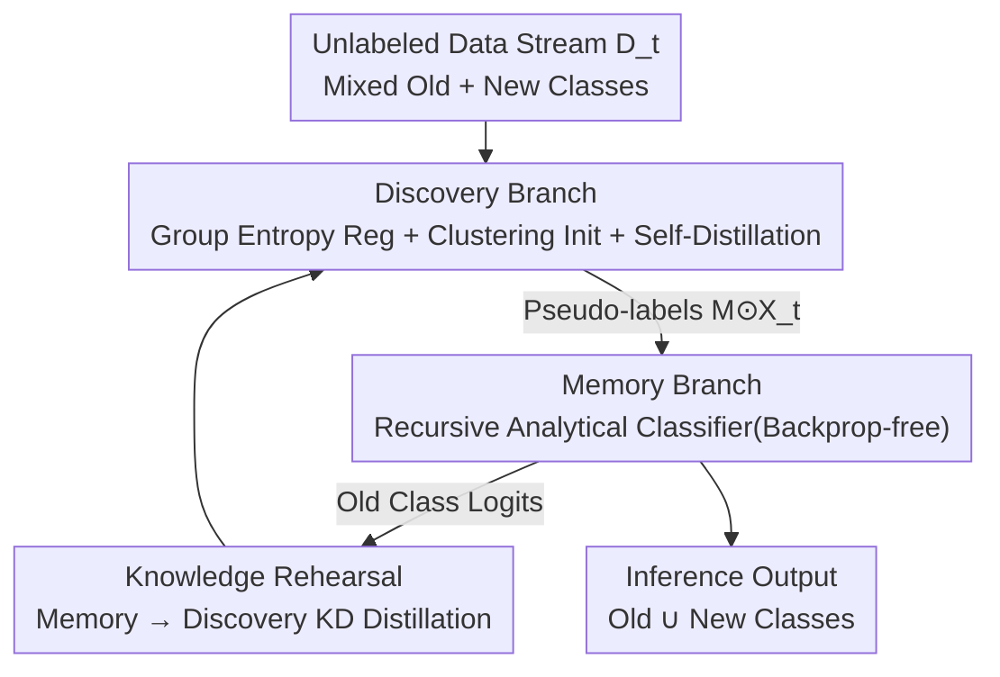

# Decouple Your Discovery and Memory in Continual Generalized Category Discovery

**Conference**: CVPR 2026  
**Paper**: [CVF Open Access](https://openaccess.thecvf.com/content/CVPR2026/html/Yu_Decouple_Your_Discovery_and_Memory_in_Continual_Generalized_Category_Discovery_CVPR_2026_paper.html)  
**Code**: Not provided by the authors  
**Area**: Continual Learning / Generalized Category Discovery  
**Keywords**: Continual Generalized Category Discovery, Dual-branch Decoupling, Analytical Learning, Catastrophic Forgetting, Stability-Plasticity Trade-off  

## TL;DR
Addressing the limitation in Continual Generalized Category Discovery (C-GCD) where "over-protection of old classes to prevent forgetting crushes the discovery of new classes," this paper proposes the DYDM dual-branch framework. It utilizes a discovery branch to recognize new classes without constraints and a memory branch using backprop-free Recursive Least Squares (RLS) analytical classifiers to stably retain all old classes. Coupled by a knowledge rehearsal distillation loop, the method achieves significant improvements in both new class and overall accuracy across four benchmarks (CAA improves by 3.2–9.9% over SOTA Happy).

## Background & Motivation
**Background**: In real-world scenarios, category boundaries are not fixed, and new classes emerge continuously over time. Generalized Category Discovery (GCD) requires models to recognize both "seen old classes" and "unseen new classes" from unlabeled data, but it typically only performs discovery in a single-stage static setting. Extending GCD to a continuous data stream without allowing re-visiting of past data (replay-free) defines **Continual Generalized Category Discovery (C-GCD)**: at each stage $t\ge1$, a batch of unlabeled data $D_t$ containing both old and new classes arrives, and the model must discover new classes while remembering old ones.

**Limitations of Prior Work**: Existing C-GCD methods (e.g., feature distillation methods, SOTA Happy) generally use strong regularization, such as **feature distillation or prototype replay**, to "weld" the model to the feature space of the previous stage to resist catastrophic forgetting. The authors conducted a crucial empirical analysis (CIFAR100, 6 and 11 stages): while these anti-forgetting strategies increase stability (old class accuracy) and overall accuracy, the **cost is a collapse in plasticity (new class accuracy)**—rigid regularization prevents the natural evolution of class distributions in the feature space, hindering the learning of new classes.

**Key Challenge**: Anti-forgetting regularization terms are **directly applied to the same set of parameters/features used for new class discovery**. Consequently, the objectives of "remembering the old" and "discovering the new" conflict within the same feature space, creating a classic stability-plasticity dilemma. Most methods lean towards excessive protection of old classes.

**Goal**: To eliminate the trade-off between stability and plasticity, achieving a win-win situation where both are improved simultaneously.

**Key Insight**: Since the conflict arises from "discovery" and "memory" sharing a single mechanism, these two processes should be **explicitly decoupled in the architecture**. Specifically, the discovery branch should be free of anti-forgetting constraints to focus on new classes, while the memory branch should focus on retaining old classes using a mechanism naturally resistant to forgetting (analytical learning/recursive least squares).

**Core Idea**: Replace the "single-branch + strong anti-forgetting regularization" paradigm with "discovery branch (self-distillation + group entropy regularization) for plasticity + memory branch (recursive analytical classifier) for stability + knowledge rehearsal coupling." This decomposes the stability-plasticity dilemma into two non-interfering sub-problems that can even benefit each other.

## Method

### Overall Architecture
DYDM decomposes the C-GCD objective into two branches sharing most parameters: the **discovery branch** unconstrainedly identifies new classes and produces pseudo-labels on unlabeled data; the **memory branch** recursively aggregates all categories recognized by the discovery branch into a linear classifier stage-by-stage and serves as the final inference branch. A **knowledge rehearsal** path is introduced between them, where the memory branch distills old class knowledge back to the discovery branch, while more accurate pseudo-labels from the discovery branch strengthen the memory branch, forming a positive feedback loop.

Both branches share a backbone (DINO pre-trained ViT-B/16), with only the **last Transformer block being distinct**: the memory branch **freezes** its block after the first task to lock in old knowledge, while the discovery branch's block continues fine-tuning to adapt to new classes. This "shared body + branched head" design allows decoupling with minimal parameter overhead, and the memory branch only requires one forward update on the CPU per stage.

### Key Designs

**1. Discovery Branch: Suppressing "Old Class Bias" with Group Entropy Regularization and Clustering Initialization**

In C-GCD's incremental stages, the lack of new class labels causes the model to collapse the probability mass toward learned old classes, making new classes nearly unrecognizable (new class accuracy is only 3.9% / 4.81% without components). Ours introduces **Group Entropy Regularization $L_{GER}$** from an information-theoretic perspective: first, aggregate the marginal prediction distribution of a batch $\bar p=\frac{1}{|B|}\sum_{i\in B}p_i$ into "old" and "new" groups, $\pi_{old}=\sum_{c\in C_{old}}\bar p(c)$ and $\pi_{new}=\sum_{c\in C_{new}}\bar p(c)$. An inter-group entropy $L_{bal}=-(\pi_{old}\log\pi_{old}+\pi_{new}\log\pi_{new})$ forces the model to balance confidence between the old and new groups. Intra-group Shannon entropies $L_{E\text{-}old}$ and $L_{E\text{-}new}$ prevent excessive sharpening within groups:

$$L_{GER}=L_{bal}+L_{E\text{-}old}+L_{E\text{-}new}.$$

The discovery branch also employs unlabeled self-distillation $L_{self\text{-}train}=\frac{1}{2|B|}\sum_i\big(\ell(q'_i,p_i)+\ell(q_i,p'_i)\big)$ (using two augmented views as soft labels) and unsupervised contrastive loss $L^u_{rep}$. The total loss is $L_{New}=L_{self\text{-}train}+L_{GER}+L^u_{rep}$. Additionally, to handle the instability of random initialization, KMeans is performed at stage $t$ to obtain $K_t=K^{old}_t+K^{new}_t$ clusters, and the $K^{new}_t$ centroids with the **lowest maximum cosine similarity to existing class heads** are selected to initialize new heads, ensuring they are placed far from old class regions.

**2. Memory Branch: Recursive Analytical Classifier using Least Squares for Backprop-free Updates**

Since the discovery branch avoids anti-forgetting constraints, old classes are retained by a memory branch comprising a **frozen encoder + 2-layer analytical classifier**. It does not rely on backpropagation and is thus naturally immune to catastrophic forgetting. Structure: a frozen encoder $f_0$ extracts features, a random projection expansion layer $f_E$ (shape $d_{FE}\times d_E$, ReLU activation) projects features to a higher dimension $X^E_0=f_{act}(f_E(f_{flat}(X^{FE}_0)))$, and a linear layer $f_L$ aligns expanded features with the one-hot label space. For the base stage, this is an $\ell_2$-regularized least squares problem $\arg\min_{W^L_0}\|Y_0-X^E_0 W^L_0\|^2_F+\gamma\|W^L_0\|^2_F$, with the closed-form solution $\hat W^L_0=(X^{E\top}_0 X^E_0+\gamma I)^{-1}X^{E\top}_0 Y_0$.

In incremental stages, an indicator matrix $M=\mathbb{I}(\arg\max_c p_c(X_t)\in C^t_{new})$ selects samples classified as **new classes** $\hat X_t=M\odot X_t$ and their one-hot pseudo-labels $\hat Y_t$, recursively updating the classifier. This avoids retraining on historical data by maintaining the autocorrelation matrix $R_t=(X^{E\top}_{0:t}X^E_{0:t}+\gamma I)^{-1}$. Weights are updated recursively (Theorem 1):

$$\hat W^L_t=\hat W^{L\prime}_{t-1}+R_t\hat X^{E\top}_t\big(\hat Y_t-\hat X^E_t \hat W^{L\prime}_{t-1}\big),\quad R_t=R_{t-1}-R_{t-1}\hat X^{E\top}_t\big(I+\hat X^E_t R_{t-1}\hat X^{E\top}_t\big)^{-1}\hat X^E_t R_{t-1}.$$

This is essentially Recursive Least Squares (RLS), equivalent to solving for all data from stages 0 to t at once, but only using current data and cached $R_{t-1}$ and $\hat W^L_{t-1}$, ensuring a strictly replay-free process.

**3. Knowledge Rehearsal: Distilling Old Class Knowledge back to the Discovery Branch**

Decoupling introduces a risk: the discovery branch might confuse old and new classes. **Knowledge rehearsal** distills stable old class knowledge from the memory branch back to the discovery branch. Given an image $x$, let memory branch output old class logits $\hat O(x)$ and discovery branch output all class logits $O(x)$. Distillation is performed using KL divergence on the **old class segment** after temperature softening:

$$L_{KD}(\hat q\,\|\,q)=\tau^2\sum_{i=1}^{C^t_{old}}\hat q_i(x)\log\frac{\hat q_i(x)}{q_i(x)}.$$

During distillation, the memory branch is frozen. This reinforces the closed loop: the memory branch's robust knowledge prevents the discovery branch from making errors on old classes, allowing it to focus on new classes.

## Loss & Training
- **Stage-0 (Base)**: Supervised training of the discovery branch: $L_{Base}=L_{ce}+L^u_{rep}+L^s_{rep}$. The encoder $f_0$ is then copied to the memory branch and frozen for initial analytical alignment.
- **Stage-$t$ (Incremental)**: Discovery branch uses $L_{New}=L_{self\text{-}train}+L_{GER}+L^u_{rep}$ plus $L_{KD}$. The memory branch uses RLS for closed-form updates (no gradients).
- **Key Hyperparameters**: DINO pre-trained ViT-B/16, fine-tuning only the last block; regularization $\gamma=0.1$, expansion layer dimension $d_E=3k$.

## Key Experimental Results

### Main Results
Four benchmarks (CIFAR100 / Tiny-ImageNet / ImageNet-100 / CUB200) were used with 50% base classes and the rest split into incremental stages (6-stage setting). Metric: Cumulative Average Accuracy (CAA).

| Dataset | Metric | DYDM (Ours) | Happy (NeurIPS24 SOTA) | Gain |
|--------|------|------|----------|------|
| CIFAR100 | CAA | 79.72 | 69.85 | +9.87 |
| Tiny-ImageNet | CAA | 70.52 | 63.22 | +7.30 |
| ImageNet-100 | CAA | 87.92 | 84.74 | +3.18 |
| CUB200 | CAA | 72.20 | 63.64 | +8.25 |

The primary takeaway is the **substantial improvement in new class accuracy (plasticity) without sacrificing old classes**. On CIFAR100, DYDM raised new class accuracy in later stages (S2, S4) by +25.30% and +19.20%, respectively.

### Ablation Study
CIFAR100 / CUB200, 6-stage average accuracy (All / Old / New):

| LGER | Init | Memory Branch | LKD | C100 All | C100 New | CUB All | CUB New |
|:---:|:---:|:---:|:---:|---|---|---|---|
| × | × | × | × | 55.83 | 3.90 | 57.57 | 4.81 |
| ✓ | × | × | × | 59.66 | 42.06 | 57.10 | 9.22 |
| × | ✓ | × | × | 58.32 | 9.70 | 59.04 | 35.33 |
| ✓ | ✓ | × | × | 64.00 | 56.10 | 59.24 | 50.90 |
| ✓ | ✓ | ✓ | × | 78.96 | 66.30 | 71.48 | 50.85 |
| ✓ | ✓ | ✓ | ✓ | **79.72** | **69.20** | **72.20** | **56.61** |

### Key Findings
- **$L_{GER}$ is crucial for breaking the "old class bias"**: Adding $L_{GER}$ alone raised C100 new class accuracy from 3.9% to 42.06%.
- **Memory branch provides the largest overall jump**: Integrating the memory branch on top of GER+Init increased C100 overall accuracy from 64.00% to 78.96% (+14.96%).
- **Knowledge rehearsal improves new classes without degrading old ones**: Adding $L_{KD}$ raised CUB new class accuracy by +5.76% while keeping old class accuracy stable.
- **Plug-and-play gains**: Used as a plugin for SimGCD⋆ and Happy, discovery metric $M_d$ improved consistently (e.g., C100 $M_d$ for Happy rose from 50.20 to 68.74).

## Highlights & Insights
- **Decoupling at the root**: Separating the conflicting discovery and memory mechanisms in the architecture rather than designing complex trade-off regularizations transforms the stability-plasticity dilemma into a win-win.
- **Clever use of RLS for memory**: The recursive closed-form update is naturally replay-free and backprop-free, essentially "outsourcing" the stability problem to an analytically solvable sub-problem.
- **Extensible Design**: The memory branch and knowledge rehearsal can be integrated into any existing C-GCD pipeline, offering a universal paradigm for enhancing continual discovery tasks.

## Limitations & Future Work
- The memory branch depends on pseudo-labels from the discovery branch ($M$ selects samples). If the discovery branch misclassifies a new class, the error is **permanently solidified** in the analytical classifier $R_t$ without the possibility of correction.
- Estimation of the number of new classes $K^{new}_t$ relies on KMeans or pre-definition; inaccuracy here directly affects initialization and alignment.
- The expansion layer uses a high-dimensional random projection ($3k$), which may lead to memory or inversion costs in $R_t$ for scenarios with massive class counts.

## Related Work & Insights
- **vs Happy (NeurIPS24, Prev. SOTA)**: Happy uses de-biasing and difficulty-aware learning but remains a single-branch method limited by the stability-plasticity trade-off. DYDM outperforms it by 3.2–9.9% in CAA and can even be used to enhance Happy as a plugin.
- **vs Feature Distillation (FROST / GM, etc.)**: These methods use rigid distillation that hinders feature evolution; DYDM frees the discovery branch from such constraints.
- **vs SimGCD (ICCV23)**: SimGCD is a static GCD method; under continual settings, its new class accuracy collapses. DYDM effectively doubles its discovery capability as a plugin.

## Rating
- Novelty: ⭐⭐⭐⭐⭐ 
- Experimental Thoroughness: ⭐⭐⭐⭐ 
- Writing Quality: ⭐⭐⭐⭐ 
- Value: ⭐⭐⭐⭐⭐ 

<!-- RELATED:START -->

## Related Papers

- [\[CVPR 2026\] Seeing Through the Shift: Causality-Inspired Robust Generalized Category Discovery](seeing_through_the_shift_causality-inspired_robust_generalized_category_discover.md)
- [\[CVPR 2026\] TAR: Token-Aware Refinement for Fine-grained Generalized Category Discovery](tar_token-aware_refinement_for_fine-grained_generalized_category_discovery.md)
- [\[CVPR 2026\] Learning Like Humans: Analogical Concept Learning for Generalized Category Discovery](learning_like_humans_analogical_concept_learning_for_generalized_category_discov.md)
- [\[CVPR 2026\] Beyond the Static World: Continual Category Discovery under Visual Drift](beyond_the_static_world_continual_category_discovery_under_visual_drift.md)
- [\[AAAI 2026\] GOAL: Geometrically Optimal Alignment for Continual Generalized Category Discovery](../../AAAI2026/self_supervised/goal_geometrically_optimal_alignment_for_continual_generalized_category_discover.md)

<!-- RELATED:END -->
