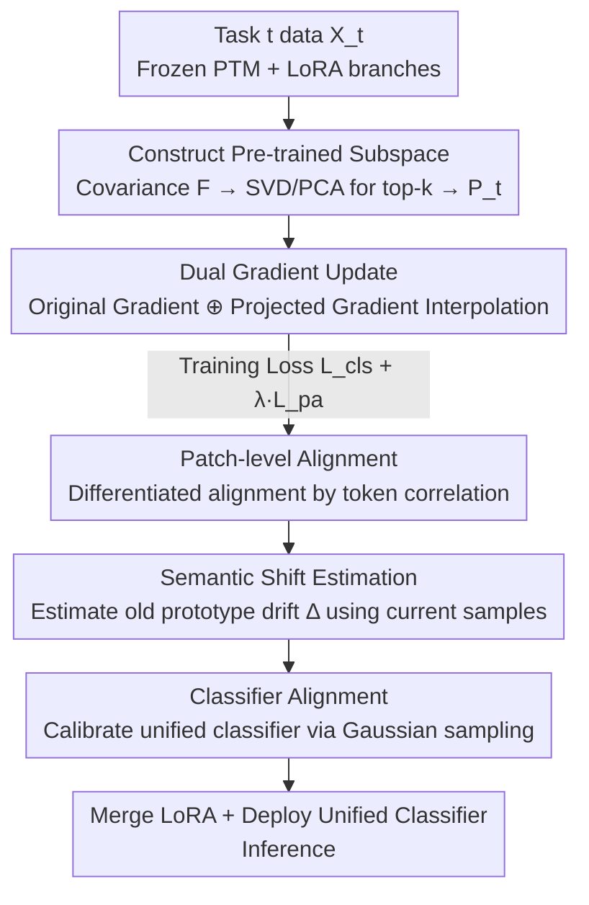

# DGS: Dual Gradient and Semantic-Shift Guided Low-Rank Adaptation for Class Incremental Learning

**Conference**: CVPR 2026  
**Paper**: [CVF Open Access](https://openaccess.thecvf.com/content/CVPR2026/html/Li_DGS_Dual_Gradient_and_Semantic-Shift_Guided_Low_Rank_Adaptation_for_Class_CVPR_2026_paper.html)  
**Code**: Not yet public (The paper states "Code will be available")  
**Area**: Continual Learning / Class Incremental Learning  
**Keywords**: Class Incremental Learning, LoRA, Gradient Projection, Stability-Plasticity, Semantic Shift  

## TL;DR
To address the issue where orthogonal gradient constraints are "too rigid and suppress plasticity" when using pre-trained models + LoRA for Class Incremental Learning, DGS replaces hard orthogonal constraints with an **interpolated fusion gradient** (original gradient $\oplus$ gradient projected onto the pre-trained subspace). Combined with **semantic-shift calibrated unified classifier alignment** and a **patch-token alignment loss**, it outperforms existing PEFT-CIL methods across six standard benchmarks.

## Background & Motivation
**Background**: Class-Incremental Learning (CIL) requires models to learn disjoint sets of new classes sequentially by session. At inference, task IDs are unavailable, and the goal is to prevent degradation across all seen classes. Utilizing pre-trained ViTs (PTM) + Parameter-Efficient Fine-Tuning (PEFT, e.g., prompt / LoRA / adapter) to freeze the backbone and train only a few parameters has become the mainstream approach, as isolated task-specific modules naturally mitigate catastrophic forgetting.

**Limitations of Prior Work**: Even with LoRA, incremental updates still lead to **representation drift**—the task-specific LoRA subspaces gradually deviate from the structured manifold of the pre-trained model, exacerbating forgetting. To combat this, Gradient Projection Memory methods (e.g., InfLoRA) **force new task gradients to be orthogonal to the subspace of previous tasks**. However, hard orthogonality restricts updates to a very narrow subspace, severely damaging **plasticity** and stifling the model's ability to learn new knowledge.

**Key Challenge**: The classic trade-off between stability (not forgetting the old) and plasticity (learning the new). Hard orthogonal constraints favor stability but fail to respect the intrinsic structure of the PTM manifold, forcing optimization away from directions where pre-trained representations could naturally evolve.

**Goal**: Suppress forgetting without sacrificing the expressiveness of new tasks. This is divided into three objectives: (1) ensuring parameter update directions are both stable and capable of learning; (2) calibrating old class prototypes/classifiers along with feature distribution drift during the incremental process; and (3) maintaining the consistency of fine-grained patch-token representations.

**Key Insight**: The authors observe geometrically that the gradient updates of linear layers naturally fall within the span of the input data. Thus, the feature subspace extracted from new task inputs under the frozen PTM can serve as an "anchor for pre-trained knowledge," rather than simply "banning" old task directions.

**Core Idea**: Instead of a "subtractive constraint" like hard orthogonality, the authors propose an **interpolated "additive fusion"**—mixing the original task gradient with its projection onto the pre-trained subspace. This yields an update direction that simultaneously lowers new task loss and preserves pre-trained knowledge, naturally leading to the intersection of the two tasks' low-loss regions.

## Method

### Overall Architecture
The backbone of DGS is a frozen pre-trained ViT. For each new task $t$, an independent LoRA branch $\Delta W_t = B_t A_t$ is expanded ($A_t\in\mathbb{R}^{r\times d}$ for dimension reduction, $B_t\in\mathbb{R}^{d\times r}$ for dimension increase, rank $r\ll d$). The equivalent weight at layer $l$ is $W_t^l = W_0^l + \sum_{i=1}^{t} B_i^l A_i^l$. Training for a task follows two stages: **During training**, LoRA is updated using the Dual-Gradient (DG) strategy with a classification loss plus a patch alignment loss $\mathcal{L}_{cls}+\lambda\mathcal{L}_{pa}$; **Post-training**, old class prototypes are calibrated using semantic shift estimation, and a unified classifier is retrained using Gaussian-sampled features (loss $\mathcal{L}_{ca}$). During inference, all LoRAs are merged into $W_0$, and the calibrated unified classifier is deployed.

### Key Designs

**1. Dual Gradient Update (DG): Replacing hard orthogonality with interpolated fusion gradients to "tune" rather than "cut" stability and plasticity.**

This is the core of the paper, directly addressing the "plasticity suppression" of orthogonal constraints. Before training a task, the task data $X_t$ is fed into the frozen $f(\cdot, W_0^l)$ to obtain input features for each layer. An uncentered covariance matrix $\mathbf{F}_t^l=\frac{1}{n_t}(\mathbf{X}_t^l)^\top \mathbf{X}_t^l$ is computed, characterizing the "new task learning space built upon pre-trained representations." SVD is then applied to $\mathbf{F}_t^l$ (PCA approach) to select the top-$k$ eigenvectors to form the projection basis $\mathbf{P}_t^l=(\mathbf{U}_t^l)_k$. This subspace preserves the generalization directions of the PTM.

Updates do not use the original gradient directly but rather a linear interpolation between it and its projection onto this subspace:

$$\Delta \mathbf{w}_{t,s}^l = -\eta\,(\boldsymbol{g}^*)_{t,s}^l,\qquad (\boldsymbol{g}^*)_{t,s}^l = (1-\alpha)\,\boldsymbol{g}_{t,s}^l + \alpha\,\big(\mathbf{P}_t^l(\mathbf{P}_t^l)^\top \boldsymbol{g}_{t,s}^l\big)$$

where $\boldsymbol{g}_{t,s}^l=\partial\mathcal{L}/\partial w_t$ is the original gradient at step $s$, $\mathbf{P}_t^l(\mathbf{P}_t^l)^\top \boldsymbol{g}$ is the component projected onto the pre-trained subspace, and $\alpha$ is the stability-plasticity knob. The projection term "anchors" learning within the PTM manifold to suppress drift and preserve old knowledge; the original term maintains full task-specific adaptation power. The essential difference from orthogonal methods is that while orthogonality "prohibits a direction," DG "takes a compromise between two good directions," guiding optimization toward the intersection of low-loss regions. Note that the classification head $cls_t$ is updated only with the original gradient; DG acts only on the LoRA adapters.

**2. Patch-level Alignment Loss (PA): Allowing strongly correlated patches to learn freely while aligning weakly correlated patches to the old model to protect fine-grained structures.**

The class token is the primary representation for the current task, but patch tokens carry significant generic pre-trained knowledge and are crucial for stability. Fully releasing patches causes catastrophic forgetting, while fully freezing them suppresses plasticity. PA loss performs **differentiated** alignment:

$$\mathcal{L}_{pa}=\frac{1}{H}\sum_{j=1}^{H}\frac{\arccos\Theta_{\cos}}{\pi}\,\big\|p_j^t-p_j^{t-1}\big\|_2$$

where $p_j^t$ and $p_j^{t-1}$ are the $j$-th patch tokens from the current and previous task models, respectively. $\Theta_{\cos}=\frac{p_0^t\cdot p_j^t}{\|p_0^t\|\|p_j^t\|}$ is the cosine similarity between the patch and the class token $p_0^t$, mapped to $(0,1)$ via $\arccos(\cdot)/\pi$ (0 is most similar, 1 is least). This weight allows patches highly correlated with the class token (task-relevant) to adapt freely (small $\arccos$ weight), while forcing weakly correlated patches back toward the previous task's representation (large weight).

**3. Semantic-Shift Guided Classifier Alignment (CA + SSE): Retraining a unified classifier on calibrated old prototypes to eliminate sub-classifier boundary misalignment.**

Sub-classifiers for each task are updated independently, leading to misaligned decision boundaries when combined. Furthermore, as the backbone evolves, prototypes stored from old sessions become "stale." CA first patches old prototypes using **Semantic Shift Estimation (SSE)**: old class prototypes are updated as $\mu_c^t=\Delta_c^{t-1\to t}+\mu_c^{t-1}$, where $\mu_c^t$ is the mean of class sample features. The shift $\Delta_c^{t-1\to t}$ is estimated using a weighted class-token displacement $\delta_i^{t-1\to t}=(p_0^t)_i-(p_0^{t-1})_i$:

$$\Delta_c^{t-1\to t}\approx\frac{\sum_i w_i\,\delta_i^{t-1\to t}}{\sum_i w_i},\qquad w_i=\exp\!\Big(-\frac{\|(p_0^{t-1})_i-\mu_c^{t-1}\|}{2\sigma^2}\Big)$$

Samples closer to the class mean receive higher weights. After obtaining calibrated statistics $\mathcal{N}(\mu_c,\sigma_c)$, $K_n$ features $\mathcal{V}_c$ are sampled per class via Gaussian distribution. The sub-classifiers are concatenated into a unified classifier and retrained using cross-entropy $\mathcal{L}_{ca}(\mathcal{V}_c,\theta_{cls})$. This step aligns the unified classifier with the updated feature distribution and corrects boundary misalignments.

### Loss & Training
The classification loss uses an **angular interval loss** (angular penalty) to ensure inter-class separation: $\mathcal{L}_{cls}=-\frac{1}{N_t}\sum_{j}\log\frac{e^{\tau\cos\theta_j}}{e^{\tau\cos\theta_j}+\sum_{i\ne j}e^{\tau\cos\theta_i}}$, where $\cos\theta_j=\frac{w_j f_{\theta_j}}{\|w_j\|\|f_{\theta_j}\|}$ and $\tau$ is a scale factor. The total loss during training is $\mathcal{L}_{cls}+\lambda\mathcal{L}_{pa}$, with LoRA updated via DG. After task training, CA is run separately. The overall workflow (Algorithm 1): store old prototypes $\rightarrow$ compute $\mathbf{P}_t^l$ $\rightarrow$ train LoRA batch-by-batch with DG $\rightarrow$ estimate prototype drift and retrain the unified classifier. Default hyperparameters: $r=32,\ \tau=20,\ \lambda=0.4,\ \alpha=0.5$; Optimizer: SGD, lr 0.01 with cosine annealing, 20 epochs, batch size 48.

## Key Experimental Results

### Main Results
Across six CIL benchmarks (ViT-B/16-IN21K backbone, no exemplars), DGS ranks first in both $A_{avg}$ and $A_{Last}$. Representative results ($A_{Last}$ / %):

| Dataset | Prev. SOTA (Method) | DGS $A_{Last}$ | Gain |
|--------|------------------|----------------|------|
| ImageNet-R B0Inc20 | 80.87 (SLCA) | **81.72** | +0.85 |
| ImageNet-A B0Inc20 | 62.15 (SSIAT) | **63.53** | +1.38 |
| CIFAR-100 B0Inc5 | 90.16 (InfLoRA) | **90.44** | +0.28 |
| ObjectNet B0Inc10 | 63.62 (MOS) | **64.85** | +1.23 |
| OmniBenchmark B0Inc30 | 80.05 (MOS) | **80.50** | +0.45 |
| CUB B0Inc10 | 89.44 (MOS) | 89.27 | −0.17 ⚠️ |

The authors emphasize that the advantage is most pronounced on datasets with larger domain gaps, such as ImageNet-R/A.

### Ablation Study
On ImageNet-R B0Inc20 / ObjectNet B0Inc10, components were added incrementally ($A_{Last}\uparrow$, $F_{Last}\downarrow$ for forgetting):

| Configuration | IN-R $A$ | IN-R $F$ | ObjNet $A$ | ObjNet $F$ | Description |
|------|---------|---------|-----------|-----------|------|
| I. baseline (LoRA+$\mathcal{L}_{cls}$) | 78.90 | 9.86 | 61.30 | 12.98 | Task-specific LoRA only |
| II. +DG | 79.68 | 6.88 | 62.64 | 10.08 | Accuracy ↑, Forgetting ↓↓ |
| III. +PA | 80.15 | 5.30 | 63.22 | 9.17 | Forgetting reduced to minimum |
| IV. +CA (no PA) | 81.26 | 8.25 | 64.47 | 14.57 | Acc jump but Forgetting rebounds |
| V. Full (DG+PA+CA) | **81.72** | 5.14 | **64.85** | 14.02 | Best overall |

### Key Findings
- **DG is the primary "brake" for forgetting**: Adding DG alone reduced forgetting on ImageNet-R/ObjectNet by 2.98% / 2.9%, validating that fusion gradients are more stable than raw gradients.
- **PA is specific to forgetting**: Configuration III reduced forgetting to the lowest levels (5.30 / 9.17), confirming that patch alignment preserves fine-grained consistency.
- **CA significantly boosts accuracy at the cost of forgetting**: Configuration IV saw accuracy jump to 81.26/64.47, but $F$ rebounded. Adding PA back (Configuration V) suppressed forgetting back to 5.14. ⚠️ Note that on ObjectNet, the forgetting in the Full version (14.02) is still significantly higher than with DG+PA alone (9.17).
- **Physical meaning of $\alpha$**: Large $\alpha$ favors projection (stable but poor plasticity), while small $\alpha$ favors original gradients (plastic but higher forgetting). $\alpha=0.5$ balances results best.
- **Hyperparameter Sensitivity**: $\tau=20$ is optimal; $\lambda=0.4$ is optimal; rank $r$ shows a monotonic slight increase from 8 to 64.

## Highlights & Insights
- **Changing "subtractive constraints" to "additive fusion" is the most clever aspect**: Instead of removing components via orthogonal projection, DGS uses the same projection matrix for interpolation. A single knob $\alpha$ softens hard constraints into a continuously adjustable trade-off.
- **Differentiated patch token alignment**: Using cosine similarity with class tokens as a gating weight for "releasing vs. freezing" tokens avoids binary choices and provides a strategy for token-level consistency in any distillation context.
- **Geometric prior**: Leveraging the fact that linear layer gradients fall within the input span to construct subspaces without storing old data makes the process exemplar-free and memory-friendly.

## Limitations & Future Work
- **CA and low forgetting are not always compatible**: Ablations show $F$ rebounds after adding CA (especially on ObjectNet), suggesting accuracy gains from classifier alignment may cost stability.
- **Heavy method stack**: DG (SVD/PCA per layer) + SSE + Gaussian sampling for CA introduces components with extra preprocessing and post-training overhead. Training time costs were not reported. ⚠️
- **Marginal gains on easier datasets**: Only +0.28 on CIFAR-100 and slightly lower than MOS on CUB. Gains are concentrated on datasets with large domain gaps.
- **Code is not yet public**, limiting reproducibility for now.

## Related Work & Insights
- **vs. InfLoRA / Orthogonal Gradient methods**: These methods constrain new gradients to the orthogonal complement of the old subspace, hampering plasticity. DGS uses interpolation to continuously adjust the balance.
- **vs. SSIAT / SDC**: DGS borrows the drift estimation from SDC to calibrate old prototypes but integrates it into a classifier retraining process to address boundary misalignment.
- **vs. MOS / EASE**: Also PTM-CIL, but DGS differs by optimizing at the gradient fusion and patch-level consistency layers.

## Rating
- Novelty: ⭐⭐⭐⭐ Reimagining orthogonal subtraction as interpolated addition is novel; CA/PA are solid combinations of existing ideas.
- Experimental Thoroughness: ⭐⭐⭐⭐ 6 datasets + multiple backbones + comprehensive ablations; missing analysis on training costs and forgetting-accuracy trade-offs.
- Writing Quality: ⭐⭐⭐⭐ Clear geometric intuition and complete formulas.
- Value: ⭐⭐⭐⭐ The plug-and-play gradient fusion strategy is practically valuable for PEFT-CIL, being exemplar-free and parameter-efficient.

<!-- RELATED:START -->

## Related Papers

- [\[CVPR 2026\] Dual-Estimator: Decoupling Global and Local Semantic Shift for Drift Compensation in Class-Incremental Learning](dual-estimator_decoupling_global_and_local_semantic_shift_for_drift_compensation.md)
- [\[CVPR 2026\] Semantic-Guided Global-Local Collaborative Prompt Learning for Few-Shot Class Incremental Learning](semantic-guided_global-local_collaborative_prompt_learning_for_few-shot_class_in.md)
- [\[CVPR 2026\] Nonparametric Deep Fine-grained Clustering with Low-Rank Guided Vision-Language Model](nonparametric_deep_fine-grained_clustering_with_low-rank_guided_vision-language_.md)
- [\[CVPR 2026\] Geometry-driven OOD Detectors Are Class-Incremental Learners](geometry-driven_ood_detectors_are_class-incremental_learners.md)
- [\[CVPR 2026\] The Devil Is in Gradient Entanglement: Energy-Aware Gradient Coordinator for Robust Generalized Category Discovery](the_devil_is_in_gradient_entanglement_energy-aware_gradient_coordinator_for_robu.md)

<!-- RELATED:END -->
