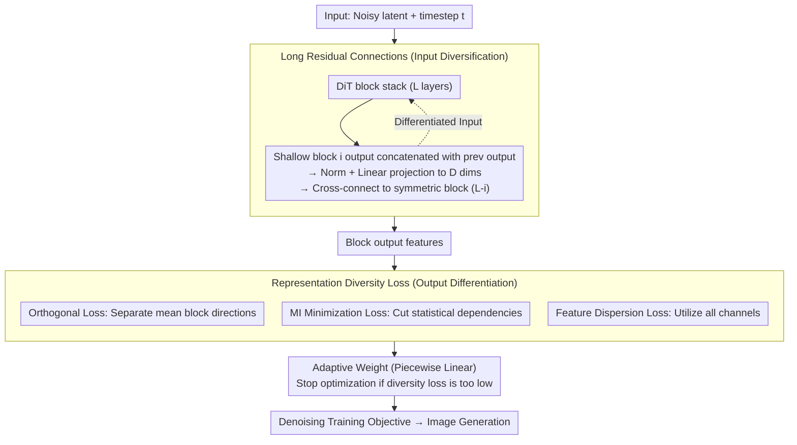

# DiverseDiT: Towards Diverse Representation Learning in Diffusion Transformers

**Conference**: CVPR 2026  
**arXiv**: [2603.04239](https://arxiv.org/abs/2603.04239)  
**Code**: [Available](https://github.com/kobeshegu/DiverseDiT)  
**Area**: Self-Supervised/Representation Learning  
**Keywords**: Diffusion Transformer, Representation Diversity, Long Residual Connection, Diversity Loss, Image Generation

## TL;DR

Systematic analysis reveals that representation diversity among DiT blocks is a key factor for effective learning. This paper proposes DiverseDiT: using long residual connections to diversify inputs and a representation diversity loss to explicitly promote feature differentiation between blocks, accelerating convergence and improving generation quality without external guidance models.

## Background & Motivation

### 1. Background

Diffusion Transformers (DiT) have achieved breakthroughs in visual generation due to their excellent scalability. Recent studies have found that high-performance diffusion models capture more discriminative internal representations, leading to methods like REPA, which align DiT intermediate representations with features from pre-trained visual encoders (e.g., DINOv2). Subsequent works like REPA-E and REG have further extended this approach.

### 2. Limitations of Prior Work

- **Dependency on Large External Models**: REPA-style methods require powerful pre-trained visual encoders (DINOv2, MAE, etc.), which are themselves costly to train.
- **Unclear Mechanisms**: Fundamental questions remain regarding how DiTs learn meaningful representations and why external alignment is effective.
- **Blind Alignment Can Be Harmful**: Aligning more blocks with more encoders can lead to performance degradation.

### 3. Key Challenge

There is a gap between "using external models for guidance" and "understanding the model's internal representation learning mechanism." The widespread use of REPA without understanding why it works hinders more principled architectural improvements.

### 4. Goal

To reveal the internal mechanisms of representation learning in DiT and design an efficient representation learning framework that does not rely on external guidance.

### 5. Key Insight

Systematic measurement of representation similarity changes across blocks during training using Centered Kernel Alignment (CKA) allows for understanding and improving DiT from a new perspective: "inter-block representation diversity."

### 6. Core Idea

**Representation Diversity Hypothesis**: The greater the difference in representations between DiT blocks, the better the model learns. REPA is effective essentially because it increases the representation difference between aligned blocks and others. Based on this, mechanisms can be designed to promote diversity directly without relying on external encoders.

## Method

### Overall Architecture

DiverseDiT addresses the premise that DiT performance depends on the diversity of representations across blocks, which previously relied on external encoders (like DINOv2 in REPA). Its strategy is to act internally by transforming block inputs and constraining block outputs to foster diversity. The pipeline adds two complementary components to the standard DiT: **Long Residual Connections (LRC)**, which cross-connect shallow block outputs to symmetric deep blocks to break input homogeneity; and **Representation Diversity Loss**, consisting of orthogonality, mutual information minimization, and feature dispersion terms to explicitly differentiate block features. The former handles "input diversification" while the latter handles "output differentiation," both without external pre-trained models.

### Key Designs

**1. Long Residual Connections: Breaking inter-block homogeneity from the input side**

In traditional DiT, the input for each block comes only from the previous layer, causing signals to become increasingly similar as they pass through layers, which is the root of representation diversity degradation. LRC connects the output of the $i$-th block directly to the symmetric $(L-i)$-th block ($L$ total layers), providing deep blocks with a differentiated shallow signal alongside the regular input. The fusion is performed by concatenating the shallow feature $f_i$ with the previous layer output $f_{l-1}$ and projecting back to the original dimension:

$$f_l = \text{Linear}(\text{Norm}(f_i \oplus f_{l-1}))$$

where $\oplus$ is concatenation. The $2D$ feature is passed through LayerNorm and a Linear layer to return to $D$ dimensions. This prevents inputs to different blocks from converging, promoting shallow feature reuse and preventing representation collapse with minimal additional parameters.

**2. Orthogonal Loss $\mathcal{L}_{\text{orth}}$: Orthogonalizing mean representation directions**

The orthogonal loss targets redundancy. If two blocks have similar overall representation directions, they learn redundant information. The token-level representations of a block are averaged across batch and token dimensions to obtain a mean vector $\mu_l \in \mathbb{R}^D$. The cosine similarity between $\mu_l$ for selected block pairs is penalized, forcing different blocks to develop in orthogonal directions.

**3. Mutual Information Minimization Loss $\mathcal{L}_{\text{MI}}$: Severing statistical dependencies**

While orthogonality constrains mean directions, fine-grained statistical correlations might still exist. $\mathcal{L}_{\text{MI}}$ aims for statistical independence between block representations. Instead of expensive covariance matrix calculations, the average cosine similarity between normalized token vectors is used as an efficient proxy for mutual information to reduce statistical coupling during training.

**4. Feature Dispersion Loss $\mathcal{L}_{\text{disp}}$: Encouraging full channel utilization**

This term addresses the "internal collapse" of single representations. If activations are concentrated in a few channels, feature capacity is wasted. $\mathcal{L}_{\text{disp}}$ flattens and normalizes block representations, calculates the mean activation for each channel, and maximizes the variance of these activations across the channel dimension (implemented as a negative variance loss). This encourages the model to fully utilize all feature channels.

### Loss & Training

Total Diversity Loss: $\mathcal{L}_{\text{div}} = 0.33 \cdot \mathcal{L}_{\text{orth}} + 0.33 \cdot \mathcal{L}_{\text{MI}} + 0.33 \cdot \mathcal{L}_{\text{disp}}$

**Adaptive Weighting Mechanism**: If $\mathcal{L}_{\text{div}}$ becomes too small, the model may diverge by over-separating and failing to learn shared semantics. A piecewise linear weight $w$ is used:

- If $\mathcal{L}_{\text{div}} > 0.5$: $w=1$ (Normal optimization)
- If $0.1 < \mathcal{L}_{\text{div}} \le 0.5$: $w = (\mathcal{L}_{\text{div}} - 0.1) / 0.5$ (Gradual weakening)
- If $\mathcal{L}_{\text{div}} \le 0.1$: $w=0$ (Stop diversity optimization)

Training: AdamW, lr=1e-4, batch size=256, 8×H800 GPUs. Minimal extra parameters from LRC Linear layers.

## Key Experimental Results

### Main Results

**Table 1: Comparison of different model scales on ImageNet 256×256 (w/o CFG, 400K iterations)**

| Model | FID↓ | sFID↓ | IS↑ | Prec.↑ | Rec.↑ |
|------|------|-------|-----|--------|-------|
| SiT-B | 36.80 | 6.77 | 40.09 | 0.51 | 0.63 |
| **+ Ours** | **28.05** | **6.04** | **50.66** | **0.57** | 0.63 |
| REPA-B | 22.99 | 6.70 | 64.73 | 0.59 | 0.65 |
| **+ Ours** | **17.29** | **6.56** | **79.92** | **0.62** | 0.65 |
| SiT-XL | 17.43 | 5.11 | 76.00 | 0.64 | 0.64 |
| **+ Ours** | **12.42** | **4.85** | **95.01** | **0.68** | 0.63 |
| REPA-XL | 8.73 | 5.21 | 118.68 | 0.69 | 0.65 |
| **+ Ours** | **8.09** | **5.02** | **123.23** | **0.70** | 0.65 |

**Table 2: Comparison with SOTA methods on ImageNet 256×256 (with CFG)**

| Method | Epochs | FID↓ | IS↑ | Rec.↑ |
|------|--------|------|-----|-------|
| DiT-XL/2 | 1400 | 2.27 | 278.20 | 0.57 |
| SiT-XL/2 | 1400 | 2.06 | 270.30 | 0.59 |
| REPA | 200 | 1.96 | 264.00 | 0.60 |
| REG | 800 | 1.36 | 299.40 | 0.66 |
| SRA | 800 | 1.58 | 311.40 | 0.63 |
| **DiverseDiT (Ours)** | **80** | **1.89** | **276.85** | **0.66** |
| **DiverseDiT (Ours)** | **200** | **1.52** | **282.72** | **0.66** |

**Single-step SOTA (ImageNet 256×256, with CFG)**: MeanFlow-XL/2 + Ours reaches FID=**2.99**, outperforming all existing single-step methods.

### Ablation Study

**Component Ablation (SiT-B / REPA-B, 400K iter)**:

| Configuration | SiT-B FID↓ | REPA-B FID↓ |
|------|-----------|------------|
| Full Method | 28.05 | 17.29 |
| w/o diversity loss | 32.77 | 20.66 |
| w/o residual connections | 33.72 | 18.18 |

**Loss Variant Ablation (REPA-B)**:

| Configuration | FID↓ | IS↑ |
|------|------|-----|
| Full | 17.29 | 79.92 |
| only $\mathcal{L}_{\text{orth}}$ | 18.97 | 75.44 |
| only $\mathcal{L}_{\text{MI}}$ | 17.70 | 78.34 |
| only $\mathcal{L}_{\text{disp}}$ | 20.85 | 68.74 |

**Adaptive Range Ablation**: Constant weight leads to divergence; the [0.1, 0.5] range is optimal (FID 28.05), performing better than [0.2, 0.7] (30.59) and [0.3, 0.9] (31.85).

### Key Findings

1. **Consistent Improvement**: Stable improvements across SiT, REPA, and MeanFlow baselines at B, L, and XL scales.
2. **Cross-Scale Competitiveness**: REPA-B + Ours (17.29) outperforms the original SiT-L (18.77); REPA-L + Ours (8.47) outperforms REPA-XL (8.73).
3. **Training Efficiency**: Achieves FID 1.89 in just 80 epochs, outperforming REPA at 200 epochs (FID 1.96).
4. **Complementarity**: SiT-B + Ours + DispLoss + SRA = FID 21.95, better than REPA-B (22.99) without requiring external encoders.

## Highlights & Insights

- **Analysis-Driven Design**: The method is designed based on systematic CKA analysis highlighting representation diversity, ensuring a strong logical foundation.
- **New Explanation for REPA**: Suggests that REPA's effectiveness stems from increasing representation differences between target blocks rather than external knowledge per se—an insightful perspective.
- **Simple and Efficient**: Components are conceptually simple, lightweight to implement, and generalizable with minimal parameter overhead.
- **No External Models**: Removes dependency on massive pre-trained encoders like DINOv2 or MAE.

## Limitations & Future Work

- The adaptive weighting mechanism (piecewise linear) is somewhat ad-hoc; thresholds 0.1/0.5 lack theoretical derivation.
- The strategy for selecting block pairs (subset $\mathcal{P}$) is not deeply discussed; optimal selection might vary with model scale or depth.
- Validation is limited to ImageNet; performance on text-to-image or video generation is untested.
- A gap remains compared to REG (FID 1.36 @ 800ep); performance under very long training needs further exploration.
- Generalization of LRC to non-symmetric architectures (e.g., U-ViT) needs verification.

## Related Work & Insights

- **REPA [Yu et al.]**: Aligning intermediate states with external encoders; DiverseDiT explains the root of its effectiveness.
- **DispLoss [Wang et al.]**: Encourages scattered embeddings; DiverseDiT is more systematic (diversifying both inputs and outputs).
- **SRA [Li et al.]**: Self-alignment by guiding high-noise layers with low-noise layers; complementary to DiverseDiT.
- **MeanFlow [Liu et al.]**: Single-step generation; DiverseDiT refreshes SOTA when integrated.
- **Insight**: Inter-block diversity is applicable to other Transformer architectures (ViT, LLM). The tradeoff between layer-wise collaboration and redundancy is a fundamental topic for study.

## Rating

⭐⭐⭐⭐ Solid analysis-driven work with logical consistency from CKA observations to method design. Components are simple yet effective and complementary to existing methods. Experimental coverage across baselines and scales is thorough. Minor weaknesses include the empirical nature of adaptive weighting and limited validation on broader generation tasks.

<!-- RELATED:START -->

## Related Papers

- [\[ICLR 2026\] Representation Alignment for Diffusion Transformers without External Components](../../ICLR2026/self_supervised/representation_alignment_for_diffusion_transformers_without_external_components.md)
- [\[ICLR 2026\] Diverse Dictionary Learning](../../ICLR2026/self_supervised/diverse_dictionary_learning.md)
- [\[CVPR 2026\] Vision Transformers Need More Than Registers](vision_transformers_need_more_than_registers.md)
- [\[CVPR 2026\] Temporal Interaction in Spiking Transformers with Multi-Delay Mixer](temporal_interaction_in_spiking_transformers_with_multi-delay_mixer.md)
- [\[CVPR 2026\] Franca: Nested Matryoshka Clustering for Scalable Visual Representation Learning](franca_nested_matryoshka_clustering_for_scalable_visual_representation_learning.md)

<!-- RELATED:END -->
