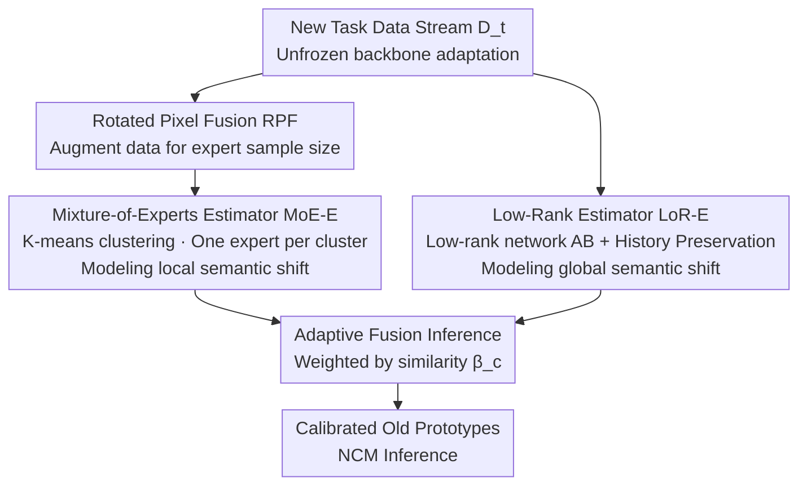

# Dual-Estimator: Decoupling Global and Local Semantic Shift for Drift Compensation in Class-Incremental Learning

**Conference**: CVPR 2026  
**Paper**: [CVF Open Access](https://openaccess.thecvf.com/content/CVPR2026/html/Xu_Dual-Estimator_Decoupling_Global_and_Local_Semantic_Shift_for_Drift_Compensation_CVPR_2026_paper.html)  
**Code**: https://github.com/AldrinLake/Dual-E.git  
**Area**: Continual Learning / Class-Incremental Learning  
**Keywords**: Exemplar-Free Class-Incremental Learning, Drift Compensation, Semantic Shift, Mixture of Experts, Low-Rank Estimation  

## TL;DR
To address the unrealistic assumption in Exemplar-Free Class-Incremental Learning (EFCIL) that "semantic distribution and drift are uniform," this paper proposes a Mixture-of-Experts (MoE) estimator (modeling local semantic shift) and a Low-Rank (LoR) estimator (modeling global semantic shift) for decoupled compensation. Both estimators are updated via closed-form solutions within a few iterations and can be integrated into existing methods as plug-and-play modules, consistently outperforming current SOTA methods across six datasets.

## Background & Motivation
**Background**: Class-Incremental Learning (CIL) requires models to learn non-overlapping classes sequentially. To avoid storage and privacy issues from caching old samples, **Exemplar-Free Class-Incremental Learning (EFCIL)** is more practical. It stores intermediate representations like **class prototypes** instead of raw samples, using Nearest Class Mean (NCM) for inference or classifier calibration.

**Limitations of Prior Work**: The backbone is continuously updated with new tasks, causing previously stored old prototypes to become "obsolete" relative to the new feature space (semantic drift). However, freezing the backbone sacrifices model plasticity. **Drift compensation** aims to resolve this dilemma: without freezing the backbone, it learns the transformation of the representation space from the old model $f_{\theta_{t-1}}$ to the new model $f_{\theta_t}$ to "transport" old prototypes into the updated space.

**Key Challenge**: Existing drift compensation methods (SDC, ADC, LDC, DP, etc.) almost all assume **uniform semantic distribution and uniform semantic drift**, whereas real-world data streams arrive randomly and are far from uniform. This leads to two types of overlooked non-uniformity:

- **Intra-task non-uniform semantic distribution**: When training drift estimators, low-frequency semantics (e.g., broccoli) appear rarely and contribute little to parameter updates, leading to inaccurate compensation for semantically related old classes (e.g., cucumber). Estimators also tend to be dominated by high-frequency semantics, biasing the compensated old prototypes.
- **Inter-task non-uniform semantic drift**: Different old classes have varying semantic similarity to new classes and should be **calibrated differentially according to similarity**. Uniform "full-magnitude calibration" applies inappropriate corrections to classes with large drifts.

**Core Idea**: Use **two complementary estimators to decouple "local semantic shift" and "global semantic shift."** A Mixture-of-Experts Estimator (MoE-E) refines compensation for low-frequency semantics from a local perspective, while a Low-Rank Estimator (LoR-E) provides gentler, history-preserving compensation for high-drift classes from a global perspective. The two are adaptively fused during inference based on similarity.

## Method

### Overall Architecture
Dual-E is a **plug-and-play compensation module** built on top of a standard EFCIL baseline (cross-entropy + knowledge distillation). In each incremental task $t$, the model first initializes parameters from the previous task ($\theta_t \leftarrow \theta_{t-1}$) and adapts to the new task using classification loss $\mathcal{L}_{cls}$ and distillation loss $\mathcal{L}_{kd}$ on new data $D_t^{train}$ without freezing the backbone. After adaptation, $f_{\theta_t}$ and $f_{\theta_{t-1}}$ are frozen, and two drift estimators are trained using the currently visible data:

- **MoE-E** uses K-means in the old representation space to partition data into $K$ local clusters. Each cluster trains a linear expert to model local transition patterns. To ensure sufficient samples for each expert within a few iterations via closed-form solutions, **Rotated Pixel Fusion (RPF)** is introduced for data augmentation.
- **LoR-E** uses a low-rank network $T^{global}=AB$ to fit the common transition pattern of the entire representation space, with a history preservation constraint to prevent over-adjustment.

During inference, for each old prototype $p_c$, the compensation results from both estimators are **fused** adaptively based on the similarity between $p_c$ and each expert "key vector," followed by NCM inference. The overall pipeline is as follows:

### Key Designs

**1. Mixture-of-Experts Estimator (MoE-E): Revitalizing Low-frequency Semantic Compensation**

The goal is to solve intra-task non-uniform semantic distribution. If a **unified linear transition function** $\mathcal{T}: f_{\theta_{t-1}} \to f_{\theta_t}$ is learned (like LDC), low-frequency semantics contribute little and compensation is biased by high-frequency semantics. An intuitive solution is to learn a class-specific transition $\mathcal{T}_c$ for each old class $c$, using only semantically similar data $SSD_t(c)=\{x \mid \Delta(p_c, m) \le \delta,\, x \in D_t^{train}\}$ (where $m=f_{\theta_{t-1}}(x)$ and $\delta$ is the neighborhood radius) to fit $\min \mathbb{E}_{x\sim SSD_t(c)}\|\mathcal{T}_c(m)-z\|_2$. However, "one-expert-per-class" cuts off knowledge sharing and fails when the new task's semantics shift significantly.

MoE-E's compromise: **Semantically similar old classes share the same local transition pattern.** Augmented data $\widetilde{D}_t^{train}$ is partitioned into $K$ clusters $\{S_k\}$ in the old space via K-means, with each cluster assigned an expert $\mathcal{T}_k^{local}$ (linear parameters $Q_k\in \mathbb{R}^{d\times d}$, cluster centroid $\mu_k$ as the routing "key"). Since both backbones are frozen, the experts have a **closed-form solution**:

$$\mathbf{Q}_k = \left(\mathbf{M}_k^{\mathrm{T}}\mathbf{M}_k + \varepsilon\mathbf{I}\right)^{-1}\left(\mathbf{M}_k^{\mathrm{T}}\mathbf{Z}_k\right)$$

Where $\mathbf{M}_k, \mathbf{Z}_k$ are embedding matrices for samples in cluster $S_k$ under old/new backbones, and $\varepsilon=10^{-9}$ prevents ill-conditioning. Old prototypes are compensated using a softmax-weighted sum $\Omega^{MoE}(p_c)=\sum_k \mathcal{T}_k^{local}(p_c)\cdot w_c^k$ based on cosine similarity between $p_c$ and centroids.

**2. Low-Rank Estimator (LoR-E): Gentle, History-Preserving Global Compensation for High-Drift Classes**

MoE-E is local and may incorrectly compensate old classes that lack similar data in the new task. LoR-E complements this from a global perspective using a low-rank transition function $T^{global}=AB$ ($A\in\mathbb{R}^{d\times r}$, $B\in\mathbb{R}^{r\times d}$, $r\ll d$) to capture common patterns. Its objective is:

$$\arg\min_{\mathbf{A},\mathbf{B}}\ \|\mathbf{M}\mathbf{A}\mathbf{B}-\mathbf{Z}\|_{\mathrm{F}}^{2} + \alpha\|\mathbf{P}\mathbf{A}\mathbf{B}-\mathbf{P}\|_{\mathrm{F}}^{2}$$

The first term is a ridge-regression global drift fit; the second is **History Preservation (HP)**. $\mathbf{P}$ stacks all old prototypes, constraining compensated prototypes to stay near their original values, preventing "over-adjustment" and promoting cross-task knowledge transfer. This makes LoR-E "gentler" than MoE-E.

**3. Rotated Pixel Fusion (RPF): Enabling Experts with Sparse Samples**

After partitioning data into $K$ clusters, the samples per expert decrease significantly. RPF augments the data:

$$x_{i,j}^{fused}=\tfrac{1}{2}\,\mathrm{rotate}(x_i,\eta)+\tfrac{1}{2}\,\mathrm{rotate}(x_j,\eta),\quad \eta\in\{0,90,180,270\}$$

This pixel-level semi-mixup of randomly rotated images ensures the closed-form solutions are solvable and increases semantic diversity, improving modeling for low-frequency semantic transitions.

**4. Adaptive Fusion Inference: Allocating Weights Based on Semantic Gap**

To address inter-task non-uniform drift, the compensation for old prototype $p_c$ is fused:

$$p_c \leftarrow \beta_c\cdot\Omega^{MoE}(p_c) + (1-\beta_c)\cdot\Omega^{LoR}(p_c)$$

The weight $\beta_c=\max_{\mu_k}\dfrac{p_c^{\mathrm{T}}\mu_k}{\|p_c\|_2\|\mu_k\|_2}$ is the **maximum cosine similarity** between $p_c$ and all expert keys $\{\mu_k\}$. If an old class finds similar semantics in a local cluster ($\beta_c$ is large), MoE-E is trusted; otherwise ($\beta_c$ is small), weight shifts to LoR-E's global preservation.

### Loss & Training
The objective during task adaptation is classification loss plus distillation loss:

$$\min_{\theta_t,\pi_t}\ \mathbb{E}_{(x,y)\sim D_t^{train}}\big[\mathcal{L}_{cls}(\sigma(g_{\pi_t}(\mathbf{z})),y)\big] + \mathbb{E}_{x\sim D_t^{train}}\big[\mathcal{L}_{kd}(g_{\pi_{t-1}}(\mathbf{m}),g_{\pi_t}(\mathbf{z}))\big]$$

The estimators **do not rely on gradient-based training** but utilize closed-form or alternating closed-form solutions, making them plug-and-play with low overhead.

## Key Experimental Results

### Main Results
Dual-E leads across CIFAR-100 / TinyImageNet / ImageNet-Subset in last-task accuracy $A_{last}$ and average incremental accuracy $A_{inc}$. The **advantage increases with task length**.

| Dataset (20 Tasks) | Metric | Dual-E | Sub-optimal (LDC/DP/ADC) | Gain |
|------|------|------|----------|------|
| CIFAR-100 | $A_{last}$ | 37.97 | 35.69 (LDC) | +2.28 |
| ImageNet-Subset | $A_{last}$ | 44.95 | 42.87 (LDC) | +2.08 |
| ImageNet-Subset | $A_{inc}$ | 59.89 | 56.91 (LDC) | +2.98 |

### Ablation Study
Components verified on TinyImageNet (20 tasks):

| Configuration | TinyImageNet-20 ($A_{last}/A_{inc}$) | Description |
|------|---------|------|
| Base ($\mathcal{L}_{cls}+\mathcal{L}_{kd}$) | 23.92 / 36.40 | No drift compensation |
| Base + LoR-E | 24.49 / 39.49 | Global only |
| Base + MoE-E | 29.46 / 43.55 | Local only |
| Base + LoR-E + (MoE-E w/o RPF) | 3.88 / 15.52 | Removing RPF leads to collapse |
| **Dual-E (Full)** | **30.35 / 44.36** | Best complementary performance |

### Key Findings
- **RPF is critical for MoE-E**: Without RPF, $A_{last}$ on TinyImageNet-20 drops from 30.35 to 3.88 because clusters lack enough samples for reliable closed-form mapping.
- **Synergy of MoE-E and LoR-E**: MoE-E alone is stronger than LoR-E, but combining them is optimal as LoR-E provides a safety net for high-drift classes.
- **History Preservation (HP) helps**: Removing HP leads to performance drops, confirming it prevents "over-adjustment."

## Highlights & Insights
- **Novel entry point**: It identifies previously ignored non-uniformity (intra-task distribution and inter-task drift) and addresses them with a local/global divide-and-conquer strategy.
- **Efficiency via Closed-form Solutions**: Both estimators avoid SGD, making the method lightweight and plug-and-play.
- **Weights based on Max Cosine Similarity**: A clean, calculation-based way to decide between local and global trust without additional training.
- **RPF Design**: Using data augmentation to ensure mathematical solvability of analytical solutions rather than just for generalization is a unique insight.

## Limitations & Future Work
- **Semantic Mismatch**: MoE-E relies on similarity for routing but could still match old classes to inappropriate local patterns; LoR-E only mitigates this rather than curing it.
- **Prototype Quality**: Performance is highly dependent on the quality of initial prototypes; if the backbone features are weak early on, compensation accuracy is limited.
- **Computational Cost**: Closed-form solutions involve matrix inversion. For very high dimensions $d$ or massive class counts, the $\mathbb{R}^{d\times d}$ matrices may pose storage/computation overhead.

## Related Work & Insights
- **vs SDC / LDC / DP**: These methods assume uniform drift. Dual-E distinguishes itself by **explicitly decoupling local/global drift** and fusing them adaptively, showing robustness in non-uniform scenarios.
- **vs Analytic Continual Learning**: Unlike methods that freeze the backbone to eliminate drift, Dual-E maintains backbone plasticity while ensuring stability through compensation.

## Rating
- Novelty: ⭐⭐⭐⭐ 
- Experimental Thoroughness: ⭐⭐⭐⭐⭐ 
- Writing Quality: ⭐⭐⭐⭐ 
- Value: ⭐⭐⭐⭐ 

<!-- RELATED:START -->

## Related Papers

- [\[CVPR 2026\] DGS: Dual Gradient and Semantic-Shift Guided Low-Rank Adaptation for Class Incremental Learning](dgs_dual_gradient_and_semantic-shift_guided_low-rank_adaptation_for_class_increm.md)
- [\[CVPR 2026\] Semantic-Guided Global-Local Collaborative Prompt Learning for Few-Shot Class Incremental Learning](semantic-guided_global-local_collaborative_prompt_learning_for_few-shot_class_in.md)
- [\[CVPR 2026\] Exemplar-Free Class Incremental Learning via Preserving Class-Discriminative Structure](exemplar-free_class_incremental_learning_via_preserving_class-discriminative_str.md)
- [\[CVPR 2026\] Representation-Steered Incremental Adapter-Tuning for Class-Incremental Learning with Pre-Trained Models](representation-steered_incremental_adapter-tuning_for_class-incremental_learning.md)
- [\[CVPR 2026\] Beyond Myopic Alignment: Lookahead Optimization for Online Class-Incremental Learning](beyond_myopic_alignment_lookahead_optimization_for_online_class-incremental_lear.md)

<!-- RELATED:END -->
