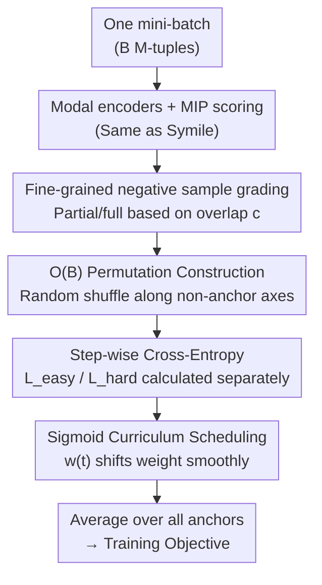

# Easy2Hard: From Partially to Fully Unmatched Modalities as Negative Samples in Contrastive Learning

**Conference**: CVPR 2026  
**Paper**: [CVF Open Access](https://openaccess.thecvf.com/content/CVPR2026/html/Yang_Easy2Hard_From_Partially_to_Fully_Unmatched_Modalities_as_Negative_Samples_CVPR_2026_paper.html)  
**Code**: None  
**Area**: Contrastive Learning / Multimodal Representation  
**Keywords**: Multimodal Contrastive Learning, Negative Sample Grading, Curriculum Learning, Cross-modal Retrieval, Total correlation  

## TL;DR
When the number of modalities $M>2$, in-batch negative samples naturally vary in difficulty based on how many non-anchor modalities they share with the positive sample. Easy2Hard explicitly splits negative samples into "partially unmatched (easy)" and "fully unmatched (hard)" categories. It uses a sigmoid curriculum curve to smoothly shift the training weight from easy negatives to hard negatives as training progresses. This method consistently outperforms Symile / CLIP-Pairwise in zero-shot retrieval across five multimodal datasets.

## Background & Motivation
**Background**: The mainstream approach for cross-modal representation learning is contrastive learning. Given a mini-batch, different modalities of the same sample are treated as positive pairs, while different samples are treated as negative pairs. Temperature-scaled InfoNCE is used to pull positive samples closer and push negative samples further apart (e.g., CLIP, ALIGN, LiT). When the number of modalities expands from 2 to $M>2$, the common practice is either to sum up the pairwise losses of all modality pairs or to bind each modality to a pivot modality (usually image, as in ImageBind or TriCoLo).

**Limitations of Prior Work**: These approaches essentially only optimize pairwise interactions and lack any explicit structure for the "difficulty" of negative samples. Cutting-edge methods like Symile use total correlation (TC) / multilinear inner product (MIP) scoring to capture joint dependencies among more than three modalities while maintaining $O(B)$ in-batch construction. However, Symile treats all in-batch negative samples equally; under a fixed anchor modality, it does not distinguish between "partially unmatched" and "fully unmatched" tuples, nor does it adjust their relative focus during training.

**Key Challenge**: In the dual-modal case, a negative sample pair has only one "unmatched" form relative to a fixed anchor. However, for $M>2$, some negative samples still share one or more non-anchor modalities with the positive sample (partially unmatched, more similar to the positive, thus "easy"), while others share none (fully unmatched, more confusing, thus "hard"). Treating them as the same type of negative sample is suboptimal. The model should ideally learn from simple partially unmatched negatives first before gradually introducing hard, fully unmatched negatives.

**Goal**: Without changing the encoder, adding task heads, or altering batch construction, the goal is to (1) provide a fine-grained negative sampling for $M$-modality contrastive learning based on cross-modal overlap and (2) implement a lightweight curriculum schedule that transitions from easy to hard.

**Core Idea**: While keeping the TC/MIP scoring and encoders from Symile, the modification is applied only to the "negative sample set." Negatives are graded by their overlap with the positive sample, and a sigmoid curriculum curve smoothly moves the training weight from "easy (partially unmatched)" to "hard (fully unmatched)."

## Method

### Overall Architecture
Easy2Hard is a mechanism for "structured, time-varying negative samples" built on top of standard TC/MIP contrastive training. Its foundation follows Symile: each modality has its own encoder producing embeddings $z^{(m)}_i\in\mathbb{R}^d$. A multilinear inner product score is calculated for an index tuple $\boldsymbol{j}=(j_1,\dots,j_M)$ (where each $j_m$ selects a sample from the batch for the $m$-th modality):

$$s(\boldsymbol{j}) = \sum_{r=1}^{d}\prod_{m=1}^{M} z^{(m)}_{j_m,\,r}.$$

By fixing an anchor modality $a$, taking the anchor from sample $i$, and taking all other non-anchor modalities from sample $j$, the temperature-scaled score for the mixed tuple is $s^{(a)}_{i,j}=\tau\,s(\boldsymbol{j}^{(a)}(i,j))$. This forms a $B\times B$ matrix where a softmax cross-entropy loss is applied per row (with the diagonal $j=i$ as the positive sample). The base objective $L_{\text{TC/MIP}}$ is the average across all anchors and the mini-batch.

Easy2Hard inserts three steps into this base: For each anchor modality, (i) construct "easy sets (partially unmatched)" and "hard sets (fully unmatched)" in $O(B)$ time using random permutations along non-anchor axes; (ii) calculate cross-entropy for each level of negative samples separately; (iii) use an external curriculum weight $w(t)\in[0,1]$ to form a convex combination of level-specific losses. The encoders, MIP scoring, and optimizer remain unchanged.

### Key Designs

**1. Fine-grained negative sample grading: Decoupling hardness by overlap**

This addresses the limitation where Symile treats all negative samples equally. Easy2Hard fixes an anchor modality $m$ and defines the set of other non-anchor views $V=\{1,\dots,M\}\setminus\{m\}$. For each negative tuple, it counts the number of non-anchor modalities $c\in\{0,\dots,M-2\}$ that "match" the positive sample. Since a negative sample cannot match all $M-1$ non-anchor modalities (otherwise it would be the positive), the difficulty level is defined as:

$$\ell = (M-1) - c \in \{1,2,\dots,M-1\},$$

where a larger $\ell$ indicates less overlap and higher difficulty. For example, with three modalities (Image, Text, Audio) and Image as the anchor: in an anchor slice $I=i$, $\langle I_i,T_i,A_i\rangle$ is the unique positive sample. A sample where only text or only audio is swapped (still sharing one non-anchor modality) is a **partially unmatched** negative (easy, $\ell=1$). A sample where both text and audio are swapped (sharing only the anchor image) is a **fully unmatched** negative (hard, $\ell=2$). 

**2. $O(B)$ Permutation Construction: Generating easy and hard sets in linear time**

Iterating through all partially/fully unmatched tuples would lead to exponential complexity. Easy2Hard (Algorithm 1) uses an efficient trick: for each non-anchor modality $m\neq a$, it independently samples a random permutation $\pi_m$ of batch indices.

- **Easy Set** $N^{(a)}_{\text{part}}$: For each anchor index $i$, **only one** non-anchor axis $m'$ is randomly selected and replaced with $\pi_{m'}(i)$, while other non-anchor modalities remain aligned with $i$. This tuple differs from the positive sample in exactly one non-anchor modality.
- **Hard Set** $N^{(a)}_{\text{full}}$: For each $i$, **all** non-anchor modalities are replaced with $\pi_m(i)$. Only the anchor modality is shared.

If a permutation happens to reconstruct the positive sample, that row is resampled. This construction is $O(B)$ for **candidate generation**. The total complexity per step remains $O(MB^2)$, similar to standard in-batch contrastive learning.

**3. Sigmoid Curriculum Scheduling: Smoothly shifting weights**

Easy2Hard uses weights composed of "differences of sigmoids." Given transition midpoints $t_1<\dots<t_{M-2}$ and slopes $k_j$, let $S_j(t)=\sigma(k_j(t-t_j))$. Then:

$$w_1(t)=1-S_1(t),\quad w_{M-1}(t)=S_{M-2}(t),\quad w_\ell(t)=S_{\ell-1}(t)-S_\ell(t),$$

which satisfies $\sum_\ell w_\ell(t)=1$ and $w_\ell(t)\ge 0$. In early training, $w_1$ is near 1, and easy negatives dominate. As $t$ increases, weight flows to higher $\ell$ (harder) levels. For three modalities, this reduces to binary gating:

$$L^{(a)}(t)=(1-w(t))\,L^{(a)}_{\text{easy}}+w(t)\,L^{(a)}_{\text{hard}},\qquad w(t)=\sigma\!\big(k(t-t_m)\big).$$

A smooth sigmoid is preferred over a linear transition because the gradient $\partial_t L = w'(t)\cdot\frac1M\sum_a(\ell^{(a)}_h-\ell^{(a)}_e)$ ensures the hard branch contribution grows **monotonically and smoothly**.

### Loss & Training
The base objective averages the weighted per-anchor contrastive loss $L^{(a)}(t)$. The curriculum only affects training and validation losses—retrieval uses frozen encoders and is independent of $w(t)$, ensuring clean evaluation. The only new hyperparameters are the midpoint $t_m$ and slope $k$. Other parameters like learning rate and weight decay use the same search space as baselines to ensure a fair comparison.

## Key Experimental Results

### Main Results
Zero-shot "two-to-one" retrieval results (2-modality query, 1-modality target, 10-way, Acc@1, with bootstrap SE) on four tri-modal datasets:

| Dataset | Easy2Hard | Symile | CLIP-Pairwise | vs Symile |
|--------|-----------|--------|---------------|-----------|
| MM-IMDb | **0.421** | 0.404 | 0.388 | +0.017 |
| Channel | **0.573** | 0.567 | 0.564 | +0.006 |
| Symile-MIMIC | **0.462** | 0.434 | 0.395 | +0.028 |
| EH-MIMIC | **0.503** | 0.477 | 0.456 | +0.026 |

The trend is consistently Easy2Hard > Symile > CLIP-Pairwise. The margin is particularly significant in clinical datasets (up to +0.067 over CLIP-Pairwise on Symile-MIMIC).

5-modality feasibility study (HoloAssist: eye gaze as anchor + head pose + 3x IMU, 10-way Acc@1):

| Method | Acc@1 |
|------|-------|
| **Easy2Hard** | **0.882** |
| Symile | 0.833 |
| ImageBind-like Pivot | 0.439 |
| Pairwise-CLIP | 0.295 |

As $M$ increases, the advantage of structured negative sampling over "pivot-based pairwise alignment" becomes more pronounced.

### Ablation Study
Ablation of the Sigmoid curriculum vs. a Linear curriculum:

| Scheduler | Channel | EH-MIMIC | Note |
|--------|---------|----------|------|
| Sigmoid (Full) | **0.573** | **0.503** | Smooth gating |
| Linear | 0.494 | 0.441 | ↓ 0.079 / 0.062 |

Linear scheduling performs significantly worse, indicating that gains stem from the combination of "structured partial/full splitting" and "well-shaped smooth transitions."

Hyperparameter sensitivity (Channel / EH-MIMIC):

| Hyperparameter | Observation |
|------|------|
| Slope $k$ | Performance peaks at moderate values ($k{=}0.3$ for Channel, $k{=}0.5$ for EH-MIMIC); degrades if $k$ is too large. |
| Midpoint $t_m$ | Weaker effect than $k$. Channel peaks at $t_m{\approx}15$, EH-MIMIC prefers slightly earlier ($t_m{\approx}11\text{–}13$). |

### Key Findings
- Performance gains primarily come from the combination of "structured negative splitting + smooth curriculum," rather than the curriculum alone.
- The curriculum slope $k$ is more critical than the midpoint $t_m$. 
- The advantage of Easy2Hard over pivot-based methods increases significantly with more modalities.
- **Note**: Best configurations for each dataset vary ($w/ t_m, k$), and numerical values between different tables may not be directly comparable due to different experimental settings.

## Highlights & Insights
- **Modularity**: The approach changes only the negative sample set and not the architecture or base loss, allowing it to be integrated into any TC-style contrastive method with minimal cost.
- **Explicit Hardness**: Instead of defining hardness via embedding similarity (which can be noisy), this work uses "cross-modal overlap," a discrete combinatorial structure that is clean, $M$-agnostic, and naturally ordered.
- **Sigmoid-of-differences**: The weight design using a decomposition of unity is elegant. It handles multi-level relay transitions smoothly and ensures gradients are well-behaved.

## Limitations & Future Work
- The absolute performance gains are relatively modest in several datasets (+0.006 to +0.028). Whether this holds for large-scale vision-language models remains unverified.
- The 5-modality study is a feasibility test on a single dataset with lightweight MLP encoders; it does not yet prove scalability to high-resolution multimodal scenarios.
- The curriculum introduces two hyperparameters ($k, t_m$). While stable within certain ranges, some datasets (like EH-MIMIC) are sensitive to aggressive transitions ($k$), requiring per-dataset tuning.

## Related Work & Insights
- **vs Symile**: Both use TC/MIP and $O(B)$ construction. The difference is Easy2Hard's ability to grade and weight negative samples by difficulty. It serves as an orthogonal enhancement to Symile.
- **vs CLIP / ImageBind**: These decompose $M>2$ into pairwise sums or pivots. Easy2Hard captures joint dependencies at the tuple level and shows significant advantages as $M$ grows.
- **vs Hard Negative Mining**: Traditional mining uses latent similarity, while Easy2Hard uses combinatorial structure (modality overlap). This avoids the overhead of similarity search and provides a more stable difficulty hierarchy.

## Rating
- Novelty: ⭐⭐⭐⭐ Grading negatives by overlap is a clean and orthogonal perspective for $M>2$ contrastive learning.
- Experimental Thoroughness: ⭐⭐⭐ Comprehensive across 5 datasets, but gains are modest and lacks large-scale LVM validation.
- Writing Quality: ⭐⭐⭐⭐ Clear motivation, well-defined algorithms, and sound gradient analysis.
- Value: ⭐⭐⭐⭐ High practical utility as an "add-on" for multimodal contrastive training without increasing encoder costs.

<!-- RELATED:START -->

## Related Papers

- [\[CVPR 2026\] Temporal Imbalance of Positive and Negative Supervision in Class-Incremental Learning](temporal_imbalance_of_positive_and_negative_supervision_in_class-incremental_lea.md)
- [\[CVPR 2026\] HCL-FF: Hierarchical and Contrastive Learning for Forward-Forward Algorithm](hcl-ff_hierarchical_and_contrastive_learning_for_forward-forward_algorithm.md)
- [\[CVPR 2026\] Learning from Semantic Dictionaries: Discriminative Codebook Contrastive Learning for Unified Visual Representation and Generation](learning_from_semantic_dictionaries_discriminative_codebook_contrastive_learning.md)
- [\[ICLR 2026\] Samples Are Not Equal: A Sample Selection Approach for Deep Clustering](../../ICLR2026/self_supervised/samples_are_not_equal_a_sample_selection_approach_for_deep_clustering.md)
- [\[CVPR 2026\] UniRefiner: Teaching Pre-trained ViTs to Self-Dispose Dross via Contrastive Register](unirefiner_teaching_pre-trained_vits_to_self-dispose_dross_via_contrastive_regis.md)

<!-- RELATED:END -->
