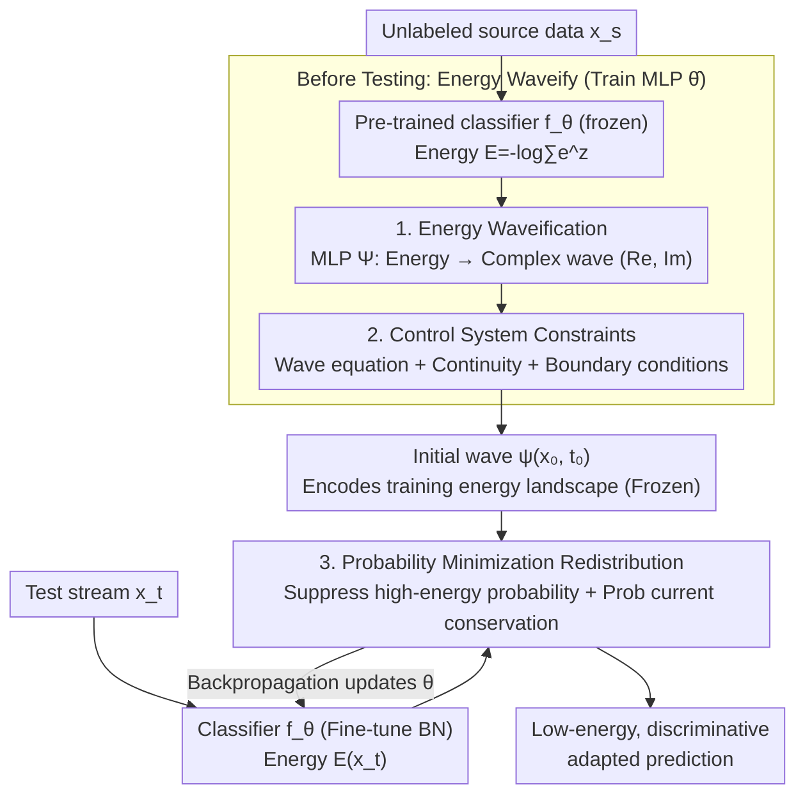

# Energy Waveify and Redistribution for Test-Time Adaptation: A Control System Perspective

**Conference**: CVPR 2026  
**Paper**: [CVF Open Access](https://openaccess.thecvf.com/content/CVPR2026/html/Wang_Energy_Waveify_and_Redistribution_for_Test-Time_Adaptation_A_Control_System_CVPR_2026_paper.html)  
**Code**: https://github.com/wongzbb/APT  
**Area**: Self-Supervised Learning / Test-Time Adaptation (TTA)  
**Keywords**: Test-Time Adaptation, Energy-Based Models, Wave Equation, Control Systems, Probability Current Conservation  

## TL;DR
This paper reparameterizes the classifier's output "energy" as a complex-valued wave (amplitude = energy uncertainty, phase = evolution direction), and uses the wave equation plus probability current conservation from control systems to guide the smooth flow of test sample energy from high-energy to low-energy regions. This achieves test-time adaptation (TTA) **without any MCMC/Langevin sampling or access to source domain data**. The adaptation time is only 1/3 to 1/7 of the top-3 baselines, while achieving comprehensive state-of-the-art (SOTA) accuracy.

## Background & Motivation
**Background**: Test-Time Adaptation (TTA) adapts models to current distribution shifts during inference using only an unlabeled test stream, which aligns better with real-world deployment than domain adaptation (requires test data during training) and domain generalization (completely avoids test data during inference). Mainstream routes fall into two categories: risk minimization-based (pseudo-labeling, entropy minimization) and energy function-based. Energy-Based Models (EBMs) assign a scalar energy value to each sample—with in-distribution samples having low energy and out-of-distribution ones high energy—measuring **overall distribution alignment** rather than pointwise prediction, thus providing a global alignment target for TTA.

**Limitations of Prior Work**: Energy-based TTA to estimate energy gradients typically relies on SGLD (Stochastic Gradient Langevin Dynamics) or approximate inference, necessitating **multiple stochastic perturbation samplings per test sample**. This leads to three issues: ① massive computational overhead, making deployment in high-throughput scenarios difficult; ② susceptibility to mode collapse and unstable convergence during the sampling process; ③ although recent sampling-free methods proposed by Han et al. bypass sampling overhead, they require maintaining a replay buffer with **source domain training samples** during testing to construct contrastive pairs, which is unacceptable in privacy-sensitive scenarios.

**Key Challenge**: If one transitions to "pre-storing training energy values and matching test samples to an energy reference to align + directly minimizing energy loss," another pitfall emerges: directly optimizing energy **dynamically reshapes the energy landscape of the training distribution**, causing originally discriminative samples to collapse to the same energy value (discriminative degradation). The energy distribution over-concentrates on key peaks, rendering pre-stored energy references obsolete and eventually causing mode collapse. In other words, sampling-free, source-free, and preserving the training energy landscape are extremely difficult to achieve simultaneously.

**Goal**: To achieve effective energy alignment in source-free TTA **without relying on sampling**, while **preserving the energy landscape of the training distribution**. The critical technical challenge is how to establish a **differentiable** connection between the in-distribution training energy landscape and the out-of-domain observed energy, allowing gradients to propagate end-to-end.

**Key Insight**: The authors model energy as a **complex-valued wave**. Wave theory naturally provides a continuous, differentiable mathematical framework to "deform" the training energy distribution into the target energy, where phase (phase angle in the complex plane) captures the direction of evolution, and amplitude captures probability density. Borrowing from Mamba's perspective of treating neural networks as state-space control systems—but differing from Mamba's real-valued state equations that only involve time derivatives—this paper uses a **complex-valued wave equation with second-order spatial derivatives** to describe the adaptation process.

**Core Idea**: TTA is reformulated as a **well-defined probability current evolution** problem using a "wave equation + control system constraints (boundary conditions + continuity conditions)" to enforce probability current conservation, guiding probability from high-energy (error-prone) regions to low-energy (accurate) regions while maintaining the overall normalization of the energy landscape throughout. This enables energy redistribution without sampling or source data. The method is named APT (Active Probability current conservation for Test-time energy adaptation).

## Method

### Overall Architecture
APT splits the entire pipeline into **two phases**: ① **Before Testing (Energy Waveify)**—the pre-trained classifier $f_\theta$ is frozen, and an MLP $\Psi_{\hat\theta}$ mapping energy to complex-valued waves is trained alone. It is constrained by a set of physical losses to satisfy the wave equation, continuity, and boundary conditions, yielding an initial wave $\psi(\hat x_0, t_0)$ that encodes the training energy landscape. ② **During Testing (Energy Redistribution)**—the MLP $\hat\theta$ is frozen, and only the normalization layer parameters $\theta$ of the classifier are fine-tuned. The frozen wave function calculates the probability corresponding to the energy of each test sample, depressing the probability of high-energy samples while ensuring this "redistribution" satisfies probability current conservation via the wave equation loss.

The core object of the pipeline is the energy $E(z) = -\log\sum_{i=1}^{K}e^{z_i}$ (the free energy of classifier logits). The wave $\psi(x,t)\in\mathbb{C}$ describes the energy landscape at the $t$-th adaptation step, governed by the wave equation $-\frac{d^2\psi}{dx^2} + V(x)\psi = \psi$, where the potential function $V(x)$ sets potential barriers in high/low-energy regions to control the magnitude of state transitions during energy evolution. Theoretically (Theorem 1), the test energy landscape starts from the initial training wave and is a weighted superposition of all possible evolution paths; thus, all observed test energies can deterministically evolve from the training energy. (Theorem 2) Under boundary and continuity conditions, $\int|\psi(\hat x,t)|^2 d\hat x = 1$ and its derivative with respect to time is 0, meaning the probability mass is conserved throughout.

### Key Designs

**1. Energy Waveification (Energy Waveify): Lifting scalar energy to complex-valued waves for a differentiable training-test bridge**

Directly performing alignment on scalar energy has a fundamental flaw—it lacks "directional" information, and forcing all test energies past a threshold collapses the energies of different classes together. The authors use an MLP parameterized by $\hat\theta$ to regress the energy into a two-dimensional vector representing the real and imaginary parts of the complex-valued wave: denoted as $E_\theta(\cdot):=-\log\sum_i \exp(f^i_\theta(\cdot))$ and $\Psi_{\hat\theta}(\cdot):=\mathrm{MLP}_{\hat\theta}(\cdot)$. The beauty of the complex representation is that the **amplitude $|\Psi|$ encodes the probability density/uncertainty of the energy, while the phase (the angle with the real axis) encodes the direction of adaptation evolution**—this directly corresponds to the capability of "continuous deformation along a differentiable path" in wave theory, creating a **differentiable** evolution channel between the training and test energy landscapes, allowing end-to-end backpropagation. This forms the foundation of the method: replacing discrete, error-prone operations like "aligning to selected energy values" with "continuous evolution along the wave's phase."

**2. Three Constraints of the Control System: Nailing the wave equation as a well-defined system for probability current conservation**

Simply outputting a wave via MLP is insufficient; the wave must be a valid solution to the wave equation $-\frac{d^2\psi}{dx^2}+V(x)\psi=\psi$. Otherwise, the existence of unique evolution is not guaranteed, and backpropagation becomes unstable. The authors "lock" the wave into a control system using three physics-inspired losses:

- **Wave equation loss $L_{def}$**: Directly penalizes the residuals of the wave diverging from the equation. The potential function is piecewise: $V(E)=0$ when $E<a$ and $V(E)=V_0$ when $E\ge a$. The threshold $a$ is set to the average energy of the training samples, $a=\mathbb{E}_{x_s}[E_\theta(x_s)]$, dividing the energy space into balanced low/high-energy zones, allowing the wave to learn distinct behaviors for energies below/above the mean to encode richer training statistics.
- **Continuity conditions $L_{value}+L_{grad}$**: Forces the wave and its first-order derivative to be continuous at the threshold $a$, i.e., $\|\Psi_{\hat\theta}(a{+}\delta)-\Psi_{\hat\theta}(a{-}\delta)\|^2$ and the gradient difference both tend to zero. Without this constraint, the wave exhibits a sharp discontinuity at the threshold, preventing probability from flowing across energy boundaries and destabilizing optimization. Continuity allows probability to flow smoothly from the suppressed high-energy regions to low-energy regions.
- **Boundary conditions $L_{bound}$**: Assuming both training and test energies fall within a bounded interval $[\tilde x_l,\tilde x_r]$, the wave amplitude is forced to zero at the boundaries: $\|Re[\Psi]\|^2+\|Im[\Psi]\|^2 = 0$. This guarantees that the wave is square-integrable and prevents probability current from leaking through the boundaries, restricting evolution strictly within a tolerance sphere of $\epsilon$ geodesic distance.

Since the gradients of these three terms are independent of the input data, they act as pure physical regularization terms on $\hat\theta$. Together, they form the prerequisite for Theorem 2—making the wave equation a **well-defined control system** that ensures $\int|\psi|^2=1$ remains constant throughout, preventing the energy landscape from being destroyed (addressing the motivation of avoiding mode collapse caused by direct energy losses). In the pre-testing phase, $\theta$ is frozen and only $\hat\theta$ is optimized, with the total loss being:

$$L_{wave}(x_s;\hat\theta)=L_{def}+\alpha\big(L_{value}+L_{grad}+L_{bound}\big).$$

**3. Probability Minimization Redistribution: Utilizing probability density maps instead of hard thresholds to steer test energy to low-energy regions while maintaining class discrimination**

During testing, $\hat\theta$ is frozen, and only the calibration/normalization parameters $\theta$ are fine-tuned to shift all test energies to the left of threshold $a$ (low-energy region). A naive approach is directly minimizing $\|E-a\|_p$, but the authors specifically reject this for concrete reasons: ① Different classes naturally reside at different energy levels (easy to cluster in low-energy, hard in high-energy). A single hard threshold $a$ wipes out this structure and squeezes different classes together. ② $\|E-a\|_p$ treats all energies above $a$ equally, whereas the learned energy **probability density** acts as a "quality map"—high-density regions represent problematic locations, and natural minima represent ideal landing spots. Hence, strong gradients push samples away from problematic areas, and as they approach low-density targets, gradients naturally decay, preventing over-tuning. ③ Operating via probability density naturally couples with the wave equation. Therefore, the authors instead suppress the probability mass in high-energy regions:

$$L_{penalize}(x_t;\theta)=\|Re[\Psi_{\hat\theta}(E_\theta(\tilde x_t))]\|^2+\|Im[\Psi_{\hat\theta}(E_\theta(\tilde x_t))]\|^2,\quad \text{s.t. } E_\theta(\tilde x_t)>a.$$

To ensure the redistribution is valid, probability must be conserved (neither created nor destroyed, only moved), which mathematically yields the continuity equation $\frac{\partial\rho}{\partial t}+\nabla\cdot j=0$ (where $\rho$ is probability density and $j$ is the probability current derived from the wave equation). Thus, the final objective couples the redistribution term with the wave equation term:

$$L(x_t;\theta)=L_{penalize}(x_t;\theta)+\beta L_{wave}(x_t;\theta).$$

$L_{penalize}$ specifies "where to go" (low-density, low-energy regions), while $L_{wave}$ ensures "how to get there" is a valid evolution path—effectively casting TTA as a constrained probability current problem.

### Loss & Training
- **Before Testing**: Freezes classifier $\theta$, trains only MLP $\hat\theta$. Loss: $L_{wave}=L_{def}+\alpha(L_{value}+L_{grad}+L_{bound})$, where $\alpha$ is the weight. The gradients of $L_{value}/L_{grad}/L_{bound}$ are data-independent and serve as pure regularization.
- **During Testing**: Freezes $\hat\theta$, updates only normalization layers $\theta$. Loss: $L=L_{penalize}+\beta L_{wave}$, where $\beta$ balances "energy redistribution" and "wave equation consistency."
- **Threshold**: $a=\mathbb{E}_{x_s}[E_\theta(x_s)]$ (average energy of training samples); $\delta$ is a small positive scalar for continuity evaluation. No stochastic sampling is performed, and no raw source domain samples are accessed during testing.

## Key Experimental Results

The experiments follow the settings of TEA, evaluating two tasks: image corruption generalization (CIFAR-10/100/TinyImageNet-200 with -C corruptions, 15 corruption types × 5 severity levels) and domain generalization (PACS, 4 domains). Evaluation metrics are Accuracy and mean Corruption Error (mCE).

### Main Results

Comparison on WRN-28-10 (BatchNorm), averaged across corruption severities 1–5 (selecting top baselines):

| Dataset | Metric | Source | TENT | SAR | CRKD | DISTA | TEA | **APT** |
|--------|------|--------|------|-----|------|-------|-----|---------|
| CIFAR-10-C | Acc(↑) | 73.45 | 86.75 | 85.83 | 88.25 | 87.36 | 87.88 | **91.12** |
| CIFAR-10-C | mCE(↓) | 100.0 | 56.17 | 58.97 | 50.77 | 55.42 | 52.00 | **43.48** |
| CIFAR-100-C | Acc(↑) | 52.12 | 69.47 | 70.01 | 70.44 | 71.01 | 71.22 | **73.57** |
| TinyImageNet-200-C | Acc(↑) | 34.13 | 32.03 | 34.60 | 37.57 | 40.15 | 39.96 | **41.55** |

APT achieves a comprehensive SOTA across three benchmarks: an average +2.21% gain over the strongest baseline on WRN-28-10 (BN), and +2.30% on ResNet-50 (GroupNorm) (CIFAR-10-C 85.33 vs. TEA 83.05, CIFAR-100-C 61.10 vs. TEA 59.67, TinyImageNet-200-C 35.45 vs. DISTA 32.26). In PACS domain generalization, the average accuracy of the four source domains is improved by 4.47% / 3.87% / 1.11% / 2.07% over the strongest baseline (APT's average on each source domain: Photo 29.13, Art 44.24, Cartoon 35.01, Sketch 27.54), performing particularly robustly on the Cartoon/Sketch domains where domain shift is most severe.

**Efficiency**: APT's adaptation time is only 1/3 to 1/7 of the top-1 to top-3 baselines (Fig.7; on a P100 GPU, APT takes ~12.6 min, while TEA takes 41.8 min, and some baselines take up to 170–315 min) because it completely eliminates the per-sample multi-step SGLD sampling.

### Analytical Experiments (CIFAR-10 Confidence Calibration)

Since the main text lacks component-level ablations (refer to the Appendix), here is an analysis table comparing confidence calibration to measure if "preserving the energy landscape" indeed brings better calibration:

| Method | MCE(↓) | ECE(↓) | Description |
|------|--------|--------|------|
| Source | 57.99 | 4.11 | Baseline without adaptation |
| TEA (Energy-based) | 47.37 | 4.02 | Insufficient calibration in low-confidence regions (0–0.4) |
| CRKD (using source data)| 58.28 | 4.94 | Worse than Source, overconfident |
| **APT** | **42.74** | **3.81** | Closest to diagonal across all intervals, robust in low-confidence regions |

### Key Findings
- **Probability conservation leads to better calibration**: Entropy-based methods (e.g., CRKD) induce overconfidence, degrading calibration. TEA suffers from insufficient calibration in low-confidence regions (where small logits have negligible influence on the partition function $Z$). APT, by keeping the energy landscape normalized throughout, yields reliability curves closest to the diagonal.
- **Left-to-right ratio positively correlates with generalization**: As the adaptation steps increase, the ratio of particles in low-energy vs. high-energy zones (Ratio = Left / Right) increases monotonically, matching the accuracy improvement. This proves that $L=L_{penalize}+\beta L_{wave}$ effectively controls the global energy distribution via local test streams. Under severe distribution shifts where baselines collapse, APT remains robust.
- **Efficiency gain stems from the mechanism, not engineering**: The sampling-free and source-free nature is inherent to the design, meaning the time advantage holds across all backbones and normalization types.

## Highlights & Insights
- **Elegant cross-disciplinary concept mapping**: Connecting "scalar energy -> complex wave -> probability current of control systems" allows the abstract demand of "preserving the training energy landscape" to materialize into a differentiable, optimizable, and theoretically guaranteed (probability conservation) loss term. This serves as a reusable paradigm for bridging physics (wave equation, continuity equation) and deep learning.
- **Compelling justification for "rejecting direct threshold penalty"**: Rather than simply minimizing $\|E-a\|_p$, the authors carefully considered that it collapses class-specific energy structures and lacks adaptive gradients. Instead, they leverage the learned probability density map as a "quality map"—the idea of "using learned density to guide optimization and naturally decaying gradients at good locations" can be easily ported to other optimization scenarios demanding soft constraints.
- **Privacy-friendly & high throughput**: Being sampling-free and source-free makes it significantly more practical than existing energy-based TTA methods in privacy-sensitive and low-latency deployments.

## Limitations & Future Work
- **Strong theoretical assumptions**: Relies on the bounded geometric assumption that the "test distribution lies within an $\epsilon$-geodesic ball of the training manifold" and confines energy to finite boundaries $[\tilde x_l,\tilde x_r]$. When domain shift exceeds this tolerance sphere (e.g., open-world, severe semantic shifts), the wave-evolution reachability assumption might fail.
- **Lack of component ablation in the main text**: The individual contributions of $L_{def}/L_{value}/L_{grad}/L_{bound}$, the barrier potential $V_0$, and weights $\alpha,\beta$ are relegated to the Appendix, making it hard to judge which term is most critical from the main text alone; whether taking average energy as the threshold $a$ is optimal is also not fully discussed in the main paper.
- **Validated only on classification + normalization layer adaptation**: The method is locked to the settings of "tuning BN/GroupNorm parameters + free energy." Its applicability to structured-output tasks (detection, segmentation) or tasks without clear energy definitions remains unknown.
- *Future directions*: Adaptive adjustment of the $\epsilon$-tolerance (dynamically adjusting boundaries based on observed shifts), extending the wave equation to multi-source/continuous-shift streams, and providing a learnable version of the potential function $V$.

## Related Work & Insights
- **vs TEA (Energy-based TTA)**: TEA uses energy adaptation but still incurs the cost of sampling/alignment to the source distribution. APT lifts energy to waves and constrains redistribution with probability conservation, avoiding sampling and preserving the energy landscape, achieving wins in both accuracy and efficiency (1/3 to 1/7 of the time).
- **vs Han et al. (sampling-free energy TTA)**: While sampling-free, Han et al. require maintaining a **source sample replay buffer** during test time to construct contrastive pairs, posing privacy risks. APT uses the "initial wave" as a bridge between training and testing, requiring absolutely zero access to source data.
- **vs Pseudo-labeling / Entropy Minimization (SHOT, TENT, SAR, EATA)**: Confidence filtering in pseudo-labeling discards low-confidence yet correct samples and accumulates errors. Entropy methods over-sharpen probabilities, distorting calibration. APT aligns global energy distributions under probability conservation, yielding significantly better calibration (ECE/MCE).
- **vs Mamba-styled State-Space Control**: Mamba uses real-valued state equations with only time derivatives. APT uses complex-valued wave equations with second-order spatial derivatives, capturing both amplitude (uncertainty) and phase (evolution direction), making it more suited for describing the continuous deformation of energy landscapes.

## Rating
- **Novelty**: ⭐⭐⭐⭐⭐ Introduces the wave equation and probability current conservation to TTA, enabling sampling-free and source-free adaptation with an elegant and self-consistent perspective.
- **Experimental Thoroughness**: ⭐⭐⭐⭐ Evaluated on three corruption benchmarks + PACS + calibration/ratio analyses, though core component ablations are in the Appendix.
- **Writing Quality**: ⭐⭐⭐⭐ The motivation progresses logically with rich illustrations. The physical notations are dense, requiring some prior background.
- **Value**: ⭐⭐⭐⭐⭐ Privacy-friendly, 1/3 to 1/7 computational cost, and SOTA accuracy make it highly practical for real-world deployment.

<!-- RELATED:START -->

## Related Papers

- [\[ICLR 2026\] Architecture-Agnostic Test-Time Adaptation via Backprop-Free Embedding Alignment](../../ICLR2026/self_supervised/architecture-agnostic_test-time_adaptation_via_backprop-free_embedding_alignment.md)
- [\[ICLR 2026\] NEO — No-Optimization Test-Time Adaptation through Latent Re-Centering](../../ICLR2026/self_supervised/neo_no-optimization_test-time_adaptation_through_latent_re-centering.md)
- [\[ICLR 2026\] Bayesian Test-Time Adaptation via Dirichlet feature projection and GMM-Driven Inference for Motor Imagery EEG Decoding](../../ICLR2026/self_supervised/bayesian_test-time_adaptation_via_dirichlet_feature_projection_and_gmm-driven_in.md)
- [\[ICLR 2026\] ZeroSiam: An Efficient Asymmetry for Test-Time Entropy Optimization without Collapse](../../ICLR2026/self_supervised/zerosiam_an_efficient_asymmetry_for_test-time_entropy_optimization_without_colla.md)
- [\[ICLR 2026\] Test-Time Efficient Pretrained Model Portfolios for Time Series Forecasting](../../ICLR2026/self_supervised/test-time_efficient_pretrained_model_portfolios_for_time_series_forecasting.md)

<!-- RELATED:END -->
