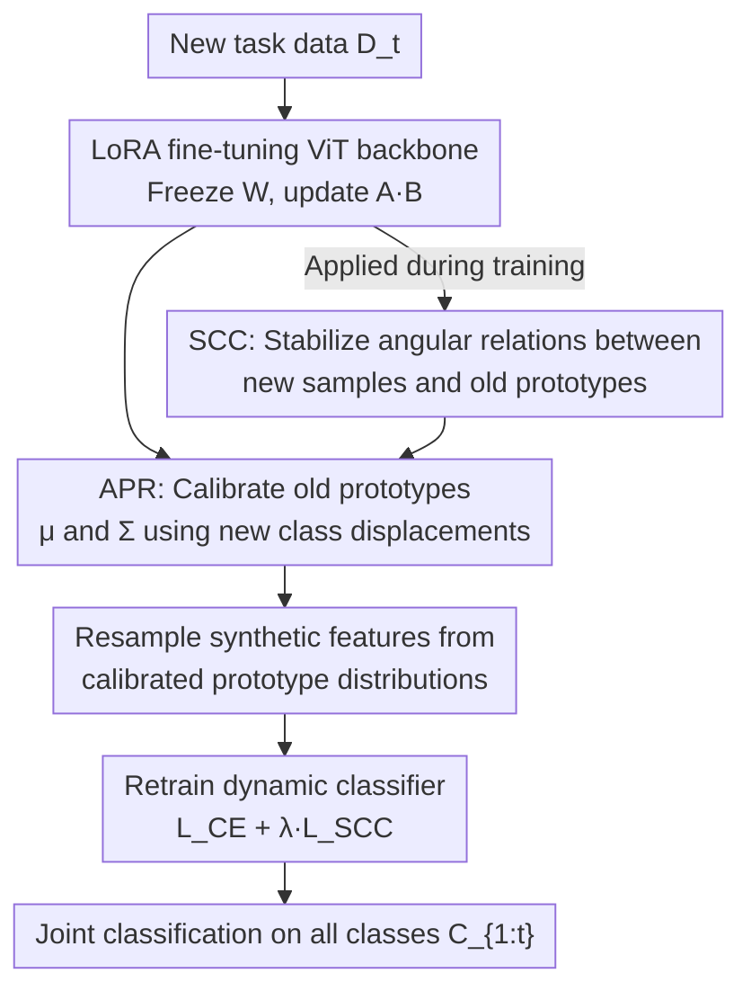

# Exemplar-Free Class Incremental Learning via Preserving Class-Discriminative Structure

**Conference**: CVPR 2026  
**Paper**: [CVF Open Access](https://openaccess.thecvf.com/content/CVPR2026/html/Zhang_Exemplar-Free_Class_Incremental_Learning_via_Preserving_Class-Discriminative_Structure_CVPR_2026_paper.html)  
**Code**: https://github.com/lambor9973/cds  
**Area**: Continual Learning / Class-Incremental Learning  
**Keywords**: Exemplar-Free Class Incremental Learning, Catastrophic Forgetting, Class-Discriminative Structure, Prototype Calibration, Pre-trained ViT  

## TL;DR
This paper identifies that the essence of catastrophic forgetting in Exemplar-Free Class Incremental Learning (EFCIL) is the collapse of "class-discriminative structure." It proposes the Adaptive Prototype Calibration (APR) to correct the mean and covariance of old class prototypes (preserving intra-class structure) and the Structural Consistency Constraint (SCC) to maintain angular relationships between new samples and old prototypes (preserving inter-class structure). The method outperforms existing approaches such as SSIAT and SLCA across six benchmarks, with particularly significant gains on fine-grained datasets.

## Background & Motivation
**Background**: EFCIL requires models to learn new classes sequentially without **storing any old task samples** due to privacy or memory constraints, while performing joint classification on all seen classes during testing. Current mainstream approaches utilize Parameter-Efficient Fine-Tuning (PEFT) on pre-trained ViTs—such as prompts (L2P, DualPrompt), adapters (EASE, ACMap), or LoRA (infLoRA)—or hierarchical learning rates (SLCA) to control update magnitudes. The core strategy is to mitigate forgetting by "freezing the backbone and updating minimal parameters."

**Limitations of Prior Work**: These methods focus on "how parameters are updated" but overlook a more fundamental source of forgetting—**feature space drift** during fine-tuning. As the backbone evolves from $f_\theta^{(t-1)}$ to $f_\theta^{(t)}$, the feature representations of old classes shift, causing previously stored old class prototypes to become misaligned in the new feature space.

**Key Challenge**: The authors decompose this drift into the simultaneous collapse of two interdependent structures: ① **Intra-class structure**—the "shape" of an individual class, characterized by the prototype center $\mu_k$ and covariance $\Sigma_k$, reflecting class compactness and integrity; ② **Inter-class structure**—the global geometric relationships among all old class prototypes, determining relative positions and separability. Using t-SNE and KL divergence heatmaps of prototype distributions on Cars-196, the paper proves that diagonal elements (intra-class) significantly increase while off-diagonal elements (inter-class) fluctuate chaotically after fine-tuning. The **simultaneous degradation of both structures** is the true cause of catastrophic forgetting.

**Goal**: To **simultaneously maintain intra-class shape and inter-class geometry** during the migration from old to new feature spaces without accessing any old samples.

**Key Insight**: Using "structure preservation" instead of "parameter preservation"—since old classes cannot be directly observed, the **displacement patterns of new classes** are used to infer and calibrate old prototype distributions (intra-class preservation), and **angular invariance** is used to indirectly anchor geometric relationships between old prototypes (inter-class preservation).

## Method

### Overall Architecture
The model utilizes a "pre-trained ViT backbone + dynamic classifier": the backbone is ViT-B/16-IN21K, fine-tuned via LoRA ($h = xW + \beta(xA)B$, rank $r=64$) inserted only into the Query/Value projections of self-attention, while backbone weights $W$ remain frozen. The classifier expands its output dimension $W^{(t)} = [W^{(t-1)}, W^{(t)}_{\text{new}}]$ as tasks arrive. This architecture serves as a scaffold; the primary contribution lies in: after learning a new task, **APR** is used to migrate and calibrate old prototypes (centers + covariance) to the new feature space, while **SCC** constrains angular relationships during training. Finally, features are **resampled from the calibrated prototype distributions** to retrain the classifier and balance old and new classes.

The process follows a sequential pipeline:

### Key Designs

**1. APR (Adaptive Prototype Calibration): Inferring old distribution migration via new class displacements**

Since old samples are unavailable, the shift of old prototypes in the new feature space cannot be directly observed. The key observation of APR is that all class displacements originate from the **same model update** ($f_\theta^{(t-1)}\!\to\!f_\theta^{(t)}$); thus, semantically similar classes exhibit similar displacement patterns. By observing the displacements of new classes, one can infer those of old classes. Specifically, the observable displacement of a new class $j$ is $\delta_j = \mu_j^{(t)} - \mu_j^{(t-1)}$, and the displacement for an old class $k$ is aggregated via attention weighted by cosine similarity:

$$\Delta_k = \sum_{j=1}^{|C_t|} w_{k,j}\,\delta_j = \sum_{j=1}^{|C_t|} \frac{\exp(\gamma \cdot s_{k,j})}{\sum_{l}\exp(\gamma \cdot s_{k,l})}\,\delta_j$$

where $s_{k,j}$ is the cosine similarity between $\mu_k^{(t-1)}$ and $\mu_j^{(t-1)}$, and $\gamma$ is a temperature parameter. The center is updated as $\mu_k^{(t)} = \mu_k^{(t-1)} + \Delta_k$. 

APR goes beyond SSIAT/SDC by also inferring **covariance**, preserving the class "shape." Modeling feature perturbation as $\delta = \alpha\Delta_k$ (where $\alpha$ is a random scalar with expectation 1), the calibrated covariance is:

$$\Sigma_k^{(t)} = \Sigma_k^{(t-1)} + \rho\,\Delta_k\Delta_k^{\top} + \epsilon I$$

This restores both the position and shape of old classes in the new space, achieving "intra-class structure preservation."

**2. SCC (Structural Consistency Constraint): Anchoring inter-class geometry via angular invariance**

While APR handles individual class shapes, global relative positions (inter-class structure) may still be disrupted. SCC leverages a geometric principle: **If the angular relationships from a set of reference points to spatial anchors remain stable, the internal geometry of the anchors is preserved.** By treating old prototypes $\{\mu_k^{(t-1)}\}$ as anchors and new samples as reference points, locking the "new sample $\to$ old prototypes" angular vectors ensures the internal geometry between old prototypes is maintained.

For each new sample $x_i$, the angular vector relative to all old prototypes is $r_i = [s_{i,1}, \dots, s_{i,K}]^{\top}$. The SCC loss requires consistency between the old and new models:

$$\mathcal{L}_{\text{SCC}} = \frac{1}{B}\sum_{i=1}^{B}\big\|r_i^{(t)} - r_i^{(t-1)}\big\|_2^2$$

This lightweight regularization maintains the relative positioning of old classes without requiring old data.

**3. Prototype Resampling + Cosine Classifier: Balancing classes via calibrated distributions**

To prevent the classifier from biasing towards new classes, synthetic features are sampled $\tilde{z}_k \sim \mathcal{N}(\mu_k^{(t)}, \Sigma_k^{(t)})$ to retrain the classifier. A cosine classifier is used to compute $y_c = \tau \cdot \frac{f(x_i)\cdot w_c}{\|f(x_i)\|\,\|w_c\|}$ alongside standard cross-entropy.

### Loss & Training
The total objective optimizes classification accuracy and structural stability:

$$\mathcal{L}_{\text{total}} = \mathcal{L}_{\text{CE}} + \lambda\,\mathcal{L}_{\text{SCC}}$$

Optimization uses SGD (lr 0.01, cosine annealing), batch size 48, and LoRA rank 64. Every task follows a pipeline: expand classifier $\to$ train on new task with $\mathcal{L}_{\text{total}}$ $\to$ update new class prototypes $\to$ perform APR on all old classes $\to$ resample and retrain the classifier.

## Key Experimental Results

### Main Results
Using ViT-B/16-IN21K, evaluating Last-Acc (average accuracy after the final task) and Inc-Acc (average accuracy across all stages).

| Dataset / Setup | Metric | Ours | Prev. Best | Gain |
|--------------|------|------|----------|------|
| ImageNet-A (5 task) | Last-Acc | 66.65±0.20 | 64.21 (SSIAT) | +2.44 |
| ImageNet-A (20 task) | Last-Acc | 62.30±0.79 | 60.30 (SSIAT) | +2.00 |
| Cars-196 (5/10/20 task) | Last-Acc | 83.52 / 80.23 / 66.14 | Baseline | +7.79~11.24 |
| ObjectNet (10 task) | Last-Acc | 63.39±0.71 | 59.50 (SLCA) | +3.89 |
| OmniBenchmark (10 task) | Last-Acc | 79.19±0.16 | 77.15 (SSIAT) | +2.04 |
| ImageNet-R (10 task) | Inc-Acc | 83.84±0.56 | Prev. Best | SOTA |

The improvement on fine-grained Cars-196 is the most significant (+7.79%–11.24%), indicating that "shape preservation" is critical for highly similar classes.

### Ablation Study
Ablation of SCC and APR components (Last-Acc):

| Configuration | ImageNet-A | Cars-196 | Description |
|------|-----------|----------|------|
| Baseline | 60.08 | 67.90 | LoRA + Cosine Classifier |
| + SCC | 63.60 (+3.52) | 74.86 (+6.96) | Inter-class structure preservation |
| + APR | 61.97 (+1.89) | 77.02 (+9.12) | Intra-class structure preservation |
| + Both (Full) | 64.58 | 80.23 | Full model |

### Key Findings
- **Component effectiveness correlates with dataset nature**: On ImageNet-A (large inter-class variance), SCC provides higher gains (+3.52) than APR (+1.89), suggesting inter-class separability dominates. On Cars-196 (fine-grained), APR gain (+9.12) is much higher, showing that preserving individual class shapes is vital.
- **Synergetic effect**: On Cars-196, the full model gain (+12.33%) exceeds the sum of individual gains, proving intra- and inter-class structures are coupled.
- APR outperforms center-only strategies (like SDC) because it explicitly models covariance.

## Highlights & Insights
- **Attributing "Catastrophic Forgetting" to geometric collapse**: Instead of a vague loss of knowledge, forgetting is quantified as intra-class degradation (diagonal growth) and inter-class disorder (off-diagonal fluctuation), leading to robust diagnostics.
- **Clever "borrowing from new to infer old"**: The hard constraint of zero old samples is bypassed by the assumption that "semantically similar classes exhibit similar displacements under the same update."
- **Angular invariance as a geometric proxy**: Using angles relative to anchors to maintain geometric positioning is lightweight and requires no old data.
- **Explicit covariance modeling**: Most methods only shift centers; this work derives a $\rho\Delta_k\Delta_k^{\top}$ term to preserve the "class shape."

## Limitations & Future Work
- **Boundaries of the APR assumption**: If new and old classes are semantically disjoint, inferring old displacements from new ones may introduce bias.
- **Reliance on pre-trained backbones**: The method is verified on ViT-B/16-IN21K; its effectiveness on models trained from scratch or weaker backbones remains unproven.
- **Strong assumptions in covariance modeling**: The perturbation model $\delta = \alpha\Delta_k$ (scalar scaling) and the independence between $z$ and $\delta$ are simplifying assumptions that may not reflect real feature warping.
- **Future Directions**: Exploring adaptive hyperparameters ($\gamma/\rho/\lambda$) or higher-order geometric constraints (such as manifold structures).

## Related Work & Insights
- **vs SSIAT/SDC**: They estimate center drift via single new samples; APR uses weighted aggregation of all new class displacements and corrects full distributions (mean + covariance).
- **vs SLCA**: SLCA uses parameter-centered control (hierarchical lr); this work focus on structure-centered preservation in the geometric space.
- **vs PET**: Prompt/Adapter/LoRA methods focus on efficient capacity expansion, while this work addresses the misalignment of prototypes in shifted feature spaces.

## Rating
- Novelty: ⭐⭐⭐⭐
- Experimental Thoroughness: ⭐⭐⭐⭐
- Writing Quality: ⭐⭐⭐⭐
- Value: ⭐⭐⭐⭐

<!-- RELATED:START -->

## Related Papers

- [\[CVPR 2026\] HyCal: A Training-Free Prototype Calibration Method for Cross-Discipline Few-Shot Class-Incremental Learning](hycal_training_free_prototype_calibration_for_cross_discipline_fscil.md)
- [\[CVPR 2026\] Exemplar-Free Continual Learning for State Space Models](exemplar-free_continual_learning_for_state_space_models.md)
- [\[CVPR 2026\] Quantized Residuals to Continuous Prompts for Few-Shot Class Incremental Learning in Vision-Language Models](quantized_residuals_to_continuous_prompts_for_few-shot_class_incremental_learning.md)
- [\[CVPR 2026\] Temporal Imbalance of Positive and Negative Supervision in Class-Incremental Learning](temporal_imbalance_of_positive_and_negative_supervision_in_class-incremental_lea.md)
- [\[CVPR 2026\] Representation-Steered Incremental Adapter-Tuning for Class-Incremental Learning with Pre-Trained Models](representation-steered_incremental_adapter-tuning_for_class-incremental_learning.md)

<!-- RELATED:END -->
