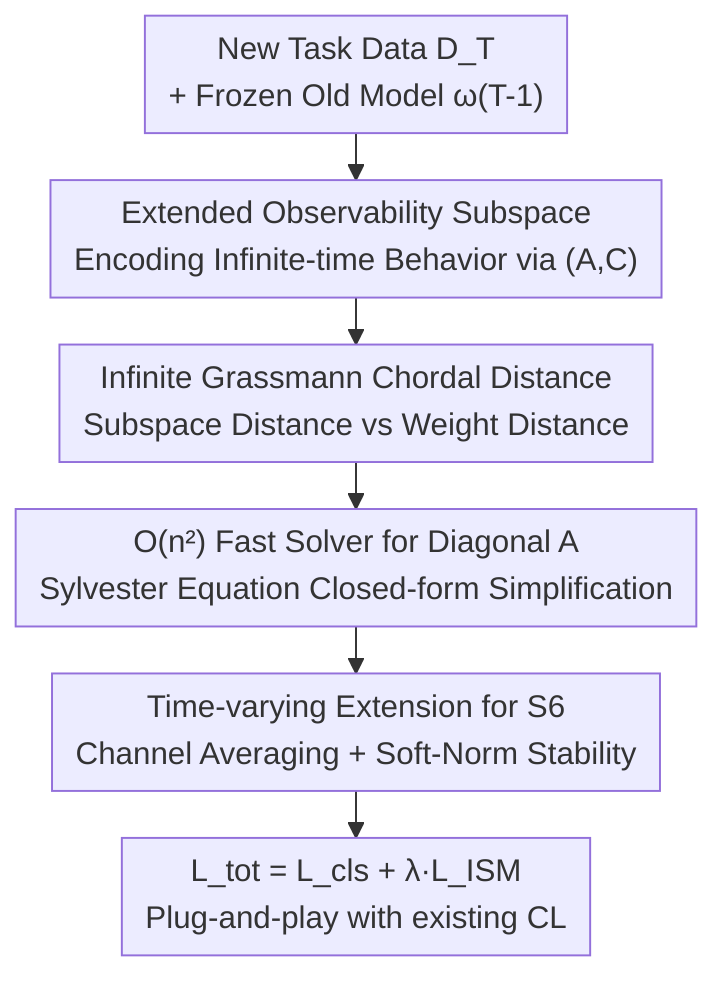

# Exemplar-Free Continual Learning for State Space Models

**Conference**: CVPR 2026  
**arXiv**: [2505.18604](https://arxiv.org/abs/2505.18604)  
**Code**: TBD  
**Area**: Continual Learning / State Space Models (Mamba/SSM) / Vision Mamba  
**Keywords**: Continual Learning, Catastrophic Forgetting, State Space Models, Extended Observability Subspace, Infinite-dimensional Grassmann Manifold

## TL;DR
This paper proposes Inf-SSM—a geometric-aware, exemplar-free regularization method that encodes the "infinite-time behavior" of SSMs (e.g., Vim/Mamba) as a point on an extended observability subspace. By constraining the distance between subspaces of new and old tasks on an infinite-dimensional Grassmann manifold and reducing the computational cost from $\mathcal{O}(n^3)$ to $\mathcal{O}(n^2)$, this method serves as a plug-and-play module that improves average AA by 8.31% and reduces forgetting (FM) by 9.36% for existing continual learning methods.

## Background & Motivation
**Background**: State Space Models (S4, S6, Mamba-2, Vision Mamba), with their structured recurrence and linear complexity, are becoming powerful alternatives to Transformers for sequence and visual modeling. However, their application in **Continual Learning (CL)** scenarios—specifically Exemplar-Free Class-Incremental Learning (EFCIL), where storing old samples is prohibited—remains largely unexplored.

**Limitations of Prior Work**: Directly applying classic CL methods designed for MLPs/CNNs/Transformers (such as EWC, SI, MAS, LwF) to SSMs involves treating $(\mathbf{A},\mathbf{B},\mathbf{C})$ as ordinary weights for Frobenius regularization. The issue is that the "state" of an SSM is a dynamical system that evolves over time. Traditional weight regularization **completely ignores the geometric structure and temporal dynamics of SSMs**, leading to constraints that are both overly restrictive and poorly targeted.

**Key Challenge**: SSMs exhibit **P-equivalence**—for any invertible matrix $\mathbf{P}$, the parameters $(\mathbf{A},\mathbf{B},\mathbf{C})$ and $(\mathbf{P}\mathbf{A}\mathbf{P}^{-1},\mathbf{P}\mathbf{B},\mathbf{C}\mathbf{P}^{-1})$ describe the **same system behavior** (identical input-output mapping). This means infinitely many parameter sets can implement the same function. Frobenius distance fails to maintain **invariance** along this P-orbit: it heavily penalizes functionally equivalent parameter updates while potentially overlooking updates that truly alter the system dynamics. In short, "parameter change" does not equal "behavioral change."

**Goal**: Design a forgetting suppression term that is (1) invariant to P-equivalence, (2) captures the **infinite-time** behavior of SSMs, (3) requires no old samples, and (4) is computationally affordable.

**Key Insight**: The authors borrow the concept of **Extended Observability** from system identification theory—using the infinite power stack of $(\mathbf{A},\mathbf{C})$, i.e., $[\mathbf{C};\mathbf{C}\mathbf{A};\mathbf{C}\mathbf{A}^2;\cdots]$, to fully characterize the expected response of a system to random excitation. The **subspace** spanned by this matrix is invariant to P-equivalence and naturally resides on the infinite-dimensional Grassmann manifold $\mathrm{Gr}(n,\infty)$.

**Core Idea**: Instead of regularizing "how far parameters are," the method regularizes **how far the extended observability subspaces of the new and old models are on the Grassmann manifold**—replacing weight distance with subspace distance to ensure constraints are faithful to the true behavior of the SSM.

## Method

### Overall Architecture
Inf-SSM redefines "forgetting prevention" as a subspace distance minimization problem. When training task $T$, for the current model and the saved model $\boldsymbol\omega_{T-1}$ from the previous task, extended observability matrices are constructed from their respective SSM $(\mathbf{A},\mathbf{C})$ parameters. These subspaces uniquely characterize the infinite-time expected behavior of the SSMs. The chordal distance between the two subspaces on the infinite-dimensional Grassmann manifold is calculated as a distillation regularization term, which is then weighted and added to the classification loss. The key to this pipeline is that directly calculating infinite-dimensional subspace distance is infeasible; the authors prove it can be reduced to solving a **Sylvester equation**. By leveraging the diagonal structure of $\mathbf{A}$ in mainstream SSMs, the complexity is reduced from $\mathcal{O}(n^3)$ to $\mathcal{O}(n^2)$ (saving up to $100\times$ FLOPs), allowing it to be integrated into any existing CL method.

### Key Designs

**1. Extended Observability Subspace: Compressing "Infinite-time Behavior" into a point on Grassmann**

The root cause of ordinary parameter regularization failure is ignoring P-equivalence. The authors observe that when an SSM is excited by Gaussian white noise $x[t]\sim\mathcal{N}(0,1)$, the expected output recurrence is $\mathbb{E}[y[t]]=\mathbf{C}\mathbf{A}\,\mathbb{E}[\boldsymbol h[t-1]]$. The entire response sequence can be written as $[\mathbb{E}[y[1]];\mathbb{E}[y[2]];\cdots]=\mathbf{O}_\infty(\mathbf{A},\mathbf{C})\,\boldsymbol h[0]$, where the extended observability matrix is $\mathbf{O}_\infty(\mathbf{A},\mathbf{C})=[\mathbf{C};\mathbf{C}\mathbf{A};\mathbf{C}\mathbf{A}^2;\cdots]\in\mathbb{R}^{\infty\times n}$. The key theorem is that the subspace $\mathcal{S}_\infty(\mathbf{A},\mathbf{C})$ spanned by its columns is **invariant** on the P-orbit—$\mathcal{S}_\infty(\mathbf{A}',\mathbf{C}')=\mathcal{S}_\infty(\mathbf{A},\mathbf{C})$.

This replaces "storing samples for replay" with "statistical probing via random excitation," bypassing EFCIL data storage limits and covering infinite horizons. Since the subspace is constrained rather than specific parameters, it treats all functionally equivalent updates equally, only punishing drifts that truly change system behavior. Each subspace is a point on $\mathrm{Gr}(n,\infty)$, translating forgetting into "how far this point moved on the manifold."

**2. $\mathcal{O}(n^2)$ Closed-form Solution for Infinite Grassmann Chordal Distance: Making "Infinite Dimensions" Tractable**

Constructing a loss requires a distance metric. The chordal distance between two subspaces $d_{\text{chord}}^2(\mathcal{S},\mathcal{S}')=2n-2\|\mathcal{S}^\top\mathcal{S}'\|_F^2$ requires $\mathcal{S}=\mathbf{O}(\mathbf{O}^\top\mathbf{O})^{-1/2}$. Since $\mathbf{O}$ is infinitely tall, direct calculation is impossible. The authors reduce the core Gram matrix $\mathbf{G}=\mathbf{O}_\infty^\top\mathbf{O}_\infty'=\sum_{t=0}^\infty(\mathbf{A}^\top)^t\mathbf{C}^\top\mathbf{C}'(\mathbf{A}')^t$ to a **Sylvester equation**:

$$\mathbf{A}^\top\mathbf{G}\mathbf{A}'-\mathbf{G}=-\mathbf{C}^\top\mathbf{C}'$$

The general solution (Bartels-Stewart algorithm) is $\mathcal{O}(n^3)$, which is expensive as the state dimension $n$ grows. However, since $\mathbf{A}$ in structured SSMs is **diagonal**, the authors transform the equation into an element-wise Hadamard form, yielding a closed-form solution:

$$\mathbf{G}=\mathbf{C}^\top\mathbf{C}'\odot\frac{1}{\mathbf{1}_n-\mathbf{A}_{\text{diag}}\mathbf{A}_{\text{diag}}'^{\top}}$$

This reduces complexity from $\mathcal{O}(n^3)$ to $\mathcal{O}(n^2)$, cutting FLOPs from $25n^3$ (Bartels-Stewart) to $4n^2$. For $n=16$ in Vim, this is a $100\times$ improvement. Calculating the distance requires solving three such equations (to obtain $\mathbf{G}_1,\mathbf{G}_2,\mathbf{G}_3$ followed by matrix algebra), which turns infinite-dimensional subspace regularization into a practical engineering solution.

**3. Observability Set Construction for S6/Vim Time-varying Systems: Connecting to Real-world Mamba**

In S4D/Mamba, $\mathbf{A}\in\mathbb{R}^{\tau\times o \times n}$ and $\mathbf{C}\in\mathbb{R}^{\tau\times n}$ are **time-varying** (each sequence position $\tau$ contains $o$ LDS), rather than a single LTI system. The authors generate a set of extended observability matrices for each timestep $\mathbb{O}=\{\mathbf{O}_{\infty,t}(\tilde{\mathbf{A}}_t,\tilde{\mathbf{C}}_t)\}_{t=1}^\tau$ by **averaging the state over the outer dimension (channel) $o$**: $\tilde{\mathbf{A}}=\mathrm{SN}(\frac1o\sum_i\overline{\mathbf{A}}_{i,j})$ and $\tilde{\mathbf{C}}=\mathrm{SN}(\mathbf{C})$. Soft-Normalization $\mathrm{SN}(x)=2/(1+e^{-x})-1$ is used to enforce Schur stability (ensuring power series convergence).

Averaging over $o$ is necessary: directly calculating distances for $\tau\times o$ SSMs in Vim-small involves $197\times384\approx7.6\times10^4$ pairs, which exceeds H100 VRAM limits. Channel averaging compresses the scale to manageable levels while retaining maximum variance (minimizing information loss).

### Loss & Training
The final Inf-SSM loss is the expected chordal distance of the observability sets between new and old tasks: $L_{\texttt{ISM}}=\mathbb{E}_{\mathcal{D}_T}\{d_{\text{chord}}^2(\mathbb{O}_{T-1},\mathbb{O}_T)\}$, weighted with the classification loss: $L_{\texttt{tot}}=L_{\texttt{cls}}+\lambda L_{\texttt{ISM}}$. The method introduces **only one hyperparameter $\lambda$** (compared to ≥5 in many SOTA CL methods), making it easy to tune and deploy. An Inf-SSM+ variant adds a Frobenius term for $\mathbf{B}$, but experiments show performance similar to Inf-SSM, validating the theoretical premise that $(\mathbf{A},\mathbf{C})$ is sufficient to characterize behavior.

## Key Experimental Results
The backbone is Vim-Small. Datasets include ImageNet-R / CIFAR-100 / Caltech-256, partitioned into 5 / 10 tasks. Metrics are average accuracy AA(↑), average incremental accuracy AIA(↑), and forgetting measure FM(↓).

### Main Results: Plug-and-play Integration (5-Tasks)

| Method | Dataset | AA(%↑) | FM(%↓) |
|--------|------|------|------|
| X-DER | ImageNet-R | 47.42 | 42.99 |
| **+Inf-SSM** | ImageNet-R | **52.61** | **31.00** |
| X-DER | CIFAR-100 | 42.33 | 65.07 |
| **+Inf-SSM** | CIFAR-100 | **48.33** | **56.66** |
| X-DER | Caltech-256 | 58.51 | 44.84 |
| **+Inf-SSM** | Caltech-256 | **68.04** | **32.11** |
| LUCIR | ImageNet-R | 31.18 | 60.24 |
| **+Inf-SSM** | ImageNet-R | **35.35** | **52.05** |

On average, Inf-SSM improves the AA of baselines by 8.31% and reduces FM by 9.36%. Gains are particularly significant with X-DER (AA +19.61%, FM −23.16%). The benefit increases with more tasks, suggesting it successfully captures SSM evolution over long sequences.

### Independent Comparison with EFCIL SOTA (Vim-small, $(\mathbf{A},\mathbf{B},\mathbf{C})$ settings vs Inf-SSM $(\mathbf{A},\mathbf{C})$)

| Configuration | ImageNet-R AA / FM | CIFAR-100 AA / FM | Caltech-256 AA / FM | Description |
|------|------|------|------|------|
| Seq (No CL) | 38.36 / 56.43 | 36.68 / 55.00 | 37.58 / 71.48 | Lower Bound |
| EWC | 45.58 / 47.31 | 38.25 / 50.71 | 42.93 / 64.30 | Parameter Importance |
| LwF-ABC | 45.09 / 40.77 | 44.62 / 38.68 | 46.52 / 59.03 | Distill $(\mathbf{A},\mathbf{B},\mathbf{C})$ |
| **Inf-SSM** | **49.34 / 25.14** | 45.18 / 36.59 | **50.75 / 49.93** | Optimal with only $(\mathbf{A},\mathbf{C})$ |

Even when only regularizing $(\mathbf{A},\mathbf{C})$, Inf-SSM outperforms others using $(\mathbf{A},\mathbf{B},\mathbf{C})$, reducing FM by 14.56% and increasing AA by 6.79%. If others are restricted to $(\mathbf{A},\mathbf{C})$, the gain is even larger (+21.73% AA). This validates that extended observability subspaces are sufficient for controlling SSM behavior.

### Efficiency Analysis (Vim-small, Single A40 GPU)

| Operation | Avg Time (s) | Description |
|------|------|------|
| EWC Loss (per batch) | 0.0095 | Plus 181.5s per task to calculate FIM |
| X-DER Loss (per batch) | 1.2534 | Modern method, slow |
| **Inf-SSM Loss (per batch)** | **0.0960** | Order of magnitude faster than X-DER |

### Key Findings
- **Forgetting reduction is the primary gain**: The decrease in FM is generally larger than the increase in AA, indicating Inf-SSM excels at stability.
- **$(\mathbf{A},\mathbf{C})$ is enough**: Adding regularization for $\mathbf{B}$ (Inf-SSM+) yields negligible gains, consistent with theory.
- **More blocks, better results**: Ablations show that applying Inf-SSM to more blocks is beneficial; deep SSM states change more than shallow ones.
- **Efficiency Sweet Spot**: At 0.096s per batch, it is ~13× faster than X-DER and avoids the per-task full-dataset pass required by EWC for FIM calculation.

## Highlights & Insights
- **Defining forgetting through "system behavior" rather than "parameter distance"**: Integrating control theory (observability) with Grassmann geometry addresses P-equivalence at its root.
- **Infinite dimensions to $\mathcal{O}(n^2)$ Engineering**: Reducing infinite-time subspace distance to a Sylvester equation with a closed-form solution for diagonal $\mathbf{A}$ is a rare combination of elegant theory and practical speed.
- **Minimalist Plug-and-play**: A single hyperparameter $\lambda$ makes it compatible with replay, replay-free, prompt, and frequency-based CL methods.
- **Transferable Paradigm**: Probing system responses with random excitation instead of storing samples can inspire other data-restricted scenarios like model distillation and compression.

## Limitations & Future Work
- **Dependency on Diagonal $\mathbf{A}$**: The $\mathcal{O}(n^2)$ solver relies on the diagonal structure common in modern SSMs. For general dense $\mathbf{A}$, it reverts to $\mathcal{O}(n^3)$.
- **Information Loss from Channel Averaging**: Averaging over $\tau\times o$ SSMs is an approximation that may be suboptimal for tasks with high channel-wise variance.
- **Baseline Comparability**: Baselines use different settings (batch size/epochs), so the focus should be on the relative Gain provided by Inf-SSM.
- **Evaluation Scope**: Currently limited to Vim-Small and image classification. Scalability to larger Mambas or NLP/Audio tasks requires further verification.
- **Future Work**: Extending Inf-SSM to knowledge distillation and compression, and exploring Schubert cells for varying dimensions.

## Related Work & Insights
- **vs EWC / SI / MAS**: These methods use Frobenius constraints in parameter space, which are not P-equivalence invariant for SSMs. Inf-SSM operates in behavior space.
- **vs LwF**: LwF requires forward passes for distillation; Inf-SSM probes the system's infinite-time expected response via random excitation.
- **vs ER / LUCIR / X-DER**: These rely on sample storage; Inf-SSM is exemplar-free but can be added to these methods to further boost performance.
- **vs Mamba-based CL**: Previous works mostly store feature embeddings. Inf-SSM is the first to explicitly utilize the observability geometry of the SSM itself.

## Rating
- Novelty: ⭐⭐⭐⭐⭐ First to introduce extended observability and Grassmann geometry to SSM continual learning.
- Experimental Thoroughness: ⭐⭐⭐⭐ Covers various datasets and paradigms, though limited to Vim-Small.
- Writing Quality: ⭐⭐⭐⭐ Clear theoretical derivation, though dense for readers without a control theory background.
- Value: ⭐⭐⭐⭐⭐ High practical value due to its plug-and-play nature and efficiency.

<!-- RELATED:START -->

## Related Papers

- [\[AAAI 2026\] Expandable and Differentiable Dual Memories with Orthogonal Regularization for Exemplar-free Continual Learning](../../AAAI2026/self_supervised/expandable_and_differentiable_dual_memories_with_orthogonal_regularization_for_e.md)
- [\[CVPR 2026\] Exemplar-Free Class Incremental Learning via Preserving Class-Discriminative Structure](exemplar-free_class_incremental_learning_via_preserving_class-discriminative_str.md)
- [\[CVPR 2026\] Is Parameter Isolation Better for Prompt-Based Continual Learning?](is_parameter_isolation_better_for_prompt-based_continual_learning.md)
- [\[ECCV 2024\] Exemplar-Free Continual Representation Learning via Learnable Drift Compensation](../../ECCV2024/self_supervised/exemplar-free_continual_representation_learning_via_learnable_drift_compensation.md)
- [\[CVPR 2026\] Parameter-efficient Continual Learning for Enhancing Plasticity without Forgetting under Limited Model Capacity](parameter-efficient_continual_learning_for_enhancing_plasticity_without_forgetti.md)

<!-- RELATED:END -->
