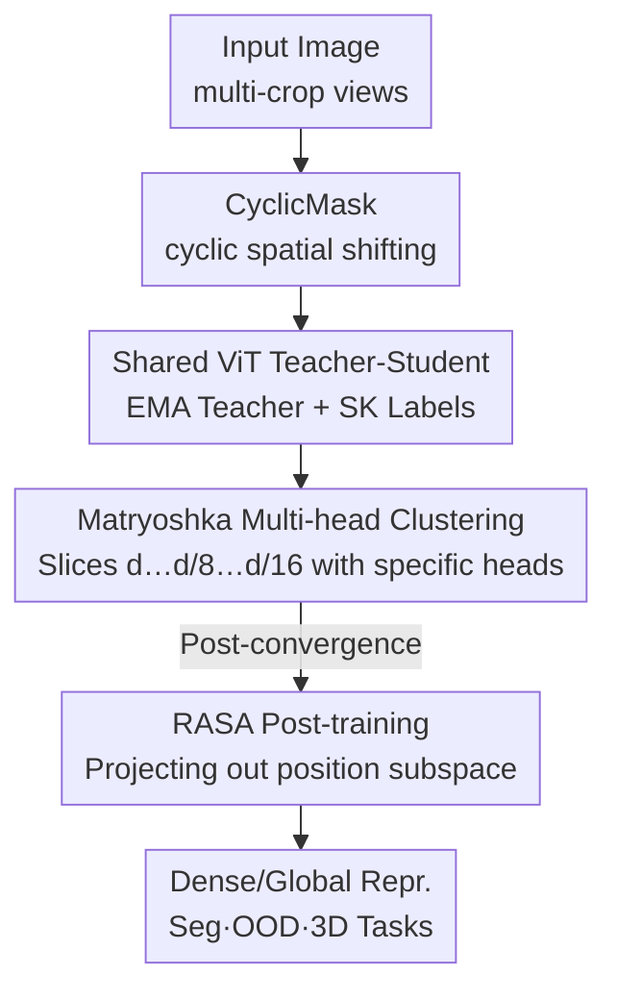

# Franca: Nested Matryoshka Clustering for Scalable Visual Representation Learning

**Conference**: CVPR 2026  
**Area**: Self-supervised representation learning  
**Keywords**: Visual Foundation Models, Self-Supervised Learning, Matryoshka Representation, Clustering SSL, Fully Open Source  

## TL;DR
Franca is the first fully open-source (data + code + weights + intermediate checkpoints) visual foundation model. Built on the DINOv2 framework, it introduces "nested Matryoshka multi-head clustering" to refine semantics layer-by-layer along feature dimensions, utilizes CyclicMask to balance mask spatial distribution, and employs RASA post-training to decouple absolute position information from dense features. Using only public data, it matches or surpasses closed-source models like DINOv2 and SigLIP 2 in segmentation, OOD detection, and 3D understanding.

## Background & Motivation
**Background**: Self-supervised learning (SSL) is the primary route for training visual foundation models (VFMs) due to the abundance of image-only data. Representative models like DINOv2, SigLIP 2, and SEER have achieved high performance using teacher-student distillation and optimal transport-based (Sinkhorn-Knopp) clustering pseudo-labels to map image features to massive codebooks.

**Limitations of Prior Work**: Two main levels. First, **Openness**—these SOTA models rely on proprietary data (LVD-142M for DINOv2, WebLI for SigLIP 2) and hide critical or all training code, preventing the community from reproducing results or studying convergence trajectories. Second, **Methodological**: ① Clustering semantics are inherently ambiguous (e.g., a car can be grouped by brand, color, or year); existing methods handle this by stacking massive codebooks (DINOv2 uses 131K prototypes), which is computationally expensive. ② Dense features are dominated by the **absolute positions of patches** rather than semantic content—if a semantic component consistently appears at a fixed location, the clustering is biased by position.

**Key Challenge**: A single fixed-dimension feature space and a single massive codebook cannot express "coarse-to-fine" hierarchical semantics nor allow flexible truncation under different compute budgets; simultaneously, the fixed patch layout and positional encoding of ViTs entangle spatial location with semantics.

**Goal**: Build a fully open-source VFM that matches closed-source performance, achieves high-quality representations in smaller models without distillation, and architecturally addresses clustering ambiguity and positional bias.

**Key Insight**: Instead of compressing all semantics into a single-dimension codebook, nested subspaces should handle different granularities—large dimensions for global semantics and small dimensions for local structure—forming a natural coarse-to-fine hierarchy. Positional bias can be removed via a lightweight linear surgery after pre-training.

**Core Idea**: Replace "single-space massive codebook clustering" with "nested Matryoshka multi-head clustering" to obtain hierarchical, compressible dense representations, followed by RASA post-processing to project out linearly predictable positional components.

## Method
Franca maintains the DINOv2-style teacher-student SSL framework and adds three components: CyclicMask (masking strategy), Matryoshka multi-head clustering (core representation learning), and RASA (positional disentanglement post-training).

### Overall Architecture
Input images are transformed into multiple global/local views using multi-crop. Each view is divided into $n$ patch embeddings with a `[CLS]` token and fed into a shared ViT. The student $f_\theta$ and teacher $\bar f_{\bar\theta}$ share the architecture; teacher parameters are updated via EMA. The `[CLS]` token produces image-level prototype scores, and patches produce patch-level prototype scores. Teacher projection outputs are processed via Sinkhorn-Knopp to create balanced target distributions for the student to match via cross-entropy.

Franca modifies this baseline with: **CyclicMask** for patch visibility, **Matryoshka multi-head clustering** for nested subspace clustering (the primary performance driver), and **RASA** post-training to subtract positional components from dense features.

### Key Designs

**1. Matryoshka Multi-head Clustering: Hierarchical Semantic Learning**

To address clustering ambiguity without stacking massive codebooks, Franca adopts Matryoshka representations. The ViT output $Z_s = f_\theta(x)\in\mathbb{R}^{(n+1)\times d}$ is sliced into nested sub-embeddings $M=\{m_1,\dots,m_k\}$ where $m_1<\dots<m_k=d$. Specifically, $Z_s^{(j)} = Z_s[:,\,1:m_j]$ (dims $d, d/8, d/16$ are used). Unlike standard Matryoshka which shares a head, Franca **assigns an independent projection head $h_\nu^{(j)}$ and an independent clustering head to each subspace**. The number of prototypes scales with $m_j$. Larger dimensions handle more prototypes, while smaller dimensions handle fewer, forcing specialization into specific semantic granularities. The total loss is:

$$\mathcal{L}_{\text{total}} = \sum_{j=1}^{k}\mathcal{L}^{(j)}.$$

This approach requires **fewer parameters and less memory** than a 131K prototype codebook. PCA visualization shows that even at unseen dimensions (e.g., dim/64), Franca maintains coherent component-level structures, whereas DINOv2 loses semantic alignment when compressed.

**2. CyclicMask: Balancing Spatial Visibility**

Standard random or block masking often lacks spatial structure and creates fragmented contexts, causing the model to favor specific spatial positions. CyclicMask **cyclically shifts the visible area along spatial axes**. This breaks simple spatial continuity and ensures visible content covers different relative positions across steps, preventing spatial bias and promoting semantic learning at zero cost.

**3. RASA: Removing Absolute Spatial Attributes via Linear Surgery**

To address "position-semantic entanglement," the authors found that many DINOv2 patch clusters trigger at fixed locations (low spatial entropy). RASA is an iterative post-training step: at iteration $t$, a linear position head $W\in\mathbb{R}^{2\times D}$ is trained on few images to regress normalized patch coordinates:

$$\mathcal{L}_{\text{pos}} = \frac{1}{n}\sum_{i=1}^{n}\lVert \sigma(WZ_i) - y_i\rVert_2^2,\quad y_i\in[0,1]^2.$$

The rows of $W$ are orthogonalized (Gram–Schmidt) into basis vectors $u_r, u_c$ representing the "positional subspace." The projection of features onto this subspace is subtracted: $Z_i^{(t+1)} = Z_i^{(t)} - ( \langle Z_i,u_r\rangle u_r + \langle Z_i,u_c\rangle u_c )$. The final transformation $L$ can be **folded into the last ViT layer weights**, resulting in zero inference cost while significantly increasing the spatial entropy of patch clusters and boosting dense task performance.

### Loss & Training
Pre-trained using ViT-B/L/G (patch 14, no registers) for 625K steps. ViT-B used ImageNet-21K; ViT-L/G used LAION-600M. Batch sizes were 2048 to 3072. High-resolution fine-tuning (HRFT) was performed on a mix of IN-1K, ADE20K, COCO, KITTI, and VOC. Finally, RASA post-training was applied for 8 iterations on Pascal VOC. No external teacher distillation was used.

## Key Experimental Results

### Main Results
Controlled comparison with DINOv2 using IN-21K and identical hyperparameters without distillation (Table 2, excerpt):

| Model | Architecture | HRFT+RASA | KNN(IN-1K) | In-Context(ADE20K) | VOS(DAVIS) |
|------|------|-----------|-----------|--------------------|-----------|
| DINOv2 | ViT-B/14 | ✗ | 77.0 | 30.0 | 63.1 |
| Franca | ViT-B/14 | ✗ | **77.5** | **31.6** | **65.5** |
| DINOv2 | ViT-L/14 | ✓ | 80.7 | 37.9 | 66.6 |
| Franca | ViT-L/14 | ✓ | **82.5** | **39.6** | **70.0** |

On dense segmentation (Table 3), Franca-L (LAION-600M) outperforms DINOv2-L (LVD-142M with distillation):

| Model | Arch | Training Data | VOC | ADE20K |
|------|------|---------|-----|--------|
| Web-SSL | ViT-L/14 | MC-2B | 71.3 | 35.3 |
| DINOv2§(Distill) | ViT-L/14 | LVD-142M | 74.6 | 38.6 |
| Franca | ViT-L/14 | LAION-600M | **79.5** | **39.6** |

### Ablation Study
Incremental component gains (Figure 2, DINOv2-B / IN-21K baseline):

| Configuration | Linear Probe (IN-1K) | In-Context (VOC) | Notes |
|------|---------------------|------------------|------|
| 1. Baseline | 81.2 | 69.6 | DINOv2-B reproduction |
| 2. + Matryoshka | 82.0 | 73.7 | Largest gain for dense tasks |
| 3. + HRFT | 82.6 | 76.2 | Resolution boost |
| 4. + RASA | 82.6 | **76.7** | Positional disentanglement |

### Key Findings
- **Matryoshka primarily benefits dense tasks**: Adding Matryoshka improved In-Context mIoU from 69.6 to 73.7, the largest single step, confirming "multi-granularity clustering" is vital for pixel-level alignment.
- **Distillation is the source of DINOv2-B's strength**: DINOv2-B without distillation on IN-21K reaches only 86.9 (VOC) / 41.3 (ADE20K), while Franca-B reaches 89.4 / 46.2.
- **Robustness at small dimensions**: Franca outperforms DINOv2 in k-NN at dim/64 because DINOv2 spreads information uniformly across all dimensions, losing semantics upon truncation.

## Highlights & Insights
- **"Full Open Source" as a priority**: Beyond weights, the paper releases training code, public data filtering scripts, and **intermediate checkpoints**, enabling researchers to study emergence behaviors and convergence.
- **Matryoshka for Clustering Heads**: Assigning independent projection/clustering heads to nested subspaces explicitly models semantic hierarchy, proving superior to monolithic codebooks.
- **RASA "Linear Surgery" Paradigm**: The method offers a template: diagnose a nuisance factor (position), build a linearly predictable subspace, and project it out. This can potentially be applied to other factors like lighting or texture.

## Limitations & Future Work
- RASA only removes **linearly predictable** positional bias. Non-linear entanglement remains, as noted in concurrent works like DINOv3.
- ViT-G skipped HRFT due to compute constraints, making comparisons between G-scale and L-scale slightly inconsistent.
- Future Work: Integrating Matryoshka clustering and RASA into stronger frameworks like DINOv3.

## Related Work & Insights
- **vs. DINOv2**: Both use Sinkhorn-Knopp SSL. Franca achieves better results on open data without distillation by using nested multi-head clustering.
- **vs. Standard Matryoshka**: While the original focuses on retrieval/compression, Franca upgrades it to "hierarchical clustering learning" with independent heads.
- **vs. SigLIP 2**: Vision-only precise spatial features in Franca significantly outperform vision-language models in dense tasks like segmentation.

## Rating
- Novelty: ⭐⭐⭐⭐ Solid combination of nested clustering and RASA linear surgery.
- Experimental Thoroughness: ⭐⭐⭐⭐⭐ Covers classification, segmentation, VOS, OOD, and 3D across multiple backbones.
- Writing Quality: ⭐⭐⭐⭐ Clear motivation, though some formulas (Eq. 3) require careful reading.
- Value: ⭐⭐⭐⭐⭐ High impact due to performance and complete transparency (checkpoints).

<!-- RELATED:START -->

## Related Papers

- [\[CVPR 2026\] Learning from Semantic Dictionaries: Discriminative Codebook Contrastive Learning for Unified Visual Representation and Generation](learning_from_semantic_dictionaries_discriminative_codebook_contrastive_learning.md)
- [\[CVPR 2026\] Scaling Dense Event-Stream Pretraining from Visual Foundation Models](scaling_dense_event-stream_pretraining_from_visual_foundation_models.md)
- [\[CVPR 2026\] Learning to See Through a Baby's Eyes: Early Visual Diets Enable Robust Visual Intelligence in Humans and Machines](learning_to_see_through_a_babys_eyes_early_visual_diets_enable_robust_visual_int.md)
- [\[ICLR 2026\] Spatially Informed Autoencoders for Interpretable Visual Representation Learning](../../ICLR2026/self_supervised/spatially_informed_autoencoders_for_interpretable_visual_representation_learning.md)
- [\[ICLR 2026\] Debiased and Denoised Representation Learning for Incomplete Multi-view Clustering](../../ICLR2026/self_supervised/debiased_and_denoised_representation_learning_for_incomplete_multi-view_clusteri.md)

<!-- RELATED:END -->
