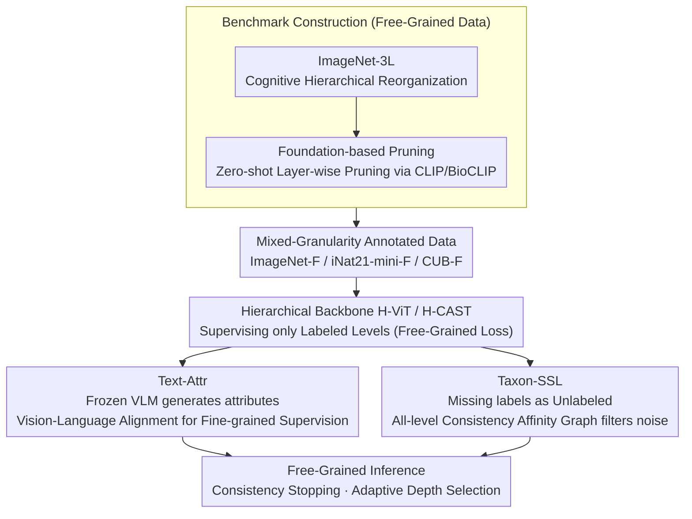

# Free-Grained Hierarchical Visual Recognition

**Conference**: CVPR 2026  
**arXiv**: [2510.14737](https://arxiv.org/abs/2510.14737)  
**Code**: [FreeGrainLearning](https://github.com/seulkipark/FreeGrainLearning)  
**Area**: Self-Supervised  
**Keywords**: Hierarchical Classification, Mixed-Granularity Labeling, Semi-Supervised Learning, Text-Guided, Taxonomy

## TL;DR

Ours proposes "free-grained" hierarchical visual recognition, allowing training labels to appear at any level of the taxonomy, and introduces text-guided pseudo-attributes and taxonomy-guided semi-supervised learning to compensate for missing supervision; during inference, the model adaptively selects prediction depth.

## Background & Motivation

Traditional hierarchical classification assumes every training image has full labels across all taxonomic levels (e.g., Bird → Bird of prey → Bald eagle). However, in reality, labels are often inconsistent:
- **Intrinsic Reasons**: Images might lack sufficient visual evidence for fine-grained labels (e.g., a distant bird where species cannot be identified).
- **Extrinsic Reasons**: Labeling is restricted by cost, expertise, or annotation protocols.

This paper defines the **free-grained learning** setting: training labels can appear at any taxonomic level, and annotation depth can vary across samples. The model must learn consistent hierarchical predictions from such incomplete, mixed-granularity supervision.

Experiments show that the current Prev. SOTA hierarchical classification method (H-CAST) suffers a Full-Path Accuracy drop of 19-40 percentage points (e.g., iNat21-mini drops from 64.9% to 25.6%) when moving from full labels to the free-grained setting, proving the challenge of this task.

## Method

### Overall Architecture

This paper addresses "free-grained" hierarchical recognition—where labels can be at any level and depths vary—requiring the model to learn consistent predictions from incomplete supervision. The framework consists of three parts: transforming existing datasets into free-grained benchmarks (including newly built ImageNet-3L and pruning to simulate mixed-granularity), using text-guided pseudo-attributes (Text-Attr) and taxonomy-guided semi-supervised learning (Taxon-SSL) to recover missing supervision, and performing adaptive inference to decide the prediction depth.

### Key Designs

**1. ImageNet-3L Dataset Construction: Creating a Clean 3-Level Taxonomy for Hierarchical Evaluation**

The native WordNet hierarchy in ImageNet is messy and deep (5-19 levels, 30% categories have multiple paths), making clean consistency evaluation impossible. Ours reorganizes it into a regular three-level taxonomy based on cognitive psychology principles (20 basic / 127 subordinate / 505 fine-grained). It removes single-child paths, maximizes intra-group diversity, refines ambiguous categories, and uses LLM + manual audit as a safety net, resulting in a large-scale clean benchmark for hierarchical evaluation.

**2. Foundation-based Pruning: Simulating Realistic Mixed-Granularity Labels with Zero-Shot Models**

To study free-grained learning, "unevenly labeled" data is required. Instead of random dropping, ours uses zero-shot predictions from CLIP/BioCLIP to check layers from coarse to fine: labels are kept if the subordinate prediction is correct, and further kept if the fine-grained prediction is also correct; otherwise, incorrect levels are pruned. In the resulting ImageNet-F, 32.6% keep all three levels, 28.0% keep two, and 39.4% keep only the basic level, which is closer to the real distribution where "insufficient visual evidence leads to missing fine-grained labels."

**3. Text-Attr: Recovering Fine-grained Supervision via Level-Consistent Visual Attributes**

**Core Insight**: While category names differ across levels, many visual attributes ("short legs", "pointed ears") are consistent. A frozen VLM (Llama-3.2-11B) generates text descriptions for images, which are encoded by CLIP's text encoder. Contrastive learning aligns image features with text embeddings. Since this supervision does not rely on category labels, it provides extra semantic cues when fine-grained labels are missing, proving particularly effective on large-scale datasets with sparse labels.

**4. Taxon-SSL: Treating Missing Labels as Unlabeled Data with Taxonomy-Aligned Affinity Graphs**

Another path is to treat missing labels as unlabeled data for semi-supervised learning. The **Mechanism** is the taxonomy-aligned affinity graph: two samples are considered a positive pair only when their pseudo-labels match across **all levels** (Eq. 3). This "all-level consistency" gate effectively filters noisy pseudo-labels and ensures hierarchical consistency. Using contrastive loss to pull positive pairs and push negative ones makes it more stable than Text-Attr on fine-grained biological data with similar appearances.

**5. Free-Grained Inference: Adaptive Prediction Depth via Consistency Stopping**

After recovering supervision, inference must determine "how deep to predict"—since a correct coarse label is often more useful than an incorrect fine one. Ours compares two strategies: confidence-based stopping stops when softmax confidence is below a threshold ($\tau=0.9$), but similar sibling classes often split the probability, leading to premature stops. Consistency-based stopping stops only when the fine-level prediction conflicts with its coarse-level ancestor, breaking taxonomy consistency. The latter requires no threshold tuning and reliably explores deeper correct levels.

### Loss & Training

- **Free-grained Hierarchical Loss**: $\mathcal{L}_{hier} = \sum_l \mathbb{1}_{y_l \text{ exists}} \cdot \mathcal{L}(f_l(x), y_l)$, where supervision is applied only to levels with existing labels.
- **Text Contrastive Loss**: InfoNCE loss aligning image-text embeddings.
- **Taxonomy-aligned Contrastive Loss**: Contrastive learning based on all-level consistent pseudo-labels.
- Backbone: ViT-Small (H-ViT) or H-CAST; trained for 100 epochs (200 for ImageNet-F).

## Key Experimental Results

### Main Results

| Dataset | Method | FPA ↑ | Fine ↑ | Sub ↑ | Basic ↑ | TICE ↓ |
|--------|------|-------|--------|-------|---------|--------|
| ImageNet-F | H-CAST (full→free) | 57.59 | 59.02 | 82.69 | 93.53 | 21.81 |
| ImageNet-F | Text-Attr (H-CAST) | **63.20** | 64.91 | 84.47 | 93.56 | 18.58 |
| ImageNet-F | Taxon-SSL | 48.40 | 52.34 | 65.74 | 82.96 | 19.87 |
| iNat21-mini-F | H-CAST | 25.63 | 28.61 | 67.20 | 83.62 | 47.17 |
| iNat21-mini-F | Taxon-SSL + Text-Attr | **31.93** | 37.08 | 69.76 | 82.20 | 37.04 |
| iNat21-mini-F | Taxon-SSL | 31.74 | 37.11 | 69.53 | 82.02 | 37.31 |

### Ablation Study

| Setting | Key Indicator | Description |
|------|---------|------|
| H-CAST full → free (CUB) | FPA: 84.9% → 45.1% | Missing labels cause 39.8pp drop |
| H-CAST full → free (iNat) | FPA: 64.9% → 25.6% | Missing labels cause 39.3pp drop |
| Text-Attr Sparse Labels | Better than Taxon-SSL | Text compensates for supervision when labels are scarce |
| Taxon-SSL Abundant Labels | Better than Text-Attr | SSL is more effective given enough data |

### Key Findings

1. **Severe Degradation of Existing Methods**: H-CAST's FPA drops by 19-40 pp in the free-grained setting, justifying the need for this research.

2. **Complementarity of Text-Attr and Taxon-SSL**: Text-Attr is stronger on large diverse datasets (ImageNet-F) due to rich semantic cues in text; Taxon-SSL excels in fine-grained biological data (iNat21-mini-F) where visual consistency is more critical due to inter-class similarity.

3. **Consistency over Confidence for Inference**: Consistency-based stopping (stopping when hierarchical consistency is broken) yields more reliable and deeper correct predictions than confidence-based stopping, without requiring threshold tuning.

4. **Text-guided Semantic Focus**: Saliency maps show Text-Attr helps the model focus on semantically relevant regions (e.g., an instrument instead of the person), whereas Taxon-SSL might be misled by visually salient but irrelevant regions.

## Highlights & Insights

- Defines a significant new setting: Free-grained hierarchical recognition, which is more realistic than traditional full-label assumptions.
- The construction of the ImageNet-3L benchmark is a valuable contribution, providing a large-scale, clean platform for hierarchical evaluation.
- The complementarity of the two methods is a deep insight: use external semantics (text) when labels are scarce, and use structured SSL for consistency when labels are moderate.
- Consistency-based inference is an elegant parameter-free strategy.

## Limitations & Future Work

- Class-level and level-level imbalances are not explicitly addressed.
- Label pruning relies on CLIP, which may introduce bias; better pruning methods (e.g., ensemble-based) remain to be explored.
- The Gain remains limited (5-25%), indicating significant room for improvement in free-grained learning.
- The method has not been extended to deeper taxonomies (beyond 3 levels).
- Inference only considers "when to stop," neglecting information propagation and error correction between levels.

## Related Work & Insights

- H-CAST (CVPR'23) is a SOTA for hierarchical classification, encouraging consistent grouping across levels.
- HRN (CVPR'22) handles multi-level supervision by maximizing marginal probability in tree-constrained spaces.
- CHMatch uses coarse labels to improve pseudo-labels but is limited to two-level settings.
- Ours unifies long-tail recognition, semi-supervised learning, weakly-supervised learning, and hierarchical consistency within a single framework.

## Rating

- Novelty: ⭐⭐⭐⭐⭐ (Defines new problem; innovative datasets and methods)
- Experimental Thoroughness: ⭐⭐⭐⭐⭐ (Multi-dataset, multi-setting, detailed analysis and visualization)
- Writing Quality: ⭐⭐⭐⭐⭐ (Clear problem definition, excellent charts, well-organized)
- Value: ⭐⭐⭐⭐⭐ (Opens new research direction, provides benchmarks and baselines)

<!-- RELATED:START -->

## Related Papers

- [\[CVPR 2026\] Trust-calibrated Collaborative Learning for Long-Tailed Visual Recognition](trust-calibrated_collaborative_learning_for_long-tailed_visual_recognition.md)
- [\[ICCV 2025\] Scaling Language-Free Visual Representation Learning](../../ICCV2025/self_supervised/scaling_languagefree_visual_representation_learning.md)
- [\[CVPR 2026\] HCL-FF: Hierarchical and Contrastive Learning for Forward-Forward Algorithm](hcl-ff_hierarchical_and_contrastive_learning_for_forward-forward_algorithm.md)
- [\[CVPR 2026\] Learning to See Through a Baby's Eyes: Early Visual Diets Enable Robust Visual Intelligence in Humans and Machines](learning_to_see_through_a_babys_eyes_early_visual_diets_enable_robust_visual_int.md)
- [\[CVPR 2026\] Exploring Visual Pretraining for Learning Language Intelligence](exploring_visual_pretraining_for_learning_language_intelligence.md)

<!-- RELATED:END -->
