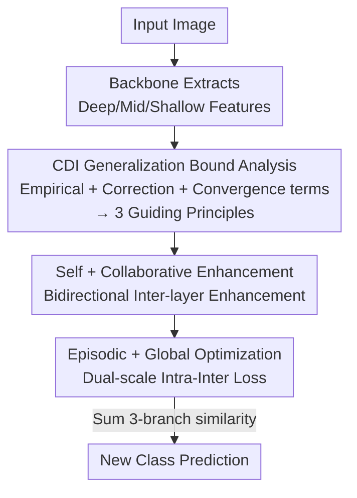

# From Few-way to Many-way: Rethinking Few-shot Fine-grained Image Classification

**Conference**: CVPR 2026  
**Paper**: [CVF Open Access](https://openaccess.thecvf.com/content/CVPR2026/html/Zhao_From_Few-way_to_Many-way_Rethinking_Few-shot_Fine-grained_Image_Classification_CVPR_2026_paper.html)  
**Code**: https://github.com/Legenddddd/SCEG  
**Area**: Few-shot Learning / Representation Learning  
**Keywords**: Few-shot fine-grained classification, many-way setting, class discriminative index, multi-layer feature synergy, Intra-Inter Loss  

## TL;DR
This paper points out that existing Few-shot Fine-grained Classification (FSFG) methods are trained and evaluated only in "few-class" scenarios (e.g., 5-way), failing significantly when faced with "many-way" settings. The authors decompose the causes of this failure into three actionable guiding principles using a generalization bound based on the Class Discriminative Index. Accordingly, they propose SCEG—featuring multi-layer self and collaborative feature enhancement plus an episodic/global dual-scale Intra-Inter Loss—which achieves significant leads across 4 datasets in both few-way and the newly proposed many-way settings.

## Background & Motivation

**Background**: Few-shot Fine-grained Classification (FSFG) aims to recognize new fine-grained categories (e.g., a specific bird species or car model) with only a few labeled images per class. The mainstream approach is episodic training: reorganizing the training set into numerous "C-way K-shot" tasks (episodes). Within each episode, the model learns fine-grained feature extraction and query–support interaction, assuming this ability can directly transfer to test-time episodes containing few new classes.

**Limitations of Prior Work**: Existing methods rely heavily on "intra-episode local interactions"—enhancing fine-grained features and amplifying the discriminability between support and query samples within an episode containing very few classes (typically 5). However, in real-world scenarios, the number of fine-grained subcategories is often large (e.g., hundreds of subcategories under the "Bird" genus). When the number of test ways increases from 5 to all new classes (many-way), these methods lack a "reliable and global" characterization of the entire class representation space, as intra-episode adaptation alone is insufficient.

**Key Challenge**: Episodic training only optimizes the "pair-wise discriminability of the source training sample set," implicitly assuming that discriminative power learned on training samples transfers to a large number of new classes. However, when the number of new classes is large, the generalization error depends not only on empirical discriminability but is also amplified by two ignored factors: ① Finite sample estimation error due to too few samples per class; ② Category-level uniform convergence error caused by encountering too few training classes in episodes to cover the global class distribution.

**Goal**: (1) Generalize FSFG from few-way to a more practical many-way evaluation setting; (2) Provide a theoretical analysis of new-class behavior to clarify the sources of "transfer failure"; (3) Design a method that ensures both "feature richness" and "global feature space coverage."

**Key Insight**: Instead of focusing solely on training episodes, the authors analyze the "class-conditional distribution" itself as a data point. Assuming that both training and new classes are sampled from the same class space distribution $\mathcal{D}_C$, they derive a generalization bound that connects "empirical discriminability on source training samples" with "expected discriminability on new classes" to identify optimization targets.

**Core Idea**: A Class Discriminative Index (CDI) is defined to quantify inter-class separability. The paper proves that the many-way generalization bound = Empirical CDI + Finite sample correction term + Category-level uniform convergence term. This leads to three guiding principles (reducing empirical CDI, augmenting feature richness, and expanding class diversity), which are addressed via SCEG's "self/collaborative feature extraction + episodic/global dual-scale optimization."

## Method

### Overall Architecture
SCEG (**S**elf and **C**ollaborative extraction + **E**pisodic and **G**lobal optimization) is strictly driven by theoretical analysis. The theory defines the Class Discriminative Index for two class-conditional distributions $T_1, T_2$:

$$\mathrm{CDI}_f(T_1,T_2)=\frac{\mathrm{Var}_f(T_1)+\mathrm{Var}_f(T_2)}{2\,\lVert \mu_f(T_1)-\mu_f(T_2)\rVert^2}$$

Representing "intra-class variance / inter-class mean margin," where lower values are better. Existing methods only minimize the average CDI of training sample pairs. This work further proves (Thm. 3.2) that the expected CDI on new classes is bounded by:

$$\mathbb{E}_{c\neq c'}[\mathrm{CDI}_f(P_c,P_{c'})]\le \frac{2}{l(l-1)}\sum_{i\neq j}\big(\mathrm{CDI}_f(\tilde S_i,\tilde S_j)+B_{ij}\big)(1+A_{ij})^2+U$$

Where $A_{ij}, B_{ij}$ are finite sample correction terms (originating from finite samples $m_c$ per class and class mean estimation errors), and $U$ is the category-level uniform convergence term (which tends to zero as the number of training classes $l$ increases, provided the global minimum class margin $\Delta(\mathcal{F}^*)$ does not collapse). This suggests three principles: **G1** Reduce empirical CDI on training samples; **G2** Make per-class features richer and closer to class semantics to reduce $A_{ij}, B_{ij}$ under sample scarcity; **G3** Optimize using as many source training classes as possible to cover the global class structure.

The pipeline is: Input images pass through a backbone to extract deep/mid/shallow features → "Self-enhancement + Bidirectional Collaborative Enhancement" fuses the three layers into richer, more discriminative sample features (G1+G2) → "Episodic local optimization" and "Global optimization" are performed simultaneously on each episode using the Intra-Inter Loss (G1+G3) → During inference, the query's similarity to new class prototypes is summed across three branches, with the maximum being the predicted class.

### Key Designs

**1. CDI Generalization Bound and Three Guiding Principles: Decomposing Many-way Failure**
The pain point is the assumption that "intra-episode discriminability transfers directly to many new classes," which often breaks in many-way settings. By treating class-conditional distributions as data points from $\mathcal{D}_C$, Thm. 3.2 explicitly attributes "transfer failure" to three parts: Empirical CDI (classes remain inseparable on training samples), $A_{ij}/B_{ij}$ (insufficient samples per class where $A_{ij}\propto \varepsilon^{(1)}/\lVert\mu_f(\tilde P_i)-\mu_f(\tilde P_j)\rVert$), and $U$ (training classes $l$ fail to cover the global distribution). This gives clear directions: augment feature richness (reduce $A, B$) and expand class diversity (reduce $U$).

**2. Self and Bidirectional Collaborative Enhancement: Richer Features under Scarcity (G2)**
To lower $A_{ij}, B_{ij}$, richer feature representations are needed. Features from deep ($F_l$), medium ($F_s$), and shallow ($F_t$) backbone layers are extracted. After self-enhancement $\tilde F_*=g^*_\theta(F_*)$ via $1\times1$ convolutions, **Bidirectional Collaborative Enhancement** is applied. High-layer features provide strong semantics but coarse spatial resolution, while low-layer features capture fine-grained local patterns. High-layer features are upsampled and compressed into a spatial map via $1\times1$ convolution and sigmoid to obtain spatial weights $S_{\hbar,\ell}$, which are element-wise multiplied by low-layer features $\hat F_{\hbar,\ell}=S_{\hbar,\ell}\odot F_\ell$. Gradient analysis shows this is bidirectional: high-layer gradients are guided by low-layer local patterns $F^\ell_{c,i,j}$, while low-layer gradients are modulated by semantic spatial masks $S$.

**3. Intra-Inter Loss for Episodic + Global Dual-scale Optimization (G1+G3)**
To lower the uniform convergence term $U$, the feature space must be optimized across as many source classes as possible. The Intra-Inter Loss (I2L) imposes two constraints on feature $f_i$: similarity to its own class prototype $S_{i,j}>\gamma$ (intra-class compactness) and similarity to other class prototypes $S_{i,j}<\gamma-m$ (inter-class separation with margin $m$), using a softplus formulation:

$$L_{i,j}=\underbrace{\mathrm{softplus}(\alpha(\gamma-S_{i,c_i}))}_{\text{Intra-class Compactness}}+\underbrace{\mathrm{softplus}\!\Big(\log\sum_{j\neq c_i}e^{\alpha(S_{i,j}-(\gamma-m))}\Big)}_{\text{Inter-class Separation}}$$

This $L$ is applied at two scales: **Episodic**, where query is compared against the $C$ class prototypes in the episode; and **Global**, where each source training class is assigned a **learnable class representative** $\tilde p_{\tilde c}\in \mathbb{R}^{d_l}$. Comparing samples against all $|\mathcal{L}_{train}|$ representatives ensures the global feature space is correctly structured.

### Loss & Training
The backbone is ResNet-12 with $3\times84\times84$ input. The total objective is the sum of episodic and global I2L across the three branches. Hyperparameters: $m=0.05$; $\gamma=0.85$ for CUB/Stanford-Dogs and $0.65$ for Stanford-Cars/Flowers102. At inference, query similarity is summed across branches $l, s, t$.

## Key Experimental Results

### Main Results
Evaluation spans four fine-grained datasets (CUB-200-2011 / Stanford-Dogs / Stanford-Cars / Flowers102) for both 5-way and many-way (all new classes) settings. Accuracy (%) of key comparisons:

| Dataset | Setting | SCEG (Ours) | SUITED | BTG-Net | Note |
|:--- |:--- |:--- |:--- |:--- |:--- |
| CUB | 5-way 1-shot | **87.79** | 86.02 | 86.44 | +1.77 over SUITED |
| CUB | many-way 1-shot | **56.02** | 52.46 | 53.35 | +3.56 over SUITED |
| CUB | many-way 5-shot | **73.69** | 71.29 | 72.19 | — |
| Flowers102 | 5-way 1-shot | **87.07** | 86.21 | 86.01 | — |
| Flowers102 | many-way 1-shot | **69.71** | 67.11 | 66.31 | Surpasses BiFI-TDM (68.89) |

Key Trend: Ours leads significantly more in many-way settings (e.g., +3.56 in CUB 1-shot), validating the claim that existing methods lack global characterization.

### Ablation Study (CUB-200-2011, incrementally added, Accuracy %)

| Configuration | 5-way 1-shot | many-way 1-shot | Note |
|:--- |:--- |:--- |:--- |
| Baseline | 80.80 | 45.16 | No enhancement |
| + Self-enhance S | 81.87 | 46.45 | More discriminative per sample |
| + Collaborative C | 83.07 | 48.85 | Bidirectional inter-layer enhancement |
| + I2L (episodic) | 84.40 | 50.84 | Joint compactness/separation |
| + Global G (Full SCEG) | **87.79** | **56.02** | Global structure, max many-way gain |

Bidirectional synergy (⇌) across all three layer pairs (t-s/t-l/s-l) achieved 83.07/48.85, significantly higher than unidirectional (⇀ 82.21 or ↽ 82.22).

### Key Findings
- **Global optimization is most critical for many-way**: Increasing from 50.84 (episodic-only) to 56.02 (+5.18 in many-way 1-shot) verifies the reduction of term $U$ via class diversity.
- **Bidirectional > Unidirectional Synergy**: Unidirectional synergy performs similarly to self-enhancement alone, indicating that mutual guidance between high and low layers is the true mechanism.
- **Robust Hyperparameters**: I2L outperforms learnable-temperature cross-entropy across range of $\gamma, m$.
- **t-SNE Visualization**: Baseline classes overlap heavily; SC encourages clustering; EG enforces clear boundaries; Full SCEG creates tight clusters aligned with class semantics.

## Highlights & Insights
- **Deriving optimizable targets from a generalization bound**: The most significant contribution is the CDI bound which explicitly dictates augmenting feature richness and expanding class diversity.
- **"Gradient as explanation" for synergy**: High-layer features are guided by low-layer local patterns, while low-layer features are modulated by semantic masks, confirmed via bidirectional ablation.
- **Dual-scale I2L**: Unifying "local discriminability" and "global positioning" into a single loss by switching between $N=C$ and $N=|\mathcal{L}_{train}|$.
- The authors explain that previous multi-layer methods (AIS-MLI, BTG-Net) were effective because they "incidentally" satisfied principle G2.

## Limitations & Future Work
- **Strong Theoretical Assumptions**: Reliance on i.i.d. sampling of class distributions, finite function classes $\mathcal{F}^*$, and non-zero global minimum margins.
- **Many-way Baseline Reproduction**: Results for many-way baselines are reproduced via official code, which may differ from potential original performance.
- **Small-scale Datasets**: Validation is limited to four relatively small fine-grained datasets; performance on larger or cross-domain scales remains untested.
- $\gamma$ requires manual tuning based on visual structure (0.85 vs 0.65), which could be made adaptive.

## Related Work & Insights
- **vs BiFRN / C2-Net**: They focus on intra-episode local interactions; SCEG adds global representatives to model class distributions, gaining more in many-way.
- **vs TDM / BiFI-TDM**: TDM uses generative weights for feature selection; SCEG performs multi-layer feature enrichment and global space optimization driven by theory.
- **vs AIS-MLI / BTG-Net**: While they use multi-layer features, SCEG provides explicit bidirectional synergy with gradient explanations and global optimization.
- **vs SUITED**: SUITED models task similarity; SCEG starts from theoretical characterization of new-class behavior, leading to significant many-way improvements.

## Rating
- Novelty: ⭐⭐⭐⭐⭐ First to generalize FSFG to many-way with a CDI bound that provides clear guiding principles.
- Experimental Thoroughness: ⭐⭐⭐⭐ Extensive settings and ablations, though many-way comparison relies on reproduction.
- Writing Quality: ⭐⭐⭐⭐ Clear narrative linking theory to method; dense but well-structured formulas.
- Value: ⭐⭐⭐⭐⭐ Many-way is more practical for real-world deployment; the theoretical framework provides guidance for future FSFG designs.

<!-- RELATED:START -->

## Related Papers

- [\[ICLR 2026\] Exploiting Low-Dimensional Manifold of Features for Few-Shot Whole Slide Image Classification](../../ICLR2026/self_supervised/exploiting_low-dimensional_manifold_of_features_for_few-shot_whole_slide_image_c.md)
- [\[CVPR 2026\] DDSF: Robust Few-Shot Learning via Disentangled Subspaces with Determinantal Point Process](ddsf_robust_few-shot_learning_via_disentangled_subspaces_with_determinantal_poin.md)
- [\[CVPR 2026\] Semantic-Guided Global-Local Collaborative Prompt Learning for Few-Shot Class Incremental Learning](semantic-guided_global-local_collaborative_prompt_learning_for_few-shot_class_in.md)
- [\[CVPR 2026\] Quantized Residuals to Continuous Prompts for Few-Shot Class Incremental Learning in Vision-Language Models](quantized_residuals_to_continuous_prompts_for_few-shot_class_incremental_learning.md)
- [\[CVPR 2026\] HyCal: A Training-Free Prototype Calibration Method for Cross-Discipline Few-Shot Class-Incremental Learning](hycal_training_free_prototype_calibration_for_cross_discipline_fscil.md)

<!-- RELATED:END -->

## Related Papers

- [\[CVPR 2026\] Graph Attention Prototypical Network for Robust Few-Shot Classification](graph_attention_prototypical_network_for_robust_few-shot_classification.md)
- [\[ICLR 2026\] Exploiting Low-Dimensional Manifold of Features for Few-Shot Whole Slide Image Classification](../../ICLR2026/self_supervised/exploiting_low-dimensional_manifold_of_features_for_few-shot_whole_slide_image_c.md)
- [\[CVPR 2026\] Few-Shot Hybrid Incremental Learning: Continually Learning under Data Scarcity and Task Uncertainty](few-shot_hybrid_incremental_learningcontinually_learning_under_data_scarcity_and.md)
- [\[CVPR 2026\] Semantic-Guided Global-Local Collaborative Prompt Learning for Few-Shot Class Incremental Learning](semantic-guided_global-local_collaborative_prompt_learning_for_few-shot_class_in.md)
- [\[CVPR 2026\] Quantized Residuals to Continuous Prompts for Few-Shot Class Incremental Learning in Vision-Language Models](quantized_residuals_to_continuous_prompts_for_few-shot_class_incremental_learning.md)

<!-- RELATED:END -->
