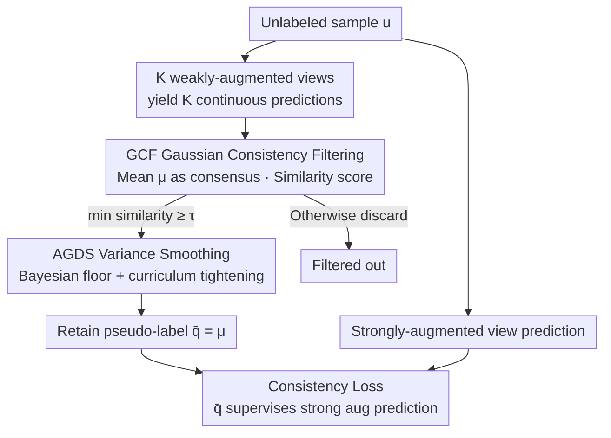

# GaussianMatch: Semi-Supervised Regression with Pseudo-Label Filtering via Multi-View Gaussian Consistency

**Conference**: CVPR 2026  
**Paper**: [CVF Open Access](https://openaccess.thecvf.com/content/CVPR2026/html/Wang_GaussianMatch_Semi-Supervised_Regression_with_Pseudo-Label_Filtering_via_Multi-View_Gaussian_Consistency_CVPR_2026_paper.html)  
**Code**: https://github.com/pywin/GaussianMatch  
**Area**: Self-supervised / Semi-supervised Learning  
**Keywords**: Semi-supervised regression, pseudo-label filtering, multi-view consistency, Gaussian similarity, curriculum learning  

## TL;DR
Addressing the challenge in semi-supervised regression (SSR) where continuous outputs lack confidence scores and low-quality pseudo-labels contaminate training, GaussianMatch utilizes the **Gaussian consistency** of predictions from multiple weakly-augmented views of the same sample as a proxy for pseudo-label reliability. It retains only those samples where all views fall within a confidence interval and employs Bayesian variance smoothing to prevent over-filtering. Under the extreme scarcity of 30 labels on UTKFace, it reduces MAE by 15.36% and improves $R^2$ by 50.21%.

## Background & Motivation
**Background**: Semi-supervised learning (SSL) is mature in classification tasks (SSC). Methods like FixMatch rely on "high-confidence pseudo-label filtering"—obtaining predictions for weakly-augmented views and treating classes with $\max(q)\ge\tau$ as pseudo-labels—to reliably filter out untrustworthy predictions.

**Limitations of Prior Work**: This mechanism cannot be directly transferred to regression. Since regression outputs are continuous values, they **inherently lack probabilistic confidence scores**, making it impossible to use "maximum class probability" to determine prediction reliability. Consequently, a large number of unverified continuous pseudo-labels are fed directly into training as supervision signals, leading to error propagation during iterations and biasing the overall predictions.

**Key Challenge**: SSC follows a discrete label paradigm emphasizing inter-class boundaries while ignoring intra-class continuity. Conversely, regression requires learning **smoothly varying** structures across samples (e.g., age 18 $\to$ 19 $\to$ 20 should transition continuously in feature space). This paradigm mismatch makes SSC filtering strategies difficult to apply and potentially destructive to feature continuity in regression.

**Key Insight**: The authors return to the intrinsic **smoothness assumption** of regression: adjacent points in feature space should have similar labels. A robust regression model should output nearly identical results for multiple **weakly-augmented** views (slight rotation, translation, or noise that preserves essential attributes) of the same sample. Based on this, empirical observation (Fig. 4) shows that a larger standard deviation (STD) among multi-view predictions correlates with a higher absolute error relative to the ground truth—**prediction consistency can serve as a reliable proxy for pseudo-label quality**.

**Core Idea**: Replace "class probability confidence" with "multi-view Gaussian consistency" to filter pseudo-labels—the more clustered the predictions, the more credible they are; the more dispersed, the more they are suppressed. This migrates the filtering philosophy of SSC to SSR in a **continuous, variance-aware** form.

## Method

### Overall Architecture
GaussianMatch adopts the general paradigm of "consistency regularization + confidence filtering" but is entirely redesigned for continuous labels. For each unlabeled sample $u_j$, $K$ **weakly-augmented** views are generated to obtain $K$ continuous predictions $\{q_j^{(1)}, \dots, q_j^{(K)}\}$. The **Gaussian Consistency Filter (GCF)** evaluates the consistency among these $K$ predictions; only samples where "all views fall within the confidence interval" are retained, with their mean $\bar q$ serving as the pseudo-label. To prevent GCF from erroneously rejecting good samples when variance approaches zero, **Adaptive Gaussian Standard Deviation Smoothing (AGDS)** utilizes a Bayesian prior to provide a floor for the standard deviation and gradually tightens the interval (curriculum style) during training. Finally, the retained pseudo-labels supervise the predictions of **strongly-augmented** views, forming the unlabeled consistency loss.

The pipeline is a clear sequential process: "multi-view generation $\to$ consistency filtering $\to$ variance adaptation $\to$ pseudo-label supervision for strong augmentation," as shown in the framework diagram:

### Key Designs

**1. Gaussian Consistency Filter (GCF): Translating "prediction dispersion" into filtering logic via multi-view Gaussian similarity**

GCF addresses the fundamental pain point that regression pseudo-labels lack confidence for filtering. Instead of class probabilities, it examines how clustered the $K$ weakly-augmented predictions for the same sample are. The mean $\mu_j$ is taken as the consensus value and the standard deviation $\sigma_j$ as the dispersion. A Gaussian similarity score is then calculated for each prediction:

$$S_j(k)=\exp\!\left(-\frac{(q_j^{(k)}-\mu_j)^2}{2\sigma_j^2}\right),\quad \forall k\in\{1,\dots,K\}$$

$S_j(k) \to 1$ indicates the prediction is perfectly consistent with the consensus. The filtering rule is strict—a sample is retained only if the **most anomalous view** meets the criteria: $\tilde M(u_j)=\mathbb{I}(\min_k S_j(k)\ge\tau)$. This threshold condition can be rewritten as a confidence interval: $|q_j^{(k)}-\mu_j|\le\rho\sigma_j$, where $\rho=\sqrt{-2\ln\tau}$. Since $\tau$ is fixed, the interval width $\rho\sigma_j$ is solely determined by $\sigma_j$; theoretically, the more dispersed the predictions (larger $\sigma_j$), the wider the interval. The authors also explain this from a maximum likelihood perspective: viewing each weak prediction as an independent noisy observation $q_j^{(k)}\sim\mathcal{N}(\mu_j,\sigma_j^2)$, $S_j(k)$ is proportional to the Gaussian likelihood (ignoring the normalization constant), meaning predictions near the consensus receive exponentially higher scores while outliers are exponentially suppressed.

**2. Adaptive Gaussian Standard Deviation Smoothing (AGDS): Bayesian floor + curriculum tightening to prevent GCF from erroneous rejection during high consistency**

GCF has a counter-intuitive failure point: when $K$ predictions are highly consistent ($\sigma_j \to 0$), the confidence interval $[\mu_j-\rho\sigma_j, \mu_j+\rho\sigma_j]$ collapses to near-zero width. Consequently, even a tiny deviation can cause a mismatch and incorrectly reject the **most credible** samples—contradicting the goal of retaining high-consistency samples. AGDS applies an inverse-Gamma prior to the sample variance for Bayesian regularization, setting a non-collapsing floor for the standard deviation:

$$\hat\sigma_j=\sqrt{\frac{\beta_0+\tfrac12\sum_{k=1}^{K}(q_j^{(k)}-\mu_j)^2}{\alpha_0+\tfrac{K}{2}-1}}$$

The degree-of-freedom constraint $\alpha_0>1$ reduces sensitivity to minor fluctuations around the mean, while the baseline variance $\beta_0>0$ ensures a reasonable interval width even if $\sigma_j \to 0$. Notably, $\beta_0$ is not fixed but follows a **curriculum decay** curve: a larger $\beta_0$ is used early in training for a loose interval to avoid underfitting due to over-filtering; it decreases as training progresses, tightening the interval and enforcing stricter consistency. At step $t$, $\beta_t=\max\big(\bar\beta_w(1-\gamma(t)), \beta_{\min}\big)$, with decay progress $\gamma(t)=\frac{t-t_w}{t_{\text{total}}-t_w}$, where $t_w$ is the warmup duration and $\bar\beta_w$ is the average $\beta_0$ calculated from valid pseudo-labels during warmup. This self-calibrating design eliminates manual tuning and allows the model to stably expand the credible pseudo-label set via a "broad acceptance followed by tightening" approach.

### Loss & Training
GaussianMatch uses a composite loss to jointly optimize labeled and unlabeled data:

$$L^{GM}=\underbrace{\frac{1}{|X'|}\sum_{x,p\in X'}|p-f_\theta(x)|}_{\text{Labeled term}}+\lambda_u\underbrace{\frac{1}{|U|}\sum_{u\in U}\tilde M(u)\,\|\bar q-f_\theta(A(u))\|_2^2}_{\text{Unlabeled consistency (MSE)}}$$

The labeled term minimizes error on augmented labeled data. The unlabeled term enforces the **strongly-augmented** view prediction $f_\theta(A(u))$ to align with the pseudo-label $\bar q=\mu_j$, multiplied by the GCF mask $\tilde M(u)=\mathbb{I}(\min_k S_j(k)\ge\tau)$. Only samples passing the filter contribute to the loss, and the raw $\sigma_j$ in the similarity score is replaced by the AGDS-smoothed $\hat\sigma_j$ to prevent interval collapse. The overall approach essentially integrates MixMatch's "averaged consensus" and FixMatch's "weak-supervising-strong" lines through variance-aware Gaussian filtering.

## Key Experimental Results

### Main Results
Comparison across different label counts on UTKFace age estimation (18,964 training images, rest unlabeled), $\downarrow$ lower is better, $\uparrow$ higher is better:

| Labels | Metric | Supervised | MixMatch | RankUp | GaussianMatch | Remark |
|--------|------|-----------|----------|--------|---------------|------|
| 30 | MAE$\downarrow$ | 15.02 | 12.50 | 11.58 | **9.80** | Substantial lead in extreme scarcity |
| 30 | $R^2$$\uparrow$ | 0.043 | 0.290 | 0.359 | **0.539** | +50% improvement over RankUp |
| 30 | SRCC$\uparrow$ | 0.265 | 0.616 | 0.606 | **0.743** | Best preservation of ordinal relations |
| 50 | MAE$\downarrow$ | 14.13 | 11.44 | 9.96 | **8.90** | 50 labels surpass a 250-label supervised model (9.42) |
| 2000 | MAE$\downarrow$ | 6.28 | 6.03 | 5.61 | **5.36** | Approaches full supervision (4.85) |

Cross-modal generalization (Yelp Review text ratings + VIPL video heart rate) also shows leadership: on VIPL with 2500 labels, MAE 7.795 vs. RankUp 8.135, Pearson $r$ 0.569 vs. 0.518; on Yelp with 250 labels, MAE 0.630, SRCC 0.832, both superior to RankUp.

### Ablation Study
UTKFace 250 labels, focusing on MAE$\downarrow$:

| Configuration | MAE$\downarrow$ | Description |
|------|------|------|
| GaussianMatch (K=8) | **6.38** | Default config, best balance |
| K=2 | 6.74 | Too few views, unreliable consensus |
| K=4 | 6.48 | Slightly worse than K=8 |
| K=16 | 6.52 | Excessive strictness leads to over-filtering |
| w/o GCF & AGDS | 7.41 | Most significant drop without core components |
| w/o AGDS | 6.85 | Over-filtering under low variance without smoothing |
| w/o Strong Aug (Weak instead) | 6.56 | Strong augmentation contributes to consistency |

### Key Findings
- **Core components are essential**: Removing GCF+AGDS degrades MAE from 6.38 to 7.41; removing only AGDS increases it to 6.85, confirming that without a floor, low variance leads to over-filtering.
- **$K$ is not "the more the better"**: $K=8$ is optimal; $K=16$ causes over-filtering due to overly strict GCF selection, while small $K$ leads to unstable consensus, showing a clear sweet spot.
- **Consistency is a reliable proxy**: Fig. 4 shows prediction STD is positively correlated with pseudo-label absolute error, directly supporting the rationality of Gaussian consistency filtering.
- **Improved feature space continuity**: t-SNE (Fig. 3) shows GaussianMatch results in sequentially arranged adjacent age groups with good local linearity, approximating a smooth manifold similar to full supervision, whereas MixMatch/Supervised show fragmented clusters.
- **Superiority over SSC paradigms**: Directly applying FixMatch to age regression (Table 3) yields only marginal gains over the supervised baseline (MAE 9.30 vs. 9.42), whereas GaussianMatch reaches 6.38—demonstrating that discrete label logic fails to model relationships between continuous targets.

## Highlights & Insights
- **Turning "No Confidence" into "Confidence"**: The most challenging aspect of regression is the lack of probabilistic confidence. The authors derive a thresholdable confidence interval $\rho\sigma_j$ from multi-view variance via Gaussian similarity, effectively creating a "soft confidence" for continuous outputs.
- **AGDS identifies a counter-intuitive bug**: While zero variance is a signal of "high consistency," it can cause a naive GCF interval to collapse and reject good samples. Solving this with inverse-Gamma prior floor + curriculum decay provides a self-calibrated, parameter-free solution.
- **"Broad acceptance then tightening" curriculum**: The $\beta_t$ schedule (large early, small later) prevents underfitting due to over-filtering in early stages while enforcing quality in later stages, a strategy applicable to other pseudo-labeling methods.
- **Clear division between strong and weak augmentation**: Weak augmentation builds consensus, while strong augmentation receives supervision. It follows the FixMatch framework but swaps "probability thresholding" for "variance-aware Gaussian filtering," ensuring low migration costs.

## Limitations & Future Work
- **Dependency on smoothness assumption**: The method relies on "weak augmentation does not change essential attributes $\to$ predictions should be consistent." If augmentations are poorly designed or the task is perturbation-sensitive, consistency is no longer a reliable proxy.
- **Computational overhead from multi-viewing**: Each unlabeled sample requires $K$ (default 8) forward passes through weakly-augmented views, making throughput heavier than single-view methods.
- **Hyperparameters are self-calibrating but not fully tuning-free**: Parameters like $\tau, \alpha_0, \beta_{\min}$ still need definition; while the paper claims they are "easy to set," systematic cross-task robustness verification is placed in Appendix G.
- **Future Work**: Extending to **imbalanced** regression scenarios (long-tailed label distributions).

## Related Work & Insights
- **vs MixMatch**: MixMatch performs averaging + sharpening + MixUp on $K$ views to generate pseudo-labels but **lacks reliability filtering**, accepting noisy labels. Ours applies a Gaussian consistency filter for higher quality.
- **vs FixMatch**: FixMatch filters via $\mathbb{I}(\max q\ge\tau)$, which is discrete logic unusable for continuous targets. Ours replaces "probability threshold" with a "variance-aware Gaussian interval," bringing filtering to regression.
- **vs RankUp**: RankUp reformulates regression as a ranking problem to leverage classification-style SSL. Ours remains in the continuous label space using consistency filtering, outperforming RankUp across most label counts in MAE/$R^2$/SRCC.
- **vs UCVME / CLSS**: UCVME uses uncertainty estimation and CLSS uses neighbor-sample smoothness. However, UCVME does not fully exploit the continuous distribution characteristics of regression. Ours provides a more direct reliability measure through multi-view consensus.

## Rating
- Novelty: ⭐⭐⭐⭐ Using multi-view Gaussian consistency as a pseudo-label confidence score and fixing GCF collapse with Bayesian smoothing is a clear and effective angle.
- Experimental Thoroughness: ⭐⭐⭐⭐ Spans vision/physiological/textual modalities + various label counts + ablation + comparison with SSC paradigms; complete chain of evidence.
- Writing Quality: ⭐⭐⭐⭐ The Motivation-Observation-Method logic is smooth, and mathematical derivations are clear.
- Value: ⭐⭐⭐⭐ Provides a simple and generalizable solution for the neglected field of semi-supervised regression, showing significant gains under extreme label scarcity.

<!-- RELATED:START -->

## Related Papers

- [\[CVPR 2026\] PAF: Perturbation-Aware Filtering for Open-Set Semi-Supervised Learning](paf_perturbation-aware_filtering_for_open-set_semi-supervised_learning.md)
- [\[CVPR 2026\] Measure The Feature Universe: Topology-based Pseudo Labeling and Gravity Consistency for Source-Free Domain Adaptation](measure_the_feature_universe_topology-based_pseudo_labeling_and_gravity_consiste.md)
- [\[ICLR 2026\] Incomplete Multi-View Multi-Label Classification via Shared Codebook and Fused-Teacher Self-Distillation](../../ICLR2026/self_supervised/incomplete_multi-view_multi-label_classification_via_shared_codebook_and_fused-t.md)
- [\[ICLR 2026\] Relationship Alignment for View-aware Multi-view Clustering](../../ICLR2026/self_supervised/relationship_alignment_for_view-aware_multi-view_clustering.md)
- [\[CVPR 2026\] CUE: Concept-Aware Multi-Label Expansion to Mitigate Concept Confusion in Long-Tailed Learning](cue_concept-aware_multi-label_expansion_to_mitigate_concept_confusion_in_long-ta.md)

<!-- RELATED:END -->
