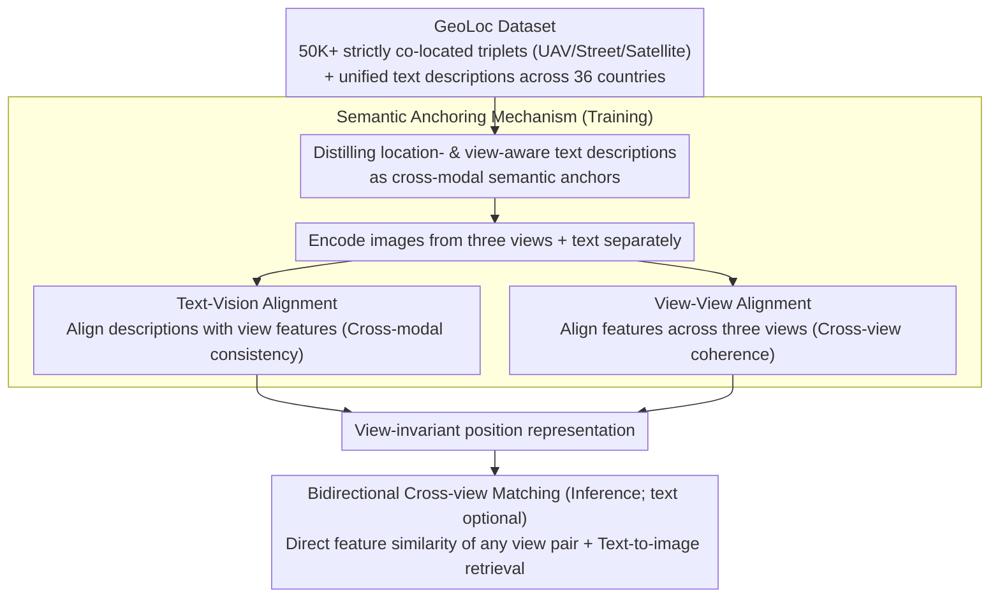

# GeoBridge: A Semantic-Anchored Multi-View Foundation Model for Geo-Localization

**Conference**: CVPR 2026  
**arXiv**: [2512.02697](https://arxiv.org/abs/2512.02697)  
**Code**: Coming soon  
**Area**: Self-supervised  
**Keywords**: Cross-view geo-localization, multi-view matching, semantic anchoring, UAV navigation, cross-modal retrieval

## TL;DR
GeoBridge proposes a semantic-anchored multi-view foundation model for geo-localization. By using text descriptions to build cross-modal semantic bridges between UAV, street-view, and satellite imagery, it achieves bidirectional cross-view matching and language-to-image localization, supported by the newly constructed GeoLoc dataset (50K+ pairs from 36 countries).

## Background & Motivation
1. **Background**: Cross-view geo-localization infers the location of a query image by retrieving geo-tagged reference images. Most existing methods adopt a satellite-centric strategy.
2. **Limitations of Prior Work**: (i) Satellite-centric strategies are fragile when high-resolution or up-to-date satellite imagery is unavailable; (ii) complementary cues between different perspectives are underutilized; (iii) the complementarity between language and vision is neglected.
3. **Key Challenge**: There is a lack of a unified framework supporting bidirectional multi-view matching—especially UAV $\leftrightarrow$ street-view matching, which is largely overlooked.
4. **Goal**: To move beyond the satellite-centric paradigm and construct a unified geo-localization model supporting arbitrary perspective-pair matching and text retrieval.
5. **Key Insight**: Use text descriptions as semantic anchors to bridge multi-view features.
6. **Core Idea**: During training, multi-view images are distilled into location- and view-aware text descriptions to serve as cross-modal semantic bridges. During inference, the text branch is optional, allowing for direct matching between any pair of viewpoints.

## Method

### Overall Architecture
GeoBridge aims to address the problem that the same location looks completely different under UAV, panoramic street-view, and satellite perspectives, making mutual retrieval difficult. The overall mechanism is as follows: first, a strictly co-located multi-view dataset with text annotations (GeoLoc) is used as the training foundation. During training, each location is paired with a "location + view-aware" text description that acts as a shared semantic junction for all viewpoints—aligning the text to the visual features of each view (cross-modal consistency) while simultaneously aligning visual features across different views (cross-view coherence). Once the representations are learned, the text can be omitted during inference: image features from any two perspectives can be directly compared via similarity for matching, or a text query can be used to retrieve images when necessary.

### Key Designs

**1. GeoLoc Dataset: Completing fully aligned multi-view triplets**

Existing datasets (e.g., University-1652, VIGOR) are mostly dual-view and satellite-centric, lacking both strictly co-located triplets and text annotations, which prevents the training of the proposed anchoring mechanism. GeoLoc addresses this by collecting 50K+ locations, each equipped with strictly co-located UAV images, Google Street View panoramas, and satellite images across 36 countries, with unified text descriptions generated for each. Non-overlapping geographic coordinates ensure that queries and references do not "cheat" via geographic proximity, making the evaluation more rigorous.

**2. Semantic Anchoring Mechanism: Using text as a common coordinate system for all views**

The greatest difficulty in cross-view localization is the lack of pixel-level overlap between UAV (oblique), street-view (eye-level), and satellite (nadir) views. Direct visual alignment is prone to biased learning. GeoBridge distills the three types of imagery for each location into a unified text description containing location and perspective information. Contrastive learning then jointly optimizes two types of pairings: text-vision pairs (bringing descriptions close to each view's features) and view-view pairs (bringing features from the three views closer together). Text acts as a modality-agnostic intermediate representation. By verbalizing semantics (e.g., "north side of a bridge, river-adjacent, with twin towers"), the visually distinct viewpoints are pinned to the same semantic coordinate—hence the term "anchoring."

**3. Bidirectional Cross-view Matching: Enabling the UAV $\leftrightarrow$ street-view link**

The satellite-centric paradigm assumes all queries are matched against satellite maps, but in reality, satellite imagery may not be current or of high resolution. Through semantic anchoring training, the model learns view-invariant position representations. Consequently, during inference, any two views can be matched directly via feature similarity without requiring text. This enables the previously neglected UAV-street-view matching—a link with high demand in scenarios where satellites are unreliable, such as disaster response, low-altitude logistics verification, and infrastructure inspection.

### Loss & Training
The training objective is a joint multi-view and cross-modal contrastive loss: the text-vision alignment term brings descriptions closer to each view's features, while the view-view alignment term brings different view features closer to one another. Optimizing both simultaneously yields view-invariant location representations.

## Key Experimental Results

### Main Results

| Task | Metric | Ours | Prev. SOTA | Gain |
|------|------|-----------|---------|------|
| UAV $\rightarrow$ Satellite | R@1 | Improved | - | Significant |
| Street-view $\rightarrow$ Satellite | R@1 | Improved | - | Competitive |
| UAV $\rightarrow$ Street-view | R@1 | First realization | N/A | New Task |
| Text $\rightarrow$ Image | R@1 | Effective | N/A | New Capability |

### Ablation Study

| Configuration | Key Metrics | Description |
|------|---------|------|
| Full GeoBridge | Optimal | Complete triple alignment |
| w/o Text Anchoring | Decrease | Semantic bridge is crucial |
| w/o GeoLoc Pre-training | Significant Decrease | Pre-training provides multi-view priors |
| Dual-view training only | Decrease | Joint triple training is stronger |

### Key Findings
- GeoLoc pre-training significantly improves cross-view localization accuracy and cross-domain generalization.
- Semantic anchoring not only enables cross-modal retrieval but also enhances pure visual matching performance.
- UAV-street-view matching is a brand-new task, and GeoBridge demonstrates its feasibility and practical value.

## Highlights & Insights
- The positioning philosophy of **transcending satellite-centricity** is vital: satellite imagery is not always available or up-to-date in real-world applications.
- The design of **text as a semantic bridge**—linking multi-views during training while being discardable during inference—is ingenious.
- The GeoLoc dataset is an important contribution in its own right: 36 countries and 50K+ strictly co-located triplets.

## Limitations & Future Work
- The quality of text descriptions affects the effectiveness of semantic anchoring.
- Matching under extreme viewpoint differences (e.g., top-down vs. frontal) remains challenging.
- Future work could extend the model to scenarios without satellite coverage, such as indoor or underground environments.

## Related Work & Insights
- **vs University-1652**: Only supports UAV-satellite dual-view. GeoBridge extends this to triple views plus text.
- **vs VIGOR**: Provides denser urban sampling but remains dual-view. GeoBridge adds the UAV perspective and text descriptions.

## Rating
- Novelty: ⭐⭐⭐⭐ Semantic anchoring + multi-view unification is a new direction.
- Experimental Thoroughness: ⭐⭐⭐⭐ Validated across multiple tasks and datasets.
- Writing Quality: ⭐⭐⭐⭐ Clear framework and detailed dataset construction.
- Value: ⭐⭐⭐⭐⭐ Dual contribution of dataset and methodology with long-term impact on the geo-localization field.

<!-- RELATED:START -->

## Related Papers

- [\[CVPR 2026\] MuM: Multi-View Masked Image Modeling for 3D Vision](mum_multi-view_masked_image_modeling_for_3d_vision.md)
- [\[CVPR 2026\] GaussianMatch: Semi-Supervised Regression with Pseudo-Label Filtering via Multi-View Gaussian Consistency](gaussianmatch_semi-supervised_regression_with_pseudo-label_filtering_via_multi-v.md)
- [\[CVPR 2026\] MOMO: Mars Orbital Model — Foundation Model for Mars Orbital Applications](momo_mars_orbital_model_foundation_model_for_mars_orbital_applications.md)
- [\[CVPR 2026\] Global-Graph Guided and Local-Graph Weighted Contrastive Learning for Unified Clustering on Incomplete and Noise Multi-View Data](global-graph_guided_and_local-graph_weighted_contrastive_learning_for_unified_cl.md)
- [\[ICML 2025\] Foundation Model Insights and a Multi-Model Approach for Superior Fine-Grained One-shot Subset Selection](../../ICML2025/self_supervised/foundation_model_insights_and_a_multi-model_approach_for_superior_fine-grained_o.md)

<!-- RELATED:END -->
