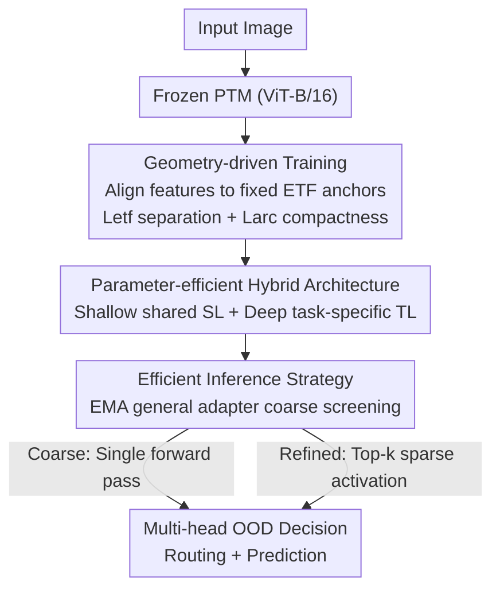

# Geometry-driven OOD Detectors Are Class-Incremental Learners

**Conference**: CVPR 2026  
**Paper**: [CVF Open Access](https://openaccess.thecvf.com/content/CVPR2026/html/Jia_Geometry-driven_OOD_Detectors_Are_Class-Incremental_Learners_CVPR_2026_paper.html)  
**Code**: https://github.com/Wangwang-Jia/GOD  
**Area**: Continual Learning / Class-Incremental Learning  
**Keywords**: Class-Incremental Learning, OOD Detection, Equiangular Tight Frame (ETF), Neural Collapse, LoRA  

## TL;DR
GOD treats "each task classifier head possessing both IND recognition and OOD rejection capabilities" as a sufficient condition for Class-Incremental Learning (CIL). By replacing learnable classifier heads with fixed Equiangular Tight Frame (ETF) anchors and utilizing ETF loss (inter-class separation) along with ArcFace loss (intra-class compactness), it unifies "classification" and "uncertainty estimation" within a shared geometric space. This transforms cross-task routing from a fragile Task-ID predictor into a naturally emerging OOD decision, achieving SOTA performance across four benchmarks.

## Background & Motivation

**Background**: Class-Incremental Learning (CIL) requires learning new classes continuously without forgetting old ones. Recent mainstream approaches freeze the Pre-trained Model (PTM) backbone and use lightweight modules (prompts, representation tuning, or architectural expansion) to adapt to incremental tasks, leveraging the PTM's generalization to suppress catastrophic forgetting.

**Limitations of Prior Work**: Most existing methods focus on optimizing the feature extractor while neglecting the design of the classifier head. The classifier head is a critical bottleneck in CIL, where current designs suffer from significant issues: (i) **Single expanding classifier heads**—a single head that grows with classes triggers representation forgetting and "recency bias" in the decision layer, pulling predictions toward new classes; (ii) **Multi-fixed classifier heads**—independent heads for each task delineate disjoint decision spaces to mitigate recency bias, but they rely on a Task-ID predictor for routing, which itself is prone to forgetting and becomes a new bottleneck.

**Key Challenge**: An ideal classifier head should not only recognize IND classes of its own task but also reject unseen OOD samples by providing usable OOD signals. However, standard softmax or cosine heads are optimized for closed-set classification and inherently lack this capability—softmax is overconfident on OOD data, and cosine learns local decision boundaries rather than global anchors. Consequently, routing must rely on an external, forgetful Task-ID predictor.

**Goal**: To make each task head a reliable IND/OOD detector, thereby turning cross-task routing into a natural decision: "accept if the head considers the input IND, otherwise reject." CIL then emerges naturally—adding new tasks simply adds new heads, with each old head maintaining its decision region, achieving both disjoint decision spaces and non-shared head expansion.

**Key Insight**: The authors analyze from a geometric perspective what kind of classifier head provides usable OOD signals. They provide a rigorous theory characterizing this capability through two geometric properties: **Inter-class Separation** and **Intra-class Compactness**. Neural Collapse theory points out that in the terminal phase of training, features and classifier weights converge to a symmetric ETF structure, which naturally satisfies the required inter-class separation geometry.

**Core Idea**: Instead of letting the model learn this ideal geometry, it is better to **hardcode the ideal geometry (fixed ETF anchors) and train features to align with it**. The distance from features to anchors then serves as a unified signal: supporting IND classification while acting as a reliable uncertainty score for OOD rejection.

## Method

### Overall Architecture
GOD is an exemplar-free CIL method based on PTMs. The backbone is a frozen ViT-B/16, with all adaptations performed via LoRA. The pipeline consists of three components: **Geometry-driven training** aligns features of each task to fixed ETF anchors, enabling inherent OOD rejection; a **Parameter-efficient hybrid architecture** splits LoRA into "shallow shared + deep task-specific" layers to prevent linear parameter explosion; and an **Efficient inference strategy** uses an EMA-aggregated general adapter for coarse screening followed by sparse activation of Top-k candidates for refinement, offering a tunable speed-accuracy trade-off.

During training for task $t$, the input passes through the frozen PTM, shared LoRA (SL), and task-specific LoRA (TL$_t$), followed by a shared Random Projection (RP) and a task-specific projection head (TP$_t$). Features are $\ell_2$-normalized and "welded" onto the task's ETF anchors using the dual ETF and ArcFace losses; TL$_{ema}$ is updated synchronously via EMA. During inference, logits from all task heads are concatenated into a global vector, and routing is determined by the highest (and non-rejected) score.

### Key Designs

**1. Geometry-driven Training: Hardcoding ETF Anchors for OOD Scoring**

To address the failure of standard heads to provide OOD signals, GOD stops jointly learning feature space and classifier weights. Instead, it **fixes an ideal geometry first and then learns features to align**. For $C_t$ classes in task $t$, a set of normalized ETF anchors $E_t=\{e_{t,1},\dots,e_{t,C_t}\}$ is constructed, satisfying $\langle e_{t,i},e_{t,j}\rangle = 1$ for $(i=j)$ and $-\frac{1}{C_t-1}$ for $(i\neq j)$. This creates maximum and uniform angular margins on the unit hypersphere, satisfying "inter-class separation." The logit for class $c$ is the cosine similarity $s_{t,c}(x)=\langle z_t(x),e_{t,c}\rangle$. At test time, concatenated logits $s(x)=\text{concat}_{t=1}^{T}(s_t(x))$ naturally implement a multi-head OOD detector.

By hardcoding the classifier as ETF + nearest anchor decision, GOD directly satisfies three of the four Neural Collapse conditions (NC2 ETF geometry, NC3 self-duality, NC4 nearest class center decision). Training only needs to address NC1—compressing intra-class features toward anchors. The dual losses fulfill the theoretical requirements: ETF loss (temperature-scaled cross-entropy) $L_{etf}=-\log\frac{\exp(s_{t,y_i}(x_i)/\tau)}{\sum_j \exp(s_{t,j}(x_i)/\tau)}$ enforces **inter-class separation**, while ArcFace loss $L_{arc}=-\log\frac{e^{s\cos(\theta_{y_i}+m)}}{e^{s\cos(\theta_{y_i}+m)}+\sum_{j\neq y_i}e^{s\cdot s_{t,j}(x_i)}}$ adds an angular margin $m$ to enforce **intra-class compactness**. The total objective is $L_{total}=L_{etf}+L_{arc}$.

**2. Shared-Specific LoRA Decomposition: Hybrid Depth-based Parameter Allocation**

Multi-head CIL usually suffers from parameter growth. Analyzing task prototype similarity across layers (Fig. 3), the authors found that **prototypes in shallow transformer blocks are highly similar across tasks** (learning task-agnostic features), whereas **deep block prototypes vary significantly** (task-specific variations).

LoRA modules are split at depth $k$: blocks $l \le k$ form a single **Shared LoRA (SL)**, initialized/trained on the first task and frozen thereafter. Blocks $l > k$ are **Task-specific TL**, with new lightweight TL$_t$ layers added for each task (warm-started from TL$_{t-1}$). For ViT-B/16, the first 9 blocks are SL and the last 3 are TL adapters. This concentrates task-specific capacity in the deep layers where it is needed most, reducing trainable parameters to only 2.64M.

**3. EMA General Adapter + Coarse-to-Fine Inference**

Activating all TL$_t$ during inference incurs $O(T)$ computation. GOD introduces an EMA-aggregated adapter TL$_{ema}$, updated as $\Theta_{ema}\leftarrow\alpha\Theta_{ema}+(1-\alpha)\Theta_t$, providing a stable approximation of global task knowledge for routing.

Two modes are provided: **Coarse mode**—a single forward pass through PTM+SL+TL$_{ema}$ yields shared features, followed by RP and all TP$_t$ to get all logits; **Refined mode**—uses Coarse logits to select Top-$k$ classes/Task IDs (default $k=3$), then re-encodes only these specific TL$_t$ modules using intermediate features from after SL.

### Loss & Training
Total loss $L_{total}=L_{etf}+L_{arc}$. $L_{etf}$ handles inter-class separation, while ArcFace (with margin $m$ and scale $s$) handles intra-class compactness. ViT-B/16 is frozen; LoRA is added only to self-attention. SL is frozen after $t=1$. No exemplars are used.

## Key Experimental Results

### Main Results
On 4 benchmarks across $T=5$ and $T=10$ settings (Average Incremental Accuracy $\bar A$):

| Method | ImageNet-R (T=5) | ImageNet-R (T=10) | Stanford Cars (T=5) | Stanford Cars (T=10) |
|------|------|------|------|------|
| EASE (CVPR'24) | 82.28 | 81.38 | 56.30 | 50.53 |
| NC-CIPM (AAAI'25) | 81.50 | 78.56 | 72.98 | 71.42 |
| LORA-DRS (CVPR'25) | 82.56 | 81.76 | 68.91 | 63.22 |
| SD-LoRA (ICLR'25) | 83.68 | 82.88 | 79.59 | 73.05 |
| **GOD (Refined)** | **86.90 (+3.22)** | **85.41 (+2.53)** | **85.23 (+5.64)** | **77.10 (+4.05)** |

GOD shows the most significant gains on fine-grained and complex benchmarks, such as Stanford Cars (+5.64% over SOTA). The gap increases with the number of tasks, proving robustness in long-sequence CIL.

### Key Findings
- **ETF loss/RP govern inter-class separation, while ArcFace governs intra-class compactness**; all three are required to achieve high intra-class cohesion and low inter-class coupling.
- Distance to ETF anchors serving both as classification and OOD uncertainty is key to unifying these spaces.
- The hybrid LoRA architecture significantly reduces parameter overhead (2.64M vs 4.7M+ in baselines) while maintaining performance.

## Highlights & Insights
- **Unified Geometry**: Unifying classification and OOD rejection into a single distance metric eliminates the need for fragile Task-ID predictors.
- **Inverted Paradigm**: "Fix the ideal geometry first, then align features" simplifies the learning problem by hardcoding mathematical priors (Neural Collapse).
- **Depth Heterogeneity**: The observation that shallow layers are task-agnostic while deep layers are task-specific provides a plug-and-play strategy for parameter-efficient adaptation.

## Limitations & Future Work
- Performance is highly dependent on the quality of PTM backbone features; gains are marginal on simple datasets where PTM features already generalize perfectly.
- The Refined mode introduces moderate latency due to Top-k re-encoding, though it remains more efficient than activating all task heads.
- Hyperparameter sensitivity (splitting depth $k$, projection dimensions, ArcFace margin) across different architectures requires further verification.

## Related Work & Insights
- **vs. Single Expanding Heads**: GOD avoids the recency bias and representation forgetting inherent in shared expanding heads by using disjoint task-specific spaces.
- **vs. Task-ID Routers**: Instead of learning a separate router that can forget, GOD uses OOD signals that emerge naturally from the geometric structure of each head.
- **vs. NC-CIPM**: While both use Neural Collapse, GOD ensures robust OOD estimation and forgetting suppression without requiring oracle Task-IDs by enforcing a stable global OOD-aware metric space.

## Rating
- Novelty: ⭐⭐⭐⭐⭐ (Reframing CIL as per-task OOD detection using fixed ETF geometry).
- Experimental Thoroughness: ⭐⭐⭐⭐ (Extensive benchmarks and latency/parameter analysis).
- Writing Quality: ⭐⭐⭐⭐⭐ (Clear logical flow from theory to design).
- Value: ⭐⭐⭐⭐ (SOTA performance with reduced parameter overhead; transferable insights for open-world learning).

<!-- RELATED:START -->

## Related Papers

- [\[CVPR 2026\] DGS: Dual Gradient and Semantic-Shift Guided Low-Rank Adaptation for Class Incremental Learning](dgs_dual_gradient_and_semantic-shift_guided_low-rank_adaptation_for_class_increm.md)
- [\[CVPR 2026\] Exemplar-Free Class Incremental Learning via Preserving Class-Discriminative Structure](exemplar-free_class_incremental_learning_via_preserving_class-discriminative_str.md)
- [\[CVPR 2025\] Order-Robust Class Incremental Learning: Graph-Driven Dynamic Similarity Grouping](../../CVPR2025/self_supervised/order-robust_class_incremental_learning_graph-driven_dynamic_similarity_grouping.md)
- [\[CVPR 2026\] An Optimal Transport-driven Approach for Cultivating Latent Space in Online Incremental Learning](an_optimal_transport_driven_approach_for_cultivating_latent_space_in_online_incr.md)
- [\[CVPR 2026\] Beyond Myopic Alignment: Lookahead Optimization for Online Class-Incremental Learning](beyond_myopic_alignment_lookahead_optimization_for_online_class-incremental_lear.md)

<!-- RELATED:END -->
