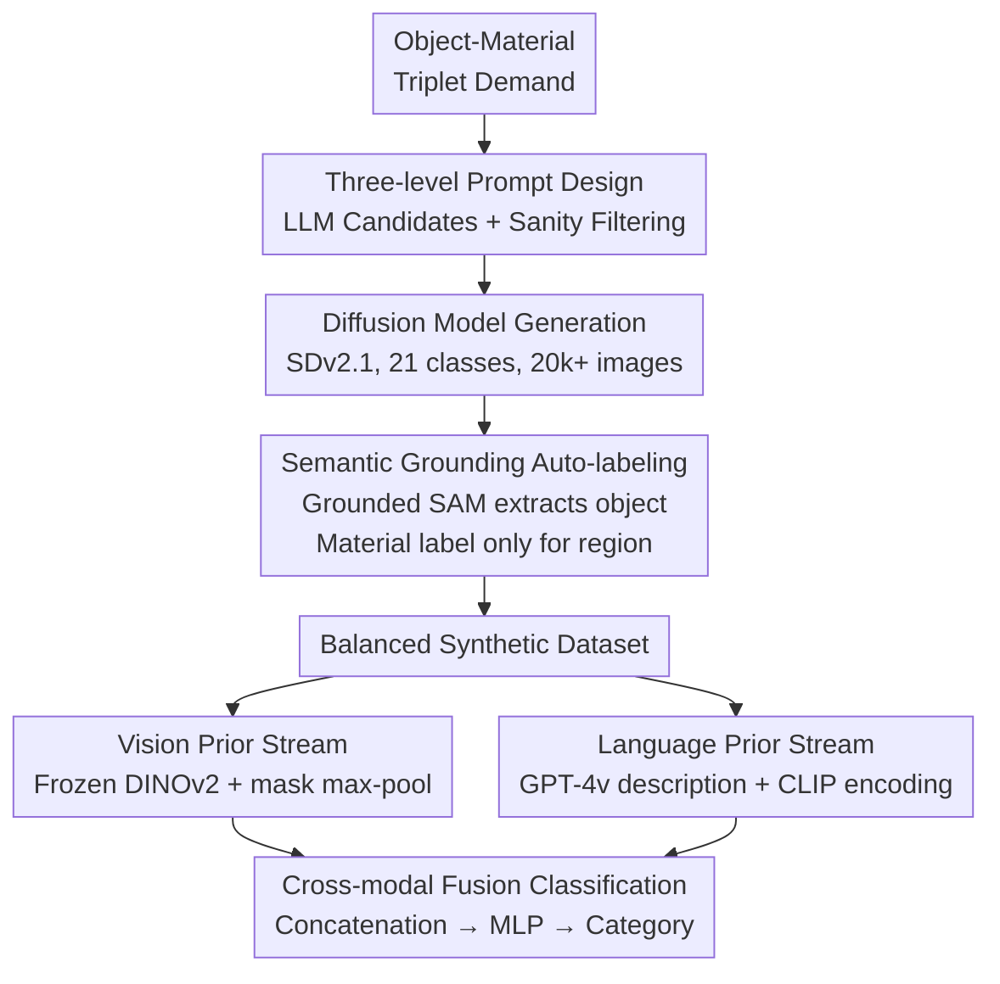

# Harnessing the Power of Foundation Models for Accurate Material Classification

**Conference**: CVPR 2026  
**Paper**: [CVF Open Access](https://openaccess.thecvf.com/content/CVPR2026/html/Lin_Harnessing_the_Power_of_Foundation_Models_for_Accurate_Material_Classification_CVPR_2026_paper.html)  
**Code**: None  
**Area**: Self-supervised / Representation Learning  
**Keywords**: Material Classification, Vision Foundation Models, Synthetic Data, Two-stream Fusion, DINOv2

## TL;DR
To address the scarcity of material classification labels, this paper constructs a balanced synthetic dataset of 21 categories using "diffusion model generation + semantic grounding auto-labeling." It then employs a two-stream fusion of "frozen DINOv2 vision stream + GPT-4v/CLIP language stream" for classification. It achieves 89% accuracy on FMD, outperforming the dedicated SOTA (MatSim) by 33%.

## Background & Motivation
**Background**: Material classification (determining if a surface is metal, wood, plastic, or ceramic) is a foundational step for downstream tasks such as rendering, simulation, and 3D content generation—for instance, identifying the material before retrieving corresponding procedural parameters from a library. Traditional approaches treat this as a standard image classification task, training CNN/Transformer classifiers on material-labeled datasets (FMD, OpenSurfaces, MINC, DMS).

**Limitations of Prior Work**: This path faces two bottlenecks. First, **labeled data is scarce and categories are highly imbalanced**—even in the largest dataset DMS (3.2 million segments, 52 categories), common materials like wood and metal far outnumber rare ones like wax or rubber, making uniform generalization difficult. Second, **direct zero-shot use of VLMs is ineffective**: large-scale pre-trained models such as CLIP and GPT-4v perform significantly worse on material recognition than on object recognition (CLIP 38%, GPT-4v 43% on DMS-test) because materials represent fine-grained appearance attributes for which VLM text prompts are too vague and adaptation to niche domain data is insufficient.

**Key Challenge**: Material classification requires both **fine-grained visual appearance cues** (texture, reflection, subsurface scattering) and **semantic priors** to disambiguate surfaces that look similar but belong to different materials. Visual features or text descriptions alone are insufficient, and there is a lack of large-scale, cleanly labeled material data for supervised training.

**Goal**: To split the problem into two sub-problems: (1) how to generate a diverse, high-quality, and reliably labeled material training set without manual annotation; (2) how to adapt to material tasks while preserving the inherent generalization capabilities of foundation models.

**Key Insight + Core Idea**: The authors observed an asymmetry—**"labeling materials given semantics" is much easier than direct material recognition**. When generating images, the foreground object is already known ("ceramic vase"). By using zero-shot segmentation to extract this object, the material label can be applied strictly to the correct region, bypassing the issue of images containing multiple materials. Combined with a two-stream network to fuse DINOv2 visual priors and CLIP-encoded linguistic priors, this facilitates both data generation and classification.

## Method

### Overall Architecture
The framework follows a two-stage "generate data, then train classifier" pipeline. Stage 1 (Data Synthesis): Use three-level prompts to guide an LLM to produce reasonable "object-material-submaterial" triplets, feed these to a diffusion model for image generation, and then use Grounding DINO / Grounded SAM to segment the target object. **Material labels are applied only to this region**, resulting in a balanced synthetic dataset of 21 categories and over 20,000 images. Stage 2 (Two-stream Classification): For a masked image, the vision stream uses a frozen DINOv2 to extract patch features, which are max-pooled within the masked region into a 768-dimensional vector. The language stream prompts GPT-4v to describe the material appearance of the region, which is then encoded by the CLIP text encoder into a 512-dimensional vector. The two streams are concatenated and passed through a lightweight MLP to output the material category.

The two-stage pipeline is illustrated below:

### Key Designs

**1. Three-level Prompt + Sanity Filtering: Natural Pairing of Objects and Materials**

Directly feeding free-form text like "a wooden object" into a diffusion model often leads to material mismatches or conflicts between foreground and background materials. This paper uses a **three-level structured prompt**—Object (vase), Material Category (ceramic), and Sub-material or Adjective (porcelain / polished). ChatGPT generates candidate triplets in bulk, followed by manual filtering of nonsensical combinations (e.g., "sponge, metal"). While simple, the true value lies in **anchoring for subsequent semantic segmentation**: because the prompt explicitly includes the object name ("vase"), the object is guaranteed to exist and be segmentable in the generated image, allowing for precise material labeling. This "segmentable object name" constraint is critical for successful auto-labeling.

**2. Semantic Grounding Auto-labeling: Using "Object Semantics" as an Intermediary**

Generated images often contain multiple materials (e.g., a ceramic vase on a wooden table). Labeling the entire image as "ceramic" during training would contaminate learning. However, "directly identifying which region corresponds to which material" is exactly the problem this paper aims to solve—it cannot be used for labeling without circular dependency. The authors' breakthrough: **materials and semantics are inherently bound during the generation process, and semantic segmentation is a mature technology**. Thus, Grounded SAM uses the object name from the prompt ("Cake-pan") as a prompt to segment the object, and the material label is **assigned only to this segmented region**. This approach achieves **98% label accuracy** on manually verified samples—a precision unattainable by pure material recognition but sufficient to train one.

**3. Two-stream Cross-modal Fusion: Complementing Visual Appearance with Language Priors**

Material recognition requires both fine-grained texture/reflection analysis and semantic knowledge to distinguish surfaces that "look similar but aren't." This paper designs a **two-stream architecture**. The vision stream utilizes a frozen DINOv2 backbone to produce $32\times32\times768$ dense patch features $\{f_{(i,j)}\}=E_{\text{DINOv2}}(I)$. The binary mask is downsampled to $32\times32$, retaining only positions where $M_{(i,j)}>0$, followed by max-pooling to aggregate a vision feature $f_{\text{vis}}=\max_{i,j}(\{f_{(i,j)}\}\circ M)\in\mathbb{R}^{768}$. The language stream uses GPT-4v to generate an appearance description $T$ for the region (e.g., "appears polished and shines with reflections"), which is encoded by the CLIP text encoder: $f_{\text{txt}}=\phi_{\text{txt}}(T)\in\mathbb{R}^{512}$. The streams are concatenated $f_{\text{fuse}}=f_{\text{vis}}\oplus f_{\text{txt}}\in\mathbb{R}^{768+512}$ and passed through an MLP:

$$l=\underset{k\in\{1,\dots,K\}}{\arg\max}\ \mathrm{MLP}(f_{\text{vis}}\oplus f_{\text{txt}})_k$$

By contextualizing visual cues with semantic priors, the model disambiguates visually similar but semantically distinct materials. The language stream distills knowledge of material properties not immediately apparent from visual features.

**4. Frozen Backbone + Lightweight Head: Specializing for Materials without Catastrophic Forgetting**

Unfreezing DINOv2 or CLIP for fine-tuning risks destroying the universal priors learned during large-scale pre-training. This paper **freezes $\phi_{\text{vis}}$ and $\phi_{\text{txt}}$, training only the aggregation layers and the MLP** (AdamW, lr=5e-5) with cross-entropy loss $L=-\sum_k \hat l_k \log p_k$. Ablation studies (Table 5) support this choice: DINOv2 in "head mode" (tuning only the MLP) reaches 0.88 mAcc, while "full mode" (unfrozen) collapses to 0.38. ⚠️ Note: There is a discrepancy between the Abstract/Introduction ("finetune the head of DINOv2 together with the MLP") and the Section 3.3 Training Protocol ("freeze DINOv2 and CLIP and train only MLP parameters"). The Method section is taken as the reference.

## Key Experimental Results

### Main Results
Three test sets: FMD (classic 10 classes), DMS-test (a 21-class subset of DMS), and Google-test (21 classes collected from Google Images, high quality, realistic/artistic content).

| Dataset | CLIP | GPT-4v | MatSim (Prev. SOTA) | Ours |
|--------|------|--------|---------------|------|
| FMD (10 classes, Acc) | 0.80 | 0.74 | 0.56 | **0.89** |
| DMS-test (21 classes, Acc) | 0.38 | 0.43 | 0.41 | **0.64** |
| Google-test (21 classes, Acc) | 0.81 | 0.74 | 0.63 | **0.92** |

Ours outperforms the dedicated SOTA MatSim by 33 percentage points on FMD and 29 points on Google-test. Zero-shot CLIP/GPT-4v performance on DMS-test (38%/43%) confirms the inadequacy of base foundation models for zero-shot material recognition.

Quality comparison of synthetic datasets (same visual branch trained on DMS vs. Ours, mIoU|mAcc):

| Training Data | DMS-test | Google-test | FMD |
|----------|----------|-------------|-----|
| DMS (Real, 3.2M segments) | **0.52\|0.67** | 0.57\|0.71 | 0.67\|0.79 |
| Ours (Synthetic) | 0.46\|0.60 | **0.81\|0.89** | **0.79\|0.88** |

Key conclusion: While DMS is slightly better on its in-domain test, **Ours significantly outperforms in cross-dataset generalization** (+18 mAcc on Google-test, +9 mAcc on FMD). PCA visualizations show synthetic samples overlap with DMS while remaining closer to FMD, essentially "bridging" the distributions.

### Ablation Study

Two-stream module ablation (mIoU|mAcc):

| GPT-4v+CLIP | DINOv2 | Google-test | DMS-test | FMD |
|:---:|:---:|---|---|---|
| ✓ | ✗ | 0.83\|0.90 | 0.49\|0.64 | 0.74\|0.85 |
| ✗ | ✓ | 0.81\|0.89 | 0.46\|0.60 | 0.79\|0.88 |
| ✓ | ✓ | **0.86\|0.92** | **0.50\|0.64** | **0.81\|0.89** |

Vision backbone comparison (FMD, mIoU|mAcc):

| Training Method | ResNet-101 | ViT-L/16 | DINOv2 |
|----------|-----------|----------|--------|
| head (MLP only) | 0.48\|0.64 | 0.50\|0.66 | **0.79\|0.88** |
| full (unfrozen) | 0.44\|0.61 | 0.34\|0.51 | 0.23\|0.38 |

### Key Findings
- **Modalities contribute ~3-4% each**: Removing either the language or vision prior drops accuracy by up to 4%; the full two-stream model is optimal across all datasets.
- **Frozen DINOv2 backbone is essential**: DINOv2 mAcc drops from 0.88 (head) to 0.38 (full), the worst among all backbones. Powerful pre-trained features are vulnerable to over-tuning on small datasets.
- **Semantic grounding auto-labeling provides +4% mIoU / +3% mAcc**: Using a null mask (global patch max-pooling) results in 0.75|0.85, whereas semantic grounding increases this to 0.79|0.88.
- **Scale benefits saturate after 2x**: Performance rises rapidly from 0.2x (2,448 images) to 1x (12,240 images). Gains slow down after 2x (0.80|0.89) but remain monotonic.

## Highlights & Insights
- **Leveraging "reverse labeling" is ingenious**: Directly identifying material regions is hard, but combining "easy semantic segmentation" with the "material-semantic binding during generation" allows using 98% accurate masks to label materials. This paradigm can be extended to other fine-grained recognition tasks lacking labels.
- **Synthetic data value lies in distribution coverage, not just volume**: Our synthetic set of only 20k images beats the 3.2M-segment DMS in cross-domain tasks. Strategically creating diversity and balance is more important than raw volume.
- **Freeze backbone + train head is a robust paradigm**: Table 5 clearly shows the gap between full fine-tuning and head-only tuning, providing a direct recipe for reusing DINOv2/CLIP in specialized domains.

## Limitations & Future Work
- **Dependency on online GPT-4v**: Generating text descriptions for each test image at inference time is costly and limits reproducibility; some metrics can only be reported as Acc rather than mIoU due to GPT-4v processing.
- **Absolute accuracy on DMS-test remains low** (0.64): Synthetic data still lags behind in-domain training for dense segmentation in natural scenes, indicating the synthetic-real gap is not fully closed.
- ⚠️ **Inconsistent training protocol**: As noted, the Abstract/Intro and the Method section describe the DINOv2 head tuning differently.
- **Reliance on Grounded SAM**: Auto-labeling quality depends on segmentation. It may fail for transparent, mirrored, or hybrid materials, which are not fully investigated.

## Related Work & Insights
- **vs MatSim [9]**: MatSim uses synthetic physical rendering + contrastive learning for classification. Ours differs by using diffusion generation + semantic grounding, leading significantly on FMD (0.89 vs 0.56) and Google-test (0.92 vs 0.63).
- **vs Zero-shot CLIP / GPT-4v**: Previous works like MAPA or Make-It-Real use VLMs for zero-shot alignment. Ours treats VLMs as "prior sources" to be distilled into a two-stream network, fixing the fine-grained accuracy gap.
- **vs DMS [39] and real datasets**: DMS is large but imbalanced with weak cross-domain generalization. Ours demonstrates a viable model for replacing expensive real annotations with balanced synthetic data.

## Rating
- Novelty: ⭐⭐⭐⭐ The "reverse semantic labeling" for material annotation is clever; two-stream fusion is standard but effective.
- Experimental Thoroughness: ⭐⭐⭐⭐ Three datasets and five ablation groups (quality/modality/backbone/scale/semantics).
- Writing Quality: ⭐⭐⭐ Logical, but inconsistent training descriptions and slightly cluttered figure captions.
- Value: ⭐⭐⭐⭐ Provides a reusable paradigm for fine-grained recognition using synthetic data and foundation models.

<!-- RELATED:START -->

## Related Papers

- [\[CVPR 2026\] Chain-of-Models Pre-Training: Rethinking Training Acceleration of Vision Foundation Models](com_pt_chain_of_models_pretraining.md)
- [\[CVPR 2026\] Robustness of Vision Foundation Models to Common Perturbations](robustness_of_vision_foundation_models_to_common_perturbations.md)
- [\[CVPR 2026\] Scaling Parallel Sequence Models to Vision Foundation Models](scaling_parallel_sequence_models_to_vision_foundation_models.md)
- [\[CVPR 2026\] Scaling Dense Event-Stream Pretraining from Visual Foundation Models](scaling_dense_event-stream_pretraining_from_visual_foundation_models.md)
- [\[CVPR 2026\] How Much 3D Do Video Foundation Models Encode?](how_much_3d_do_video_foundation_models_encode.md)

<!-- RELATED:END -->
