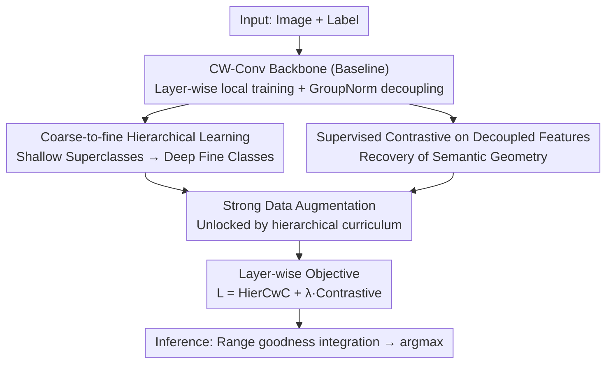

# HCL-FF: Hierarchical and Contrastive Learning for Forward-Forward Algorithm

**Conference**: CVPR 2026  
**arXiv**: [2605.24797](https://arxiv.org/abs/2605.24797)  
**Code**: None  
**Area**: Self-Supervised / Non-Backpropagation Training / Representation Learning  
**Keywords**: Forward-Forward, Hierarchical Learning, Supervised Contrastive, Goodness Decoupling, Biologically Plausible Training

## TL;DR
Addressing the "lack of cross-layer coordination in layer-wise independent training" and the "semantic collapse of features after goodness decoupling" in the Forward-Forward (FF) algorithm, HCL-FF introduces "coarse-to-fine hierarchical supervision" and "supervised contrastive learning on decoupled features" as two local objectives for each layer. Without breaking the layer-wise independence of FF, it improves CIFAR-100 accuracy from 53.09% to 70.09% (+17.00%), setting a new SOTA for FF-based methods.

## Background & Motivation
**Background**: Backpropagation (BP) is the cornerstone of modern deep learning, but it is criticized for being biologically implausible (the brain does not backpropagate error signals layer-by-layer nor cache all activations), having high memory overhead, and being an opaque internal representation. The Forward-Forward (FF) algorithm is a recent alternative: it defines a local goodness objective for each layer (goodness being the "strength" of activations). Positive samples (correct image-label pairs) increase goodness, while negative samples decrease it. Each layer is optimized independently without cross-layer gradients, making it naturally parallel, memory-efficient, and interpretable.

**Limitations of Prior Work**: Greedy layer-wise training in FF creates two structural issues. First is the **lack of hierarchical coordination**—gradient-based CNNs naturally form a hierarchy of "shallow layers for low-level cues, deep layers for high-level semantics," whereas FF forces shallow layers to distinguish between all $K$ fine-grained classes, a task too difficult that results in poor early-layer representations. Second is the **decoupling dilemma**—to prevent deep layers from "free-riding" on previous goodness signals, FF must normalize activations (length or layer normalization), removing magnitude information and leaving only relative firing patterns. However, local objectives only optimize goodness (magnitude); once magnitude is removed, the remaining decoupled features are unconstrained and semantically ambiguous.

**Key Challenge**: This constitutes a trade-off—strict decoupling prevents deep layers from overfitting to old goodness but discards the "semantic information encoded in activation magnitudes" (the only part directly optimized by the goodness objective). Recent works (CwComp/Trifecta using BatchNorm, SCFF using triangle activation) ease decoupling to mitigate information loss, but at the cost of goodness signal leakage across layers, causing deep layers to overfit to old signals rather than learning new patterns, which limits network depth.

**Goal / Key Insight**: To resolve "lack of coordination" and the "decoupling dilemma" while preserving FF layer independence. The observation is: if goodness manages the **scale** of activations, then semantics can be carried separately by the **direction (relative geometry)** of activations. Thus, the authors use a curriculum of coarse-to-fine supervision to fix cross-layer coordination and a contrastive objective on decoupled features to re-constrain the lost semantic "direction."

**Core Idea**: Each CW-Conv layer is assigned two additional local objectives: HierCwC loss for coarse-to-fine (shallow superclasses, deep fine classes) and supervised contrastive loss on goodness-decoupled features. This assigns "scale to goodness and direction to contrast," preserving semantics without leaking goodness.

## Method

### Overall Architecture
The backbone of HCL-FF is inherited from DeeperForward: a CW-Conv (Channel-Wise Convolution) stem followed by 4 residual blocks, each with 4 CW-Conv layers (17 layers total). **Each layer is trained independently without cross-layer gradients.** Each CW-Conv layer splits the activation tensor along channels into $K$ subsets ($K$=number of classes), each corresponding to a class. Mean goodness $g^{(\ell)}\in\mathbb{R}^K$ is calculated using Eq.4. The baseline uses GroupNorm (groups=$K$, equivalent to subset-wise normalization) to erase global magnitude for goodness decoupling before passing to the next layer. During inference, the Signal Integrating and Pruning module selects the optimal layer range $[s,e]$ on the validation set, averages the goodness within the range $\tilde g=\frac1{e-s+1}\sum_{\ell=s}^{e}g^{(\ell)}$, and takes the argmax.

HCL-FF adds two new local objectives to **each layer**: the CwC loss is replaced with HierCwC ("shallow superclasses, deep fine classes"), and a supervised contrastive loss is added to decoupled features. The hierarchical curriculum also unlocks strong data augmentation for shallow layers. All three components are layer-local, maintaining FF parallelism.

### Key Designs

**1. Coarse-to-fine Hierarchical Learning: Moving difficulty to deeper layers**

This directly addresses the issue where FF forces shallow layers to distinguish all fine classes. The authors organize $K$ fine classes into a hierarchy tree, where each layer $\ell$ corresponds to a set of superclass partitions $\{G^{(\ell)}_1,\dots,G^{(\ell)}_{K_\ell}\}$ (a partition of $\mathcal{Y}=\{1,\dots,K\}$). The number of superclasses is monotonic $K_1\le K_2\le\dots\le K_L=K$, with the last layer performing fine-grained classification. Superclass goodness is calculated by averaging the goodness of fine classes within the group $\hat g^{(\ell)}_j=\frac1{|G^{(\ell)}_j|}\sum_{i\in G^{(\ell)}_j}g^{(\ell)}_i$. Replacing labels/goodness in Eq.5 with superclass versions yields the HierCwC loss:

$$L^{(\ell)}_{\text{HierCwC}}=-\sum_{i=1}^{K_\ell}\hat y^{(\ell)}_i\log\frac{\exp(\hat g^{(\ell)}_i)}{\sum_{j=1}^{K_\ell}\exp(\hat g^{(\ell)}_j)}$$

The hierarchy tree is constructed in a "data-driven" manner: after pre-training with the CwC objective, a linear classifier is trained on fixed final-layer features. Each row of the weight matrix is treated as a class prototype, $\ell_2$-normalized, and hierarchically clustered. The 17 layers are mapped to tree depth via $\text{level}(i)=\lceil i(D-1)/16\rceil$ ($D$ is max tree depth). Early-terminated nodes are padded by "self-copying as children" to ensure valid partitions. This allows early layers to organize semantic structure before fine-tuning, stabilizing cross-layer coordination.

**2. Supervised Contrastive on Decoupled Features: Re-constraining semantics lost after decoupling**

This solves the decoupling dilemma. Since FF only optimizes goodness (magnitude), normalizing it leaves the relative activation patterns unconstrained, leading to semantic collapse. The key insight is: if goodness handles "scale," let contrastive learning handle "direction." For each CW-Conv layer, **goodness-decoupled features** $z^{(\ell)}$ are global-average-pooled and passed through a linear projection head to get embedding $\mathbf{h}^{(\ell)}$. A supervised contrastive loss is applied:

$$L^{(\ell)}_{\text{Con}}=\sum_{i=1}^{N}\frac{-1}{|\mathcal{P}(i)|}\sum_{p\in\mathcal{P}(i)}\log\frac{\exp(\mathrm{sim}(\mathbf{h}^{(\ell)}_i,\mathbf{h}^{(\ell)}_p)/\tau)}{\sum_{a\in A(i)}\exp(\mathrm{sim}(\mathbf{h}^{(\ell)}_i,\mathbf{h}^{(\ell)}_a)/\tau)}$$

where $\mathcal{P}(i)$ is the set of same-class samples in the batch, $\mathrm{sim}$ is cosine similarity, and $\tau$ is temperature. The critical difference is the "target": prior contrastive FF variants (e.g., SCFF) applied contrast to **raw activations** or goodness, which failed to fix post-decoupling collapse. HCL-FF applies it specifically to **decoupled** $z^{(\ell)}$, explicitly constraining the relational geometry (clustering same classes, pushing apart others) to fill the semantic void left by normalization. Note that the contrastive loss **always uses fine labels** to avoid collapsing meaningful fine-grained distinctions.

**3. Strong Data Augmentation: A free lunch unlocked by hierarchical design**

This is a side effect of the hierarchical design rather than a standalone trick. Previously, FF shallow layers were overwhelmed by fine-grained tasks; adding strong augmentation only worsened the noise, rendering it useless. By simplifying shallow targets to coarse superclasses, the burden is reduced, allowing the model to finally benefit from the sample diversity of strong augmentation (RandomCrop, Flip, ColorJitter, Grayscale). This is confirmed in the ablation: adding augmentation alone (V1→V2) helps little, but combined with hierarchical learning (V5→V6), CIFAR-10/100 gains +3.39%/+5.54%, respectively.

### Loss & Training
The total objective for each layer is the sum of two local losses: $L^{(\ell)}_{\text{total}}=L^{(\ell)}_{\text{HierCwC}}+\lambda L^{(\ell)}_{\text{Con}}$, with $\lambda=1$ for all experiments. They are complementary: hierarchical loss provides structured coarse-to-fine supervision across depth, while contrastive loss preserves the semantic geometry of decoupled features. Training uses Adam (weight decay $1\times10^{-4}$) + cosine annealing (LR $8\times10^{-2}\to2\times10^{-4}$); CIFAR/Tiny-ImageNet for 1000 epochs, MNIST/F-MNIST for 150 epochs; Tiny-ImageNet/CIFAR-100 batch 512, others 128; single RTX A6000.

## Key Experimental Results

### Main Results
Evaluation on five benchmarks, mean of 5 runs. HCL-FF achieves SOTA among all FF-based methods, even surpassing standard BP ResNet-20 on CIFAR-10/100.

| Dataset | Metric | HCL-FF (Ours) | DeeperForward (Prev SOTA) | Gain |
|--------|------|------|----------|------|
| CIFAR-10 | Top-1 Acc | **91.68±0.19** | 86.22±0.17 | +5.46% |
| CIFAR-100 | Top-1 Acc | **70.09±0.15** | 53.09±0.79 | +17.00% |
| MNIST | Top-1 Acc | **99.65±0.04** | 99.63±0.04 | +0.02% |
| F-MNIST | Top-1 Acc | **93.87±0.24** | 93.13±0.13 | +0.74% |
| Tiny-ImageNet | Top-1 Acc | **48.46** | 35.95 | +12.51% |

Note: Standard BP ResNet-20 scores 91.25/67.20 on CIFAR-10/100; HCL-FF (91.68/70.09) has overtaken it. On Tiny-ImageNet, ResNet-BP is 64.40; while FF still lags behind BP, HCL-FF (48.46) significantly outperforms other FF methods (SCFF 35.67 / DeeperForward 35.95).

### Ablation Study
Hier.=Hierarchical, Con.=Contrastive, Aug.=Strong Augmentation (CIFAR-10 / CIFAR-100 Acc):

| Config | Hier. | Con. | Aug. | CIFAR-10 | CIFAR-100 | Note |
|------|------|------|------|----------|-----------|------|
| V1 | × | × | × | 86.22 | 53.09 | Baseline (=DeeperForward) |
| V2 | × | × | ✓ | 88.80 | 54.65 | Augmentation alone is limited |
| V3 | × | ✓ | ✓ | 91.05 | 63.77 | Contrastive contributes heavily |
| V4 | ✓ | × | ✓ | 88.20 | 61.61 | Hierarchical contributes heavily |
| V5 | ✓ | ✓ | × | 88.44 | 65.22 | Removing Aug drops CIFAR significantly |
| V6 | ✓ | ✓ | ✓ | 91.83 | 70.76 | Full Model |

> ⚠️ Full model scores in the ablation table (single run) are 91.83/70.76, whereas the main table (5-run mean) shows 91.68/70.09. Use values in their respective contexts.

Linear Probing (Final feature Acc Before/After Norm) to quantify semantic retention after decoupling:

| Method | CIFAR-10 (Before/After) | CIFAR-100 (Before/After) |
|------|------|------|
| CwComp | 76.29 / 76.64 | 41.98 / 36.41 |
| DeeperForward | 84.46 / 76.93 | 48.38 / 35.47 |
| **Ours** | **91.93 / 91.91** | **67.42 / 65.85** |

### Key Findings
- **Contrastive learning is the main driver for CIFAR-100**: V2→V3 (adding contrastive only) boosts CIFAR-100 by +9.12% and CIFAR-10 by +2.25%. The more classes there are, the more features collapse after decoupling, making contrastive constraints more critical.
- **Hierarchy is more effective in large label spaces**: V2→V4 (adding hierarchical only) improves CIFAR-100 by +6.96% but slightly reduces CIFAR-10 by -0.60%. The gains of coarse-to-fine curricula scale with the label space.
- **Augmentation requires hierarchy to be effective**: Adding augmentation alone is nearly useless (V1→V2 +2.58%/+1.56%), but with hierarchical learning, the gain doubles (V5→V6 +3.39%/+5.54%). This confirms that "simplifying early targets allows augmentation to be properly absorbed."
- **Semantics are preserved after decoupling**: In linear probing, DeeperForward drops sharply after normalization (84.46→76.93, 48.38→35.47), indicating its discriminative power was mostly in the magnitude. HCL-FF barely drops (91.93→91.91, 67.42→65.85), proving the contrastive objective effectively moved semantics to the "direction."
- **Robustness to hierarchy construction**: On CIFAR-100, WordNet 71.01 / Word2Vec 69.59 / Data-driven 70.76. Data-driven clustering approaches human semantic hierarchies without external priors.

## Highlights & Insights
- **"Scale to goodness, direction to contrast" is the most elegant insight**: Re-framing the FF decoupling dilemma as magnitude carrying scale and relative patterns carrying semantic direction allows two orthogonal local objectives to handle them separately. This perspective is transferable to any local learning scenario where normalization causes semantic loss.
- **Contrastive learning on "decoupled" features is a masterstroke**: Previous contrastive FF variants applied it to raw activations/goodness. Precisely applying it to $z^{(\ell)}$ allows the model to migrate semantics from "magnitude" to "direction," a distinction evidenced by the linear probe results.
- **Hierarchical curriculum unlocks augmentation**: One design (coarse-to-fine) activates another previously ineffective tool (strong augmentation). This causal chain—"reduce early objective complexity → release data diversity dividend"—is valuable for other layer-wise/local training paradigms.
- **Strict FF layer independence**: Both HierCwC and contrastive are layer-local objectives without cross-layer backpropagation or global signals (unlike Trifecta's block-wise BP or Collaborative FF's global goodness), maintaining the parallel and memory-efficient advantages of FF.

## Limitations & Future Work
- **Significant gap with BP on difficult data**: On Tiny-ImageNet, HCL-FF 48.46 vs ResNet-BP 64.40. The ceiling for FF models in high-res/large-label space remains far below BP.
- **Dependency on pre-constructed hierarchy trees**: The hierarchical curriculum requires CwC pre-training + clustering, adding an offline step. While not highly sensitive, hierarchy quality still affects the performance ceiling.
- **Heuristic mapping of layers to tree depth**: The $\text{level}(i)=\lceil i(D-1)/16\rceil$ mapping and node self-copying are manual rules. Their optimality and scalability to much deeper networks are not fully explored.
- **Validation limited to small/medium resolution classification**: Not yet tested on detection, segmentation, or large-scale ImageNet-1k. Contrastive loss requires same-class samples in a batch, which may become sparse in ultra-large category spaces.

## Related Work & Insights
- **vs DeeperForward**: DeeperForward uses mean goodness + LayerNorm for strict decoupling, enabling 17-layer CNNs, but loses post-decoupling semantics. HCL-FF uses the same backbone but adds hierarchy + contrastive to restore semantics, lifting CIFAR-100 from 53.09 to 70.09.
- **vs CwComp / Trifecta**: These use BatchNorm to ease decoupling and mitigate info loss, but goodness leakage saturates deep layer performance (e.g., CwComp levels off after layer 8). HCL-FF maintains strict decoupling and injects semantics via contrast, allowing Accuracy to improve continuously across depth.
- **vs SCFF / other contrastive FF**: They apply contrast to raw/goodness signals without touching post-decoupling collapse. HCL-FF targets $z^{(\ell)}$ specifically to solve the decoupling dilemma.
- **vs Collaborative FF**: This uses global goodness targets to improve coordination but sacrifices FF parallelism. HCL-FF is entirely local, preserving parallelism.

## Rating
- Novelty: ⭐⭐⭐⭐⭐ Elegant re-framing of the "scale vs direction" dilemma with orthogonal local objectives.
- Experimental Thoroughness: ⭐⭐⭐⭐⭐ 5 benchmarks + complete ablation + linear probing + hierarchy sensitivity + layer-wise accuracy.
- Writing Quality: ⭐⭐⭐⭐ Motivates the decoupling dilemma clearly with well-aligned formulas and figures.
- Value: ⭐⭐⭐⭐ Advances FF methods by 17 points on CIFAR-100, surpassing equivalent BP models; a significant step for biologically plausible/edge training.

<!-- RELATED:START -->

## Related Papers

- [\[CVPR 2026\] MemFlow: A Lightweight Forward Memorizing Framework for Quick Domain Adaptive Feature Mapping](memflow_a_lightweight_forward_memorizing_framework_for_quick_domain_adaptive_fea.md)
- [\[CVPR 2026\] TeFlow: Enabling Multi-frame Supervision for Self-Supervised Feed-forward Scene Flow Estimation](teflow_enabling_multi-frame_supervision_for_self-supervised_feed-forward_scene_f.md)
- [\[CVPR 2026\] Free-Grained Hierarchical Visual Recognition](free-grained_hierarchical_visual_recognition.md)
- [\[CVPR 2026\] CHEEM: Continual Learning by Reuse, New, Adapt and Skip -- A Hierarchical Exploration-Exploitation Approach](cheem_continual_learning_by_reuse_new_adapt_and_skip_--_a_hierarchical_explorati.md)
- [\[CVPR 2026\] UniGeoCLIP: Unified Geospatial Contrastive Learning](unigeoclip_geospatial_contrastive.md)

<!-- RELATED:END -->
