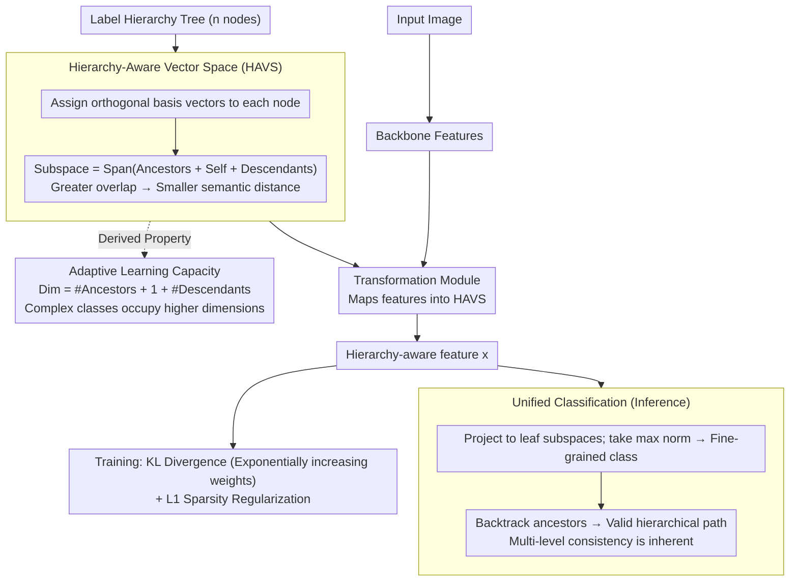

# Hier-COS: Making Deep Features Hierarchy-aware via Composition of Orthogonal Subspaces

**Conference**: CVPR 2026  
**arXiv**: [2503.07853](https://arxiv.org/abs/2503.07853)  
**Code**: [Project Page](https://sites.google.com/iiitd.ac.in/hier-cos)  
**Area**: Self-supervised  
**Keywords**: Hierarchical classification, orthogonal subspaces, hierarchy-aware features, evaluation metrics, label hierarchy

## TL;DR
Ours proposes the Hier-COS framework, which constructs a theoretically guaranteed hierarchy-aware vector space (HAVS) by assigning orthogonal basis vectors to each node in a hierarchy tree. This work unifies "hierarchy-aware fine-grained classification" and "hierarchical multi-level classification" for the first time while introducing a new evaluation metric, HOPS, consistently outperforming Prev. SOTA across four datasets.

## Background & Motivation

**Background**: Traditional classifiers treat all classes as mutually exclusive, ignoring the semantic hierarchy between categories. Hierarchy-aware representation learning aims to make semantically similar classes closer in the feature space, thereby reducing the severity of errors.

**Limitations of Prior Work**: (a) Feature representations in existing methods are restricted to the one-dimensional space of weight vector directions, leading to insufficient angular separation; (b) existing methods assign uniform learning capacity despite varying classification complexities across categories; (c) current evaluation metrics (MS, AHD@k) have significant flaws—AHD is permutation-invariant and cannot distinguish between the best and worst top-k prediction orders.

**Key Challenge**: Existing methods either focus solely on hierarchy-aware multi-class classification (unable to perform multi-level classification) or require additional classifiers and constraints for multi-level tasks, increasing training complexity without guaranteeing consistency.

**Goal**: To build a feature space that is theoretically guaranteed to be hierarchically consistent while unifying two classification modes and adaptively allocating learning capacity.

**Key Insight**: Using orthogonal basis vectors to construct subspaces, where the subspace of each node is composed of the basis vectors of all its ancestors and descendants. Distance is defined as the orthogonal projection distance to the subspace—classes sharing more ancestors have greater subspace overlap, resulting in smaller distances.

**Core Idea**: Each category corresponds to an orthogonal subspace spanned by the basis vectors of its ancestors, itself, and its descendants. The composition of these subspaces naturally encodes the hierarchical structure.

## Method

### Overall Architecture
The core problem Hier-COS addresses is making deep features "aware" of the semantic hierarchy between classes—for example, misidentifying a Husky as a Wolf should incur a lower penalty than misidentifying it as a Truck. This is achieved by mapping the entire label hierarchy tree $\mathcal{T}$ (comprising $n$ nodes) into an $n$-dimensional orthogonal vector space. Specifically, each node in the tree is assigned a mutually orthogonal basis vector $\mathcal{E}$, and each category corresponds to a subspace $V_i = \text{span}(\mathcal{E}_i^a \cup \{e_i\} \cup \mathcal{E}_i^d)$ spanned by its "ancestors + self + descendants." A lightweight transformation module maps standard features extracted by the backbone into this space $V_\mathcal{T}$. During classification, the model determines which category subspace the feature falls into. The brilliance of this pipeline lies in the fact that hierarchical relationships are not "forced" by extra losses but are naturally encoded into the subspace overlaps by the geometric structure.

### Key Designs

**1. Hierarchy-Aware Vector Space (HAVS): Encoding "Semantic Proximity" via Subspace Overlap**

To make the feature space "hierarchical," the distance metric must follow the tree distance—the more ancestors two classes share, the closer they should be in the feature space. Hier-COS satisfies this through the geometric relationship of orthogonal subspaces. A category with a higher subspace dimension (more ancestors/descendants) shares more basis vectors with its siblings, leading to greater overlap. The paper defines the "distance from feature to category" as the projection norm onto the orthogonal complement of that category's subspace. Computationally, this is the sum of squared components along basis directions not belonging to the subspace: $d_S^2(\mathbf{x}, V_{y_j}) = \sum_{e \in \neg\mathcal{E}_{y_j}} x_e^2$. Theorem 1 provides the theoretical guarantee: if feature $\mathbf{x} \in V_{y_i}$ has non-zero projections in all basis directions, then $V_\mathcal{T}$ is a HAVS, meaning the order in tree distance $D_\mathcal{T}(y_i, y_j) < D_\mathcal{T}(y_i, y_k)$ implies the same order in feature distance $|D_i - D_j| < |D_i - D_k|$. In other words, hierarchical consistency is an intrinsic property of the space.

**2. Adaptive Learning Capacity: Automatic Allocation of Representation Space**

Hierarchies in the real world are often imbalanced—some subtrees are dense with fine-grained distinctions, while others contain only a few coarse categories. Existing methods allocate a one-dimensional representation space to all classes, leaving difficult fine-grained classes with insufficient separation. Hier-COS solves this via its subspace construction: the dimension of a category's subspace is directly equal to "# of ancestors + 1 + # of descendants." A complex category deep in the tree naturally falls into a high-dimensional subspace, providing enough directions to encode distinguishing features, while a simple, isolated category occupies a low-dimensional subspace. Learning capacity scales automatically with category complexity without manual design or extra hyperparameters.

**3. Unified Classification: Consistent Fine-grained and Multi-level Outputs**

Previously, performing both fine-grained and multi-level classification required separate heads per level and a consistency loss to "glue" predictions into a valid path—outputs were often inconsistent. Hier-COS avoids this. During inference, it simply projects the feature onto each leaf subspace and selects the one with the maximum norm $\hat{y} = \arg\max_{y_i \in \mathcal{V}_\ell} \|\mathbb{P}_{\mathcal{E}_{y_i}} \mathbf{x}\|$. Proposition 1 guarantees that backtracking the ancestors of $\hat{y}$ results in a valid path $\{\hat{y}^{(1)}, \dots, \hat{y}^{(H)}\}$ in the tree. Thus, multi-level consistency is "free," preventing contradictions where a model might predict "Husky" at the leaf but "Feline" at an intermediate level.

### Loss & Training
The objective function is $\mathcal{L}_{total} = \mathcal{L}_{kl} + \alpha \mathcal{L}_{reg}$. $\mathcal{L}_{kl}$ uses KL divergence to pull feature distributions along basis vectors toward the target distribution, applying exponentially increasing weights to ensure leaf nodes receive the most attention. $\mathcal{L}_{reg}$ is an L1 regularization term that enforces sparsity, ensuring the feature activates only one basis direction per level to fall on a valid hierarchical path. The transformation module follows the HAFrame design, allowing either end-to-end training or training a lightweight module on a frozen backbone.

## Key Experimental Results

### Main Results

**CIFAR-100 (5-level Hierarchy)**

| Method | Accuracy↑ | MS↓ | AHD@20↓ | HOPS↑ | HOPS@5↑ |
|------|----------|-----|---------|-------|---------|
| Cross Entropy | 77.77 | 2.33 | 3.19 | 0.54 | 0.05 |
| HAFrame | 80.55 | 2.00 | 2.45 | 0.86 | 0.81 |
| **Hier-COS** | **81.75** | 2.09 | **2.44** | **0.89** | **0.84** |

**iNaturalist-19 (7-level Hierarchy)**: Hier-COS significantly outperforms HAFrame on HOPS, demonstrating its advantage in scenarios with deep hierarchies and large category counts.

### Ablation Study

| Configuration | FPA↑ | Accuracy↑ | Description |
|------|------|----------|------|
| Cross Entropy | 77.11 | 77.77 | Large Acc-FPA gap indicates inconsistency |
| HAFrame | 77.0 | 80.55 | FPA is actually lower than CE |
| **Hier-COS** | **82.91** | **81.75** | FPA > Accuracy! Strong hierarchical consistency |

### Key Findings
- Ours shows a Gain of 1.36-3.64% in FPA (Full Path Accuracy) across all datasets compared to HAFrame, with the smallest Accuracy-FPA gap, confirming the theoretical guarantee of hierarchical consistency.
- The HOPS metric effectively distinguishes scenarios where AHD fails: while AHD@20 gives the same score (2.06) for both best and worst rankings, HOPS shows significant variance.
- Training only the transformation module on a frozen ViT backbone yielded a 2.42% top-1 Gain, proving that Hier-COS efficiently converts pre-trained features into hierarchy-aware ones.
- As $K$ increases, the correct ranking ratio of existing methods drops sharply; Hier-COS maintains 64-74% at $K=20$, far exceeding the ~0% of other methods.

## Highlights & Insights
- **Elegant Unification of Theory and Practice**: The use of orthogonal subspace compositions to encode hierarchy is original and elegant. Theorem 1 and Proposition 1 provide rigorous guarantees for consistency, which is superior to using loss terms to "approximate" consistency.
- **HOPS Evaluation Metric**: Reveals the permutation-invariant flaw of AHD@k. The proposed HOPS considers both top-1 accuracy and ranking preferences based on error severity. HOPS@1 = top-1 accuracy is a graceful special case.
- **"Subspace Dimension = Learning Capacity" Insight**: The method automatically allocates representation space based on the tree topology, removing the need for manual hyperparameter tuning.

## Limitations & Future Work
- The feature space dimension $n$ equals the number of nodes in the hierarchy; for massive trees (e.g., tens of thousands of nodes), this may lead to high dimensionality.
- Validated only on image classification; has not been extended to NLP or multi-modal hierarchical scenarios.
- Although HOPS is superior to AHD, the choice of the weight function $\eta_j$ (multi-step exponential linear decay) is somewhat arbitrary.
- The impact of the specific assignment of orthogonal bases (bijective but arbitrary) requires further analysis.

## Related Work & Insights
- **vs HAFrame**: HAFrame also uses fixed frames for hierarchy-aware classification, but features are restricted to the 1D direction of weight vectors. Hier-COS introduces subspace compositions, providing multi-dimensional representation space and adaptive capacity.
- **vs Flamingo**: Flamingo learns hierarchical similarity via label embeddings but does not guarantee hierarchical consistency.
- **vs Hyperbolic Embeddings**: Hyperbolic spaces naturally encode hierarchies but require manifold optimization. Hier-COS achieves similar effects in Euclidean space via orthogonal subspaces, which is simpler.

## Rating
- Novelty: ⭐⭐⭐⭐⭐ The idea of encoding hierarchy via orthogonal subspace composition is original, elegant, and theoretically sound.
- Experimental Thoroughness: ⭐⭐⭐⭐ Extensive comparisons across 4 datasets and multiple metrics, though lacks NLP/large-scale scenarios.
- Writing Quality: ⭐⭐⭐⭐⭐ Rigorous theoretical derivation, clear problem-driven narrative, and excellent critical analysis of evaluation metrics.
- Value: ⭐⭐⭐⭐ Provides dual contributions to the methodology and evaluation of hierarchical classification.

<!-- RELATED:START -->

## Related Papers

- [\[CVPR 2026\] Nonparametric Deep Fine-grained Clustering with Low-Rank Guided Vision-Language Model](nonparametric_deep_fine-grained_clustering_with_low-rank_guided_vision-language_.md)
- [\[CVPR 2026\] TAR: Token-Aware Refinement for Fine-grained Generalized Category Discovery](tar_token-aware_refinement_for_fine-grained_generalized_category_discovery.md)
- [\[CVPR 2026\] PAF: Perturbation-Aware Filtering for Open-Set Semi-Supervised Learning](paf_perturbation-aware_filtering_for_open-set_semi-supervised_learning.md)
- [\[AAAI 2026\] Expandable and Differentiable Dual Memories with Orthogonal Regularization for Exemplar-free Continual Learning](../../AAAI2026/self_supervised/expandable_and_differentiable_dual_memories_with_orthogonal_regularization_for_e.md)
- [\[ICLR 2026\] Exploiting Low-Dimensional Manifold of Features for Few-Shot Whole Slide Image Classification](../../ICLR2026/self_supervised/exploiting_low-dimensional_manifold_of_features_for_few-shot_whole_slide_image_c.md)

<!-- RELATED:END -->
