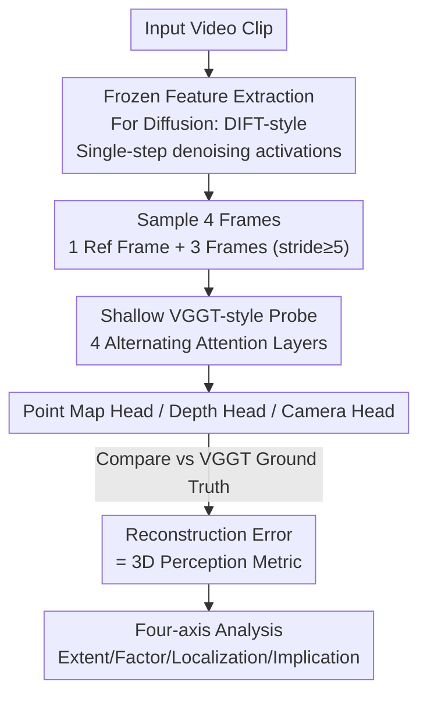

# How Much 3D Do Video Foundation Models Encode?

**Conference**: CVPR 2026  
**Paper**: [CVF Open Access](https://openaccess.thecvf.com/content/CVPR2026/html/Huang_How_Much_3D_Do_Video_Foundation_Models_Encode_CVPR_2026_paper.html)  
**Code**: https://vidfm-3d-probe.github.io/ (Project Page)  
**Area**: Self-Supervised / Representation Analysis (Probing Study)  
**Keywords**: Video Foundation Models, 3D Perception, Probing, Video Diffusion Models, Geometric Reconstruction

## TL;DR
The authors propose the first **model-agnostic** probing framework, using "frozen video foundation model features + shallow feed-forward heads predicting 3D point clouds/depth/camera poses" to quantify the internal 3D understanding of various video models. The conclusion is that leading video generation models trained only on 2D videos (such as WAN2.1-14B) exhibit strong emergent 3D perception, even surpassing expert models trained specifically on 3D data (e.g., Fast3R) in cross-domain scenarios.

## Background & Motivation
**Background**: Recovering 3D structure from 2D vision is a classic problem in computer vision, but high-quality 3D data remains scarce, limiting the scaling of 3D foundation models. In contrast, video data is massive and easily accessible, and since videos are 2D projections of the 3D world, "using video priors for 3D" has become a popular direction—either by adding 3D control conditions to video models or making them output 3D caches.

**Limitations of Prior Work**: Almost all such works require **fine-tuning** video models on 3D data, combined with various task-specific engineering (explicit 3D memory, post-processing optimization, running feed-forward models on generation results) to suppress 3D inconsistency artifacts. These confounds mix the "actual 3D capability brought by video data itself" with the "capability added by fine-tuning and engineering," making it unclear how much 3D perception a foundation video model encodes **natively**.

**Key Challenge**: To answer whether video pre-training can natively induce strong 3D perception, the contributions of fine-tuning and engineering must be decoupled through a **direct, model-agnostic, and quantifiable** evaluation. Existing probing works (Probe3D, Feat2GS) only probe **image models** and mainly measure 2.5D proxy metrics like depth/normals or cross-view consistency, rather than directly probing global 3D properties or covering the family of video models.

**Goal**: To measure the 3D perception of various Video Foundation Models (VidFM) under a unified probe and answer four questions—① **Extent**: What is the gap between video models, image models, and expert 3D models? ② **Factor**: What are the effects of temporal reasoning, 3D fine-tuning, and model scale? ③ **Localization**: Which layer and which diffusion timestep concentrate 3D information? ④ **Implication**: Are VidFM features practical when 3D data/compute are limited?

**Key Insight**: If a video model truly understands 3D, a **shallow, feed-forward readout head that does not optimize the base** should be able to decode accurate 3D properties from its frozen features; lower readout error indicates stronger native 3D perception. By using "probe reconstruction error" as a unified metric for 3D perception, fair comparisons can be made across different model families.

## Method

### Overall Architecture
The method is a two-stage "frozen features → shallow probe → 3D error" pipeline: first, the video model under test is treated as a **frozen feature extractor** to extract frame-wise spatio-temporal features from video clips; then, a lightweight feed-forward probe is trained on top of these features to predict dense 3D point maps, depth maps, and camera poses for each frame; **only the probe is trained, while the base remains frozen**. Given the same probe capacity, training set, and supervision, whichever base model allows the probe to achieve lower reconstruction error is considered to have encoded stronger native 3D information. GT is generated using VGGT on full sequences (which is more accurate than dataset-provided labels).

### Key Designs

**1. Frozen Feature Extraction + DIFT-style Reading for Diffusion Models: Unified probing for arbitrary video models**

Different video models have vastly different architectures (self-supervised encoders, latent diffusion generators). To perform model-agnostic comparisons, the first step is to reduce them to "frame-wise spatio-temporal feature maps $F_t \in \mathbb{R}^{C\times H_f\times W_f}$." For self-supervised/deterministic models (V-JEPA, DINOv2, Fast3R), spatial features are taken directly from the final layer. The difficulty lies in **diffusion video generators**—they lack ready-made "features." The authors adapt DIFT: a denoising timestep $\tau$ is selected, noise is added to the input, a **single step** of denoising is performed, and the hidden activations of specified layers are read as features. Null embeddings are used for text; image-to-video models are conditioned on the first frame. Layer indices and $\tau$ are fixed as hyperparameters. For models with limited context windows, long videos are split into short chunks, each prepended with the first frame as a common reference, maintaining a frame-to-feature index $\pi(t)$ for gathering features during probing. The value of this step is that it allows generative diffusion models to be measured with the same scale, while "frozen + shallow readout" ensures measurement of native information rather than probe-injected information.

**2. Shallow VGGT-style Feed-forward Probe: Extracting "native" 3D with minimal readout capacity**

The probe is intentionally kept shallow: for each video, $S{=}4$ frames are taken (the first as reference, 3 others sampled with a minimum interval of 5), spatio-temporal tokens are extracted, and 4 **alternating attention** blocks are stacked—each containing an intra-frame attention (mixing tokens within a frame) and a global attention (mixing tokens across frames), mirroring VGGT but much shallower. This is followed by three readout heads: two DPT heads outputting dense point maps $\hat{X}_{t_i}\in\mathbb{R}^{H\times W\times 3}$ (in the first frame's coordinate system) and depth maps $\hat{D}_{t_i}$, and a camera head predicting relative poses. The design philosophy is: the probe capacity is deliberately suppressed to force "globally consistent 3D" to be supplied by the base features rather than inferred by the probe—thus, readout error cleanly reflects the native 3D perception of the base. The training objective is a multi-task loss $L = \lambda_{p}L_{pmap} + \lambda_{d}L_{depth} + \lambda_{c}L_{cam}$ (default weights = 1): confidence-weighted $\ell_2$ for points/depth (after normalization to remove scale ambiguity), and Huber loss for camera poses.

**3. Upper and Lower Reference Control Groups: Establishing a credible interval for VidFM features**

Since video data itself can resolve some 3D, the ranking of VidFMs alone might be misleadingly high. Two controls are set. **Lower Bound (Frame-wise Image Control)**: DINOv2 features are extracted **independently** for each frame and fed to the same probe. Since features are extracted in isolation, any "global 3D in a common coordinate system" must be synthesized by the probe itself rather than the base. To keep the task well-defined, a reference token marking the first frame is added, while other hyperparameters match the VidFM setting. **Upper Bound (Native 3D Control)**: Probing Fast3R features—as it is directly trained to predict 3D point maps from multiple views, providing a strong reference under the same probe and supervision. Additionally, since CO3D is in the Fast3R training set but DL3DV is not, this control also allows observing the **generalization behavior** of expert models. With the lower (isolated image) and upper (3D expert) bounds, the VidFM values gain an interpretable scale.

### Loss & Training
Multi-task loss $L = \lambda_{pmap}L_{pmap} + \lambda_{depth}L_{depth} + \lambda_{cam}L_{cam}$, with all weights defaulting to 1. Point maps and depth use confidence-weighted $\ell_2$, with GT scenes normalized to eliminate global scale; camera poses use Huber loss. Throughout training, only the probe parameters are updated; the base video models remain frozen.

## Key Experimental Results

### Main Results: 3D Perception Comparison (CO3Dv2 / DL3DV)

CO3Dv2 contains object-centric turntable videos (11k segments after filtering), while DL3DV contains large, cluttered scenes (more difficult). GT is generated via full VGGT sequences. Point map errors are multiplied by 10 for readability.

| Probed Feature | CO3D Point Err↓ | CO3D Depth↓ | CO3D AUC@30↑ | DL3DV Point Err↓ | DL3DV Depth↓ | DL3DV AUC@30↑ |
|---|---|---|---|---|---|---|
| DINOv2 (Per-frame, Lower Bound) | 0.559 | 0.209 | 0.508 | 2.814 | 0.534 | 0.245 |
| V-JEPA (Self-supervised video) | 0.439 | 0.214 | 0.619 | 1.576 | 0.613 | 0.558 |
| CogVideoX | 0.485 | 0.231 | 0.569 | 1.748 | 0.608 | 0.486 |
| Aether (CogVideoX+3D fine-tuned) | 0.501 | 0.249 | 0.571 | 1.566 | 0.574 | 0.527 |
| Open-Sora2.0 | 0.391 | 0.196 | 0.643 | 1.306 | 0.445 | 0.607 |
| **WAN2.1-14B** | **0.284** | **0.151** | 0.736 | **1.051** | **0.323** | **0.660** |
| Fast3R (3D Expert, Upper Bound) | 0.262 | 0.145 | 0.769 | 1.379 | 0.514 | 0.637 |

Key takeaway: On CO3D (within Fast3R's training distribution), WAN2.1-14B is second only to Fast3R. However, on DL3DV (**unseen** by Fast3R), WAN2.1-14B **outperforms** Fast3R across all metrics (Point 1.051 vs 1.379, Depth 0.323 vs 0.514, AUC@30 0.660 vs 0.637)—the generator trained only on 2D videos shows more robust cross-domain 3D than the 3D expert.

### Ablation Study: Model Scale / Localization / VidFM Features replacing DINO

| Experiment | Configuration | Key Metric | Description |
|---|---|---|---|
| Scale (Point Err on Ablation Set) | WAN 1.3B → 14B | 0.0468 → 0.0360 (−23%) | Scaling significantly improves performance |
| Scale (Point Err on Ablation Set) | CogVideoX 2B → 5B | 0.0576 → 0.0590 (+2%) | Slightly degrades performance |
| Localization | Mid-layer + Early (but not first) timestep | Lowest Point Error | Consistent across all diffusion models |

Replacing DINO with VidFM features (VGGT in practice, limited 3D data scenario):

| Method | CO3D Point Err↓ | CO3D Depth↓ | DL3DV Point Err↓ | DL3DV Depth↓ |
|---|---|---|---|---|
| Original VGGT (DINO features) | 0.476 | 0.205 | 2.751 | 0.518 |
| **VidFM-VGGT (Frozen WAN2.1-14B features)** | **0.289** | **0.145** | **1.034** | **0.319** |

### Key Findings
- **Extent**: Leading video generators (WAN2.1-14B, Open-Sora2.0) possess 3D perception strong enough to approach or even surpass the 3D expert Fast3R cross-domain, despite never seeing 3D data.
- **Factor ① Temporal reasoning is key**: While per-frame DINOv2 has reasonable depth on CO3D (0.209), its global 3D (Point 0.559, AUC@30 0.508) is significantly worse than all video models. Video models benefit from "exchanging information along the temporal axis," with the gap widening on the more difficult DL3DV; this shows 2.5D proxy metrics like depth cannot truly reflect global 3D perception.
- **Factor ② 3D fine-tuning is a double-edged sword**: Aether (CogVideoX fine-tuned with 3D objectives) shows significant improvement on the large-scale DL3DV but performs slightly worse than the base on object-centric CO3D. The authors attribute this to training data being mostly synthetic game/simulation scenes—fine-tuning boosts scores but may harm cross-domain generalization.
- **Factor ③ Mixed scaling effects**: Parameter count does not guarantee stronger 3D; WAN's scaling coincided with more high-quality high-resolution data, while CogVideoX's scaling of architecture alone slightly regressed, suggesting data is the critical variable.
- **Localization**: 3D information in diffusion models is most concentrated in **middle layers + early (but not first) timesteps**, a finding strikingly consistent across models. Final layers are suppressed by per-frame RGB synthesis tasks, while the earliest layers/steps have not yet formed high-level features or are too noisy.
- **Implication**: When 3D data is limited, replacing DINO with frozen WAN features to train VGGT (VidFM-VGGT) results in massive improvements, proving video model features are better suited for feed-forward 3D reconstruction under low-data regimes.

## Highlights & Insights
- **Operationalizing "3D perception" as a quantifiable unified metric**: By fixing probe capacity and the training set, reconstruction error is used to directly compare models across families, bypassing the difficulty of directly comparing different architectures; this protocol is reusable for any new video/image base.
- **Solid combination of DIFT-style reading + upper/lower bounds**: The former solves the "lack of features" in diffusion models, while the latter (per-frame image lower bound + 3D expert upper bound) anchors the conclusions within an interpretable interval, preventing over-interpretation of raw scores.
- **Experimental design targeting "cross-domain truth"**: Deliberately choosing DL3DV (unseen by Fast3R) to show the video generator outperforming the 3D expert is more convincing than minor leads in-distribution, highlighting the generalization advantage of 2D video priors.
- **Transferable engineering insights**: The finding that middle layers + early timesteps are the "sweet spot" for 3D features in video diffusion models is consistent across models—downstream tasks can directly adopt this layer/step selection strategy.

## Limitations & Future Work
- **Reliance on public checkpoints precludes controlled experiments**: Due to resource/data constraints, the authors could not train video generators from scratch under strictly controlled variables, making it difficult to precisely attribute 3D perception differences to "data vs training strategy vs scale."
- **VidFM-VGGT ceilings not verified on large-scale data**: The Implication section only verifies on small datasets like CO3D/DL3DV. Resource limits prevented training large-scale 3D reconstruction models from scratch using VidFM features—which is the core question for "whether video priors can support scalable 3D foundation models."
- **GT depends on VGGT automatic generation**: All point map/depth/pose GT comes from VGGT full-frame inference. Treating VGGT as ground truth might introduce systematic bias toward features similar to VGGT's (e.g., geometrically biased models).
- **Probing remains supervised readout**: Although intentionally kept shallow, there is a lack of theoretical definition for "how shallow is sufficient for native information measurement." Probe capacity itself remains an implicit hyperparameter.

## Related Work & Insights
- **vs Probe3D / Feat2GS**: These also use dense probes for 3D perception but target **image models** and evaluate 2.5D proxies like depth/normals. This paper directly probes **video models** using **true 3D properties** (point clouds/poses) and demonstrates that depth is not the best metric for 3D perception.
- **vs VBench / WorldScore**: These benchmark video generators based on **generated output** consistency; this paper evaluates **internal representations**, shifting focus from "does the output look like 3D" to "does the model understand 3D."
- **vs Video-to-3D Fine-tuning (Aether, etc.)**: Mainstream works fine-tune video models on 3D data to output 3D. This paper does the opposite—**no fine-tuning**, probing frozen features to cleanly separate "native video priors" from "fine-tuned capabilities"—and shows fine-tuning can sometimes harm generalization.
- **vs Classical SfM/MVS and Feed-forward 3D (Fast3R/VGGT)**: Classical methods struggle with textureless/wide-baseline scenes; feed-forward methods struggle with scaling and generalizing to dynamic/real cluttered scenes. This paper provides a third path: features from existing video generators may be "free 3D priors" superior to DINO for low-data feed-forward 3D reconstruction.

## Rating
- Novelty: ⭐⭐⭐⭐⭐ First model-agnostic direct 3D probe for video models; the problem framing (decoupling fine-tuning) and findings (generators beating experts) are highly novel.
- Experimental Thoroughness: ⭐⭐⭐⭐ Two datasets, four axes, and upper/lower bounds are comprehensive. Localization/scale ablations are solid, though controlled data-scale experiments are missing.
- Writing Quality: ⭐⭐⭐⭐⭐ Clear four-axis structure; conclusions match tables/figures well; logic for the protocol and controls is transparent.
- Value: ⭐⭐⭐⭐⭐ Provides quantitative evidence and a reusable protocol for using video for scalable 3D; layer/step selection and VidFM-feature-replacement findings are directly applicable to downstream 3D work.

<!-- RELATED:START -->

## Related Papers

- [\[CVPR 2026\] TALO: Pushing 3D Vision Foundation Models Towards Globally Consistent Online Reconstruction](talo_pushing_3d_vision_foundation_models_towards_globally_consistent_online_reco.md)
- [\[AAAI 2026\] From Pretrain to Pain: Adversarial Vulnerability of Video Foundation Models without Finetuning](../../AAAI2026/self_supervised/from_pretrain_to_pain_adversarial_vulnerability_of_video_foundation_models_witho.md)
- [\[ICML 2026\] How 'Neural' is a Neural Foundation Model?](../../ICML2026/self_supervised/how_neural_is_a_neural_foundation_model.md)
- [\[CVPR 2026\] Scaling Parallel Sequence Models to Vision Foundation Models](scaling_parallel_sequence_models_to_vision_foundation_models.md)
- [\[CVPR 2026\] Chain-of-Models Pre-Training: Rethinking Training Acceleration of Vision Foundation Models](com_pt_chain_of_models_pretraining.md)

<!-- RELATED:END -->
