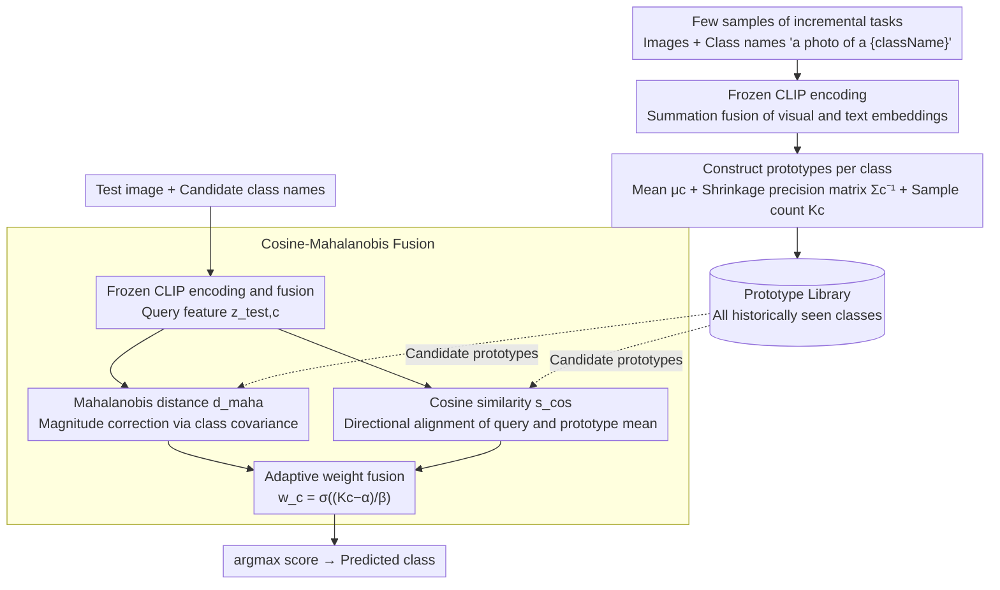

# HyCal: A Training-Free Prototype Calibration Method for Cross-Discipline Few-Shot Class-Incremental Learning

**Conference**: CVPR 2026  
**arXiv**: [2604.15678](https://arxiv.org/abs/2604.15678)  
**Code**: None  
**Area**: Self-supervised  
**Keywords**: Continual Learning, Few-Shot Class-Incremental Learning, Cross-Domain Adaptation, Prototype Calibration, Domain Gravity

## TL;DR
This paper identifies the "Domain Gravity" bias in heterogeneous domain continual learning—where data-rich or low-entropy domains exert disproportionate influence in the shared embedding space. It proposes HyCal, a training-free method that calibrates prototypes by fusing cosine similarity and Mahalanobis distance, achieving robust classification in cross-discipline imbalanced few-shot incremental learning.

## Background & Motivation

1. **Background**: Pre-trained vision-language models (e.g., CLIP) perform excellently in continual learning. Few-Shot Class-Incremental Learning (FSCIL) simulates real-world scenarios by limiting the number of samples per class and has recently been extended to cross-domain settings to leverage the zero-shot capabilities of VLMs for cross-domain knowledge retention.
2. **Limitations of Prior Work**: Existing cross-domain FSCIL methods still assume fixed few-shot configurations and balanced data distributions. In practice, heterogeneous domains differ significantly in visual entropy, feature geometry, and data availability. Projection or kernel-based approaches (e.g., RanPAC) enrich feature representations but exacerbate the drift toward data-rich domains. Covariance-based methods suffer from unstable covariance estimation in few-shot heterogeneous domains.
3. **Key Challenge**: Data imbalance in heterogeneous domains causes "Domain Gravity"—over-represented or low-entropy domains exert disproportionate influence in the shared embedding space, causing prototypes of weakly represented domains to drift and decision boundaries to blur. Existing methods implicitly assume homogeneous feature distributions and cannot counter this asymmetric representational power.
4. **Goal**: (1) Define a Cross-Discipline Variable Few-Shot Class-Incremental Learning (XD-VSCIL) benchmark; (2) Propose a training-free prototype calibration method to mitigate Domain Gravity.
5. **Key Insight**: Cosine similarity and Mahalanobis distance capture complementary and statistically independent geometric information in high-dimensional space—directional alignment and covariance-aware magnitude.
6. **Core Idea**: Dynamically fuse cosine similarity (global directional stability) with Mahalanobis distance (domain-specific covariance correction) to achieve robust prototype matching without modifying the backbone.

## Method

### Overall Architecture
HyCal addresses the problem in cross-discipline continual learning where "data-rich or low-entropy domains pull the shared embedding space toward themselves." It achieves this by performing all calibrations at the inference stage without touching the backbone. The workflow is as follows: The backbone uses a frozen CLIP (neither image nor text encoders are updated). For each incremental task, visual embeddings and class name text ("a photo of a {className}") embeddings are summed and fused into a unified embedding. From the few samples of the task, a "prototype" is calculated for each new class—including a class mean embedding $\mu_c$, a shrinkage-regularized precision matrix $\Sigma_c^{-1}$ (the inverse of covariance), and the sample count $K_c$. During test image classification, HyCal first fuses the test image and candidate class names into query features, then calculates two scores for each candidate prototype: how aligned the query feature is with the prototype mean direction (cosine similarity) and how close it is to the prototype considering the class covariance (Mahalanobis distance). Finally, these two scores are fused using a weight that adapts to the sample count, and the class with the maximum score is predicted. This process involves no training, backpropagation, or parameter updates; it simply stabilizes the "distance metric for prototype matching."

### Key Designs

**1. Domain Gravity: Framing "imbalance-induced drop" as a structural bias**

Instead of immediately stacking methods, this paper first answers "why performance drops in heterogeneous domain continual learning." The answer is: each domain generates a "representational potential" in the shared embedding space based on its visual consistency and data density. Low-entropy domains (highly regular images, like MNIST) or domains with large sample sizes have higher potential, disproportionately dominating the embedding geometry and pulling prototypes of under-represented domains toward themselves, thereby blurring decision boundaries. The authors decompose this bias into two sources: **Pre-training bias**, where CLIP inherits distribution bias from large-scale corpora, naturally allowing common domains to dominate geometry; and **Incremental accumulation**, where prototypes and embeddings continuously drift toward visually consistent domains as tasks are added. The paper uses t-SNE visualizations to demonstrate the drift trajectories of prototypes of under-represented domains in methods like RanPAC. The value of this concept lies in upgrading the phenomenon description "poor performance due to data imbalance" into a locatable and counterable structural objective.

**2. Cosine-Mahalanobis Fusion: Using two geometrically independent distances to cross-compensate blind spots**

A direct consequence of Domain Gravity is that a single distance metric is insufficient: cosine similarity only considers direction and ignores domain-specific variance, losing accuracy when a domain's geometry is pulled away. While the Mahalanobis distance incorporates covariance, covariance estimation itself is unreliable in few-shot settings. HyCal’s key argument is that these two measures capture orthogonal information—under the isotropic Gaussian assumption, the feature direction vector $U$ and magnitude $R$ are statistically independent ($R \perp U$). Thus, the cosine term depending on $U$ and the Mahalanobis term depending on $R$ and covariance capture non-overlapping information, making their entropies additive $H(C, M) = H(C) + H(M)$. Further mutual information analysis shows that combining them is strictly beneficial: $I(L; C, M) \geq \max\{I(L; C), I(L; M)\}$, meaning the discriminative information after fusion is at least as high as that of either term alone. During fusion, a weighted sum of the two scores is taken for each candidate class $c$:

$$c_{pred} = \arg\max_c \left[\, w_c \cdot d_{\text{maha}} + (1-w_c) \cdot s_{\text{cos}} \,\right]$$

The weight is not fixed but adapts to the number of samples per class: $w_c = \sigma\big((K_c^t - \alpha)/\beta\big)$. The intuition is straightforward—the more samples a class has (larger $K_c^t$), the more reliable the covariance estimate, resulting in a larger $w_c$ that favors the Mahalanobis distance. With fewer samples, the weight reverts to the more stable global directional signal of cosine similarity. This allows the "reliance on covariance" to be automatically adjusted based on data volume rather than using a one-size-fits-all approach across heterogeneous domains.

**3. XD-VSCIL Benchmark and CDE Metric: A comparable testing ground for "variable few-shot + heterogeneous domains"**

Existing FSCIL benchmarks use fixed few-shot and homogeneous domains, failing to detect collapse under imbalance. The authors construct the **Cross-Discipline Variable Few-Shot Class-Incremental Learning (XD-VSCIL)** benchmark: 8 datasets with large disciplinary gaps (Aircraft, ArtBench, DTD, EuroSAT, Galaxy, MNIST, OrganMNIST, OxfordFlowers) are sequenced, allowing class counts and samples per class to vary between tasks, deliberately creating shifts in visual entropy and data volume. The accompanying **Cross-Discipline Efficiency (CDE)** metric uses a harmonic mean to combine adaptability $S_{\text{adapt}}$ and final accuracy $S_{\text{last}}$, weighted by $w^t \propto 1/\sqrt{K^t}$. Tasks with fewer samples receive higher weights, rewarding data efficiency—performing well with fewer samples—rather than allowing average scores to be inflated by domains with many samples.

### Loss & Training
HyCal is entirely training-free, involving no loss functions or backpropagation. It only requires storing mean embeddings, regularized precision matrices, and sample counts for each class. To prevent covariance estimation from degrading in few-shot settings, the precision matrix is derived from a shrinkage-regularized covariance $\Sigma_c^{reg} = (1-\lambda)\Sigma_c + \lambda\gamma I$, adding $\gamma I$ to the diagonal to prevent the covariance matrix from being nearly singular and causing the Mahalanobis distance to explode.

## Key Experimental Results

### Main Results

**High-scale domain imbalance (8 domains)**:

| Method | Avg Accuracy | Last Accuracy | Std Dev |
|------|-----------|-----------|--------|
| Primal-RAIL | 53.49% | 59.86% | 22.04 |
| RanPAC | 49.98% | 61.13% | 21.57 |
| KLDA | 41.06% | 61.43% | 24.61 |
| **HyCal** | **54.48%** | **63.50%** | **19.50** |

**Preliminary analysis of domain imbalance (2 domains)**:

| Setting | HyCal | RanPAC | Domain Gap |
|------|-------|--------|---------|
| General (10-shot) | 65.26% | 63.57% | **0.45** vs 2.06 |
| Balanced (20/5-shot) | 64.98% | 60.77% | 8.80 vs 11.49 |
| Imbalanced (5/10-shot) | 62.84% | 59.23% | 4.94 vs 6.83 |

### Ablation Study

| Configuration | Last Accuracy | Description |
|------|-----------|------|
| HyCal (Cosine + Mahalanobis) | 63.50% | Complete method |
| Cosine only | ~61% | Lacks covariance information |
| Mahalanobis only | ~60% | Unstable under few-shot |
| FeCAM (Covariance method) | 5.69% | Severe collapse in heterogeneous domains |

### Key Findings
- **HyCal has the lowest standard deviation (19.50 vs 21-24)**: This indicates more balanced performance across different domains, effectively mitigating the performance asymmetry caused by Domain Gravity.
- **FeCAM completely collapses in heterogeneous domains (5.69%)**: This shows that pure covariance methods are infeasible in heterogeneous few-shot settings.
- **Minimization of domain gaps**: Under the general 10-shot setting, HyCal’s gap between the two domains is only 0.45% (compared to 2.06% for RanPAC), directly validating the effectiveness of the fusion strategy in mitigating Domain Gravity.

## Highlights & Insights
- The **"Domain Gravity" concept** is the most valuable contribution of this paper: it attributes performance degradation in heterogeneous domain continual learning to a structural bias rather than simple data scarcity, providing a clear analytical framework for future research.
- **Information-theoretic proofs** (Theorems 1 & 2) provide a solid theoretical foundation for Cosine-Mahalanobis fusion, particularly the independence proof and the mutual information inequality, making the method more than just empirically "effective."
- The **training-free design** is highly practical: requiring no additional parameters, no backpropagation, and no backbone modifications, it can be directly embedded into existing CLIP-based continual learning workflows.

## Limitations & Future Work
- The theoretical analysis of complementarity is based on the isotropic Gaussian assumption, which deviates from the highly anisotropic distribution of actual VLM embeddings.
- The hyperparameters $\alpha, \beta$ in the sigmoid function for fusion weights $w_c$ require manual setting.
- Validation was limited to CLIP and was not extended to other VLMs (e.g., SigLIP, EVA-CLIP).
- The sequential order of the 8 domains may affect results; order sensitivity was not fully explored.
- Future work could explore adaptive covariance regularization strength and meta-learning-based fusion weights.

## Related Work & Insights
- **vs RanPAC**: RanPAC uses random projections to enrich prototype representations, but suffers from severe prototype drift in heterogeneous domains (as shown by t-SNE). HyCal's dual-distance fusion does not modify the feature space but calibrates it at inference.
- **vs Primal-RAIL**: Primal-RAIL adapts to new domains through parametric methods but shows high performance fluctuation under imbalance. HyCal's training-free nature makes it naturally more robust to variations in sample counts.

## Rating
- Novelty: ⭐⭐⭐⭐ The Domain Gravity concept is insightful; Cosine-Mahalanobis fusion is simple yet theoretically grounded.
- Experimental Thoroughness: ⭐⭐⭐⭐ Multiple imbalance settings and baseline comparisons, though the number of domains (8) is relatively small.
- Writing Quality: ⭐⭐⭐⭐ Clear problem definition and rigorous derivation, though some parts are slightly verbose.
- Value: ⭐⭐⭐⭐ The XD-VSCIL benchmark and Domain Gravity concept hold long-term value for the continual learning community.

<!-- RELATED:START -->

## Related Papers

- [\[CVPR 2026\] Exemplar-Free Class Incremental Learning via Preserving Class-Discriminative Structure](exemplar-free_class_incremental_learning_via_preserving_class-discriminative_str.md)
- [\[CVPR 2026\] Semantic-Guided Global-Local Collaborative Prompt Learning for Few-Shot Class Incremental Learning](semantic-guided_global-local_collaborative_prompt_learning_for_few-shot_class_in.md)
- [\[CVPR 2026\] Quantized Residuals to Continuous Prompts for Few-Shot Class Incremental Learning in Vision-Language Models](quantized_residuals_to_continuous_prompts_for_few-shot_class_incremental_learning.md)
- [\[CVPR 2026\] From Few-way to Many-way: Rethinking Few-shot Fine-grained Image Classification](from_few-way_to_many-way_rethinking_few-shot_fine-grained_image_classification.md)
- [\[CVPR 2026\] DDSF: Robust Few-Shot Learning via Disentangled Subspaces with Determinantal Point Process](ddsf_robust_few-shot_learning_via_disentangled_subspaces_with_determinantal_poin.md)

<!-- RELATED:END -->
