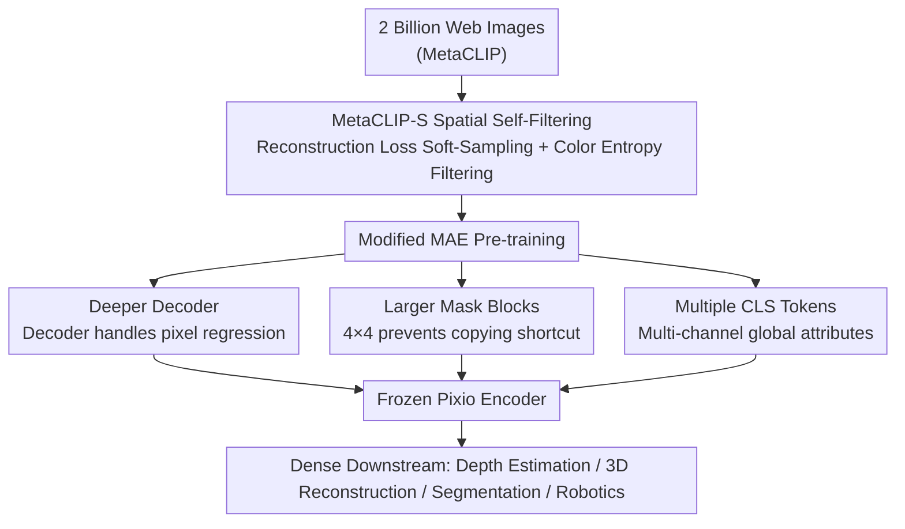

# In Pursuit of Pixel Supervision for Visual Pre-training

**Conference**: CVPR 2026  
**Paper**: [CVF Open Access](https://openaccess.thecvf.com/content/CVPR2026/html/Yang_In_Pursuit_of_Pixel_Supervision_for_Visual_Pre-training_CVPR_2026_paper.html)  
**Code**: https://github.com/facebookresearch/pixio  
**Area**: Self-Supervised Learning / Representation Learning  
**Keywords**: Masked Autoencoders, Data Self-Filtering, Dense Representations, Visual Pre-training, Spatial Intelligence  

## TL;DR
The authors scale MAE back up to web-scale data, proposing a reconstruction-loss-based "spatial data self-filtering" strategy named MetaCLIP-S. Coupled with four minimal algorithmic modifications (a deeper decoder, larger mask blocks, and multiple CLS tokens), they train a model named Pixio. This model matches or exceeds DINOv2/v3 on dense prediction tasks such as depth estimation, feed-forward 3D reconstruction, and segmentation, despite DINOv2/v3 relying on extensive benchmark-specific curated filtering.

## Background & Motivation
**Background**: Visual representation learning has evolved from supervised learning (ImageNet category labels) to self-supervised learning, and further to image-text contrastive learning like CLIP. Currently, the DINO family (DINOv2/v3) represents the strongest general-purpose encoders for dense prediction tasks (depth, 3D, segmentation).

**Limitations of Prior Work**: The authors point out limitations in both lines of research. First, "high-level semantic supervision" like CLIP or discrete labels essentially acts as a projection of the physical world through human cognition and language ("a picture is worth a thousand words"). Information regarding lighting changes, spatial layouts, symmetry, and reflections cannot be adequately described by language alone, and scaling is bottlenecked by the reliance on human annotation. Second, while DINOv2/v3 are powerful, they employ aggressive "benchmark-centric" data filtering—using benchmark images as queries to retrieve similar training images from large pools, and even injecting benchmark training sets like IN-1K and Mapillary with up to 100× oversampling. While this approach dramatically boosts short-term leaderboard rankings, it renders models highly vulnerable to unknown future distributions.

**Key Challenge**: Obtaining robust dense representations for "spatial intelligence" requires diverse data that preserves spatial structure, continuity, and real-world interactions. However, 2D pixels do not inherently possess explicit spatial structures, and the raw distribution crawled from the web is heavily dominated by "low spatial information" content, such as product photography and document/text images, making them suboptimal for direct training.

**Goal**: Under minimal human curation and without introducing benchmark bias, this work aims to select images rich in spatial structure from web-scale data, enabling a simple, stable self-supervised framework (MAE) to scale effectively on this dataset.

**Key Insight**: Pixels are the most primitive source of visual information, naturally containing all hierarchical levels from low-level details (colors, textures, materials, geometry) to high-level concepts (semantics, relationships, events). Rather than fitting human-defined high-level abstractions that treat low-level signals as "noise," it is highly effective to perform direct pixel reconstruction, forcing the model to compress and reconstruct multi-level information.

**Core Idea**: The core idea is to measure the spatial structural richness of an image using the model's own reconstruction loss to perform soft-sampling filtering (highly difficult-to-reconstruct images are retained, while easy-to-reconstruct product images are downweighted). By incorporating four essential algorithmic enhancements into MAE, the paper demonstrates that web-scale data combined with self-filtering achieves performance comparable to DINOv3 on dense downstream tasks under pure pixel supervision.

## Method

### Overall Architecture
The overall pipeline of Pixio is styled as "data curation first, algorithm enhancement second." Starting from the 2 billion web images of MetaCLIP, a baseline Pixio model pre-trained on raw data calculates the reconstruction loss for each image. This forms the basis of MetaCLIP-S soft-filtering (high loss = spatially rich structure = higher retention probability). Meanwhile, color histogram entropy filtering is applied to exclude text images and low-light interaction images. Then, a modified version of MAE—retaining the two core pillars of asymmetric encoder-decoder design and a high masking ratio—is trained on the filtered data. The modifications include a deeper decoder, block-wise masking (scaled from single patches to $4 \times 4$ blocks), and multiple CLS tokens. Upon completion of pre-training, the encoder is frozen and evaluated on downstream dense tasks using DPT or linear heads.

### Key Designs

**1. MetaCLIP-S: Soft-filtering images based on reconstruction loss as "spatial richness score"**

This step directly addresses the challenge of raw web distributions being dominated by product photography and document text, where spatial information is scarce. Rather than relying on human annotations or querying with benchmark images (which introduces the benchmark bias heavily criticized in DINOv2/v3), the authors let the model speak for itself. A Pixio model pre-trained on raw data computes the reconstruction loss $l_i$ for each image, defining the retention (sampling) probability as:

$$P(i) = \min(l_i, 1)$$

The intuition is elegant: product images with clean backgrounds and simple structures are quickly reconstructed by the model, yielding low reconstruction losses and resulting in downsampling. Conversely, real-world scenes with complex geometries, illumination, reflections, and symmetries present high reconstruction difficulties and losses, maintaining a high retention probability. This effectively offloads the task of determining "which images contain rich spatial structures" directly to the reconstruction difficulty of the model. Additionally, a hard filter utilizing color histogram entropy is introduced to exclude images with high reconstruction losses that are actually text-heavy, dark, or lack scene diversity (which would otherwise contaminate the soft-sampling signal). These complementary strategies preserve diverse real-world content while minimizing human-induced curation bias. In ablation studies, this approach boosts ADE20K mIoU from 44.7 (pure MetaCLIP) to 46.8.

**2. Deeper Decoder: Offloading the "dirty work" of pixel regression from the encoder**

The authors initially present a diagnostic observation (Figure 3): the optimal general features of the original MAE-H do not reside in the final layer but appear as early as block 20 (out of 32). Their hypothesis is that the decoder in MAE is too shallow to handle the capacity requirements of pixel regression. Consequently, to minimize reconstruction loss, the deep layers of the encoder are forced to double as a decoder to capture low-level details, compromising the high-level semantic representation. The solution is straightforward: deepen the decoder to take full responsibility for pixel regression, freeing up the encoder. Empirically, increasing the decoder depth from 8 to 32 leads to substantial boosts: IN-1K k-NN surges from 35.3 to 55.8, NYUv2 depth error drops from 0.431 to 0.410, and ADE20K mIoU increases from 35.8 to 40.4. However, the decoder cannot be made arbitrarily deep; excessively powerful decoders can lead to "encoder laziness" (delegating representation learning to the decoder) or direct memorization of visual details, causing over-parameterized configurations such as 768×32 to degrade. Thus, a lightweight footprint is maintained.

**3. Larger Mask Blocks: Blocking the shortcut of copying from neighboring patches**

MAE defaults to randomly mask out individual patch tokens. The primary issue is that masked patches can easily "shortcut" reconstruction by copying texture patterns from immediate neighbors, which fails to enforce genuine visual comprehension and damages local context and spatial structures. Pixio instead performs block-wise masking using $4 \times 4$ local patch blocks. By masking out continuous blocks, the model cannot bypass representation learning using local replication and is forced to infer masked regions from distal contexts. This yields richer local representations while mitigating ground-truth leakage. However, there is an upper bound; excessively large blocks (e.g., $8 \times 8$) render the target regions unpredictable and degrade learning performance. Ablation runs (using a default 512×8 decoder and a 75% mask ratio) show that merely scaling the masking granularity from $1 \times 1$ to $2 \times 2$ increases IN-1K k-NN by 19.0, reduces NYUv2 depth error from 0.431 to 0.362, and yields a +6.0 increase in ADE20K mIoU.

**4. Multiple CLS tokens: Expanding capacity for diverse global image attributes**

MAE adheres to a single class token. While free of explicit loss supervision, it implicitly encodes global structural features such as camera poses and aids in local-to-global patch interactions. However, a single token lacks the capacity to accommodate independent global attributes simultaneously, such as scene categories, visual styles, object concepts, and camera poses. Pixio directly scales the count to multiple CLS tokens, averaging or concatenating them when general global representations are required downstream. This shares structural similarities with ViT register tokens but serves a distinct purpose: registers are discarded during evaluation, whereas Pixio's multiple CLS tokens are directly utilized as global descriptors for downstream tasks (classification, robot learning). In ablation studies, increasing the CLS token count from 1 to 4 boosts IN-1K k-NN from 63.3 to 75.1, alongside minor gains in dense tasks.

### Loss & Training
The framework inherits the standard MAE pixel reconstruction objective (asymmetric encoder-decoder + high mask ratio). The largest model employs a ViT-5.4B/16 backbone trained on 2 billion filtered web images, processing 20 billion seen samples across 1.3 million iterations with a batch size of 16384 and input resolution of 256×256. The decoder configuration uses 512 dimensions across 32 blocks, a $4 \times 4$ masking block granularity, and 8 CLS tokens. The main comparisons in the paper utilize a Pixio-H encoder (631M params) distilled from the largest model, benchmarking against DINOv3-H+ (841M params).

## Key Experimental Results

### Main Results
Evaluating frozen encoders with trainable DPT/linear heads for in-domain metric depth estimation (smaller/larger values indicate better performance as indicated by column arrows):

| Task / Dataset | Metric | MAE-H (631M) | DINOv2-g (1137M) | DINOv3-H+ (841M) | Pixio-H (631M) |
|--------------|------|------|------|------|------|
| NYUv2 (DPT) | RMSE ↓ | 0.465 | 0.355 | 0.320 | **0.268** |
| NYUv2 (DPT) | δ1 ↑ | 80.8 | 90.1 | 93.2 | **95.5** |
| NYUv2 (Linear) | RMSE ↓ | 0.595 | 0.560 | 0.559 | **0.366** |
| KITTI (DPT) | RMSE ↓ | 2.740 | 2.424 | 2.386 | **2.210** |

As observed, despite having 200M fewer parameters than DINOv3-H+ and being distilled from a teacher model that is 1.3B parameters smaller than its counterpart, Pixio-H still outperforms in most dense downstream tasks. For semantic segmentation (ADE20K mIoU using a DPT head), Pixio-H scores 53.6 vs DINOv3-H+'s 52.3. On promptable segmentation across five SAM 2 datasets, Pixio matches or slightly exceeds DINOv3-H+. On CortexBench for robot learning, Pixio achieves an average score of 78.4, outperforming DINOv3 by 3.1 and R3M by 1.2. In feed-forward 3D reconstruction (under the MapAnything framework), Pixio leads in multiple pose/depth evaluation metrics on ScanNet++, ETH3D, and TartanAir. Remarkably, while Pixio is trained strictly using single-view observations, it yields superior multi-view consistency compared to DINOv3, which leverages explicit 8-view inputs.

### Ablation Study
Incremental effects of the three algorithmic modifications (all pre-trained on 2B filtered datasets, Table 8):

| Configuration | IN-1K k-NN ↑ | NYUv2 RMSE ↓ | ADE20K mIoU ↑ | Pascal mIoU ↑ |
|------|------|------|------|------|
| MAE (Decoder 512×8, Mask 1×1, 1 CLS) | 37.9 | 0.392 | 37.2 | 67.4 |
| Pixio (Decoder 512×32, Mask 2×2, 4 CLS) | **59.5** | **0.321** | **46.8** | **80.2** |

Data source comparisons (Table 7, evaluated under 5B seen samples):

| Data Source | Curation | IN-1K k-NN ↑ | NYUv2 RMSE ↓ | ADE20K mIoU ↑ |
|--------|------|------|------|------|
| IN-1K (1.3M) | Manual | 77.2 | 0.395 | 42.9 |
| IN-21K (13M) | Manual | 75.2 | 0.360 | 44.8 |
| MetaCLIP (2B) | Semantic Only | 54.2 | 0.351 | 44.7 |
| MetaCLIP-S (2B) | Self-Filtered | 59.5 | 0.321 | **46.8** |

### Key Findings
- **Deepening the decoder yields the most significant contribution** among the three modifications: advancing from 8 to 32 blocks independently boosts the IN-1K k-NN by 20 points, as it directly addresses the root cause of the encoder "doubling as a decoder."
- **Data filtering is indeed the bottleneck for dense representations**: Raw MetaCLIP 2B (filtered only using alt-text semantics) falls behind carefully curated manual datasets like IN-21K on dense tasks. However, incorporating MetaCLIP-S self-filtering enables it to comprehensively outperform previous methods, demonstrating that "the presence of spatial structures" is far more crucial than "raw data volume." Notably, classifications like IN-1K k-NN on web data are lower than those trained on IN-1K—this is an expected outcome given that classification favors semantically curated datasets, whereas the focal point of this paper is dense tracking and spatial tasks.
- **Several modifications exhibit "diminishing returns" or sweet spots**: A 768×32 decoder configuration degrades performance (yielding encoder laziness/local memorization), and an 8×8 mask size worsens results due to unpredictable masked regions. Granularity must be balanced precisely between task difficulty and learnable representations.
- **An honest and interpretable weak spot**: Pixio lags behind DINOv2/v3 on the KITTI self-driving benchmark. The authors transparently disclose that this is due to abstaining from injecting millions of Mapillary driving images (as DINOv2 does)—a direct consequence of rejecting "benchmark-specific customization."

## Highlights & Insights
- **Framing "data filtering" as a self-referential loop tied to "reconstruction loss"**: Using the model's own reconstruction difficulty as a proxy for "spatial structural complexity" elegantly bypasses both manual annotation and benchmark-centric retrieval. This methodology presents a highly transferable data-filtering paradigm across various self-supervised methods.
- **Using the diagnostic observation "optimal features are not in the raw final layer" to deduce architectural flaws**: The probing experiments in Figure 3 expose the reality that encoders are forced to double as decoders. The progression from visual diagnosis to identifying the root cause and deploying a solution (deepening the decoder) serves as a compelling engineering deduction chain.
- **Succeeding in multi-view tasks with pure single-view training**: Pixio outperforms DINOv3 (which uses explicit multi-view signals) on MapAnything feed-forward 3D reconstruction, indicating that raw single-image pixel supervision is sufficient to yield strong multi-view correspondence patterns.
- **A "less is more" anti-benchmark philosophy**: The paper explicitly rejects shortcuts like oversampling benchmark validation sets up to 100× to inflate leaderboards, betting instead on out-of-distribution robustness and future scalability—a highly principled methodological stance.

## Limitations & Future Work
- The authors concede that lagging behind in specific driving scenes like KITTI is the direct cost of omitting domain-specific data curation. For targeted vertical benchmarks, a pure diversity-driven strategy is not always optimal.
- MetaCLIP-S relies on "pre-training an initial Pixio model on raw data to calculate loss," which introduces bootstrapping costs and circular dependencies. The quality of the starting model influences the filtering signal, and the stability boundaries of such self-referential filtering require deeper investigation.
- The evaluation focuses strictly on dense prediction. For classification tasks, web data performs worse than manually curated datasets, indicating that this framework is "curated for spatial intelligence" rather than being universally optimal for all vision tasks.
- Future directions: extending the loss-driven self-filtering strategy to other self-supervised frameworks (e.g., DINO, contrastive learning), exploring dynamic on-the-fly filtering, and integrating multi-view or video temporal clues to improve curation signals.

## Related Work & Insights
- **vs DINOv2/v3**: These frameworks achieve superior results using large-scale data paired with aggressive "benchmark-centric" filtering (such as retrieving similar images and repeatedly injecting benchmark sets). Conversely, this work employs minimal manual intervention and loss-driven self-filtering to prevent benchmark bias. Pixio achieves comparable or superior results to DINOv3 with fewer parameters and a simpler pixel-reconstruction objective, with its main downside being performance gaps in highly domain-specific tasks (e.g., self-driving).
- **vs Original MAE**: While retaining the core pillars of asymmetric codecs and high masking ratios, this paper demonstrates that a shallow decoder, single-patch masking, and a single CLS token are suboptimal under web-scale datasets and large backbones, correcting each iteratively. Additionally, the training corpus is shifted from IN-1K to 2B filtered web images.
- **vs CLIP / Label Supervision**: CLIP projects the continuous physical world into human language blocks, failing to represent inexpressible visual cues like light-source shifts, spatial layout configurations, or symmetrical reflections. It is also bottlenecked by human annotation limits. This work directly establishes pixel-level, multi-scale signals as rich supervision.

## Rating
- **Novelty**: ⭐⭐⭐⭐ Loss-driven spatial self-filtering presents a clean and highly transferable perspective. While individual algorithmic modifications are not entirely new, their integration is thoroughly validated.
- **Experimental Thoroughness**: ⭐⭐⭐⭐⭐ Spans across four key dense tasks: depth, 3D, segmentation, and robotics, alongside exhaustive ablation studies covering data sources, decoder configurations, mask blocks, and CLS choices, benchmarking directly against the state-of-the-art DINOv3.
- **Writing Quality**: ⭐⭐⭐⭐⭐ A logical deduction chain extending smoothly from empirical diagnostic analysis to identifying root causes and presenting solutions. The motivations are targeted and drawbacks are addressed transparently.
- **Value**: ⭐⭐⭐⭐⭐ Revalidates the competitive strength of pure pixel supervision paired with web-scale corpora for dense representations, offering powerful empirical proof that "data curation outperforms complex algorithmic designs."

<!-- RELATED:START -->

## Related Papers

- [\[CVPR 2026\] Chain-of-Models Pre-Training: Rethinking Training Acceleration of Vision Foundation Models](com_pt_chain_of_models_pretraining.md)
- [\[CVPR 2026\] Reading Your Actions: Learning Generalizable Action Representations via Pre-training AEMG](reading_your_actions_learning_generalizable_action_representations_via_pre-train.md)
- [\[ECCV 2024\] Efficient Image Pre-Training with Siamese Cropped Masked Autoencoders](../../ECCV2024/self_supervised/efficient_image_pre-training_with_siamese_cropped_masked_autoencoders.md)
- [\[ICML 2026\] NITP: Next Implicit Token Prediction for LLM Pre-training](../../ICML2026/self_supervised/nitp_next_implicit_token_prediction_for_llm_pre-training.md)
- [\[CVPR 2026\] UPLiFT: Efficient Pixel-Dense Feature Upsampling with Local Attenders](uplift_efficient_pixel-dense_feature_upsampling_with_local_attenders.md)

<!-- RELATED:END -->
