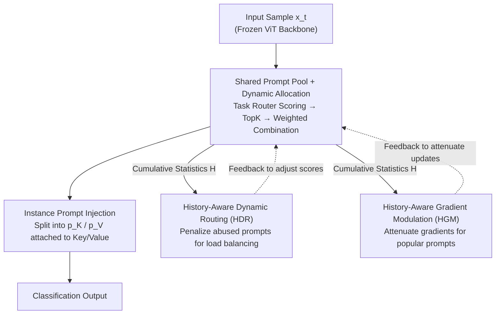

# Is Parameter Isolation Better for Prompt-Based Continual Learning?

**Conference**: CVPR 2026  
**Paper**: [CVF Open Access](https://openaccess.thecvf.com/content/CVPR2026/html/Li_Is_Parameter_Isolation_Better_for_Prompt_Based_Continual_Learning_CVPR_2026_paper.html)  
**Code**: TBD (Authors claim it will be open-sourced)  
**Area**: Continual Learning / Representation Learning  
**Keywords**: Continual Learning, Prompt Learning, Mixture-of-Experts, Class-Incremental Learning, Catastrophic Forgetting

## TL;DR
Addressing the mainstream "one set of prompts per task" paradigm in prompt-based continual learning, this paper proposes a Hash framework utilizing a shared prompt pool + task-aware sparse gating. It introduces a modulator based on historical activation statistics to simultaneously suppress abused prompts and protect essential ones, consistently outperforming static allocation methods across 4 class-incremental benchmarks with higher parameter efficiency.

## Background & Motivation
**Background**: Prompt-based continual learning is a major direction for mitigating catastrophic forgetting—freezing the pre-trained backbone (e.g., ViT-B/16) and optimizing only a small number of prompts for each new task. This is parameter-efficient and naturally supports knowledge isolation. Methods like DualPrompt, HiDe-Prompt, and NoRGa follow the setting of "assigning a fixed set of prompts to each task."

**Limitations of Prior Work**: The authors refer to this practice as "parameter isolation" and identify two major flaws. First, while rigid allocation simplifies task management, it completely cuts off parameter sharing between related tasks, lacking elasticity for heterogeneous task sequences with varying capacity requirements. Second, static allocation leads to inefficient model capacity utilization; fixed quantities and assignments cannot adaptively match the varying complexity and correlation of different tasks.

**Key Challenge**: The root problem lies in the opposition of "knowledge isolation" and "knowledge reuse." Complete isolation prevents forgetting but sacrifices positive transfer and parameter efficiency. Conversely, opening up sharing introduces forgetting due to certain prompts being repeatedly reused and excessively updated.

**Goal**: Construct a prompt framework that allows cross-task sharing without forgetting. This is decomposed into two sub-problems: (i) how to flexibly reuse prompts across tasks rather than occupying fixed territories; (ii) how to prevent popular prompts from being overwritten by excessive updates after sharing.

**Key Insight**: The authors view the prompt pool as a set of "experts" (each specializing in certain feature patterns or task attributes) and use the sparse routing logic of Mixture-of-Experts (MoE) to dynamically combine prompts. This allows a continuous transition between "specialization" and "generalization" rather than a binary isolation.

**Core Idea**: Replace "fixed prompts per task" with a "globally shared prompt pool + task-aware sparse gating," and introduce cumulative historical activation statistics to modulate routing scores and gradient magnitudes. This ensures that frequently used prompts are both balanced out and protected.

## Method

### Overall Architecture
The method, named Hash (History-Aware prompt-SHaring), targets non-exemplar class-incremental learning (CIL). The model learns a sequence of classification tasks $\{T_1, \dots, T_T\}$, where each task introduces new disjoint classes. Training only accesses current task data, and testing involves classification over the union of all seen classes **without task identifiers**.

The pipeline is as follows: Input samples are first scored by a task-specific router against a global prompt pool. Top-K prompts are selected and weighted to form instance-level prompts, which are injected into the Key/Value of frozen ViT attention layers. Parallel to this is a feedback loop: cumulative activations of each prompt are recorded during training. These statistics are fed back to the routing (to penalize abused prompts) and the gradients (to attenuate updates of popular prompts), creating a dynamic balance where "the more a prompt is used, the more it is constrained."

### Key Designs

**1. Shared Prompt Pool + Task-Aware Sparse Gating: From "Task-Exclusive" to "Global Ad-hoc Combination"**

This design directly addresses the "parameter isolation" bottleneck. The prompt pool $P=\{p_1, \dots, p_K\}$ is globally shared, with each prompt $p_k \in \mathbb{R}^{L_p \times d}$ treated as an expert. Each task is assigned a specific router $R_t$. For sample $x_i^{(t)}$, the router calculates relevance scores $\tilde{s}^{(t)} = x_i^{(t)}W_r / \sqrt{d}$. The scores are averaged along the sequence dimension to get a vector $s$ of length $K$. A subset $\mathcal{K}(s)$ is selected via Top-K, and weights $\omega_k = \exp(s_k) / \sum_{j \in \mathcal{K}(s)} \exp(s_j)$ are computed via softmax. The instance prompt is $\tilde{p} = \sum_{k \in \mathcal{K}(s)} \omega_k p_k$.

Compared to static allocation, this design promotes prompt reuse and expands representation capacity. Activation diversity is characterized by entropy $H(\omega) = -\sum_k \omega_k \log \omega_k$. High entropy indicates distributed attention for complex inputs, while low entropy shows selective activation for simple inputs. Total parameters remain lower than HiDe-Prompt even with routers.

**2. History-Aware Dynamic Routing (HDR): Load Balancing via Cumulative Activations**

While the shared pool improves generalization, some prompts may be over-updated. HDR records cumulative activations $H_e^t$ for each prompt up to task $t$ and applies a penalty function $\varphi$ to the relevance scores: $\tilde{s}_e = s_e - \varphi(H_e^t)$. The default implementation uses a piecewise penalty for Top-K high-frequency experts: if $e$ belongs to the most activated set $A_t$, then $\tilde{s}_e = s_e - \delta$ ($\delta > 0$), otherwise it remains unchanged. This forces the router to activate more balanced subsets.

**3. History-Aware Gradient Modulation (HGM): Gradient Attenuation for Prompt Protection**

HGM targets the "update" side: a monotonic decay function $\psi: \mathbb{R}^+ \to (0, 1]$ modulates the gradient $\tilde{g}_e = \psi(H_e^t) \cdot g_e$. Practically, a piecewise constant $\psi(H_e^t) = \beta$ ($0 < \beta < 1$) is used for Top-K experts. This is equivalent to reducing the learning rate for high-frequency experts, implicitly imposing parameter stability.

This is formalized as a regularization term $R_e(\theta_e; H_e^t) = \frac{1}{2} H_e^t \lVert \theta_e - \theta_e^t \rVert^2$: the more a prompt is activated, the heavier the penalty for deviating from old parameters.

### Loss & Training
Tasks $T_t$ are optimized using supervised classification loss $L_{cls}$ on current data $D_t$. Prompt selection is instance-level for both training and inference. Implementation: ViT-B/16 backbone (Sup-21K pre-trained), Adam optimizer ($\beta_1=0.9, \beta_2=0.999$), batch size 128.

## Key Experimental Results

### Main Results
Results on Split CIFAR-100 and Split ImageNet-R (10 tasks):

| Dataset | Method | FAA↑ | CAA↑ | FM↓ |
|---------|--------|------|------|-----|
| CIFAR-100 | HiDe-Prompt | 92.61 | 94.03 | 1.50 |
| CIFAR-100 | NoRGa | 94.48 | 95.83 | 1.44 |
| CIFAR-100 | **Hash (Ours)** | **95.02** | **95.97** | 1.67 |
| ImageNet-R | CPG | 78.63 | 81.04 | 7.18 |
| ImageNet-R | NoRGa | 75.40 | 79.52 | 4.59 |
| ImageNet-R | **Hash (Ours)** | **79.02** | **82.96** | **2.63** |

On ImageNet-R, Hash is 3.66% higher than NoRGa in FAA. Among "Shared" methods, Hash reduces FM to 2.63, significantly better than CPG (7.18), proving that history-aware modulation controls forgetting effectively.

### Ablation Study
FAA results for the three components:

| Configuration | CIFAR-100 FAA | ImageNet-R FAA |
|---------------|---------------|----------------|
| MoE Shared Pool Only | 88.56 | 76.99 |
| MoE + HDR | 94.15 | 78.10 |
| MoE + HGM | 93.86 | 77.56 |
| Full (MoE+HDR+HGM) | 95.02 | 79.02 |

### Key Findings
- **Major Driver**: History-aware modulation is most critical; adding HDR alone improves CIFAR-100 FAA by ~5.6%, indicating load balancing is the primary factor for accuracy and forgetting control.
- **Layer Sensitivity**: Injecting into shallow layers 1–4 works best (95.02). Excessive injection in all layers (1–12, 94.81) slightly decreases performance.
- **Robustness**: Consistent lead across different pre-training paradigms (iBOT/DINO/MoCo).

## Highlights & Insights
- Reconceptualizes "Parameter Isolation vs. Sharing" into two controllable knobs: "Who to select" (Routing) and "How to update" (Modulation). Both are driven by the same cumulative activation statistics.
- The regularization perspective $R_e = \frac{1}{2} H_e^t \lVert \theta_e - \theta_e^t \rVert^2$ provides a formal explanation for "freezing highly-depended experts," a concept transferable to any MoE-based system to prevent expert degradation.
- Achieving higher accuracy with fewer parameters than isolation-based methods proves that "sharing + sparse activation" is superior to task-exclusive prompt allocation.

## Limitations & Future Work
- **Hyperparameters**: HDR/HGM default to piecewise constant penalties; these thresholds/coefficients are hyperparameters. Adaptive mechanisms could be a future improvement.
- **Scenario Scope**: Evaluation is focused on image classification CIL; transferability to detection or segmentation remains to be verified.
- **Long-sequence Bias**: Since statistics accumulate monotonically, early high-frequency prompts might be suppressed long-term, potentially marginalizing early knowledge.

## Related Work & Insights
- **vs. HiDe-Prompt / DualPrompt (Static)**: These isolate knowledge; Hash uses a global pool for adaptive combinations, facilitating positive transfer with higher efficiency.
- **vs. CPG / L2P / CODA-Prompt (Shared Pool)**: While all use shared pools, Hash distinguishes itself by using "Historical Activation Statistics" to drive both routing penalties and gradient modulation, achieving the lowest FM among shared methods.
- **vs. NoRGa**: NoRGa uses non-linear residual gating but still assigns per task; Hash applies MoE to a truly shared pool with explicit forgetting control.

## Rating
- Novelty: ⭐⭐⭐⭐ 
- Experimental Thoroughness: ⭐⭐⭐⭐⭐ 
- Writing Quality: ⭐⭐⭐⭐ 
- Value: ⭐⭐⭐⭐ 

<!-- RELATED:START -->

## Related Papers

- [\[CVPR 2026\] Parameter-efficient Continual Learning for Enhancing Plasticity without Forgetting under Limited Model Capacity](parameter-efficient_continual_learning_for_enhancing_plasticity_without_forgetti.md)
- [\[ECCV 2024\] PromptCCD: Learning Gaussian Mixture Prompt Pool for Continual Category Discovery](../../ECCV2024/self_supervised/promptccd_learning_gaussian_mixture_prompt_pool_for_continual_category_discovery.md)
- [\[CVPR 2026\] Exemplar-Free Continual Learning for State Space Models](exemplar-free_continual_learning_for_state_space_models.md)
- [\[CVPR 2026\] A Faster Path to Continual Learning](a_faster_path_to_continual_learning.md)
- [\[CVPR 2026\] Semantic-Guided Global-Local Collaborative Prompt Learning for Few-Shot Class Incremental Learning](semantic-guided_global-local_collaborative_prompt_learning_for_few-shot_class_in.md)

<!-- RELATED:END -->
