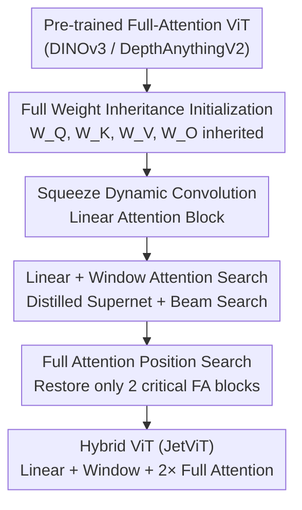

# JetViT: Efficient High-Resolution Vision Transformer with Post-Training Attention Search

**Conference**: CVPR 2026  
**arXiv**: [2605.26636](https://arxiv.org/abs/2605.26636)  
**Code**: TBD (Authors claim will open source)  
**Area**: Self-supervised / Representation Learning · Efficient ViT  
**Keywords**: Hybrid Attention, Linear Attention, Post-Training Search, Vision Foundation Models, High-Resolution Inference

## TL;DR
JetViT proposes **Post-Training Attention Search**: instead of training from scratch, it converts pre-trained full-attention ViTs (DINOv3, DepthAnythingV2) into efficient hybrid ViTs composed of "linear + window + very few full attention" blocks through weight inheritance, distillation, and beam search. It improves high-resolution inference throughput to $1.79\times$ and reduces latency by $44.81\%$ on H100 without accuracy loss.

## Background & Motivation
**Background**: Vision foundation models like DINOv3 and DepthAnythingV2 rely on full-attention ViTs to achieve SOTA in dense prediction (segmentation, depth). The feature quality is extremely high—DINOv3 can perform cross-task transfer with just a linear head. However, self-attention has $\mathcal{O}(N^2)$ complexity relative to sequence length. For high-resolution images (e.g., $1024\times2048$), the token count is massive, making inference slow and memory-intensive.

**Limitations of Prior Work**: To improve efficiency, the community has designed numerous efficient attention mechanisms (linear attention, window attention) and new architectures (Vision Mamba, etc.). However, these are mostly validated on small benchmarks like ImageNet-1K and rarely applied to large-scale foundation models. The reality is that foundation models require pre-training on massive (often private) datasets, making the cost of "retraining with an efficient architecture" prohibitive for most researchers.

**Key Challenge**: There is a deadlock between the exploration of efficient architectures and the pre-training costs of foundation models—using faster attention requires retraining, but retraining is impossible due to the lack of data and compute.

**Goal**: Transform existing full-attention foundation models into efficient hybrid models without retraining and without private data, while preserving the accuracy of the original model.

**Key Insight**: The authors observe that many full-attention blocks in pre-trained ViTs are redundant; only a few layers truly require global modeling. Rather than designing new architectures from scratch, it is better to **inherit all weights from the original model** and replace redundant full-attention blocks with linear or window attention, retaining only a few critical full-attention blocks.

**Core Idea**: Shift the design of efficient ViTs from the pre-training phase to the **post-training phase**—using a two-stage distillation and search pipeline to determine which blocks should be replaced by linear or window attention and which must remain as full attention.

## Method

### Overall Architecture
The core of JetViT is **Post-Training Attention Search**: the input is a pre-trained full-attention ViT (teacher), and the output is an accuracy-aligned, faster hybrid ViT (linear + window + 2 full-attention blocks). The process is supported by three components: a low-overhead linear attention block, an initialization strategy that inherits all attention weights, and a two-stage beam search that progressively replaces full attention and restores critical ones.

Specifically, the "Squeeze Dynamic Convolution Linear Attention Block" is used as the base efficient module. Then, **Step 1** searches for the optimal combination of "linear vs. window" to obtain a pure efficient ViT with $\mathcal{O}(N)$ complexity but slightly lower accuracy. **Step 2** searches for where to insert full-attention blocks back into this efficient ViT, finding that restoring just 2 blocks can match the teacher's performance. The entire process uses feature distillation from the teacher, and efficient blocks inherit $W_Q, W_K, W_V, W_O$ directly.

### Key Designs

**1. JetViT Linear Attention Block: Squeeze Dynamic Convolution for Local Information with Zero Overhead**

The limitation is that naive ReLU linear attention reduces complexity to $\mathcal{O}(N)$ but suffers significant accuracy drops. Linear attention approximates similarity $\text{Sim}(Q,K)=\exp(QK^\top/\sqrt{d})$ using a kernel function $\phi(Q)\phi(K)^\top$ to avoid the $N\times N$ matrix. Simple kernels like ReLU lack expressiveness. Prior work added Depth-Wise Convolution (DWC) on $V$ for local info or used focusing factors $p$ for kernel $\phi(x)=\frac{\|x\|}{\|x\|^p}x^p$. Ablations show DWC provides the largest gain, while complex kernels offer marginal benefits but slow training by 37%.

The authors adopt **Squeeze Dynamic Convolution**: instead of generating a kernel per token (which drops throughput by 40%), they perform global average pooling on $V$ to get global features and use a lightweight MLP with SiLU to **generate a globally shared dynamic convolution kernel**, replacing the static weights of DWC. This retains the efficiency of the ReLU kernel while providing better representation than static DWC. Tab.1 shows it improves mIoU from 65.17 to 73.12 with minimal increase in training step time.

**2. Full Weight Inheritance Initialization: Enabling Efficient Blocks to Absorb Teacher Knowledge**

When converting full attention to linear or hybrid forms, prior work typically only inherits MLP weights and randomly initializes $W_Q, W_K, W_V, W_O$ for efficient blocks, citing structural differences. The authors do the opposite: **they inherit all attention weights $W_Q, W_K, W_V, W_O$**. The intuition is that linear/window attention share the same projection semantics as full attention; random initialization discards knowledge encoded in these matrices.

Experiments show this step is crucial for convergence and final accuracy: for pure linear ViTs, inheriting all weights improves Cityscapes segmentation by **+3% mIoU** compared to inheriting only MLP weights. This weight inheritance allows the search to be completed at a low cost during post-training.

**3. Linear + Window Attention Search (Step 1): Building an Optimized Efficient Backbone**

Window attention (WA) computes self-attention within non-overlapping windows and usually requires alternation with full attention for global context. The authors investigate if linear attention (LA) can replace expensive full attention for global aggregation to build a backbone consisting **only of LA + WA**. They construct a **supernetwork with two candidate blocks per layer** and train it via feature distillation from the teacher. After training, **beam search** identifies the optimal LA/WA combination.

The search is stage-wise greedy, following the efficiency order "Linear > Window > Full Attention". Starting from an all-linear configuration, linear blocks are replaced with window blocks until accuracy gains peak. Tab.2 shows that the searched LA+WA hybrid (66.43 mIoU) significantly outperforms pure linear (61.48) or pure window (65.14) models, recovering most of the teacher's performance (68.74).

**4. Full Attention Position Search (Step 2): Matching Teacher Performance with 2 Blocks**

To close the remaining gap, the authors build another supernetwork where each layer has two candidates: "the efficient block from Step 1" and "a full-attention block". Using distillation and beam search, they progressively replace efficient blocks with full attention. The conclusion is counter-intuitive: **only 2 full-attention blocks** are sufficient to recover the original performance.

The optimal positions depend on downstream usage: DepthAnythingV2 (using 4 intermediate layers) places full attention in mid-deep layers (13, 17); DINOv3 (using the last layer for a linear head) selects later layers (14, 22). Notably, **the first block is always linear attention**, suggesting it functions similarly to a CNN convolution for basic feature extraction.

### Loss & Training
The entire process uses the pre-trained full-attention ViT as a teacher for **feature distillation**. Distillation aligns features used by the downstream task: only the last layer for linear head segmentation, and four intermediate layers for DPT depth estimation. Supernetwork training uses single-path sampling. Beam search scores are based directly on downstream metrics (mIoU, DA2K). For DepthAnythingV2, after the two-stage search, it is fine-tuned on pseudo-depth labels generated from unlabeled real images (SA1B, BDD100K, etc.).

## Key Experimental Results

### Main Results: Semantic Segmentation (DINOv3 Backbone, Cityscapes / ADE20K)

| Model | Size | Latency(ms)↓ | Throughput(samples/s)↑ | Cityscapes mIoU↑ | ADE20K mIoU↑ |
|------|------|-----------|------------------|------------------|--------------|
| DINOv3 (teacher) | Base | 12.86 | 81.52 | 74.56 | 50.32 |
| JetViT-DINOv3 | Base (0 FA) | 7.37 | 153.94 | 71.87 | 48.84 |
| JetViT-DINOv3 | Base (2 FA) | 8.27 | 133.68 | 75.01 | 49.85 |
| DINOv3 | Large | 35.07 | 29.53 | 79.84 | 52.57 |
| JetViT-DINOv3 | Large (2 FA) | 18.77 | 57.90 | 79.88 | 52.31 |
| DINOv3 | 7B | 316.79 | 3.26 | 81.92 | 54.72 |
| JetViT-DINOv3 | 7B (2 FA) | 221.08 | 4.80 | 81.92 | 54.86 |

With 2 full-attention blocks (2 FA), JetViT-DINOv3 matches or slightly exceeds the teacher's mIoU across all sizes, while the Base model's throughput nearly doubles.

### Main Results: Monocular Depth Estimation (DepthAnythingV2 Backbone)

| Model | Size | Latency(ms)↓ | Throughput↑ | DA2K Acc↑ | CityScapes $\delta_1$↑ |
|------|------|-----------|-------|-----------|------------------------|
| DepthAnythingV2 (teacher) | Large | 60.76 | 14.20 | 97.60 | 0.872 |
| JetViT-DepthAnything | Large (2 FA) | 32.63 | 32.13 | 97.84 | 0.876 |
| DepthAnythingV2 | Giant | 164.25 | 6.35 | 97.94 | 0.876 |
| JetViT-DepthAnything | Giant (2 FA) | 90.65 | 11.39 | 98.03 | 0.879 |

The Large model latency is cut from 60.76ms to 32.63ms (approx. $1.79\times$ throughput, $44.81\%$ latency reduction), with metrics like DA2K and $\delta_1$ slightly outperforming the teacher.

### Ablation Study

| Configuration (DINOv3 Distill, Cityscapes) | mIoU | Description |
|---------------------------------|------|------|
| Pure Full Attention (teacher) | 68.74 | Upper bound accuracy, slowest |
| Pure Linear Attention | 61.48 | Fastest, significant drop |
| Pure Window Attention | 65.14 | Intermediate |
| LA + WA (Step 1 Search) | 66.43 | Recovers most performance, still a gap |

| Linear Block Design (DINOv3 teacher) | mIoU | Step Time(s) | Description |
|----------------------------------|------|---------------|------|
| Baseline: ReLU Linear Attention | 65.17 | 0.198 | Starting point |
| + Static DWC on V | 71.82 | 0.227 | DWC provides largest gain |
| + DWC + Focusing Factor | 72.48 | 0.312 | Complex kernels slow and marginal |
| + Squeeze Dynamic DWC (Ours) | **73.12** | 0.232 | Best accuracy, near zero overhead |

### Key Findings
- **High Redundancy**: Retaining only 2 of 24 blocks in ViT-Large recovers teacher performance, indicating massive redundancy.
- **Position Dependency**: FA positions depend on downstream task. DPT (intermediate) → mid-deep layers (13, 17); Linear Head (final) → late layers (14, 22). Shallow layers consistently favor linear attention.
- **Weight Inheritance is Crucial**: Inheriting all weights yields +3% mIoU over MLP-only inheritance and faster convergence.
- **Low Cost**: Post-Training Attention Search costs only ~1/68 of DINOv3-7B pre-training.

## Highlights & Insights
- **Paradigm Shift to Post-Training**: Instead of designing new architectures and retraining, the focus shifts to inheritance and searching. This allows researchers to modify SOTA foundation models without massive compute/data.
- **Squeeze Dynamic Convolution Trade-off**: Per-token kernels are too expensive; static DWC is less expressive. A globally shared dynamic kernel generated from pooled $V$ hits a "sweet spot" of efficiency and representation.
- **Two-Stage Search Logic**: Establishing an efficient backbone (Step 1) before adding expensive full attention (Step 2) is more efficient than a single-stage search.
- **Structural Insights**: Patterns like "FA near extraction layers" and "Linear in shallow layers" can guide future manual hybrid ViT designs.

## Limitations & Future Work
- **Lack of Kernel Optimization**: The linear blocks are pure PyTorch; custom CUDA kernels could further improve speed.
- **Dependency on Teacher quality**: Accuracy is bounded by the teacher; gains are limited if the base model is weak.
- **Supernet Distillation Cost**: While 68× cheaper than pre-training, it still requires training a supernet for every new backbone or task.
- **Task Coverage**: Experiments focus on dense prediction (segmentation/depth); classification and detection require more systematic validation.

## Related Work & Insights
- **vs. From-scratch Efficient ViTs**: Prior models validate on small benchmarks; JetViT aligns with foundation models on high-resolution dense tasks. Vision Mamba suffers from doubled computation due to bidirectional scanning.
- **vs. Hybrid Conversion (MLP-only inheritance)**: Prior work randomizes QKVO weights and limits architecture; JetViT inherits all weights (+3% mIoU) and searches structure automatically.
- **vs. Fine-grained NAS**: Traditional NAS has massive search spaces; JetViT searches only at the "block type" level, drastically reducing cost and enabling knowledge transfer through inheritance.
- **vs. MiDaS V3 (Swin backbone)**: MiDaS uses windowed Swin but sees a depth accuracy drop; JetViT uses fewer global FA layers to outperform it in both accuracy and speed.

## Rating
- Novelty: ⭐⭐⭐⭐⭐ 
- Experimental Thoroughness: ⭐⭐⭐⭐ 
- Writing Quality: ⭐⭐⭐⭐ 
- Value: ⭐⭐⭐⭐⭐ 

<!-- RELATED:START -->

## Related Papers

- [\[CVPR 2026\] Chain-of-Models Pre-Training: Rethinking Training Acceleration of Vision Foundation Models](com_pt_chain_of_models_pretraining.md)
- [\[ICML 2025\] PDE-Transformer: Efficient and Versatile Transformers for Physics Simulations](../../ICML2025/self_supervised/pde-transformer_efficient_and_versatile_transformers_for_physics_simulations.md)
- [\[CVPR 2026\] Graph Attention Prototypical Network for Robust Few-Shot Classification](graph_attention_prototypical_network_for_robust_few-shot_classification.md)
- [\[NeurIPS 2025\] Spend Wisely: Maximizing Post-Training Gains in Iterative Synthetic Data Bootstrapping](../../NeurIPS2025/self_supervised/spend_wisely_maximizing_post-training_gains_in_iterative_synthetic_data_bootstra.md)
- [\[ECCV 2024\] Efficient Image Pre-Training with Siamese Cropped Masked Autoencoders](../../ECCV2024/self_supervised/efficient_image_pre-training_with_siamese_cropped_masked_autoencoders.md)

<!-- RELATED:END -->
