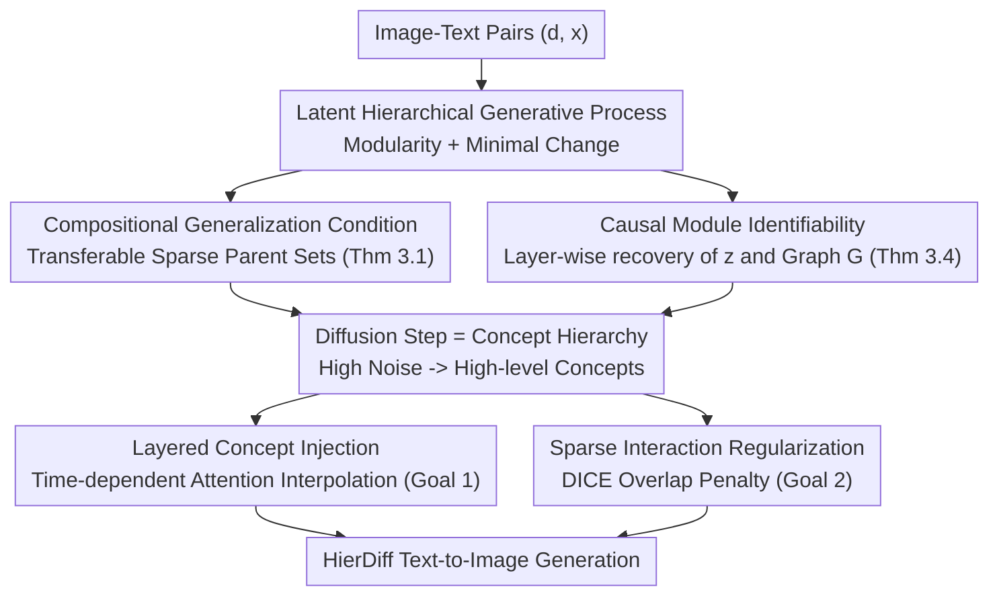

# Learning by Analogy: A Causal Framework for Compositional Generalization

**Conference**: CVPR 2026  
**Paper**: [CVF Open Access](https://openaccess.thecvf.com/content/CVPR2026/html/Kong_Learning_by_Analogy_A_Causal_Framework_for_Compositional_Generalization_CVPR_2026_paper.html)  
**Code**: None  
**Area**: Self-supervised / Causal Representation Learning / Diffusion Models  
**Keywords**: Compositional Generalization, Causal Modularity, Latent Hierarchical Models, Identifiability, Text-to-Image Diffusion

## TL;DR
This paper formalizes "compositional generalization by analogy"—a form of human cognition—into a latent hierarchical generative process using causal language (modularity + principle of minimal change). It proves that this structure supports compositional generalization for complex conceptual interactions and can be identifiably recovered from image-text pairs. Based on this, it interprets diffusion timesteps as conceptual hierarchies to develop HierDiff, which improves performance on DPG-Bench from ELLA's 74.91 to 79.28.

## Background & Motivation
**Background**: Compositional generalization—recombining learned concepts into new combinations never seen during training (e.g., generating "a peacock eating rice" after seeing only "peacock" and "rice")—is considered a hallmark of human intelligence and a frequent failure point for text-to-image models. Recently, causal representation learning has begun seeking "provable" conditions for it.

**Limitations of Prior Work**: Existing provable frameworks impose overly strong assumptions on how concepts interact. One class of work (Brady et al., Wiedemer et al.) assumes different concepts act on non-overlapping pixel regions without interaction; Lachapelle et al. assume concepts are **additively** superimposed in pixel space $x:=\sum_i g_i(z_i)$; Brady et al. subsequently relaxed this to second-order polynomials. None of these parametric forms can characterize complex non-parametric interactions such as "beak & rice" learned and transferred in the real world.

**Key Challenge**: The true difficulty of compositional generalization lies not in "which concepts were learned," but in whether the **sparse structure of causal interactions** between concepts is correctly modeled and identifiably recovered. Additive/polynomial assumptions both lose conceptual hierarchy and lock interactions into fixed functional forms.

**Goal**: (1) Identify what latent structure in the data generation process enables compositional generalization; (2) Prove this structure can be uniquely recovered (identifiable) from observable image-text pairs; (3) Implement a functional diffusion model based on this abstract theory.

**Key Insight**: Drawing from human "analogical reasoning"—one might not have seen a peacock eating rice, but can associate it with "a chicken eating rice," as peacocks and chickens share low-level concepts like beaks and wings, and the interaction module "beak & rice = pecking" can be transferred from the chicken to the peacock. This corresponds to two principles in causality: **Modularity** (systems can be decomposed into autonomous, transferable modules) and **Minimal Change** (high-level concepts differ only in a few low-level concepts).

**Core Idea**: Utilize a latent hierarchical causal model to simultaneously encode "concept hierarchy" and "interaction modules." It is proven that *sparse hierarchical structure $\Rightarrow$ compositional generalization* and *the structure is identifiable*. The diffusion denoising chain is then implemented as this hierarchical process.

## Method

### Overall Architecture
This paper follows a two-part "theory + implementation" structure. On the theoretical side, it defines a latent hierarchical data generation process: text description $d$ (discrete, controlling whether "peacock/rice" appears) $\to$ high-level concepts $z_1$ $\to$ layer-by-layer continuous latent concepts $z_2, \dots, z_L$ (beak, tail, "beak & rice", etc.) $\to$ image $x$. The whole is a Markov chain $d \to z_1 \to \cdots \to z_L \to x$, where each non-root variable $v:=g_v(\mathrm{Pa}(v), \epsilon_v)$ is generated from parent nodes plus independent exogenous noise. Two core theorems are presented: the composition condition (Thm 3.1, when new combinations can be generated) and causal module identification (Thm 3.4, whether this latent structure can be uniquely recovered from $p(d,x)$).

On the implementation side, abstract "levels" are mapped to diffusion timesteps: high noise steps ($t$ is large) $\to$ only high-level concepts are retained; low noise steps $\to$ low-level details are injected. This leads to HierDiff, which involves two components: step-wise injection of concepts at different granularities (time-dependent cross-attention interpolation) and applying sparse regularization to low-level concept attention maps.

### Key Designs

**1. Latent Hierarchical Generative Process: Embedding "Hierarchy + Modular Interaction" into Data Assumptions**

Addressing the pain point where additive/polynomial assumptions discard hierarchy and complex interactions, this work no longer assumes images are obtained by **pixel addition** of concepts. Instead, it defines a causal graph $G:=(V,E)$ where $V:=d \cup z \cup x$ and variables are arranged by layers $z:=[z_1, \dots, z_L]$. Text $d$ directly determines high-level concepts $z_1$ ($d_i=0$ indicates concept absence, corresponding to a degenerate distribution; different non-zero values represent variants of the same concept), and remaining variables are generated layer-by-layer via $v:=g_v(\mathrm{Pa}(v), \epsilon_v)$. Crucially, **low-level modules can be shared across multiple high-level concepts** (e.g., "beak" is a child of both "peacock" and "chicken"), and interactions like "beak & rice" are modeled as a **non-parametric** transferable module $g_z$. This preserves conceptual hierarchy without locking interactions into additive or polynomial forms, enabling the expression of real interactions like "pecking."

**2. Compositional Conditions and Sparsity: When New Combinations Can Be Generated**

Addressing "when extrapolation to combinations not seen in training is possible," Thm 3.1 provides a necessary and sufficient condition: a discrete combination $d$ is composable ($d \in \Omega_{\text{comp}}$) if and only if for every continuous latent variable $z$, the support of its parent nodes under $d$ is covered by some combination $\tilde d \in \Omega_{\text{supp}}$ from the **training support**, i.e., $\mathrm{supp}(\mathrm{Pa}(z)|d) \subseteq \mathrm{supp}(\mathrm{Pa}(z)|\tilde d)$. The intuition is: as long as the required inputs for every latent variable have been seen in some training sample (where $\tilde d$ can vary for different $z$), one can take "beak & rice" from "chicken eating rice" and "colorful tail" from "peacock" to assemble a new combination—this is the formalization of analogy. This implies **sparsity is key**: the smaller the parent set $\mathrm{Pa}(z)$, the easier it is to find a $\tilde d$ in the training support that covers it. Thus, sparser graphs lead to stronger compositional capabilities. The principle of minimal change further ensures high-level concepts differ only on a few modules, requiring fewer module transfers and making composition more feasible. This insight provides a theoretical basis for "encouraging sparsity during training."

**3. Causal Module Identifiability: Unique Recovery of Hierarchical Structures from Image-Text Pairs**

Proving "sparse hierarchies can generalize" is insufficient; they must be learnable from data, otherwise models might learn entangled, non-modular representations. Thm 3.4 proves, under a set of identification conditions (Condition 3.3: invertibility, density smoothness, layer-wise conditional independence $p(z_{l+1}|z_l)=\prod_n p(z_{l+1,n}|z_l)$, and "sufficient diversity"—for each $z_{l+1}$ there exist $2n(z_{l+1})+1$ values of $z_l$ such that the vector differences composed of first/second-order log-density derivatives in Eq (2) are linearly independent), that the latent variables $z_l$ and graph structure $G$ can be **identified component-wise** (each $\hat z_i=h_i(z_{\pi(i)})$ contains information about only a single true concept), up to permutations within each layer. The proof strategy is top-down: first identify $z_1$ using text $d$ as a source of variation, then identify its children $z_2$ using the identified $z_1$, and so on. Compared to Kong et al., who only achieved "subspace identifiability" (where multiple concepts in the same layer are mixed into a single subspace, destroying transferability), this work leverages non-trivial interactions between latents (Condition 3.3-iv) to achieve identification at the **individual concept level**, which is critical for compositional generalization.

**4. HierDiff: Diffusion Steps as Hierarchy + Layered Injection + Sparse Regularization**

How is the theory implemented? This work treats the diffusion model $\{f_t\}_{t=1}^T$ as a family of models where high noise steps ($t$ large) retain only high-level concepts and low noise steps inject low-level details. Thus, the "timestep $\longleftrightarrow$ concept hierarchy" alignment is natural (corresponding to the hierarchical process in Eq.1). On top of this, two things are done. **Goal 1: Layered Concept Injection**: An LLM first decomposes a high-level description $y$ ("peacock eating rice") into $M$ low-level local descriptions $\{y_0^{(m)}\}$. The global cross-attention $A_{T-1}=\mathrm{XAttn}(x_t, u)$ and the mean of low-level attention maps are interpolated step-wise:
$$A_t=(1-s(t))\cdot A_{T-1}+\frac{s(t)}{M}\sum_{m=1}^{M}A_0^{(m)},$$
where $s(t)$ is monotonically decreasing with $s(0)=1, s(T-1)=0$ (experimentally $s(t)=\cos(\pi t/2(T-1))$), allowing the granularity of injected information to transition smoothly from coarse to fine as diffusion steps progress. **Goal 2: Sparse Interaction Regularization**: A DICE loss is used to penalize spatial overlap between low-level concept attention maps:
$$\mathcal L_n=\sum_{m\neq n}D\big(H_0^{(m)},H_0^{(n)}\big),\quad D(H_1,H_2)=\frac{2\,\mathrm{tr}(H_1H_2)}{\|H_1\|_1+\|H_2\|_1},$$
representing a practical proxy for the "sparse parent set" in Thm 3.1. The total objective is $\mathcal L=\mathcal L_d+\lambda\mathcal L_n$ ($\mathcal L_d$ is the diffusion ELBO, $\lambda=10^{-4}$, $M=3$).

## Key Experimental Results

### Main Results
The baseline HierDiff is fine-tuned from Stable Diffusion v1.5, with the CLIP text encoder replaced by a frozen FLAN-T5-xl. It is trained on the LayoutSAM dataset and evaluated on DPG-Bench (1065 multi-concept prompts, five dimensional metrics), with results averaged over three random seeds.

| Model | DPG Total | Global | Entity | Attribute | Relation | Other |
|------|---------|--------|--------|-----------|----------|-------|
| SD v1.5 | 63.18 | 74.63 | 74.23 | 75.39 | 73.49 | 67.81 |
| PixArt-α | 71.11 | 74.97 | 79.32 | 78.60 | 82.57 | 76.96 |
| Playground v2 | 74.54 | 83.61 | 79.91 | 82.67 | 80.62 | 81.22 |
| ELLA | 74.91 | 84.03 | 84.61 | 83.48 | 84.03 | 80.79 |
| **Ours (HierDiff)** | **79.28** | **85.77** | **85.15** | **86.98** | **86.82** | **87.77** |

HierDiff leads across all five dimensions, with a total score gain of +4.37 over the strongest baseline, ELLA. Qualitatively, for prompts like "a keyboard lying on a beige carpet," only HierDiff correctly renders the "keyboard" concept and its "black/glossy" attributes, while baselines often miss the concept entirely.

Extending the implementation from U-Net to a 4.8 billion parameter Diffusion Transformer (HierDiff-DiT), the DPG reaches 84.9, comparable to large models such as DALLE 3 (83.5), FLUX-schnell (84.8), and SANA-1.5 (84.7), demonstrating the scalability of the framework.

### Ablation Study
Sparse regularization (w/o SR) and time-dependent injection (w/o TD) were sequentially removed. DPG-Bench results (3 seeds):

| Config | Global | Relation | Other | Description |
|------|--------|----------|-------|------|
| w/o TD | 85.15 ± 2.26 | 86.29 ± 1.03 | 85.64 ± 0.90 | No time dependency; retreats to a single global prompt for all steps |
| w/o SR | 83.09 ± 2.49 | 87.14 ± 0.59 | 85.56 ± 0.60 | No sparse regularization |
| **Ours (HierDiff)** | 85.77 ± 1.21 | 86.82 ± 0.86 | **87.77 ± 1.45** | Full model |

### Key Findings
- **Time dependency assists relation understanding**: Without time-dependent injection, the "Relation" dimension drops; the model tends to muddle concepts like "pineapple" and "beer," suggesting that injecting concepts by hierarchy at different steps helps organize multi-concept relations.
- **Sparse regularization assists concept separation**: Without sparsity constraints, the model blurs attention maps for two bottles; adding DICE overlap penalties significantly reduces the overlap area between local prompt attention maps, enabling individual control over each concept.
- **Theory-Practice Alignment**: The authors explicitly map implementation details back to theoretical conditions—the diffusion chain corresponds to the hierarchical process (Cond 3.3-iii), $\mathcal L_n$ corresponds to sparse connectivity (Thm 3.1), time-indexed models provide hierarchy-dependent transformations (Eq.1), and the denoising reconstruction target promotes invertibility (Cond 3.3-i).
- Visualization across steps shows local attention for "chicken" and "rice" gradually focusing from global dispersion to local regions with minimal intersection, validating "decomposition-then-recombination with minimal interference."

## Highlights & Insights
- **Translating "Analogy" into Provable Causal Conditions**: By using modularity and minimal change principles, the paper translates "why humans can imagine unseen combinations" into Thm 3.1—a precise condition regarding parent support coverage—which is far more explanatory than "additive superposition" assumptions.
- **Concept-Level Identifiability**: Unlike previous work achieving only subspace identifiability, this work separates concepts within the same layer using latent interactions. This single-component identification is a prerequisite for compositional transferability and represents a solid theoretical contribution.
- **"Diffusion Steps = Concept Hierarchy" as a Transferable Interface**: Mapping abstract hierarchical structures to timesteps and implementing them via attention interpolation is a network-agnostic approach—useful for both U-Net and 4.8B DiT, and potentially transferable to other conditional generation tasks.
- **DICE Loss for Sparsity**: Converting the theoretical "graph sparsity" into a directly optimizable attention map overlap loss is a clean example of theory-driven engineering.

## Limitations & Future Work
- **Latent Graph Verification**: The authors acknowledge the difficulty of directly verifying the latent causal graph on real-world data; theoretical conditions (like sufficient diversity) are assumptions on data distribution that are primarily supported indirectly by HierDiff's empirical performance.
- **Dependency on LLM for Decomposing Local Descriptions**: Testing relies on QWEN-v2.5 to generate local text. Although the authors state it can be replaced by simple heuristics with similar performance, decomposition quality remains a potential risk.
- **Fixed Number of Low-Level Concepts**: Experiments use $M=3$ local concepts; whether this is sufficient for concept-dense scenes and how to adaptively select $M$ is not fully discussed.
- Evaluation is primarily on the DPG-Bench benchmark; robustness across different benchmarks and styles requires further verification.

## Related Work & Insights
- **vs. Additive/Polynomial Composition (Lachapelle, Brady et al.)**: These assume concepts are additively superimposed or interact via second-order polynomials in pixel space. Ours models arbitrary complex interactions (e.g., "beak & rice") using non-parametric modules $g_z$, offering greater expressivity; additive/non-interaction assumptions are special cases of this framework.
- **vs. Subspace Identifiability (Kong et al.)**: They only guarantee subspace identifiability in non-linear hierarchical models, where multiple concepts in the same layer are mixed. Ours leverages latent interactions to achieve component-wise identification and full graph recovery, providing better transferability.
- **vs. ELLA / Global Prompt Diffusion**: ELLA and others feed a single global text condition to all diffusion steps. HierDiff injects different granularities of concepts per step with sparse constraints, proving more stable for complex prompts with multiple concepts and relations, outperforming ELLA by ~4.4 on DPG total.

## Rating
- Novelty: ⭐⭐⭐⭐⭐ Formulating analogical cognition as an identifiable latent hierarchical causal model and providing precise conditions for compositional generalization is highly novel.
- Experimental Thoroughness: ⭐⭐⭐⭐ Main experiments on DPG-Bench, ablations, and large-model extensions are fairly complete, though cross-benchmark validation is limited.
- Writing Quality: ⭐⭐⭐⭐ The alignment from theory to implementation is clear, though notation is dense and some derivations require referring to the appendix.
- Value: ⭐⭐⭐⭐⭐ Provides both a provable theoretical framework for compositional generalization and a scalable text-to-image method, offering significant dual value.

<!-- RELATED:START -->

## Related Papers

- [\[CVPR 2026\] From Feature Learning to Spectral Basis Learning: A Unifying and Flexible Framework for Efficient and Robust Shape Matching](from_feature_learning_to_spectral_basis_learning_a_unifying_and_flexible_framewo.md)
- [\[ICML 2026\] Statistical Consistency and Generalization of Contrastive Representation Learning](../../ICML2026/self_supervised/statistical_consistency_and_generalization_of_contrastive_representation_learnin.md)
- [\[CVPR 2026\] MemFlow: A Lightweight Forward Memorizing Framework for Quick Domain Adaptive Feature Mapping](memflow_a_lightweight_forward_memorizing_framework_for_quick_domain_adaptive_fea.md)
- [\[ICML 2026\] A Refined Generalization Analysis for Extreme Multi-class Supervised Contrastive Representation Learning](../../ICML2026/self_supervised/a_refined_generalization_analysis_for_extreme_multi-class_supervised_contrastive.md)
- [\[AAAI 2026\] HiLoMix: Robust High- and Low-Frequency Graph Learning Framework for Mixing Address Association](../../AAAI2026/self_supervised/hilomix_robust_high-_and_low-frequency_graph_learning_framework_for_mixing_addre.md)

<!-- RELATED:END -->
