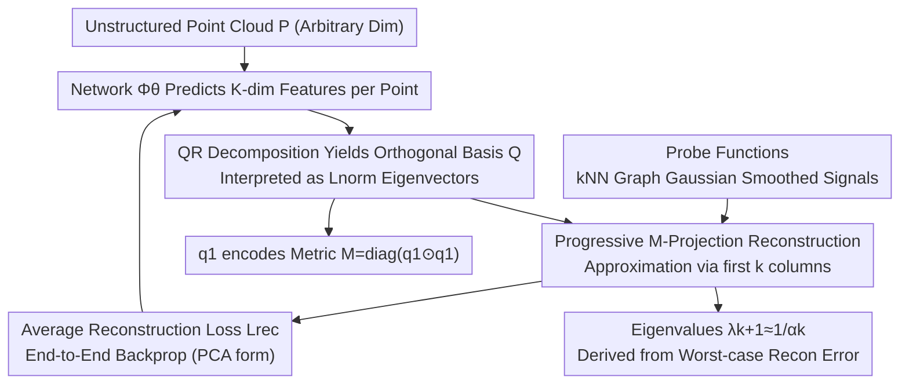

# Learning Eigenstructures of Unstructured Data Manifolds

**Conference**: CVPR 2026  
**Paper**: [CVF Open Access](https://openaccess.thecvf.com/content/CVPR2026/html/Velich_Learning_Eigenstructures_of_Unstructured_Data_Manifolds_CVPR_2026_paper.html)  
**Code**: https://github.com/royvelich/learning-eigenstructures  
**Area**: Self-supervised / Geometric Processing / Manifold Learning / Spectral Methods  
**Keywords**: Spectral Basis, Laplacian Operator, Optimal Approximation Theory, Point Clouds, Manifold Learning

## TL;DR
This paper moves away from the traditional "select operator, discretize, then decompose" pipeline. Instead, it uses a neural network to directly learn spectral bases from unstructured data of arbitrary dimensions (point clouds, image manifolds). Rooted in optimal approximation theory, the network simultaneously recovers spectral bases, implicit metrics (sampling density), and eigenvalues by minimizing the reconstruction error of probe functions, approximating the cotangent Laplacian oracle on 3D surfaces while scaling to high-dimensional image manifolds.

## Background & Motivation
**Background**: A core pillar of geometric processing involves defining operators on manifolds (e.g., Laplace-Beltrami Operator (LBO), Hamiltonian, Bi-harmonic) and using their **spectral decomposition** (eigenvalues/eigenvectors) for downstream tasks such as filtering, diffusion, functional maps, and feature descriptors. In practice, the community rarely uses the operator matrix directly, relying instead on its first few eigenvectors.

**Limitations of Prior Work**: The standard workflow follows "choose a discrete approximation (PSD/symmetric/consistent) $\to$ explicitly construct a discrete operator matrix $\to$ solve the generalized eigenvalue problem." This pipeline works for 3D meshes but (1) relies on high-quality triangulation (cotangent weights require Delaunay meshes to avoid violating the maximum principle), whereas point clouds require complex robust remeshing; (2) **fails to scale elegantly to high-dimensional manifolds**, where one must resort to graph Laplacians that are highly sensitive to connectivity and local density, deviating from smooth LBO behavior.

**Key Challenge**: Each step—selection, discretization, and decomposition—introduces strong assumptions and numerical sensitivity regarding data structure (mesh, dimension, metric). Generalizing the LBO reliably to high dimensions remains a fundamental difficulty.

**Goal**: Skip the "operator selection + matrix construction + solver tuning" steps and directly learn the spectral decomposition from data, ensuring the learned basis **implicitly** corresponds to an operator without assuming specific mesh structures or manifold dimensions.

**Key Insight**: Based on optimal approximation theory, the "optimal orthogonal basis" for a signal class corresponds exactly to the eigenvectors of an SPD operator. Conversely, if a network learns a basis that optimally approximates a class of probe functions, that basis is implicitly the eigenbasis of some operator. Selecting the operator is thus transformed into selecting a **probe function distribution**, which is easier to define (e.g., Gaussian-smoothed random functions on a kNN graph) than discretizing operators, especially in high dimensions.

**Core Idea**: A network predicts features for each point, which are QR-orthogonalized to obtain a basis $Q$. This is interpreted as the eigenvectors of a normalized Laplacian $L_{\text{norm}}$. The network is trained end-to-end to minimize the progressive reconstruction error of probe functions. The first eigenvector naturally encodes the metric, and eigenvalues are derived from the worst-case reconstruction errors.

## Method

### Overall Architecture
The method is built upon two dual theorems from optimal approximation theory: Min-Max optimality (Thm 3.1) states that for the signal class $\mathcal C_L=\{f:\|f\|_L\le1\}$, the optimal $k$-term orthogonal approximation basis consists uniquely of the eigenvectors of the SPD operator $L$. Operator-Bounded PCA (Thm 3.2) states that PCA on uniformly distributed signals over $\mathcal C_L$ yields the same basis. The pipeline is: Network $\Phi_\theta:\mathbb R^{n\times d}\to\mathbb R^{n\times K}$ predicts $K$ features $\to$ QR decomposition yields orthogonal basis $Q=[q_1,\dots,q_K]$ interpreted as the first $K$ eigenvectors of $L_{\text{norm}}$; a batch of Gaussian-smoothed random probe functions is used for progressive reconstruction, with the average error as the sole loss. After training, eigenvalues, metrics, and implicit operators can be inferred from the basis.

### Key Designs

**1. Transforming "Spectral Basis" into a Learnable Reconstruction Objective**

To address the need for explicit operator construction, this work approximates the **basis** directly. Thm 3.1 states that for any SPD operator $L$, the orthogonal basis $b$ that minimizes the progressive $k$-term error
$$\alpha_k=\min_{b}\max_{\|f\|_L\le1}\Big\|f-\sum_{i=1}^k\langle f,b_i\rangle b_i\Big\|^2$$
is uniquely the set of eigenvectors of $L$ (ordered by eigenvalues), where $\alpha_k=1/\lambda_{k+1}$. Finding the "optimal reconstruction basis" is equivalent to finding the eigenbasis, turning eigendecomposition into a differentiable problem. The choice of operator is defined by the probe signal class $\mathcal C_L$.

**2. Metric Encoding via the First Eigenvector**

In high dimensions, estimating the mass matrix is difficult. By interpreting $Q$ as eigenvectors of a normalized Laplacian $L_{\text{norm}}=M^{-1/2}SM^{-1/2}$, the null space is $M^{1/2}\mathbf 1$. Thus, the first eigenvector $q_1\propto M^{1/2}\mathbf 1$ **directly encodes the sampling density weights**. The network learns the metric $M=\mathrm{diag}(q_1\odot q_1)$ for free, ensuring geometric consistency without additional modules. Unnormalized bases can be retrieved via $v_i=M^{-1/2}q_i$.

**3. Implicit Operators via Probe Functions and Progressive Loss**

Operator selection is offloaded to the **probe function distribution**. To approximate the LBO, probes should be smooth functions with bounded Dirichlet energy (since $\|\nabla f\|^2=\|f\|_\Delta$). On point clouds, gradients are hard to compute, so the authors use random signals smoothed with Gaussian kernels on kNN graphs. Training uses an equivalent PCA formulation (Thm 3.2):
$$\mathcal L_{\text{rec}}=\frac1{mK}\sum_{i=1}^m\sum_{k=1}^k\big\|f^{(i)}-f^{(i)}_{\text{proj},k}\big\|_2^2,$$
where $f^{(i)}_{\text{proj},k}$ is the M-weighted projection of the $i$-th probe onto the first $k$ bases. Different probe families (piecewise constant, smooth polynomials) correspond to different operators.

**4. Eigenvalues from Worst-Case Reconstruction Error**

Given $\alpha_k=1/\lambda_{k+1}$, eigenvalues are estimated during inference as $\lambda_{k+1}\approx 1/\max_i\|f^{(i)}-f^{(i)}_{\text{proj},k}\|_2^2$. This requires no extra parameters and no separate eigenvalue solver. The implicit operator $Q_K\Lambda_K Q_K^\top$ can be reconstructed if necessary but is rarely needed in practice.

### Loss & Training
The sole training objective is the average progressive reconstruction loss $\mathcal L_{\text{rec}}$ (Eq. 1). The forward pass involves: generating $m$ probes $\to$ $\Phi_\theta(P)$ forward pass $\to$ QR decomposition to get $Q$ $\to$ projecting probes onto the first $k$ columns using an M-weighted scheme and accumulating errors. $\Phi_\theta$ is a small MLP for single-shape overfitting or a Transformer for generalization.

## Key Experimental Results

### Main Results
On 3D surfaces, the learned bases are compared against the "oracle cotangent Laplacian" (computed with true mesh connectivity). Metrics include average cosine similarity (higher is better) and eigenvalue relative error.

| Shape | $k\le10$ | $k\le20$ | $k\le50$ | $\lambda$ Relative Error |
|------|----------|----------|----------|--------------------|
| Armadillo | 0.968 | 0.967 | 0.773 | 0.200 ± 0.126 |
| Bimba | 0.964 | 0.945 | 0.822 | 0.093 ± 0.145 |
| Botijo | 0.972 | 0.955 | 0.813 | 0.153 ± 0.092 |
| Kitten | 0.993 | 0.988 | 0.981 | 0.088 ± 1.04 |
| Lion | 0.951 | 0.908 | 0.822 | 0.067 ± 0.086 |
| Laurent Hand | 0.823 | 0.696 | 0.568 | 0.066 ± 0.078 |

Despite being unsupervised and mesh-free, low-frequency eigenvectors show cosine similarities near 1.0. Interestingly, for some shapes, the learned bases provide **better information compression** than the oracle when reconstructing xyz coordinates using $k$ terms.

### Manifold Learning
Images are treated as points on a manifold using DINOv2/CLIP features ($d=768/512$). **Optimal-Approximation Eigenmaps** (learned spectral bases) are compared against PCA, Isomap, Laplacian Eigenmaps, t-SNE, and UMAP on datasets like STL10 and CIFAR100.

| Setting | Evaluation | Key Findings |
|------|---------|---------|
| 1D Toy [0,1] | Basis visualization | Recovers Fourier-like harmonics (constant $v_1$), confirming Laplacian-like spectra. |
| 3D Surfaces | vs. Oracle Cotan LBO | High alignment in bases and eigenvalues. |
| Surface $\to$ Volume | Generalization | Generalizes to unseen shapes and volumetric manifolds with slight precision drop. |
| High-dim Images | NMI / ARI Clustering | Embedding quality is comparable or superior to baselines, significantly outperforming Laplacian Eigenmaps. |

### Key Findings
- **Unsupervised Approximation matches Oracles**: The optimal approximation objective recovers the cotangent LBO structure without mesh connectivity.
- **Metric Emergence**: Area weights $M$ estimated from $q_1$ align with geometric intuition, proving the metric is "free."
- **Superior to Graph Laplacians**: In high dimensions, the method outperforms standard Laplacian Eigenmaps, suggesting learned implicit operators are more robust than graph-based ones.
- **Operator Flexibility**: Changing probe families allows learning spectra for non-LBO operators (e.g., Schrödinger operators with potentials $V(x)$).

## Highlights & Insights
- **Unified Pipeline**: Replaces selection, discretization, and decomposition with a single end-to-end reconstruction objective.
- **Intrinsic Metric**: Using the normalized Laplacian form allows $q_1$ to encode the mass matrix, eliminating the need for separate density estimation.
- **Eigenvalues from Error**: The $\lambda_{k+1}=1/\alpha_k$ relationship provides a theoretically elegant way to extract eigenvalues without parameters.
- **Trade-off Shift**: Generating simple probe families in high dimensions is easier than reliable operator discretization.

## Limitations & Future Work
- **High-Frequency Accuracy**: Bases for large $k$ sometimes deviate from the oracle in overfitting scenarios. Generalization models still show lower precision than overfitted ones.
- **Probe Distribution Slack**: kNN Gaussian smoothing is only a loose approximation of the constrained Laplacian distribution; the gap between implicit and target LBOs lacks quantitative characterization.
- **Feature Dependence**: High-dimensional results rely on pre-trained embedding spaces (DINOv2/CLIP) and kNN distance metrics.
- Downstream tasks like shape matching or descriptors have yet to be fully evaluated against specialized end-to-end models.

## Related Work & Insights
- **vs. Cotangent/Robust Laplacian**: Standard methods require meshes and struggle with point clouds or higher dimensions; Ours learns bases from points that match the oracle.
- **vs. Graph Laplacian**: Graph methods are density-sensitive; Ours provides smoother, more robust embeddings for manifold learning.
- **vs. Neural Eigenfunctions**: Previous methods often require explicit domain parameterization or retuning for every domain; Ours consumes point clouds directly and generalizes across shapes.
- **vs. Matrix Learning**: Most prior work still constructs matrices and uses solvers; Ours bypasses matrix construction entirely.

## Rating
- Novelty: ⭐⭐⭐⭐⭐ Replacing the spectral pipeline with an end-to-end basis learning objective is highly innovative.
- Experimental Thoroughness: ⭐⭐⭐⭐ Broad coverage from 1D to high-dim images, though downstream geometric tasks are less explored.
- Writing Quality: ⭐⭐⭐⭐ Clear theoretical derivation, though requires a strong background in spectral geometry.
- Value: ⭐⭐⭐⭐⭐ Provides a scalable, operator-free paradigm for spectral analysis of unstructured data.

<!-- RELATED:START -->

## Related Papers

- [\[NeurIPS 2025\] Manifolds and Modules: How Function Develops in a Neural Foundation Model](../../NeurIPS2025/self_supervised/manifolds_and_modules_how_function_develops_in_a_neural_foundation_model.md)
- [\[ICLR 2026\] Equivariant Splitting: Self-supervised learning from incomplete data](../../ICLR2026/self_supervised/equivariant_splitting_self-supervised_learning_from_incomplete_data.md)
- [\[ICML 2026\] Data Augmentation of Contrastive Learning is Estimating Positive-incentive Noise](../../ICML2026/self_supervised/data_augmentation_of_contrastive_learning_is_estimating_positive-incentive_noise.md)
- [\[ICML 2026\] Towards One-for-All Anomaly Detection for Tabular Data](../../ICML2026/self_supervised/towards_one-for-all_anomaly_detection_for_tabular_data.md)
- [\[ICLR 2026\] AutoDV: An End-to-End Deep Learning Model for High-Dimensional Data Visualization](../../ICLR2026/self_supervised/autodv_an_end-to-end_deep_learning_model_for_high-dimensional_data_visualization.md)

<!-- RELATED:END -->
