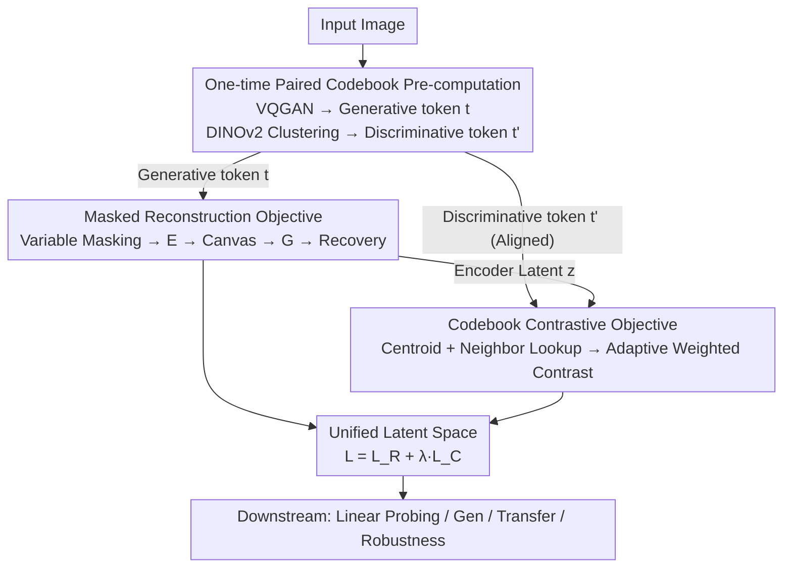

# Learning from Semantic Dictionaries: Discriminative Codebook Contrastive Learning for Unified Visual Representation and Generation

**Conference**: CVPR 2026  
**Paper**: [CVF Open Access](https://openaccess.thecvf.com/content/CVPR2026/html/Estepa_Learning_from_Semantic_Dictionaries_Discriminative_Codebook_Contrastive_Learning_for_Unified_CVPR_2026_paper.html)  
**Code**: https://github.com/ImaGonEs/LEASE  

**Area**: Self-Supervised Learning / Unified Visual Representation and Generation  
**Keywords**: Self-Supervised Learning, Codebook Contrastive, Unified Representation, Masked Reconstruction, VQGAN

## TL;DR
LEASE utilizes a pair of "Generative Codebook + Discriminative Codebook" to encode images offline into two aligned sequences of discrete tokens. A single encoder is then trained using both "Masked Reconstruction" and "Codebook Contrastive" objectives. This allows the same latent space to achieve both high-quality generation and strong discriminative power—without data augmentation, online tokenizers, or distilling frozen teacher models. It achieves a new SoTA in unified SSL on ImageNet-1K, with training speeds 48.7% faster than MAGE and 8.75% faster than Sorcen.

## Background & Motivation

**Background**: Self-supervised pre-training in computer vision has long been divided into two paths. Discriminative methods (SimCLR, MoCo, DINO, MAE, etc.) learn features suitable for "understanding" tasks like classification and retrieval; generative methods (VQGAN, Diffusion Models, MaskGIT) excel at "drawing" images. Recently, "Unified SSL" approaches like MAGE and Sorcen have attempted to perform both tasks using a single model by discretizing images via VQGAN and reconstructing them.

**Limitations of Prior Work**: While unified methods follow a promising direction, they incur high costs. MAGE requires an **online tokenizer** during training, necessitating a quantization step at every iteration, which is computationally expensive. Sorcen alleviates this by pre-computing inputs but introduces a **dual-encoder** architecture, requiring an additional forward pass to calculate contrastive objectives. Other methods like REPA, VFMTok, MergeVQ, and SVG rely on **distilling frozen VFMs (e.g., DINOv2)** as teachers, requiring heavy models to remain active during training, which limits efficiency.

**Key Challenge**: Discriminative and generative representations are inherently **semantically misaligned**. Generative tokens focus on fine-grained appearance ("what this pixel looks like"), while discriminative features focus on high-level semantics ("what concept this is"). These do not share the same semantic coordinate system. Existing methods either sacrifice one for the other (e.g., MAGE-C improves discrimination with a contrastive objective but loses generation quality) or rely on massive computation (online tokenizers / dual encoders / frozen teachers) to force both signals into one model.

**Goal**: To develop a lightweight framework using a **single encoder and a single forward pass** that reconciles generative and discriminative semantics without relying on augmentations, online quantization, or external teachers.

**Key Insight**: The authors observe that discriminative semantics can be "dictionarized." By clustering the feature space of a self-supervised VFM into $K$ centroids, each centroid becomes a "semantic concept word," and the set of centroids forms a **discriminative semantic codebook**. Similarly, VQGAN provides a **generative codebook**. Since every patch of an image can find a corresponding word in both codebooks, they can be **aligned positionally**. Discriminative words act as "positive samples" for generative words, enabling contrastive learning directly in the discrete token space without online encoding or a second network.

**Core Idea**: Use a pair of position-aligned "Generative + Discriminative Codebooks" to pre-compute data into discrete tokens once. Then, train a single encoder with a dual objective: "Masked Token Reconstruction (for generation) + Codebook Contrastive (for discrimination)" to unify both semantics in a single latent space.

## Method

### Overall Architecture
LEASE consists of a Transformer encoder $E$ and a decoder $G$. Unlike standard MIM which operates on pixels, LEASE **operates directly on discrete tokens**. Before training, a one-time pre-computation is performed: a **generative codebook** (an unsupervised VQGAN) encodes images into generative token sequences $t=(t_1,\dots,t_{SS})$, and a **discriminative codebook** (formed by $K$ centroids from k-means on DINOv2 features) encodes the same images into discriminative sequences $t'$. These sequences are **position-aligned**: the $i$-th token in $t$ and $t'$ correspond to the same patch. $t$ serves as the actual input, while $t'$ provides discriminative labels/positive samples for each generative token.

During training, two objectives run in parallel: **Masked Reconstruction**, where $t$ is heavily masked and fed into $E$, with $G$ restoring the masked tokens; and **Codebook Contrastive**, which pushes the encoder's latent vectors closer to their corresponding discriminative centroids (and neighbors) and farther from other centroids in the codebook. The total loss is $L_{\text{LEASE}}=L_R+\lambda L_C$. This process requires only one forward pass and lightweight codebook lookups, making it fast and independent of external teachers.

### Key Designs

**1. Paired Generative-Discriminative Codebooks + One-time Pre-computation: Aligning Semantics into Discrete Tokens**

This design directly addresses semantic misalignment and computational waste. Instead of calculating alignment online, LEASE "dictionarizes" both semantics. The generative codebook (pre-trained VQGAN) quantizes patches into tokens $t_i\in[0,v_{max}]$ favoring fine-grained reconstruction. The discriminative codebook (k-means centroids $C$ of DINOv2 features) represents semantic concepts. Because tokens are **position-aligned**, a chain $e_i \to t_i \to t'_i \to C_{t'_i}$ allows the model to instantly retrieve discriminative positive samples for every generative token. Efficiency is gained by pre-computing the entire dataset once, eliminating online quantization overhead.

**2. Masked Token Reconstruction: Learning Fine-grained Generative Semantics in Discrete Space**

This branch handles the generative aspect. LEASE employs a **variable mask ratio** (fluctuating between 50%–100%, average 69%) to balance generation and representation. Masked tokens are represented by an out-of-vocabulary `[MASK]` integer, with a `[CLS]` token prepended. To save memory, masked tokens are discarded, keeping only half the sequence length. Reconstruction is modeled as **discrete token prediction**, where the encoder projects masked sequences to a latent space, and the decoder $G$ predicts original tokens $t$ based on a "canvas" initialized by the latent vectors. The loss is cross-entropy on masked positions:

$$L_R = -\mathbb{E}_{t\sim D}\left[\sum_{i=1}^{CS} m_i \log p(t_i \mid cv_i)\right]$$

**3. Codebook Contrastive + Adaptive Centroid Weighting: Learning Stable Discriminative Semantics**

This is the core innovation. Unlike standard contrastive learning (e.g., InfoNCE) where negatives are sampled from the batch, LEASE **pulls positive and negative samples directly from the discriminative codebook**. For each input token, the model finds its discriminative centroid $C_{t'_i}$ and retrieves the $K_{sel}$ most similar **neighboring centroids** $N_{t'_i}$ using cosine similarity. Since neighbors vary in similarity, **adaptive weighting** is introduced:

$$w_{ij} = \frac{\exp(sim_{ij}/\tau)}{\sum_{k\in C_{t'_i}\cup N_{t'_i}}\exp(sim_{ik}/\tau)}$$

The codebook contrastive loss is calculated only on unmasked tokens:

$$L_C = -\frac{1}{N_u}\sum_{i\in U}\sum_{j\in C_{t'_i}\cup N_{t'_i}} w_{ij}\log\frac{\exp(z_i^\top C_j/\alpha)}{\sum_{k=1}^{K}\exp(z_i^\top C_k/\alpha)}$$

Negative samples are all remaining centroids in the codebook, which effectively removes batch-dependent noise. Ablations show this objective must be applied to the **encoder** latent space to achieve unification.

### Loss & Training
The total objective is $L_{\text{LEASE}}=L_R+\lambda L_C$. The architecture uses ViT-Base. The generative codebook is from an unsupervised VQGAN, and the discriminative codebook is derived from DINOv2. The model is pre-trained on ImageNet-1K for 1600 epochs. For conditional generation, the encoder is frozen and the decoder is fine-tuned with a CLIP class embedding.

## Key Experimental Results

### Main Results

Evaluations on ImageNet-1K (Linear Probing LP% for discrimination, FID/IS for generation). LEASE leads among VQGAN-based unified models:

| Method | Category | LP% | FID↓ | IS↑ |
|------|------|-----|------|-----|
| ADDP | Gen | 11.5 | **8.9** | 95.32 |
| MAGE-C | Contrastive | **78.2** | 31.8 | 37.40 |
| MAE | MIM | 68.0 | - | - |
| Sorcen | Unified (VQGAN) | 75.1 | 9.61 | 90.96 |
| MAGE | Unified (VQGAN) | 74.7 | 11.1 | 81.17 |
| **LEASE** | Unified (VQGAN) | 76.7 | 9.62 | **91.78** |

**Key Findings**: LEASE achieves higher LP (76.7%) than Sorcen/MAGE. Its FID (9.62) matches Sorcen and significantly outperforms MAGE. Efficiency-wise, LEASE is **48.7%** faster than MAGE and **8.75%** faster than Sorcen due to its single-forward, lightweight codebook design. Robustness (k-NN on IN-A/C/R) is significantly improved compared to baselines.

### Ablation Study

Impact of components on Linear Probing and Generation (Rec=Reconstruction, DC=Decoder Contrastive, EC=Encoder Contrastive):

| Config | LP% | FID↓ | IS↑ | Note |
|------|-----|------|-----|------|
| Rec Only | 73.62 | 10.62 | 79.59 | Baseline |
| Rec + DC | 74.20 | 10.97 | 78.73 | Contrastive on Decoder: IS drops |
| Rec + EC + DC | 76.07 | 10.36 | 84.33 | Contrastive on both: No extra gain |
| **LEASE (Rec + EC)** | **76.11** | **10.35** | **86.71** | Best performance |

### Key Findings
- **Encoder-side Contrastive is Essential**: Adding contrastive learning to the encoder increases LP (73.62→76.11) and IS (79.59→86.71). Applying it to the decoder harms generation quality.
- **Codebook Source**: DINOv2 provides the strongest discriminative codebook.
- **Scaling Codebook Size**: Increasing from 8K to 16K centroids improves all metrics, as finer patch semantics provide more detailed contrastive signals.

## Highlights & Insights
- **Dictionary-based Semantic Alignment**: Using aligned generative and discriminative codebooks allows zero-cost semantic coupling without augmentations or online encoding.
- **Codebook-level Negatives**: Sampling negatives from the codebook rather than the batch bypasses batch size constraints and sampling noise, leading to more stable features.
- **Unification Locus**: Results empirically prove that unification should occur in the encoder's latent space; injecting discriminative signals into the decoder degrades generative performance.
- **Efficiency through Paradigm Shift**: By using one-time pre-computation and a single forward pass, LEASE eliminates the heavy overhead of online tokenizers and frozen teachers.

## Limitations & Future Work
- **Online Tokenization at Inference**: While training is efficient, inference still requires quantifying images into tokens, maintaining tokenizer overhead. 
- **Hyperparameter Sensitivity**: Parameters like neighbor count $K_{sel}$ and temperature $\tau$ may require tuning for domain-specific data.
- **Dependence on VFM Quality**: The discriminative power is capped by the quality of the VFM (DINOv2) used to build the codebook.

## Related Work & Insights
- **vs. MAGE / Sorcen**: LEASE is faster and more discriminative while maintaining competitive generation quality by avoiding online tokenization or dual encoders.
- **vs. Distillation Methods**: Unlike REPA or MergeVQ, LEASE does not require a frozen teacher model to be active during pre-training, reducing memory and compute.
- **vs. Standard Contrastive**: LEASE replaces batch-based sampling with codebook-based sampling, fundamentally improving the stability of contrastive learning.

## Rating
- Novelty: ⭐⭐⭐⭐
- Experimental Thoroughness: ⭐⭐⭐⭐⭐
- Writing Quality: ⭐⭐⭐⭐
- Value: ⭐⭐⭐⭐

<!-- RELATED:START -->

## Related Papers

- [\[CVPR 2026\] UniGeoCLIP: Unified Geospatial Contrastive Learning](unigeoclip_geospatial_contrastive.md)
- [\[CVPR 2026\] Franca: Nested Matryoshka Clustering for Scalable Visual Representation Learning](franca_nested_matryoshka_clustering_for_scalable_visual_representation_learning.md)
- [\[CVPR 2026\] Exemplar-Free Class Incremental Learning via Preserving Class-Discriminative Structure](exemplar-free_class_incremental_learning_via_preserving_class-discriminative_str.md)
- [\[CVPR 2026\] Global-Graph Guided and Local-Graph Weighted Contrastive Learning for Unified Clustering on Incomplete and Noise Multi-View Data](global-graph_guided_and_local-graph_weighted_contrastive_learning_for_unified_cl.md)
- [\[CVPR 2026\] Exploring Visual Pretraining for Learning Language Intelligence](exploring_visual_pretraining_for_learning_language_intelligence.md)

<!-- RELATED:END -->
