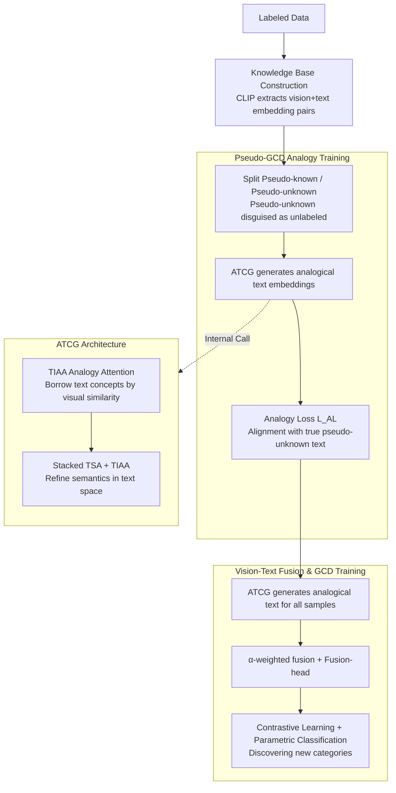

# Learning Like Humans: Analogical Concept Learning for Generalized Category Discovery

**Conference**: CVPR 2026  
**arXiv**: [2603.19918](https://arxiv.org/abs/2603.19918)  
**Code**: [GitHub](https://github.com/zhou-9527/AnaLogical-GCD)  
**Area**: Self-supervised  
**Keywords**: Generalized Category Discovery, Analogical Learning, Vision-Language Models, Cross-modal Reasoning, CLIP

## TL;DR

The AL-GCD framework is proposed, which designs an "Analogical Textual Concept Generator" (ATCG) by simulating the human analogical reasoning mechanism. It analogically generates textual concepts for unknown samples from a vision-language knowledge base of known categories, transforming category discovery into a joint vision-language reasoning task. It achieves an average improvement of 5.0% across six benchmarks and 7.1% on fine-grained datasets.

## Background & Motivation

Generalized Category Discovery (GCD) requires models to recognize known categories while discovering new ones from unlabeled data. Core challenges faced by existing methods:

**Limitations of Purely Visual Pipelines**: Most GCD methods rely solely on visual information, performing poorly on fine-grained datasets (e.g., CUB-200 birds, Stanford Cars)—categories that are visually similar but semantically distinct are difficult to distinguish.

**Loose Coupling of Supervised Learning and Category Discovery**: Annotation information from known categories is not effectively transferred to the discovery process of new categories.

**Lack of Prior Knowledge Transfer Mechanism**: Even with vision-language models like CLIP, existing methods fail to establish an explicit knowledge bridge from the known to the unknown.

The authors draw inspiration from **analogical reasoning in cognitive science**: when humans learn new concepts, they retrieve related concepts from their knowledge base (long-term memory) and construct new concepts through analogical reasoning. For instance, seeing a "BMW Coupe" might trigger associations with "Audi S5 Coupe" (same coupe type) and "BMW X5 SUV" (same BMW brand), enabling rapid understanding of the new category via analogy.

## Method

### Overall Architecture

AL-GCD aims to solve the issue where pure visual GCD cannot distinguish categories that "look similar but differ semantically" in fine-grained datasets. Even with CLIP, textual knowledge of known categories is often not transferred to unknown samples. Its approach is to let the model "analogize" like a human: when encountering an unknown sample, it first finds visually similar concepts from a known category vision-language knowledge base, borrows their textual semantics to "assemble" the textual concept for the current sample, and finally fuses this textual channel with the visual channel for category discovery.

The system consists of a visual encoder $f_v$, a text encoder $f_t$, a fusion module (Fusion-head) $g$, and a core **Analogical Textual Concept Generator (ATCG)** $\varphi_{ATCG}$. Training proceeds in two stages: the first stage builds a knowledge base using labeled data and trains the analogy capability of the ATCG through a "pseudo-GCD" task; the second stage enters real GCD training, where the ATCG generates textual concepts for all unlabeled samples, which are then fused with visual features for contrastive learning and parametric classification.

### Key Designs

**1. Knowledge Base Construction: Storing known vision-text pairs as retrievable "long-term memory"**

To perform analogy, a pool of "experience" is required for retrieval. The authors use pre-trained CLIP to extract image embeddings $\mathbf{v}_i^l = f_v(x_i^l)$ and category name text embeddings $\mathbf{t}_i^l = f_t(\text{text}(y_i^l))$ for each labeled sample, storing them as pairs in a knowledge base $\mathcal{K} = \{(\mathbf{v}_i^l, \mathbf{t}_i^l)\}$. This step corresponds to the process in the human brain where the hippocampus consolidates short-term experience into cortical long-term memory. All subsequent analogies "invoke" visually similar known concepts from this library; thus, the coverage of the knowledge base directly determines how appropriate the borrowed textual semantics are.

**2. Pseudo-GCD and Analogical Training: Using "known to simulate unknown" to create supervision for ATCG**

The most difficult problem is that real unknown categories have no text labels, so how can a module be trained to "generate textual concepts for unknown samples"? The authors use a clever trick: in each training round, known categories $\mathcal{Y}^l$ are randomly split into "pseudo-known" and "pseudo-unknown" halves. $n$ samples from pseudo-unknown categories are disguised as unlabeled data $\mathcal{D}_P^u$, while $m$ labeled samples from pseudo-known categories act as the knowledge base. Using the image embeddings of pseudo-unknown samples as queries, the ATCG analogizes a text embedding from the pseudo-known vision-text pairs:

$$\tilde{\mathbf{t}}_j = \varphi_{ATCG}(\mathbf{v}_j^l, \{\mathbf{v}_i\}_{i \in \mathcal{D}_P^l}, \{\mathbf{t}_i\}_{i \in \mathcal{D}_P^l})$$

The key is that these "pseudo-unknown" samples actually have ground-truth text embeddings $\mathbf{t}_j^l$, allowing for direct supervision of the generation via an analogy loss:

$$\mathcal{L}_{AL} = \frac{1}{n}\sum_{j=1}^n\big(1 - \cos(\tilde{\mathbf{t}}_j, \mathbf{t}_j^l)\big)$$

Essentially, the model repeatedly practices "seeing unfamiliar samples → borrowing known concepts → restoring textual semantics" in a fully supervised environment. When facing actual unknown categories, this analogy capability can be transferred.

**3. ATCG Architecture: Using analogy attention to "borrow concepts" and refine semantics**

The internal mechanism of ATCG must determine how to extract textual concepts from visually similar known samples. The initial layer is the Text-Image Analogy Attention (TIAA): the query is the unlabeled sample's image embedding $\mathbf{v}_j^u$, the keys are the labeled samples' image embeddings $\{\mathbf{v}_i^l\}$, and the values are the corresponding text embeddings $\{\mathbf{t}_i^l\}$. Attention weights based on visual similarity allow the model to "borrow" textual concepts from the most similar known samples. Subsequently, multiple layers of Textual Self-Attention (TSA) + TIAA are stacked for iteration: TIAA consistently aligns with visually similar known concepts, while TSA smooths semantics within the textual space to make the generated embeddings more coherent.

**4. Vision-Text Fusion and GCD Training: Applying analogical textual concepts to classification**

Once the textual channel is established, it must contribute to category discovery. During training, the ATCG generates analogical text embeddings $\tilde{\mathbf{t}}_i$ for all samples (labeled and unlabeled), which are fused with visual embeddings via weight $\alpha$: $\mathbf{h}_i = \alpha \cdot \mathbf{v}_i + (1-\alpha) \cdot \tilde{\mathbf{t}}_i$. These are projected through the Fusion-head to become the final embedding $\mathbf{f}_i = g(\mathbf{h}_i)$, used for contrastive learning and parametric classification. Unlike dual-branch methods such as GET, AL-GCD uses the fused embedding for classification, injecting textual semantics directly into the decision process.

### Mechanism Example

Consider an unlabeled image of a "BMW Coupe". The ATCG first queries the knowledge base using its image embedding, hitting two types of known concepts based on visual similarity: "Audi S5 Coupe" (same coupe type) and "BMW X5 SUV" (same brand). The TIAA layer borrows weighted semantics like "coupe" and "BMW" from these samples. The stacked TSA layers then refine these potentially conflicting semantics (type vs. brand) into a coherent textual concept. After fusing this text embedding with the original visual embedding, the model holds evidence for both "looks like this" and "belongs to this semantic," allowing it to distinguish the "BMW Coupe" from other unlabeled data.

### Loss & Training

- **Representation Learning Loss**:
    - Unsupervised contrastive loss $\mathcal{L}_{rep}^u$: Consistency across augmented views of all samples.
    - Supervised contrastive loss $\mathcal{L}_{rep}^s$: Clustering samples of the same category.
    - $\mathcal{L}_{rep} = (1-\lambda)\mathcal{L}_{rep}^u + \lambda\mathcal{L}_{rep}^s$
- **Parametric Classification Loss**:
    - Initialize category prototypes $\mathcal{C} = \{c_1, ..., c_K\}$.
    - Self-distillation for pseudo-labels: Using sharpened predictions of augmented views as soft labels.
    - $\mathcal{L}_{cls} = (1-\lambda)\mathcal{L}_{cls}^u + \lambda\mathcal{L}_{cls}^s$
- Total Loss: $\mathcal{L} = \mathcal{L}_{rep} + \mathcal{L}_{cls}$

## Key Experimental Results

### Main Results

**Based on SimGCD-CLIP pipeline, known category number K is given**

| Dataset | Metric (All) | SimGCD-CLIP | +AL-GCD | Gain |
| :--- | :--- | :--- | :--- | :--- |
| CUB-200 | Accuracy | 69.6 | **74.7** | +5.1 |
| Stanford Cars | Accuracy | 69.4 | **78.3** | +8.9 |
| FGVC Aircraft | Accuracy | 53.5 | **58.6** | +5.1 |
| CIFAR-100 | Accuracy | 81.1 | **84.7** | +3.6 |
| ImageNet-100 | Accuracy | 89.9 | **92.6** | +2.7 |
| Herbarium19 | Accuracy | 47.9 | **50.3** | +2.4 |

**Average gain across all baselines**

| Metric | Average Gain |
| :--- | :--- |
| All | +7.7 |
| Old (Known) | +5.9 |
| New (Unknown) | +8.6 |

**Comparison with SOTA (K Known)**

| Method | CUB All | Cars All | Aircraft All |
| :--- | :--- | :--- | :--- |
| GET (CVPR 25) | 77.0 | 78.5 | 58.9 |
| SelEx-CLIP + AL-GCD | **84.1** | **79.0** | **66.6** |

### Ablation Study

The authors integrated AL-GCD into three different GCD pipelines (CMS-CLIP, SimGCD-CLIP, SelEx-CLIP), achieving consistent improvements and proving its **plug-and-play** nature.

| Baseline Pipeline | CUB Gain | Cars Gain | Description |
| :--- | :--- | :--- | :--- |
| CMS-CLIP → +AL-GCD | +8.0 | +2.1 | Clustering-based method |
| SimGCD-CLIP → +AL-GCD | +5.1 | +8.9 | Parametric method |
| SelEx-CLIP → +AL-GCD | +9.9 | +10.2 | Largest gain in fine-grained tasks |

### Key Findings

1. **Fine-grained datasets benefit most**: Average gain on CUB, Cars, and Aircraft is 7.1%, far exceeding the 2.5% on general datasets.
2. **Significant improvement on New categories**: The gain for New categories (+8.6) is greater than for Old categories (+5.9), indicating that analogical reasoning effectively assists in discovering new categories.
3. **Strong Generalization**: Effective across DINO and CLIP backbones, as well as parametric and clustering pipelines.
4. **Effective under Unknown K**: CMS-CLIP + AL-GCD still shows a +8.1 gain when K is unknown.

## Highlights & Insights

1. **Elegant Design Inspired by Cognitive Science**: Systematizes the human analogical reasoning process (knowledge retrieval → cross-modal analogy → concept construction) into a trainable neural network module with solid motivation.
2. **Ingenious Pseudo-GCD Training Strategy**: By simulating the "known → unknown" split within known categories, it enables the ATCG to learn analogy under supervised signals, bypassing the lack of ground truth for real unknown categories.
3. **Plug-and-Play Modular Design**: ATCG does not change the overall architecture of the GCD pipeline, merely adding a textual embedding channel, giving it high practical utility.
4. **Correction of Vision-Text Fusion**: Instead of simply concatenating CLIP features, it generates "semantically aligned" textual concepts via analogy, making the fusion more meaningful.

## Limitations & Future Work

1. **Dependency on CLIP Quality**: The quality of text embeddings depends on the CLIP text encoder and the descriptive quality of category names.
2. **Knowledge Base Scale Constraints**: The knowledge base only contains labeled samples; if the gap between known and unknown categories is too large, the analogy may fail.
3. **Increased Computational Overhead**: ATCG requires knowledge base retrieval and attention calculations for each sample, increasing inference costs.
4. **Category Name Dependency**: The definition of text(y) might influence performance, though the paper does not extensively discuss the impact of different text templates.
5. **Lack of Large-scale Exploration**: Experiments were only conducted on small to medium-sized datasets; efficiency in million-category scenarios remains to be verified.

## Related Work & Insights

- **Difference from GET (CVPR 2025)**: GET also uses a dual-branch vision+text design, but final classification depends solely on visual embeddings; AL-GCD uses fused embeddings for classification.
- **Difference from CPT**: CPT adapts CLIP via prompt tuning but lacks a knowledge transfer path from known to unknown.
- **Insight**: The concept of analogical reasoning can be extended to other open-set problems, such as open-vocabulary detection and zero-shot recognition.

## Rating

- **Novelty**: ⭐⭐⭐⭐⭐ — Cognitive science inspiration + pseudo-GCD training + ATCG architecture; highly original.
- **Experimental Thoroughness**: ⭐⭐⭐⭐ — 6 datasets, 3 pipelines, full K known/unknown settings.
- **Writing Quality**: ⭐⭐⭐⭐ — Clear motivation and detailed method description.
- **Value**: ⭐⭐⭐⭐ — Plug-and-play design with good adaptability.

<!-- RELATED:START -->

## Related Papers

- [\[CVPR 2026\] Seeing Through the Shift: Causality-Inspired Robust Generalized Category Discovery](seeing_through_the_shift_causality-inspired_robust_generalized_category_discover.md)
- [\[CVPR 2026\] TAR: Token-Aware Refinement for Fine-grained Generalized Category Discovery](tar_token-aware_refinement_for_fine-grained_generalized_category_discovery.md)
- [\[CVPR 2026\] Decouple Your Discovery and Memory in Continual Generalized Category Discovery](decouple_your_discovery_and_memory_in_continual_generalized_category_discovery.md)
- [\[CVPR 2026\] The Devil Is in Gradient Entanglement: Energy-Aware Gradient Coordinator for Robust Generalized Category Discovery](the_devil_is_in_gradient_entanglement_energy-aware_gradient_coordinator_for_robu.md)
- [\[CVPR 2026\] OmniGCD: Abstracting Generalized Category Discovery for Modality Agnosticism](omnigcd_abstracting_generalized_category_discovery_for_modality_agnosticism.md)

<!-- RELATED:END -->
