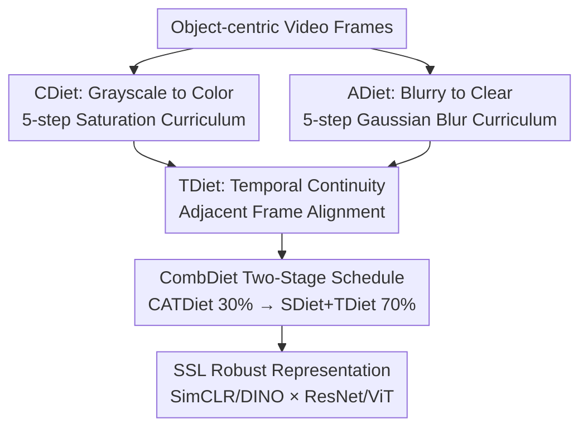

# Learning to See Through a Baby's Eyes: Early Visual Diets Enable Robust Visual Intelligence in Humans and Machines

**Conference**: CVPR 2026  
**Paper**: [CVF Open Access](https://openaccess.thecvf.com/content/CVPR2026/html/Cai_Learning_to_See_Through_a_Babys_Eyes_Early_Visual_Diets_CVPR_2026_paper.html)  
**Code**: Yes (The paper states that code/data/models are open-sourced on GitHub; ⚠️ check the original text for the specific URL)  
**Area**: Self-Supervised Learning / Developmental Psychology Inspired / Robust Visual Representation  
**Keywords**: Self-Supervised Learning, Visual Development, Curriculum Learning, Robustness, Temporal Continuity

## TL;DR
The authors encode three laws of infant visual development—grayscale to color, blurry to clear, and temporal continuity—into a "visual diet" for self-supervised training called CATDiet. Training SSL models solely on object-centric videos yields more robust recognition of corrupted images, shape bias, and depth perception across ten datasets. Furthermore, the models spontaneously demonstrate developmental signals consistent with macaque V1 synapse density and infant visual cliff behavior. A two-stage "CombDiet" is proposed as a warm-up for standard SSL, consistently outperforming conventional SSL.

## Background & Motivation

**Background**: The world seen by newborns is low-resolution, low-saturation, and unfolds continuously over time. Visual acuity and color vision mature gradually during the first year. Developmental psychology posits that this "early limitation" is not a defect but a developmental scaffold for organizing sensory experience into stable, generalizable representations. In contrast, AI vision systems are typically trained directly on full-detail, static images, relying on massive random data augmentation for robustness.

**Limitations of Prior Work**: Standard training paradigms are "ecologically invalid," ignoring that natural vision develops through structured, temporally coherent experiences, leading to poor generalization of modern vision models on corrupted or occluded images. Existing work inspired by developmental psychology also has shortcomings: (1) Pre-training on infant head-cam videos captures viewpoint statistics but fails to model key attributes like low acuity or low color vision; (2) Methods modeling "blurry-to-clear" or "grayscale-to-color" transitions are mostly **fully supervised**, requiring thousands of labels, which is ecologically unrealistic; (3) Training on raw video streams makes it difficult to disentangle which factor brings generalizable representations; (4) Most evaluations focus on clean image recognition, ignoring robustness.

**Key Challenge**: Humans develop robust vision through "limited and natural" early experiences, whereas machines force robustness through "full detail + artificial augmentation"—the former is ecologically valid but lacks systematic modeling in self-supervised frameworks, while the latter yields performance that is high but fragile.

**Goal**: (1) Embed key laws of infant vision into **self-supervised** (unlabeled) training to achieve ecological validity; (2) Establish a benchmark to systematically quantify how individual visual diets and their combinations improve robustness; (3) Investigate if such developmental training spontaneously yields developmental signals consistent with biological vision; (4) Transform these insights into a practical solution for real-world CV.

**Key Insight**: Reverse-engineering infant visual development—instead of mimicking mature vision, replicate the developmental trajectory of "limited input gradually released" and implement it as a data curriculum + training objective.

**Core Idea**: Use CATDiet (Grayscale→Color + Blurry→Clear + Temporal Continuity) as a "visual diet" for self-supervised training, then use CombDiet as a warm-up followed by standard SSL.

## Method

### Overall Architecture
CombDiet is a two-stage self-supervised framework that embeds human visual development principles into both "data curricula" and "learning objectives." **Stage 1 (First 30% epochs) = CATDiet**, serving as a warm-up to simulate the rapid visual development of an infant's first year: it interleaves two data curricula, CDiet (grayscale to color) and ADiet (blurry to clear), and adds a temporal regularization objective, TDiet (temporal continuity). **Stage 2 (Remaining 70% epochs) = SDiet + TDiet**: SDiet is the standard data augmentation pipeline of conventional SSL (corresponding to mature vision), while **TDiet is retained** to maintain temporal continuity throughout. The framework is validated using two representative SSL methods (SimCLR, DINO) across two backbones (ResNet, ViT), totaling four variants.

### Key Designs

**1. CDiet Grayscale to Color: Replicating Color Maturation with a 5-Stage Saturation Curriculum**

Addressing the gap where existing methods fail to model low infant color vision, CDiet designs a five-stage saturation schedule: in each stage, given a mixing ratio $s$, a full-color image $I_c$ and its grayscale version $I_g$ are mixed as $sI_c + (1-s)I_g$. From the first to the fifth stage, $s$ is randomly sampled within $(0.20,0.36)$, $(0.36,0.52)$, $(0.52,0.68)$, $(0.68,0.84)$, and $(0.84,1.0)$, respectively. Stage durations (epochs) are $[10,7,6,5,2]$, shortening sequentially to reflect the rapid rise in early infant color sensitivity. This forces the model to learn from luminance/structure rather than color early on, resulting in more stable shape-based representations instead of fragile color shortcuts.

**2. ADiet Blurry to Clear: Replicating Visual Acuity Development with a 5-Stage Gaussian Blur Curriculum**

Corresponding to the law of "low acuity." ADiet defines a five-stage Gaussian blur schedule with standard deviation $\omega \in [4, 3, 2, 1, 0]$ (kernel sizes $[25, 19, 13, 7, 1]$ pixels for a $224\times224$ image). Stage durations are $[10, 6, 6, 3, 5]$, decreasing sequentially to echo the "near-exponential growth of visual acuity in the first year." In CATDiet, the blur schedule of ADiet and the saturation schedule of CDiet are **interleaved and fused**, each retaining its own stage duration. Moving from blurry to clear forces the model to capture global contours before adding details, preventing it from being misled by high-frequency textures initially.

**3. TDiet Temporal Continuity: Leveraging "Adjacent Frames are the Same Object" as Free Supervision**

Adjacent video frames typically represent small, continuous changes in viewpoint for the same object. This temporal coherence provides an inherent, free supervisory signal. TDiet introduces a temporal alignment objective, grouping adjacent frames (and their versions augmented via CDiet/ADiet) as positive samples. The training objective pulls adjacent frame representations closer to encourage viewpoint invariance. It adapts to SSL methods: in SimCLR, it aligns adjacent frames and their views in the embedding space while pushing non-adjacent frames away; in DINO, it aligns adjacent frame features through clustering prototypes evolved via student/teacher networks. Compared to a "Non-Smooth" baseline that only pulls cropped views of the same frame, TDiet brings more robust representations through "cross-frame" rather than "cross-crop" consistency.

**4. CombDiet Two-Stage Schedule: Developmental Diet as Warm-up for Mature Vision**

CATDiet alone is a limited diet and insufficient to match mature training. CombDiet splits training into a 30% / 70% ratio (determined via grid search): the first segment uses CATDiet to simulate first-year development, and the second segment switches to SDiet (standard SSL augmentation) to approximate adult vision, with **TDiet maintained in the second stage** to sustain temporal coherence. This hybrid of "ecologically limited first, efficient maturity second" preserves the inductive biases brought by early development while achieving the efficiency of mature vision, representing a key step in grounding psychological insights into actionable CV solutions.

### Loss & Training
All models use a batch size of 64 and a resolution of $224\times224$. Training uses AdamW (LR $5\times10^{-4}$, weight decay $1\times10^{-4}$) with cosine annealing and a 10-epoch warm-up, performed on RTX A6000 / RTX 6000 Ada. SSL objectives follow the respective contrastive/clustering losses of SimCLR / DINO, with TDiet added as an additional alignment term for adjacent frames.

## Key Experimental Results

The benchmark covers 10 datasets. The main text shows SimCLR-ResNet, with other variants consistent in the appendix. Metrics include: **mCE** (mean Corruption Error, normalized error mean across types/intensities on corrupted images, lower is more robust), **Acc** (top-1), **S-Bias** (shape preference, proportion of cases judged as shape-consistent on TSCC, higher indicates more reliance on global shape), **dAcc** (depth ordering binary classification accuracy, 0.5 is random), **FIM** (Trace of Fisher Information Matrix, characterizing network sensitivity/connectivity to perturbations).

### Main Results

Comparison of CATDiet diets on CO3D / CO3D-C (SimCLR-ResNet, lower mCE / higher Acc is better):

| Diet | mCE↓ | Acc↑ | Note |
|------|------|------|------|
| CDiet | 84.8 | 68.5 | Color curriculum only |
| ADiet | 86.9 | 55.8 | Acuity curriculum only |
| TDiet | 86.2 | 60.9 | Temporal continuity only |
| **CATDiet** | **72.0** | **72.9** | Fusion of all three, significantly better than individuals |

CombDiet vs. Baselines (Selection: SAY=Clean Acc↑, SAY-C=mCE↓, 3D-PC=dAcc↑):

| Variant | Config | SAY Acc↑ | SAY-C mCE↓ | 3D-PC dAcc↑ |
|------|------|---------|-----------|-------------|
| SimCLR-ResNet | STD | 54.9 | 85.7 | 63.9 |
| SimCLR-ResNet | **CombDiet** | **63.0** | **77.1** | **68.6** |
| DINO-ViT | STD | 54.6 | 79.6 | 74.5 |
| DINO-ViT | **CombDiet** | **55.1** | **76.0** | **78.9** |

(⚠️ CombDiet table numbers are from OCR cache; minor decimal errors may exist, please refer to the original paper.)

### Ablation Study

Ablation on the order of CATDiet curricula—constructed via four baselines: REV (Reverse), SHF (Shuffled), FO (First stage Only), LO (Last stage/original only):

| Config | Key Metric | Note |
|------|---------|------|
| CDiet (Positive Order) | mCE 84.8 | Full Grayscale→Color curriculum |
| C-LO (Original only) | mCE 90.8 | Removed early limitation, mCE dropped by 6 |
| C-SHF (Shuffled) | mCE 87.3 | 2.5% worse than positive order |
| C-REV (Reverse) | mCE 94.1 | Wrong order is worse than shuffled |

### Key Findings
- **Order is critical; incorrect order is harmful**: Positive order CDiet is 2.5% lower in mCE than the best baseline C-SHF; Reverse C-REV (94.1) is even worse than Shuffled C-SHF (87.3), indicating that the "limited-to-released" developmental order provides the correct inductive bias.
- **Early limitation is a scaffold but cannot stop there**: Using only original images (LO) is worse than the full curriculum (C-LO 90.8 vs CDiet 84.8), but using only the first stage (FO) also fails—early constraints help the start, but subsequent stages are needed to grow robust representations.
- **Fusion > Sum of parts**: CATDiet's mCE 72.0 / Acc 72.9 is significantly better than any single component of CDiet, ADiet, or TDiet, showing synergistic effects.
- **Spontaneous emergence of biological signals**: CATDiet's FIM rises then falls around epoch 5, matching the "increase then decrease" curve of macaque V1 synapse density (whereas CAT-SHF drops monotonically and converges prematurely); depth accuracy (dAcc) also surges around epoch 5, marking the emergence of depth sensitivity; behavior in the visual cliff paradigm aligns with infant behavior.

## Highlights & Insights
- **Engineering developmental psychology laws into "Data Curricula + Training Objectives"**: CDiet/ADiet are data-side curricula, while TDiet is a loss-side regularization. Their orthogonal and decomposable nature allows the benchmark to quantify individual contributions—making it possible to answer "which factor brings robustness" quantitatively for the first time.
- **Biological signals emerging from Zero Supervision**: The model only sees object-centric videos without any infant behavior or monkey brain neural data, yet it replicates the V1 synapse density curve and visual cliff behavior. This "aha" moment of reverse-engineering development suggests that robustness might be a byproduct of the developmental trajectory rather than an explicit optimization goal.
- **Transferable "Free Supervision" of TDiet**: The idea of using "adjacent frames = same object" as positive samples can be added to almost any video SSL framework and adapts to both SimCLR and DINO with low migration cost.

## Limitations & Future Work
- **Limited coverage of SSL methods and backbones**: Due to compute constraints, only four combinations of SimCLR, DINO × ResNet, ViT were chosen. Generative SSL (e.g., MAE) was excluded by the authors as "ecologically invalid," which is debatable.
- **Manual/Grid search for curriculum hyperparameters**: Stage durations, mixing ratio intervals, and 30%/70% splits are empirical; cross-dataset transferability and sensitivity are not fully explored.
- **Small data scale**: Only ~35k frames from child S in SAYCam and 10 classes in CO3D were used; whether conclusions scale to larger datasets and more categories remains to be verified. ⚠️ Some experimental figures are from OCR cache; verify with the original text before reproduction.

## Related Work & Insights
- **vs. Infant Head-cam Video Pre-training (SAYCam category)**: These capture viewpoint statistics but ignore low acuity/color vision; Ours explicitly models these attributes and uses a benchmark to disentangle contributions.
- **vs. Supervised "Blurry→Clear / Grayscale→Color" methods**: Prior works require heavy labeling, which is ecologically unrealistic; Ours puts the same developmental transitions into a **Self-Supervised** framework with zero labels.
- **vs. Standard Robustness Methods (Strong Augmentation / Domain Invariant Learning)**: These rely on artificial augmentation or non-ecological goals to improve metrics like ImageNet-C; Ours instead lets robustness emerge spontaneously from "limited + natural" early experience, offering a complementary path.

## Rating
- Novelty: ⭐⭐⭐⭐⭐ Systematically encoding infant visual development into self-supervised curricula and validating emergent biological signals is novel and self-consistent.
- Experimental Thoroughness: ⭐⭐⭐⭐⭐ 10 datasets + multi-task + 4 types of order ablation + biological comparisons provide comprehensive coverage.
- Writing Quality: ⭐⭐⭐⭐ Motivation and biological grounding are clear, though the CombDiet main table has high information density and is slightly difficult to read.
- Value: ⭐⭐⭐⭐ Provides an executable paradigm for "ecologically valid robust vision," offering insights for high-stakes scenarios like robotics and autonomous driving.

<!-- RELATED:START -->

## Related Papers

- [\[CVPR 2026\] Free-Grained Hierarchical Visual Recognition](free-grained_hierarchical_visual_recognition.md)
- [\[CVPR 2026\] Franca: Nested Matryoshka Clustering for Scalable Visual Representation Learning](franca_nested_matryoshka_clustering_for_scalable_visual_representation_learning.md)
- [\[CVPR 2026\] In Pursuit of Pixel Supervision for Visual Pre-training](in_pursuit_of_pixel_supervision_for_visual_pre-training.md)
- [\[CVPR 2026\] OpenVision 2: A Family of Generative Pretrained Visual Encoders for Multimodal Learning](openvision_2_a_family_of_generative_pretrained_visual_encoders_for_multimodal_le.md)
- [\[CVPR 2026\] Trust-calibrated Collaborative Learning for Long-Tailed Visual Recognition](trust-calibrated_collaborative_learning_for_long-tailed_visual_recognition.md)

<!-- RELATED:END -->
