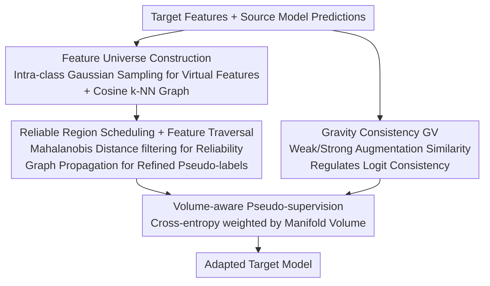

# Measure The Feature Universe: Topology-based Pseudo Labeling and Gravity Consistency for Source-Free Domain Adaptation

**Conference**: CVPR 2026  
**Paper**: [CVF Open Access](https://openaccess.thecvf.com/content/CVPR2026/html/Lee_Measure_The_Feature_Universe_Topology-based_Pseudo_Labeling_and_Gravity_Consistency_CVPR_2026_paper.html)  
**Code**: To be confirmed  
**Area**: Self-supervised / Representation Learning / Source-Free Domain Adaptation (SFDA)  
**Keywords**: Source-Free Domain Adaptation, Pseudo Labeling, Manifold Topology, Consistency Regularization, Feature Traversal

## TL;DR
Addressing Source-Free Domain Adaptation (SFDA), this paper models the target feature space as a "feature universe" with virtual feature padding. It propagates reliable pseudo-labels along a cosine k-NN graph via feature traversal and proposes "Gravity Consistency" regularization—using the similarity between weak and strong augmented features to modulate the strength of logit consistency. This approach consistently outperforms prior SFDA methods on Office-Home, DomainNet-126, and VisDA-C.

## Background & Motivation
**Background**: Source-Free Domain Adaptation (SFDA) provides only a pre-trained source model and a set of unlabeled target data, without access to source data. The mainstream approach is self-training: generating pseudo-labels from the model itself, combined with Consistency Regularization (CR) to mitigate pseudo-label noise.

**Limitations of Prior Work**: The authors identify two overlooked issues. First, existing pseudo-labeling methods (SHOT, GKD, R-SFDA, etc.) measure the distance from "samples to class centers" using Euclidean/cosine metrics in the embedding space. However, they **assume that class cluster structures are well-maintained in the target domain**, whereas domain shift makes target embeddings sparse and loose, leading to unreliable distance estimates and persistent pseudo-labeling errors—a phenomenon the authors call "manifold-unaware pseudo labeling." Second, traditional CR only acts on the output logits and is blind to "reliability at the feature level." When trained with noisy pseudo-labels, it can reinforce noisy labels (confirmation bias), termed "logit-anchored spurious regularization." As shown in Table 1, simply adding KL-divergence CR to SHOT/GKD yields less than a 1% improvement.

**Key Challenge**: The quality of pseudo-labels depends on the characterization of the embedding manifold geometry, while the effectiveness of CR depends on the ability to distinguish "which samples' consistency signals are trustworthy"—both of which are oversimplified by existing methods using coarse distance/logit metrics.

**Goal**: (1) Construct a manifold space that reflects the geometric structure of the target feature distribution to generate pseudo-labels; (2) Make consistency regularization sensitive to feature-level reliability to avoid over-regularization on uncertain samples.

**Key Insight**: The authors observe that the more similar the features extracted from weak and strong augmentations are, the more reliable the model's prediction for that sample is (validated in Table 2: higher weak-strong feature cosine similarity correlates with higher classification accuracy). This provides a measurable indicator for "which consistency signals to trust."

**Core Idea**: Use virtual features to "fill" the sparse embedding space into a traversable feature universe, allowing pseudo-labels to propagate along the graph only from statistically reliable regions. Furthermore, using a metaphor from physical gravity, feature similarity is used to weight logit consistency, focusing regularization on samples that are truly structurally reliable.

## Method

### Overall Architecture
The method uses only unlabeled target data $X_t$ and a pre-trained source model (encoder $g$ + classifier $f$). The pipeline follows two paths: the **pseudo-label refinement line** first models target features as a feature universe and produces refined labels via graph traversal; the **consistency regularization line** applies Gravity Consistency to weak/strong augmentations. Finally, volume-aware weighted cross-entropy is used to optimize pseudo-label supervision alongside both types of regularization.

### Key Designs

**1. Feature Universe Construction: Filling sparse embeddings into a modelable manifold with virtual features**

Building a cosine k-NN graph directly on domain-shifted target embeddings is unreliable—features are too sparse and clusters are not compact. The authors first perform k-means on all target features $z_i=g(x_i)$ to obtain class centroids $\mu^{(k)}$ and probability-weighted covariances $\Sigma^{(k)}=\sum_i p_i^{(k)}(z_i-\mu^{(k)})(z_i-\mu^{(k)})^T$. Then, $\lambda$ virtual features $v_j^{(k)}$ are sampled for each class from an intra-class Gaussian $\mathcal{N}(\mu^{(k)},\Sigma^{(k)})$ to fill the gaps. After merging real features $Z_t$ and virtual features $V_t$ into $Z'_t$, a cosine k-NN graph $G=(V,E)$ is constructed. This graph of "real + virtual" features arranged around class Gaussians is the **feature universe**. Its significance lies in creating continuity via virtual features that are otherwise difficult to capture with real points alone, providing a path for subsequent label propagation.

**2. Reliable Region Scheduling + Feature Traversal: Propagating labels only from statistically reliable nodes**

Some nodes in the feature universe are inherently out-of-distribution or untrustworthy. For each merged feature $z'_i$, the authors compute the squared Mahalanobis distance $d_i^2=(z'_i-\mu^{(\bar y_i)})^\top\Sigma^{(\bar y_i)-1}(z'_i-\mu^{(\bar y_i)})$ to its pseudo-labeled class center. A reliability mask $M_i=\mathbb{1}[d_i^2\le \text{Percentile}(D_{\bar y_i},\rho)]$ is applied based on the intra-class distribution, with the percentile threshold gradually increasing from $\rho_{\min}$ to $\rho_{\max}$ ($\tau(e)=\rho_{\min}+(\rho_{\max}-\rho_{\min})\sqrt{e/E}$)—trusting only the most reliable core points early on and gradually relaxing the criteria. **Feature traversal** starts from each real target feature and searches along k-NN neighbors for the first reliable node where $M=1$, using its class as the refined pseudo-label $\hat y_i$. If no direct neighbors are reliable, the search expands hop-by-hop; if the maximum hop $H$ is exceeded, the label of the last visited node is taken. This ensures labels flow from "dense reliable zones" to peripheral samples, avoiding mislabeling from direct distance metrics.

**3. Gravity Consistency GV: Weighting logit consistency with feature similarity**

Traditional CR looks only at logits and cannot distinguish which consistency signals are trustworthy. The authors use a gravity metaphor—the "attraction" between two augmented images depends on their geometric proximity in the embedding space. GV multiplies the cosine similarity of weak/strong augmented features by the KL divergence of their predictions: $L_{GV}=\sqrt{\mathbb{E}_i[\cos(z_i^\alpha,z_i^A)\cdot D_{KL}(p_i^A\|p_i^\alpha)]}$. When features are well-aligned, this term strengthens the logit consistency constraint; the square root compresses the scale to avoid instability from large KL values. Essentially, it injects "structural reliability" directly into the consistency signal, concentrating regularization on reliable samples where both weak and strong features are consistent (Zone A in the paper’s Figure 1), while weakening constraints on unreliable regions (Zones C/D), thereby suppressing confirmation bias. This module is plug-and-play and improves results when added to SHOT/GKD/TPDS.

**4. Volume-aware Pseudo-supervision: Balancing cross-entropy by class manifold volume**

To mitigate imbalanced learning, the authors weight cross-entropy by the "manifold volume" occupied by each class in the embedding space. The covariance $\Sigma^{(k)}$ is reused to calculate the normalized perceived manifold volume $\tilde V^{(k)}=V^{(k)}/\sum_j V^{(j)}$, where $V^{(k)}=\tfrac{1}{2}\log_2\log\det(I+\tfrac{1}{\bar p^{(k)}}\Sigma^{(k)})$. This is used as a weight in the weighted cross-entropy $L_{CE}$ on the average prediction of weak/strong augmentations. The intuition is that classes with larger volumes are more widely distributed and easily overwhelmed; higher weights for these classes balance the learning intensity.

### Loss & Training
The total objective is a weighted sum of three terms: volume-aware cross-entropy $L_{CE}$, Gravity Consistency $L_{GV}$, and the Information Maximization loss $L_{IM}$ commonly used in SFDA: $L_{total}=\alpha L_{CE}+\beta L_{GV}+\gamma L_{IM}$. Ablations show $L_{IM}$ is indispensable—adding $L_{GV}$ without $L_{IM}$ leads to premature convergence and a performance drop (68.6% → 66.3% on DomainNet-126), as $L_{IM}$ prevents maturity by balancing per-sample entropy and maximizing batch-level entropy to maintain prediction diversity.

## Key Experimental Results

### Main Results
Evaluations were conducted on three standard domain adaptation benchmarks using ResNet50 (Office-Home/DomainNet-126) and ResNet101 (VisDA-C) backbones. The full framework (UP + GV) is denoted as Ours; gray rows indicate applying GV alone to existing methods.

| Dataset | Metric | Ours | Prev. SOTA | Gain |
|--------|------|------|----------|------|
| Office-Home | Avg Accuracy | 74.4% | R-SFDA 74.1% | +0.3% |
| DomainNet-126 | Avg Accuracy | 73.6% | Exceeds existing | — |
| VisDA-C (Sy→Re) | Accuracy | 87.7% ⚠️ | UCON 89.6% | Limited by VRAM |

> ⚠️ On VisDA-C, UP requires calculating intra-class covariance for all features, which has high memory overhead. Due to VRAM limitations in the experimental environment, the authors used multi-GPU parallel covariance estimation but could not fully realize the gains of UP, leading to conservative results (still reaching 87.7%).

Applying GV alone to existing methods consistently yields extra gains: SHOT/GKD/TPDS improved by +1.1%/+0.6%/+0.4% on Office-Home; on DomainNet-126, SHOT w/GV and GKD w/GV improved by an average of +5.0%. The table below compares GV with standard KL-divergence CR from early motivation experiments (Table 1):

| Method | A→P | A→R | P→A | R→P |
|------|-----|-----|-----|-----|
| SHOT | 78.8 | 81.3 | 68.0 | 81.3 |
| SHOT + KL | 80.2 (+1.4) | 81.5 (+0.2) | 68.6 (+0.6) | 81.5 (+0.2) |
| SHOT + GV | 80.9 (+2.1) | 82.1 (+0.8) | 68.9 (+0.9) | 82.1 (+0.8) |

GV consistently shows higher gains than pure KL-based CR across every transfer task.

### Ablation Study
Ablations on Office-Home using SHOT as the baseline:

| Configuration | Avg Accuracy | Description |
|------|---------|------|
| SHOT Baseline | 71.9% | Without proposed components |
| + UP (Feature Universe) | 72.5% | Topological approx + label propagation improves label quality |
| + GV (Gravity Consistency)| +1.1% | Joint feature/logit level consistency |
| Full (UP + GV) | 74.4% | Synergy between both produces best results |

### Key Findings
- UP and GV have a synergistic effect: individually they yield gains of 0.6% and 1.1%, respectively, reaching 74.4% combined. This indicates that "aligning embedding structures" and "aligning consistency signals" are complementary lines of work.
- GV requires $L_{IM}$: without $L_{IM}$, adding GV results in performance drops due to premature convergence (66.3% < 68.6%). GV provides stable gains only when $L_{IM}$ is included.
- GV is plug-and-play: gains are observed when integrated into various SFDA frameworks like SHOT, GKD, and TPDS. The gain on DomainNet-126 (up to +5.0%) was even larger than on Office-Home.

## Highlights & Insights
- **The "fill it if it's uncertain" approach is clever**: Rather than brute-force distance calculation on sparse embeddings, the authors use virtual features sampled from intra-class Gaussians to support the manifold as a traversable graph. This converts a "metric problem" into a "graph propagation problem," bypassing the failures of Euclidean distance assumptions.
- **Calibrating consistency signals with measurable feature similarity**: Table 2 first validates that "more similar weak-strong features lead to more accurate predictions," then constructs GV based on this. This turns an empirical observation into a loss term, creating a logical closed loop transferable to any self-training framework using weak/strong augmentation CR.
- **GV's value as a general plugin exceeds the overall framework**: Its improvement over existing SFDA methods (up to +5%) exceeds the +0.3% margin between the full framework and SOTA. Such a "low-cost plug-and-play" design is highly likely to be reused in future work.

## Limitations & Future Work
- The authors acknowledge that UP's covariance estimation has high memory overhead for large class numbers or samples (VisDA-C), requiring multi-GPU parallelism, which prevented the method from reaching its full potential on that dataset—scalability is a practical bottleneck.
- The absolute gain of the full framework over the latest SOTA on Office-Home is only +0.3%; the primary value lies in the GV plugin rather than the pseudo-labeling component.
- The virtual feature sampling relies on a "single Gaussian per class" assumption. Its validity for multimodal or long-tailed distributions and the sensitivity of hyperparameters like $\lambda$ (virtual features per class) and $H$ (max hops) are not fully explored in the main text.
- Future directions: use low-rank or diagonal covariance approximations to alleviate UP's memory issues; explore Gaussian Mixture Models instead of single Gaussians to characterize more complex intra-class structures.

## Related Work & Insights
- **vs SHOT / GKD**: These methods label pseudo-labels based on cosine distance to class centers in the embedding space, assuming cluster structures are preserved. Ours points out that this assumption fails under domain shift and uses virtual features + graph traversal for "manifold-aware" label propagation.
- **vs R-SFDA**: R-SFDA uses the intersection of classifier sampling and class center sampling for curriculum pseudo-labeling. Ours also pursues "labeling only reliable samples" but achieves this via Mahalanobis distance percentile scheduling and graph traversal, extending reliability along topological continuity.
- **vs Traditional KL Consistency Regularization (AdaContrast, etc.)**: Traditional CR only anchors logits and is easily misled by noisy pseudo-labels. GV multiplies feature-level similarity into logit consistency, making it sensitive to feature reliability—an "geometric weighting" upgrade to CR.

## Rating
- Novelty: ⭐⭐⭐⭐ Feature Universe + Graph Traversal and Gravity Consistency are novel and self-consistent perspectives.
- Experimental Thoroughness: ⭐⭐⭐⭐ Three standard benchmarks + multiple baseline plugin validations, though VisDA-C was limited by memory and ablations were slightly light.
- Writing Quality: ⭐⭐⭐⭐ Clear Motivation—Observation—Method loop with complete formulas.
- Value: ⭐⭐⭐⭐ GV is plug-and-play and yields universal gains for existing SFDA, highlighting strong practical value.

<!-- RELATED:START -->

## Related Papers

- [\[CVPR 2026\] MemFlow: A Lightweight Forward Memorizing Framework for Quick Domain Adaptive Feature Mapping](memflow_a_lightweight_forward_memorizing_framework_for_quick_domain_adaptive_fea.md)
- [\[CVPR 2026\] GaussianMatch: Semi-Supervised Regression with Pseudo-Label Filtering via Multi-View Gaussian Consistency](gaussianmatch_semi-supervised_regression_with_pseudo-label_filtering_via_multi-v.md)
- [\[ICLR 2026\] PAS: Estimating the Target Accuracy Before Domain Adaptation](../../ICLR2026/self_supervised/pas_estimating_the_target_accuracy_before_domain_adaptation.md)
- [\[ICLR 2026\] Architecture-Agnostic Test-Time Adaptation via Backprop-Free Embedding Alignment](../../ICLR2026/self_supervised/architecture-agnostic_test-time_adaptation_via_backprop-free_embedding_alignment.md)
- [\[CVPR 2026\] Free-Grained Hierarchical Visual Recognition](free-grained_hierarchical_visual_recognition.md)

<!-- RELATED:END -->
