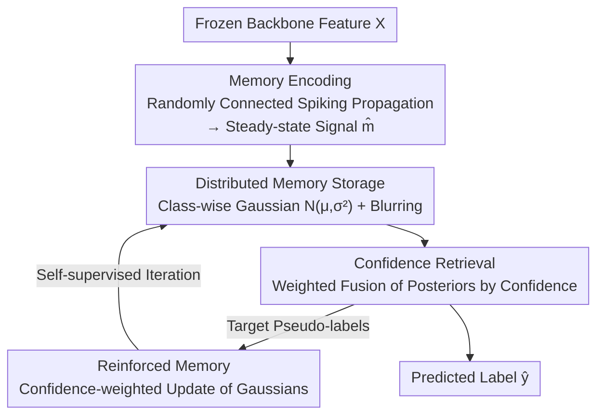

# MemFlow: A Lightweight Forward Memorizing Framework for Quick Domain Adaptive Feature Mapping

**Conference**: CVPR 2026  
**Paper**: [CVF Open Access](https://openaccess.thecvf.com/content/CVPR2026/html/Lv_MemFlow_A_Lightweight_Forward_Memorizing_Framework_for_Quick_Domain_Adaptive_CVPR_2026_paper.html)  
**Code**: https://github.com/so-link/MemFlow  
**Area**: Self-Supervised / Transfer Learning / Domain Adaptation  
**Keywords**: Source-Free Domain Adaptation, Gradient-Free Learning, Forward Memorizing, Spiking Propagation, Edge Devices

## TL;DR
MemFlow proposes a "forward memorizing framework" inspired by the brain's memory mechanism that entirely bypasses backpropagation. By freezing the backbone and using randomly connected neurons to record feature-label associations as Gaussian distributions—retrieved and fused based on confidence—it enables rapid on-device domain adaptation. It achieves up to a 10% improvement across four cross-domain datasets while consuming less than 1% of the time required by traditional domain adaptation methods.

## Background & Motivation
**Background**: Deploying pre-trained vision models to real-world environments often leads to significant performance degradation due to diverse test scenarios. Source-Free Unsupervised Domain Adaptation (SFUDA) utilizes unlabeled target data to continuously optimize models, with pseudo-labeling and clustering being dominant approaches.

**Limitations of Prior Work**: Existing SFUDA methods require gradient-based backpropagation (BP) to optimize deep networks. However, BP is significantly slower than forward inference (Fig. 1a), making online continual learning nearly impossible on resource-constrained edge devices. A lightweight alternative is to retrain only the final fully connected layer of the classifier (Fig. 1b), but this suffers from limited adaptability due to the small number of trainable parameters.

**Key Challenge**: To achieve rapid adaptation on edge devices, one must maintain a frozen deep backbone while ensuring the "feature-to-prediction" mapping is sufficiently flexible. Traditional methods fail to balance high efficiency with strong adaptability, either relying on expensive full-network BP or under-parameterized final-layer retraining. This paper formally defines this problem as **Domain Adaptive Feature Mapping (DAMap)**: freezing the feature extractor $f$ and optimizing only a lightweight classifier $c$ using unlabeled target data.

**Key Insight**: The authors draw inspiration from biological neural networks (BNNs), which adapt quickly to new domains without extensive labeling. As suggested by Hinton, there is no evidence of explicit gradient BP in the brain. BNNs rely on "memory," which is structurally distributed across interconnected neurons and functionally capture, retain, and retrieve signal associations via neural plasticity across encoding, storage, and retrieval stages.

**Core Idea**: Replace "gradient-based functions" with "distributed memory storage and retrieval." Randomly connected neurons record feature-label associations as Gaussian distributions via spikes. During prediction, memories from neurons are fused based on confidence. The framework supports reinforced memory using unlabeled data, enabling gradient-free, plug-and-play rapid domain adaptation.

## Method

### Overall Architecture
MemFlow follows a frozen backbone $f$ and models classification as a process of "distributed memory storage and retrieval" across randomly connected neurons. It consists of four memory-related stages: ① **Memory Encoding**—Input features undergo multi-round spiking propagation through a random network to obtain steady-state memory signals, achieving non-linear projection; ② **Distributed Memory Storage**—Each neuron models the "memory signal-label" association as class-wise Gaussian distributions, using Gaussian blurring to create "blurred memory" to prevent overfitting; ③ **Confidence Retrieval**—Each neuron provides class posteriors and confidence based on its memory, and the network fuses these results via confidence weighting; ④ **Reinforced Memory**—Target domain pseudo-labels are used to update Gaussian parameters weighted by confidence, completing adaptation through self-supervised iterations. The entire process involves only forward propagation.

### Key Designs

**1. Memory Encoding via Spiking Random Projection: Non-linear transformation using unlearned random networks**

**Design Motivation**: To obtain discriminative representations without training weights. MemFlow mimics BNN topology with high-connectivity hubs and sparse nodes, defining three node types: entry, hub, and bridge nodes. Weights are randomly initialized in $[-1,1]$ and fixed. Signal propagation follows: $h_{i,t+1} = h_{i,t} + \sum_{j\in N_i} o_{j,t} W_{ji}$. Spikes are triggered if $h_{i,t+1}>0$, and the steady-state memory signal is accumulated as $\widehat{m}_i = m_{i,T}$.

**2. Gaussian Distributed Memory Storage + Blurred Memory: Compressing associations and preventing overfitting**

**Design Motivation**: To avoid memory explosion from lookup tables and prevent overfitting under low-data regimes. Theorem 1 proves that the $k$-th class memory signal at neuron $i$ follows $P(\widehat{m}_i^k \mid y=k) \sim N(\mu_i^k, (\sigma_i^k)^2)$. Each unit only needs $2C$ parameters. Gaussian blurring $Q(\widehat{m}_i\mid y=k)$ is applied to balance neuron contributions. Ablation shows blurring provides a >10% gain.

**3. Confidence-Weighted Distributed Memory Retrieval: Robust fusion of local memories**

**Design Motivation**: To integrate distributed local memories into a robust decision. During retrieval, the $i$-th neuron provides a posterior $\Pr(y=k\mid\widehat{m}_i)$ based on blurred memory, with confidence $c_i$ defined by its likelihood. The final decision is a confidence-weighted average: $\Pr(y=k\mid X) = \frac{\sum_i c_i \Pr(y=k\mid\widehat{m}_i)}{\sum_j c_j}$.

**4. Reinforced Memory Mechanism: Gradient-free adaptation**

**Design Motivation**: To transition from a static classifier to an adaptive one. Target samples generate pseudo-labels $\widehat{y}$, which update Gaussian parameters directly. To handle noise, node-wise confidence $E_i(\widehat{m}_i, \widehat{y})$ weights the updates. Theorem 2 ensures that the error bound $\|\Theta^\dagger - \Theta^*\| \le O(\frac{\epsilon E}{1-\beta})$ is proportional to the pseudo-label error rate $\epsilon$.

## Key Experimental Results

### Main Results
Comparison on four cross-domain datasets showing accuracy (%) and adaptation time per instance (ms) in the DAMap setting:

| Dataset | retrain@last | retrain@BLS | retrain@KNN | MemFlow (Ours) |
|------|------|------|------|------|
| Office-Home (Acc) | 61.6 | 62.6 | 61.9 | **66.0** |
| Office-Home (Time) | 0.082 | 0.088 | 0.305 | **0.057** |
| Office31 (Acc) | 80.4 | 80.4 | 82.3 | **86.1** |
| Digits (Acc) | 86.9 | 89.0 | 87.1 | **89.1** |
| VisDA-C (Acc) | 65.0 | 67.2 | 62.7 | **72.1** |
| VisDA-C (Time) | 0.096 | 0.045 | 0.210 | **0.012** |

MemFlow yields the highest accuracy and lowest time; on VisDA-C, it exceeds final-layer retraining by over 10%. Compared to heavy SFUDA methods, it achieves comparable accuracy in less than 1% of the adaptation time.

### Ablation Study
Component ablation (Accuracy %). CU=Confidence Update, GB=Gaussian Blur, SM=Spiking Mechanism:

| CU | GB | SM | Office-31 | Office-Home | Digits | VisDA-C |
|----|----|----|-----------|-------------|--------|---------|
| ✗ | ✗ | ✗ | 73.46 | 42.54 | 60.68 | 35.94 |
| ✓ | ✗ | ✗ | 84.97 | 55.57 | 64.17 | 42.60 |
| ✗ | ✓ | ✗ | 84.59 | 65.04 | 89.00 | 70.96 |
| ✓ | ✓ | ✗ | 85.52 | 65.84 | 89.07 | 71.14 |
| ✓ | ✓ | ✓ | **86.08** | **66.00** | **89.14** | **72.08** |

### Key Findings
- **Gaussian Blur (GB)** provides the highest contribution (>10% gain), preventing single-neuron dominance.
- **Confidence Update (CU)** ensures stability against pseudo-label noise; **Spiking Mechanism (SM)** provides robust long-term memory.
- Performance is insensitive to the number of hub/bridge nodes (10–200).

## Highlights & Insights
- Replacing **gradient fitting** with **memory storage-retrieval** transforms adaptation into "recording" in Gaussian distributions, making it gradient-free and edge-friendly.
- Compressing associations into $2C$ parameters with blurring efficiently mimics biological memory.
- Strong plug-and-play capability: acts as both a DAMap classifier and a plugin to enhance SHOT/AaD/PFC.

## Limitations & Future Work
- Absolute accuracy is lower than heavy SFUDA methods (e.g., VisDA-C 72.1 vs AaD 88.0); it prioritizes speed over peak SOTA accuracy.
- The Gaussian assumption may falter under heavy multi-modal or long-tailed distributions.
- Reinforced memory is sensitive to pseudo-label quality; risks under extreme domain shifts were not fully explored.

## Related Work & Insights
- **vs. SFUDA (SHOT/AaD)**: These optimize deep networks via BP, offering high accuracy but slow speeds. MemFlow is orders of magnitude faster and gradient-free.
- **vs. retrain@last/KNN**: MemFlow outperforms these lightweight baselines in both speed and accuracy within the DAMap framework.
- **vs. Gradient-free Networks (ELM/BLS)**: Those still focus on "function fitting," whereas MemFlow focuses on "distributed associations," allowing easier reinforcement on unlabeled data.

## Rating
- Novelty: ⭐⭐⭐⭐⭐ Replaces gradients with memory storage for adaptation; defines the DAMap problem.
- Experimental Thoroughness: ⭐⭐⭐⭐ Excellent ablation and speed comparisons, though peak accuracy stays below heavy SFUDA.
- Writing Quality: ⭐⭐⭐⭐ Clear biological motivation and logic, though some mathematical details are in supplements.
- Value: ⭐⭐⭐⭐⭐ High practical value for on-device continual learning with minimal computational overhead.

<!-- RELATED:START -->

## Related Papers

- [\[CVPR 2026\] Measure The Feature Universe: Topology-based Pseudo Labeling and Gravity Consistency for Source-Free Domain Adaptation](measure_the_feature_universe_topology-based_pseudo_labeling_and_gravity_consiste.md)
- [\[CVPR 2026\] HCL-FF: Hierarchical and Contrastive Learning for Forward-Forward Algorithm](hcl-ff_hierarchical_and_contrastive_learning_for_forward-forward_algorithm.md)
- [\[CVPR 2026\] Learning by Analogy: A Causal Framework for Compositional Generalization](learning_by_analogy_a_causal_framework_for_compositional_generalization.md)
- [\[CVPR 2026\] UPLiFT: Efficient Pixel-Dense Feature Upsampling with Local Attenders](uplift_efficient_pixel-dense_feature_upsampling_with_local_attenders.md)
- [\[CVPR 2026\] TeFlow: Enabling Multi-frame Supervision for Self-Supervised Feed-forward Scene Flow Estimation](teflow_enabling_multi-frame_supervision_for_self-supervised_feed-forward_scene_f.md)

<!-- RELATED:END -->
