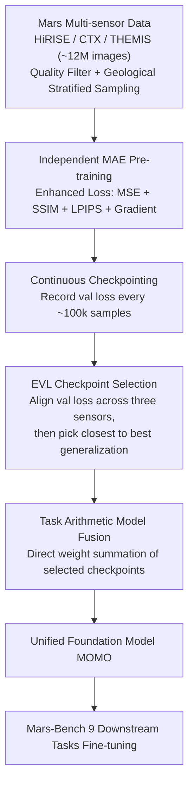

# MOMO: Mars Orbital Model — Foundation Model for Mars Orbital Applications

**Conference**: CVPR 2026  
**arXiv**: [2604.02719](https://arxiv.org/abs/2604.02719)  
**Code**: [https://github.com/kerner-lab/MOMO](https://github.com/kerner-lab/MOMO)  
**Area**: Self-supervised  
**Keywords**: Mars remote sensing, Foundation model, Model fusion, Checkpoint selection strategy, Multi-sensor

## TL;DR

MOMO is the first foundation model for Mars remote sensing. It pre-trains MAEs independently on three Mars sensors (HiRISE/CTX/THEMIS) and proposes an Equal Validation Loss (EVL) checkpoint selection strategy for model fusion. It outperforms ImageNet pre-training and Earth Observation foundation models across 9 downstream tasks in Mars-Bench.

## Background & Motivation

**Background**: Foundation models (FMs) in the Earth Observation (EO) field have exceeded 150 models (e.g., SatMAE, CROMA, Prithvi), achieving widespread success in applications like food security and disaster response. Mars orbital satellites also systematically collect planetary surface observations, yet no foundation model specifically designed for Mars remote sensing exists. Researchers still rely on ImageNet pre-trained models for Mars tasks.

**Limitations of Prior Work**: (1) Earth EO foundation models cannot be directly transferred to Mars: different atmospheric conditions, lighting, surface materials, and sensor characteristics lead to significant distribution shifts. (2) Extreme differences between Mars sensors: HiRISE (0.25m/pixel), CTX (5m/pixel), and THEMIS (100m/pixel); coverage also varies significantly (CTX ~100%, HiRISE <3%). (3) Traditional multi-sensor fusion methods (e.g., channel stacking, heterogeneous data mixing) are either unfeasible or unscalable for Mars data.

**Key Challenge**: Mars multi-sensor data spans a 400x spatial resolution range (0.25m to 100m), has immense coverage disparities, and lacks spatio-temporally aligned co-occurrences. Traditional channel stacking or joint training methods either require aligned data or necessitate full retraining when adding new sensors.

**Goal**: How to efficiently construct a unified multi-sensor Mars foundation model that outperforms ImageNet and EO pre-training across various Mars remote sensing tasks?

**Key Insight**: Instead of directly mixing heterogeneous data, independent MAE pre-training is performed for each sensor, followed by parameter fusion using task arithmetic. The crucial insight is that merging at the final checkpoint may be unstable due to different training trajectories. The proposed EVL strategy aligns the training phases before fusion.

**Core Idea**: Independent MAE pre-training per sensor + weight-aligned checkpoint selection via EVL + model fusion via task arithmetic = the first Mars remote sensing foundation model.

## Method

### Overall Architecture

MOMO addresses a direct problem: Mars has three orbital sensors (HiRISE, CTX, THEMIS) with a 400x resolution gap, disparate coverage, and no aligned observations, making traditional joint training impractical. MOMO adopts a "divide-and-conquer then merge" approach: it prepares ~12 million high-quality Mars images (~4M per sensor), pre-trains an **independent** MAE for each sensor (using an enhanced composite loss to learn geomorphological structures rather than just textures), records validation losses periodically, uses the EVL strategy to select checkpoints with comparable convergence, and finally applies task arithmetic to sum their weights into a unified model. This model is then fine-tuned on 9 Mars-Bench downstream tasks.

### Key Designs

**1. Enhanced Reconstruction Loss: Learning Geomorphology Over Texture**

Standard MAE uses MSE as the reconstruction objective, which focuses on pixel intensities but is insensitive to high-order spatial features like shape and boundary continuity. Consequently, models can recover textures but fail to reconstruct precise crater outlines, which are critical for Mars segmentation. MOMO replaces the objective with a composite loss:

$$\mathcal{L}_\text{total} = \lambda_1\mathcal{L}_\text{MSE} + \lambda_2\mathcal{L}_\text{SSIM} + \lambda_3\mathcal{L}_\text{LPIPS} + \lambda_4\mathcal{L}_\text{grad}$$

Each term serves a purpose: MSE ensures pixel fidelity, SSIM constrains structural consistency, LPIPS provides perceptual constraints, and the gradient loss $\mathcal{L}_\text{grad}$ penalizes differences in horizontal/vertical gradients to force the model to learn spatial edge smoothness. These additions specifically target the boundary and shape requirements of downstream segmentation tasks.

**2. Equal Validation Loss (EVL) Checkpoint Selection: Merging at Comparable Convergence**

Due to disparate data distributions and training trajectories, merging models at their final checkpoints or individual early-stopping points can be unstable (e.g., one model overfits while another underfits). EVL ensures fusion occurs when all models reach a similar convergence level. During training, validation loss $\mathcal{L}_i^{(e)}$ is logged every 100k samples. From all possible epoch combinations $\mathbf{t_c}=(e^1,\dots,e^n)$, the strategy first filters for "loss alignment" where the difference between any two sensors' validation loss satisfies:

$$\Delta_{ij} = |\mathcal{L}_i^{(e_a^i)} - \mathcal{L}_j^{(e_b^j)}| \leq \epsilon$$

Among these candidates, the set that minimizes the average distance to their respective early-stopping epochs is chosen:

$$\mathbf{t_c}^\star = \min_{\mathbf{t_c} \in \mathcal{E}_\text{EVL}} \bar{D}(\mathbf{t_c}),\quad \bar{D}(\mathbf{t_c}) = \frac{1}{n}\sum_i |e^i - s_{es}^i|$$

This ensures the models have converged similarly and are near their best generalization points, preventing one model from hindering another during fusion.

**3. Task Arithmetic Model Fusion: Weights Summation Over Data Mixing**

After selecting the optimal checkpoints, MOMO takes the parameters $\{\theta_i^{(e_\star^i)}\}$ and merges them using task arithmetic: $\text{MOMO}=\mathcal{T}(\theta_1^{(e_\star^1)},\dots,\theta_n^{(e_\star^n)})$. Unlike Data Merging (DM), this is highly scalable: new sensors can be added by training their individual MAEs without retraining everything. Loss landscape visualization shows that checkpoints selected by EVL reside closer in weight space and within the same loss basin, allowing linear addition without performance collapse.

### Loss & Training

Each sensor is trained independently for 5 epochs (~4M samples each). HEALPix is used for train/val splitting to prevent data leakage. Pre-training data is filtered for quality using SSIM and noise estimation (threshold 0.4) and stratified by Mars geological units to ensure representation.

## Key Experimental Results

### Main Results

| Model | AtmosDust | DoMars16k | Frost | Landmark | Boulder | ConeQuest | Crater Binary | Crater Multi | MMLS | Avg. Rank |
|------|-----------|-----------|-------|----------|---------|-----------|---------------|-------------|------|-----------|
| Scratch | 0.94 | 0.73 | 0.95 | 0.79 | 0.07 | 0.52 | 0.37 | 0.05 | 0.50 | 4.11 |
| ImageNet | 0.92 | **0.91** | 0.97 | **0.92** | 0.16 | 0.70 | 0.55 | 0.11 | 0.57 | 2.33 |
| SatMAE | 0.96 | 0.93 | 0.97 | 0.92 | 0.05 | 0.68 | 0.46 | 0.04 | 0.32 | 3.00 |
| **MOMO** | **0.96** | 0.92 | **0.98** | 0.91 | **0.20** | **0.71** | **0.54** | **0.12** | **0.57** | **1.67** |

Average F1-score for classification and mIoU for segmentation. MOMO achieves an average rank of 1.67, significantly outperforming all baselines.

### Ablation Study

| Checkpoint Strategy | Boulder | ConeQuest | Crater Binary |
|-----------|---------|-----------|---------------|
| Early Stopping (ES) | 0.12 | 0.68 | 0.50 |
| Last Epoch (LE) | 0.18 | 0.70 | 0.50 |
| **EVL (Ours)** | **0.20** | **0.71** | **0.54** |

EVL consistently outperforms ES and LE across three segmentation tasks, with an average gain of ~2.5% mIoU.

### Key Findings

- **Segmentation vs. Classification**: MOMO shows significant advantages in segmentation (avg. mIoU gain ~4% vs ImageNet) but smaller gains in classification (~1.25%), indicating that in-domain pre-training benefits fine-grained spatial understanding more.
- **EO Model Failure on Mars**: EO models like SatMAE perform significantly worse than ImageNet on segmentation (e.g., Boulder mIoU of 0.05), confirming the fundamental distribution shift between Earth and Mars data.
- **MOMO vs. Data Merge (DM)**: DM crashes on tasks like Frost (F1=0.44 vs MOMO 0.98), highlighting the instability of mixing heterogeneous Mars data during training.
- **MOMO vs. Single-Sensor Pre-training**: While single-sensor models perform well on their own data, MOMO provides a unified model that handles all sensors while improving average segmentation performance by 4.2%.
- **Loss Landscape Analysis**: EVL-selected checkpoints are closer in weight space and located in flatter loss basins, explaining their superior stability and generalization.

## Highlights & Insights

- **Checkpoint Selection via Validation Loss Alignment**: A simple yet effective contribution applicable to any heterogeneous data fusion scenario. The core idea is "merging at similar convergence levels."
- **Model Fusion as an Alternative to Data Fusion**: This avoids instabilities in joint training and naturally supports incremental expansion (adding new sensors only requires training + merging), offering a blueprint for Earth EO multi-sensor models.
- **Enhanced MAE Loss**: In scenarios where structural features are vital (like Mars geomorphology), combining LPIPS, SSIM, and gradient loss is far superior to pure MSE.

## Limitations & Future Work

- Computational constraints prevented comparison with more fusion baselines (e.g., Git Re-Basin).
- The assumption of linear mode connectivity may fail if data distributions are extremely divergent.
- Only three sensors were used; the effectiveness of adding more (e.g., CRISM spectrometers) remains unknown.
- Gains on classification tasks are limited (~1%), suggesting ImageNet may suffice for simple Mars classification.

## Related Work & Insights

- **vs. SatMAE**: SatMAE fails on Mars segmentation tasks, proving EO→Mars transfer is ineffective.
- **vs. Data Merge**: MOMO avoids the training crashes observed with direct data mixing.
- **vs. Purohit et al. (2023)**: While earlier work focused on single sensors (CTX), MOMO provides a comprehensive multi-sensor framework evaluated across 9 tasks.

## Rating

- Novelty: ⭐⭐⭐⭐ First Mars foundation model; EVL strategy is a novel technical contribution.
- Experimental Thoroughness: ⭐⭐⭐⭐ Comprehensive evaluation on Mars-Bench, multiple baseline comparisons, and loss landscape analysis.
- Writing Quality: ⭐⭐⭐⭐ Clear motivation and systematic methodology.
- Value: ⭐⭐⭐⭐ Pioneers the application of foundation models in planetary science; open-sourced weights and code provide significant value to the community.

<!-- RELATED:START -->

## Related Papers

- [\[CVPR 2026\] NitroGen: An Open Foundation Model for Generalist Gaming Agents](nitrogen_an_open_foundation_model_for_generalist_gaming_agents.md)
- [\[ICML 2026\] How 'Neural' is a Neural Foundation Model?](../../ICML2026/self_supervised/how_neural_is_a_neural_foundation_model.md)
- [\[AAAI 2026\] Spikingformer: A Key Foundation Model for Spiking Neural Networks](../../AAAI2026/self_supervised/spikingformer_a_key_foundation_model_for_spiking_neural_networks.md)
- [\[ECCV 2024\] InfMAE: A Foundation Model in the Infrared Modality](../../ECCV2024/self_supervised/infmae_a_foundation_model_in_the_infrared_modality.md)
- [\[ICML 2026\] InfoAtlas: A Foundation Model for Zero-Shot Statistical Dependence Estimation](../../ICML2026/self_supervised/infoatlas_a_foundation_model_for_zero-shot_statistical_dependence_estimate.md)

<!-- RELATED:END -->
