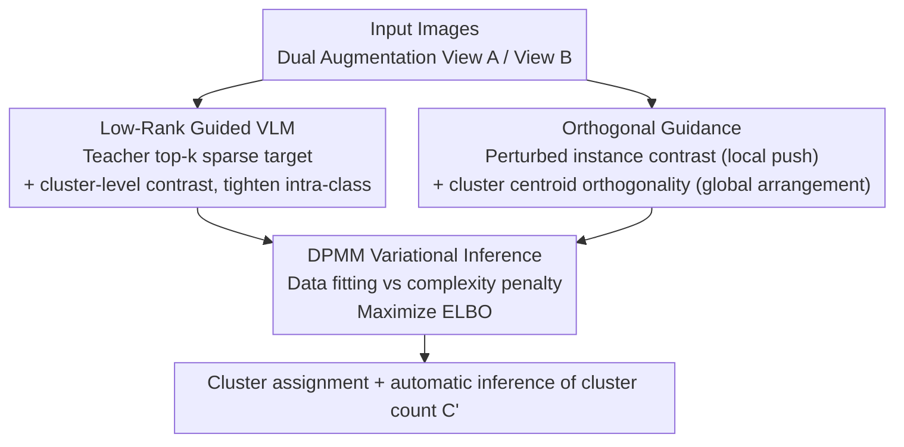

# Nonparametric Deep Fine-grained Clustering with Low-Rank Guided Vision-Language Model

**Conference**: CVPR 2026  
**Paper**: [CVF Open Access](https://openaccess.thecvf.com/content/CVPR2026/html/Ye_Nonparametric_Deep_Fine-grained_Clustering_with_Low_Rank_Guided_Vision-Language_Model_CVPR_2026_paper.html)  
**Code**: https://github.com/HenryWells02/VLMFine-Clustering  
**Area**: Self-Supervised / Deep Clustering / Multimodal VLM  
**Keywords**: Fine-grained Clustering, Low-Rank Guidance, VLM Teacher, Orthogonal Constraint, Dirichlet Process

## TL;DR
A frozen VLM is utilized as a "teacher" to reformulate low-rank compression in unsupervised fine-grained clustering as a top-k selection task. Combined with perturbed instance contrast and cluster centroid orthogonal constraints, these elements are integrated into a Dirichlet Process Variational Inference framework. This approach simultaneously learns representations and automatically infers the number of clusters, achieving SOTA results on fine-grained benchmarks such as CUB, Dogs, Flower, and Pet.

## Background & Motivation
**Background**: Deep clustering employs neural networks to simultaneously learn representations and cluster assignments in an end-to-end manner. Recent mainstream approaches leverage prior knowledge from large models (such as CLIP-based VLMs or even LLMs) to assist clustering, showing significant efficacy on general coarse-grained data.

**Limitations of Prior Work**: Applying these methods to **fine-grained clustering** leads to dual failures. First, general large models are predominantly pretrained on **coarse-grained** data, which features high inter-class variance and low intra-class variance. Fine-grained data exhibits the opposite characteristics (e.g., birds of different species looking nearly identical, while individuals of the same species vary greatly in posture and color), causing large models to miss subtle semantic differences required for sub-class differentiation. Second, most deep clustering methods require a **predefined number of clusters $C$**, which is unrealistic for real-world data exploration. The few large models fine-tuned on fine-grained data are supervised classification models, relying on labels unavailable in clustering scenarios.

**Key Challenge**: Fine-grained clustering must simultaneously address **loose intra-class** compactness (high intra-class variance causes dispersal of samples from the same category) and **blurred inter-class** separability (low inter-class variance causes different clusters to merge), all while the **number of clusters is unknown**.

**Goal**: To adapt VLMs for fine-grained clustering under conditions of no fine-grained labels and no preset cluster counts, enabling the dynamic discovery of clusters reflecting sub-classes.

**Key Insight**: The authors start from a theoretical observation: If the model is perfect, all prediction vectors for samples of the same semantic class should be identical. Consequently, the **rank of the matrix $P$** formed by stacking these predictions should be 1. Low rank implies intra-class compactness. However, since the class membership is unknown, $P$ cannot be directly constructed. Thus, a self-supervised approach is adopted, shifting the target to "multiple augmented versions of a single sample should converge toward the same sparse prototype."

**Core Idea**: Reformulate low-rank compression as "aligning to the top-k sparse targets provided by the VLM" (a differentiable proxy), complemented by orthogonalization to separate clusters, and unifying representation learning with cluster count inference within an ELBO objective using Dirichlet Process Variational Inference.

## Method

### Overall Architecture
The method revolves around a student model $F(\cdot)$ (comprising a shared encoder $f_\theta$ and a prediction head $g_\theta$) and a frozen VLM teacher $f_{teacher}$. For each input image, two asymmetric augmented views, View A ($T_A$) and View B ($T_B$), are generated. The student processes both views, while the teacher processes only View B to generate sparse targets. The pipeline consists of three components: **Low-Rank Guidance** ensures intra-class compactness, **Orthogonal Guidance** ensures inter-class separability, and both are embedded as "data fitting terms" into the ELBO of **DPMM Variational Inference**. The intrinsic "complexity penalty" of the DPMM prior dynamically regularizes redundant clusters during training, allowing the effective cluster count $C'$ to emerge automatically upon convergence without pre-specification.

### Key Designs

**1. Low-Rank Guided VLM: Reformulating "Matrix Rank-1" as Differentiable Alignment to VLM top-k Targets**

To address "loose intra-class" issues, ideally, the prediction matrix $P$ for samples of the same class should satisfy $\mathrm{Rank}(P)=1$. However, class labels are unknown, and direct minimization of matrix rank is NP-hard and non-differentiable. The authors use self-supervision as a proxy: for a single sample $x_i$, multiple augmentations $\{\hat{x}_{i,m}\}$ are generated, requiring the rank of their prediction matrix $D=[F(\hat{x}_{i,1}),\dots]^T$ to approach 1. Theorem 1 relaxes this to "all row vectors $c_m$ converging to the same $k$-sparse prototype $t$, where $\|t\|_0\le k$." Implementation involves the teacher generating high-confidence, gradient-free sparse targets on View B via $T^B_i=\mathrm{TopK}(f_{teacher}(T_B(x_i)))$. The student (predicting View A) is then forced to align with these targets via a low-rank guidance loss $L_{guidance}=-\frac{1}{N}\sum_i\sum_j \mathbb{I}(j\in T^B_i)\log(p^A_{\theta,i,j})$. This transforms "rank minimization" into an efficient differentiable task of "selecting top-k class indices," where the VLM's semantic prior acts as the low-rank signal source. Additionally, a cluster-level contrastive loss $L_{clu\_con}$ (calculating centroids by aggregating features from both views using View A's soft assignments $p^A_{\theta,i}$) performs geometric compression. $L_{guidance}$ serves as a "semantic anchor" for low-rank clusters, while $L_{clu\_con}$ acts as a "geometric compactor" for physical tightness, resulting in $L_{cluster}=L_{clu\_con}+\lambda_{guide}L_{guidance}$.

**2. Orthogonal Guidance: Local Instance Scaling + Global Centroid Arrangement for Inter-class Blur**

Compactness alone is insufficient; fine-grained scenarios often feature compact clusters that are entangled. The authors design a combination of "bottom-up local pushing" and "top-down global guidance." Locally, a perturbed instance contrastive loss $L_{ins\_con}$ (InfoNCE form) is used: learnable perturbations are added to the input. These perturbations are negligible for positive pairs (same class) but **amplify subtle hidden differences between negative pairs (different classes)**, making the contrastive task harder and forcing the model to learn wider inter-class margins. Globally, an orthogonal loss $L_{ortho}=\|M^TM-I\|_F^2$ is applied to a **shared learnable prototype matrix** $M=[m_1,\dots,m_C]$, forcing cluster prototypes to span mutually orthogonal one-dimensional subspaces. Crucially, $M$ is not a set of random vectors; since the student generates predictions $p^A_{\theta,i}$ by comparing features with $M$, $L_{cluster}$ populates $M$ with high-level concepts inherited indirectly from the teacher. Thus, orthogonal constraints are effective because they act on a "semantically grounded" parameter matrix. These components combine into $L_{separability}=L_{ins\_con}+\lambda_{ortho}L_{ortho}$.

**3. DPMM Variational Inference: Automatic Inference of Cluster Count $C$ via Complexity Penalty**

To eliminate the "preset cluster count" constraint, the clustering process is embedded into the non-parametric Bayesian framework of the Dirichlet Process Mixture Model (DPMM). The objective shifts from "minimizing heuristic losses" to "maximizing the Evidence Lower Bound (ELBO)." The ELBO is decomposed into two terms: the **data fitting term** $\mathbb{E}_{q(Z)}[\log p(X|Z)]$, which measures the explanatory power of the cluster structure (maximized by minimizing $L_{cluster}+L_{separability}$, favoring more clusters), and the **complexity penalty term** $\mathrm{KL}(q(Z,V)\|p(Z,V))$ (derived from the stick-breaking prior, which naturally favors fewer clusters). Mixing weights are generated by $\pi_l=V_l\prod_{j<l}(1-V_j)$. These two terms compete: a cluster is only "activated" if the fitting gain from adding it **significantly outweighs** the complexity cost. Upon convergence, the effective number of clusters carrying non-negligible sample volumes represents the optimal $C'$ dynamically inferred from the data. The framework maximizes ELBO end-to-end, with the complexity penalty implicitly minimized as part of DPMM-VI, requiring no additional balancing hyperparameters.

### Loss & Training
The overall objective is to maximize the ELBO (Eq. 14). In practice, this is driven by minimizing the data fitting loss $L_{DataFitting}=L_{cluster}+L_{separability}$, while the complexity penalty $\mathrm{KL}(q\|p)$ is implicitly minimized during variational optimization. The student uses a ResNet-50 backbone, and the teacher uses a frozen ResNet-50 or CLIP (ViT-B/16). Training lasts 500 epochs with a batch size of 64, using Adam with lr 3e-4. Parameters: $\tau_i=0.1$, $\tau_c=0.5$, $\lambda_{guide}=1.2$, $\lambda_{ortho}=0.8$, DPMM concentration $\alpha=0.4$, and top-$k=3$. Execution on a single RTX 4080.

## Key Experimental Results

> **Metric Definition**: NMI (Normalized Mutual Information, measures information consistency between predicted clusters and true labels, higher is better); ACC (Clustering Accuracy after optimal bipartite matching, higher is better). Both are reported as percentages.

### Main Results
On four fine-grained datasets (CUB-200-2011, Stanford Dogs, Oxford Flower, Oxford-IIIT Pet), the version with the CLIP teacher (Ours+CLIP) achieves SOTA across all datasets. Even the version using a standard ResNet teacher outperforms most VLM-guided methods.

| Dataset | Metric | Ours+CLIP | Prev. SOTA | Gain |
|--------|------|-----------|----------|------|
| CUB-200-2011 | NMI / ACC | 70.9 / 41.8 | 64.6 / 34.7 (TAC) | +6.3 / +7.1 |
| Stanford Dogs | NMI / ACC | 69.1 / 53.2 | 64.8 / 48.7 (TAC) | +4.3 / +4.5 |
| Oxford Flower | NMI / ACC | 88.4 / 72.6 | 81.5 / 69.7 (CLUDI) | +6.9 / +2.9 |
| Oxford-IIIT Pet | NMI / ACC | 88.0 / 82.2 | 87.3 / 74.1 (CLUDI) | +0.7 / +8.1 |

On large-scale general datasets (ImageNet-50/100/200), the method remains competitive: ImageNet-50 reaches 92.4/84.2 (NMI/ACC), and ImageNet-100 reaches 87.8/77.1, both surpassing CLUDI. The ACC for ImageNet-200 (72.3) is slightly lower than CLUDI (73.7).

**Cluster Inference (Table 2)**: The predicted number of clusters aligns closely with the true number of categories—CUB 200→210.4, Dogs 120→127.1, Flower 102→104.6, Pet 37→39.3, verifying that the DPMM framework automatically approximates the true cluster count rather than relying on presets.

### Ablation Study
Decomposition of components on Oxford Flower (Baseline = DPMM + standard instance/cluster contrastive loss):

| Configuration | NMI | ACC | Description |
|------|-----|-----|------|
| (a) Baseline | 52.1 | 24.4 | DPMM + standard contrastive |
| (b) + $L_{guidance}$ | 75.8 | 39.6 | Add low-rank guidance |
| (c) + Perturbation | 76.6 | 42.1 | Add input perturbation |
| (d) + $L_{ortho}$ | 81.7 | 57.5 | Add orthogonal guidance to (a) |
| (e) Ours (Full) | 84.7 | 65.5 | All components working together |

### Key Findings
- **Low-rank guidance provides the largest contribution**: Adding $L_{guidance}$ alone increases ACC from 24.4 to 39.6 (NMI 52.1 to 75.8), making it the most significant single component. Adding orthogonal guidance (d) separately increases ACC to 57.5, and synergy between both (e) reaches 65.5, confirming the "intra-class compactness + inter-class orthogonality" effect.
- **Top-k sparsity $k$ should be small**: Performance peaks at $k=3$ on Stanford Dogs (ACC 40.3) and is near-optimal for $k\in[3,5]$ on Flowers. Excessively large $k$ introduces teacher noise and degrades performance; thus $k=3$ is the default.
- **Temperature robustness**: Performance is stable and peaks around $\tau_i=0.1$ and $\tau_c=0.5$.
- t-SNE visualizations show the feature space evolving from chaotic entanglement at Epoch 0 to compact, separable clusters at Epoch 300, providing direct evidence for the dual-guidance mechanism.

## Highlights & Insights
- **Translating non-differentiable "rank minimization" into differentiable "top-k selection"**: Theorem 1 uses the convergence of augmented predictions to a shared $k$-sparse prototype as a proxy for $\mathrm{Rank}(D)\to1$, with the VLM providing the sparse targets. This transforms abstract low-rank optimization into an end-to-end trainable task.
- **Orthogonal constraints on "semantically charged" prototype matrices**: While $L_{ortho}$ is a standard form, its synergy with $L_{cluster}$ ensures that $M$ inherits the teacher's semantics. Consequently, orthogonality arranges meaningful cluster centers rather than random vectors.
- **Asymmetric effect of perturbations**: Perturbations are harmless to positive pairs but amplify negative pair differences, effectively increasing the difficulty of the contrastive task for free and specifically addressing the low inter-class variance of fine-grained data.
- **Elegant "unknown cluster count" solution via Non-parametric Bayes**: Utilizing the stick-breaking complexity penalty naturally rewards fewer clusters, avoiding the fragility of density-based heuristics like HDBSCAN.

## Limitations & Future Work
- Dependence on a strong VLM teacher: Teacher quality determines the quality of top-k targets. Performance on out-of-distribution data or with weak teachers might suffer (potentially explaining the slightly lower ImageNet-200 ACC).
- Evaluation follows the convention of using the entire set as a clustering set without a train/test split; generalization to truly unseen samples is not directly verified.
- Inferred cluster counts, while close to the ground truth, are generally **slightly higher** (e.g., CUB 210.4 vs 200). Whether over-splitting becomes an issue in finer domains deserves attention.
- Sensitivities of $\alpha$ and $T$ are placed in the supplementary material and not fully explored in the main text.
- High tuning cost due to multiple losses ($L_{guidance}/L_{clu\_con}/L_{ins\_con}/L_{ortho}$ + DPMM) and hyperparameters ($\lambda_{guide},\lambda_{ortho},\tau_i,\tau_c,k,\alpha$).

## Related Work & Insights
- **vs TAC / TEMI (VLM-guided clustering)**: While these also use CLIP priors, they still require a preset number of clusters and do not explicitly address the dual challenges of fine-grained data. This paper uses the low-rank top-k + orthogonal + DPMM triad to solve compactness, separability, and cluster count simultaneously.
- **vs CLUDI (Diffusion feature generation clustering)**: CLUDI generates features using diffusion models; this method uses a VLM teacher + Non-parametric Bayes, outperforming it on Flower/Pet/ImageNet-50/100 and explicitly outputting inferred cluster counts.
- **vs Traditional DPMM Deep Clustering**: Prior works integrated DPMM priors into generative models. This paper's innovation lies in mapping discriminative contrastive losses directly to the ELBO's data-fitting term, providing a probabilistic interpretation of loss functions while injecting VLM semantics into the prototype matrix.

## Rating
- Novelty: ⭐⭐⭐⭐⭐ The "Rank-1 to top-k" translation and mapping contrastive loss to the ELBO data-fitting term are highly innovative.
- Experimental Thoroughness: ⭐⭐⭐⭐ Extensive testing on four fine-grained and three ImageNet subsets, including cluster inference and ablation, though some sensitivities are relegated to supplements.
- Writing Quality: ⭐⭐⭐⭐ The chain of reasoning from theorem to proxy to loss is clear; the math is dense but self-consistent.
- Value: ⭐⭐⭐⭐ Unsupervised fine-grained clustering without preset cluster counts has significant practical value; the code is open-source.

<!-- RELATED:START -->

## Related Papers

- [\[CVPR 2026\] DGS: Dual Gradient and Semantic-Shift Guided Low-Rank Adaptation for Class Incremental Learning](dgs_dual_gradient_and_semantic-shift_guided_low-rank_adaptation_for_class_increm.md)
- [\[ICLR 2026\] Mini-cluster Guided Long-tailed Deep Clustering](../../ICLR2026/self_supervised/mini-cluster_guided_long-tailed_deep_clustering.md)
- [\[CVPR 2026\] TAR: Token-Aware Refinement for Fine-grained Generalized Category Discovery](tar_token-aware_refinement_for_fine-grained_generalized_category_discovery.md)
- [\[ICLR 2026\] Part-level Semantic-guided Contrastive Learning for Fine-grained Visual Classification](../../ICLR2026/self_supervised/part-level_semantic-guided_contrastive_learning_for_fine-grained_visual_classifi.md)
- [\[CVPR 2026\] From Few-way to Many-way: Rethinking Few-shot Fine-grained Image Classification](from_few-way_to_many-way_rethinking_few-shot_fine-grained_image_classification.md)

<!-- RELATED:END -->
