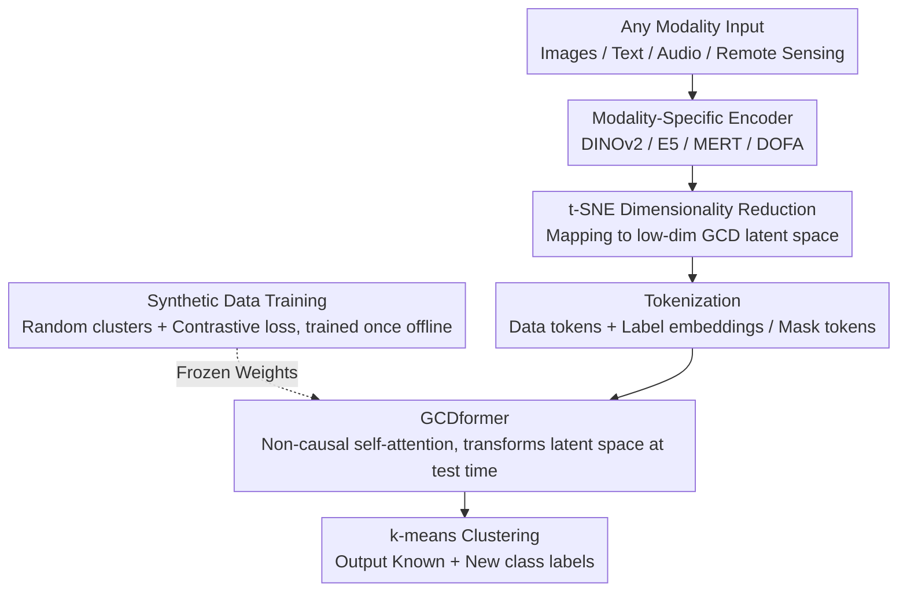

# OmniGCD: Abstracting Generalized Category Discovery for Modality Agnosticism

**Conference**: CVPR 2026 Findings  
**arXiv**: [2604.14762](https://arxiv.org/abs/2604.14762)  
**Code**: [github.com/Jordan-HS/OmniGCD](https://github.com/Jordan-HS/OmniGCD)  
**Area**: Self-supervised learning/Representation learning  
**Keywords**: generalized category discovery, modality-agnostic, zero-shot, transformer, synthetic training

## TL;DR

OmniGCD is proposed as the first modality-agnostic generalized category discovery method. By utilizing GCDformer trained on synthetic data, it transforms the GCD latent space of any modality into a more cluster-friendly representation during inference, achieving zero-shot GCD across 16 datasets spanning four modalities.

## Background & Motivation

Generalized Category Discovery (GCD) simulates human category learning by simultaneously identifying known classes and discovering new ones under partial supervision. Neuroscience research suggests that human category formation is an abstract process independent of sensory input. However, existing GCD methods typically operate within a single modality and require dataset-specific fine-tuning, neglecting the fundamental abstract nature of category learning. This motivates the design of a modality-agnostic solution—training once to enable zero-shot GCD across vision, text, audio, remote sensing, and other modalities.

## Method

### Overall Architecture

OmniGCD aims to perform "modality-agnostic" generalized category discovery: training once to zero-shot recognize known classes and discover new ones across any modality (images, text, audio, remote sensing). The overall workflow maps inputs to feature spaces using modality-specific encoders, reduces dimensionality via t-SNE to a low-dimensional GCD latent space, and then concatenates data tokens with label embeddings (for known classes) or mask tokens (for unknown classes) as input to GCDformer. During testing (without gradient updates), GCDformer transforms the latent space into a representation more suitable for clustering. Finally, k-means provides labels for both known and new classes. GCDformer itself is trained only once during an offline stage using synthetic data.

### Key Designs

**1. GCDformer: Abstracting Category Discovery as Latent Space Set Transformation**

The essence of GCD is "finding reasonable groupings for a set of points," which is independent of specific modalities. Based on this, a non-causal self-attention Transformer based on the GPT-2 architecture is used: the input is a concatenation of data tokens ($d$-dimensional features after reduction) and label tokens (sinusoidal positional encodings or learnable masks of $d_l$ dimensions). Crucially, it **does not encode positional information**, as GCD treats the input as a set rather than a sequence. The training objective is a contrastive loss that pulls same-class points closer and pushes different-class points further apart, allowing GCDformer to learn to organize clusterable structures regardless of the modality.

**2. Synthetic Data Training: Trading Synthetic Point Clouds for True Modality Agnosticism**

If GCDformer were exposed to any real modality data, it would develop modality-specific biases, undermining modality agnosticism. Consequently, this work relies entirely on synthetic data for training: generating up to 200 random clusters where cluster centers and intra-cluster points are sampled from Gaussian (Normal/Laplace/von Mises) or uniform distributions. Each cluster is assigned a random integer label, and a portion of points or entire clusters are randomly masked to simulate the mixed labeled/unlabeled GCD latent space. These synthetic data must satisfy two conditions: coverage of the GCD latent space and distributional alignment with real data. Thus, a low-dimensional (2D in experiments) latent space is chosen to make sampling controllable, which, combined with appropriate dimensionality reduction, allows the same trained GCDformer to be applied directly to all 16 datasets.

**3. Selection of Dimensionality Reduction: t-SNE Aligning Synthetic and Real Distributions**

The success of synthetic training depends on whether the synthetic distribution resembles the real distribution after dimensionality reduction. This paper compares PCA, UMAP, and t-SNE, finding that t-SNE is optimal in terms of synthetic-real KL divergence (1.41) and metrics such as cluster separation, expansion, and overlap. This is because the non-linear mapping and heavy-tailed t-distribution of t-SNE better preserve local structures and alleviate crowding, making the synthetic latent space closely approximate the real one.

### Loss & Training

A contrastive loss with a margin is employed: pairs from the same class are pulled closer using $L^2$ distance, while pairs from different classes are pushed apart subject to a margin constraint. GCDformer is trained only once, and the same model is shared across all 16 datasets.

## Key Experimental Results

### Main Results

Average accuracy gain (pp) across 16 datasets and 4 modalities:

| Modality | Known Class Gain | New Class Gain |
|----------|------------------|----------------|
| Vision   | +6.2pp           | +6.2pp         |
| Text     | +17.9pp          | +17.9pp        |
| Audio    | +1.5pp           | +1.5pp         |
| Remote Sensing | +12.7pp    | +12.7pp        |

This work represents the first implementation of GCD in the audio modality.

### Ablation Study

- t-SNE dimensionality reduction is superior to PCA and UMAP (lowest KL divergence, optimal cluster quality).
- GCDformer overfits quickly on synthetic data, necessitating sufficient sampling diversity.
- Encoder quality directly impacts ultimate GCD performance.

### Key Findings

- The perspective of abstracting GCD as a representation space transformation problem is novel.
- Training on synthetic data achieves true modality agnosticism.
- Encoder quality remains the performance bottleneck—better "eyes" directly lead to better GCD.

## Highlights & Insights

- The research motivation, inspired by abstract category formation in the human prefrontal cortex, is natural and compelling.
- The design decoupling representation learning from category discovery allows modality encoders and GCD capabilities to progress independently.
- The new setting of zero-shot GCD fills a vacancy in existing literature.

## Limitations & Future Work

- The non-parametric nature of t-SNE dimensionality reduction limits instantaneous inference for new data.
- Low-dimensional latent spaces may lose information critical for certain fine-grained distinctions.
- Synthetic data generation strategies still require manual design.

## Related Work & Insights

- The idea of using a Transformer as a general set processor can be generalized to other tasks requiring grouping or clustering.
- The paradigm of synthetic training combined with zero-shot inference is instructive for cross-domain generalization.
- The modality-agnostic GCD benchmark provides a rigorous evaluation framework for subsequent work.

## Rating

7/10 — The problem definition is novel and the cross-modality generalization is impressive, though the dependence on t-SNE and low-dimensional constraints requires future resolution.

<!-- RELATED:START -->

## Related Papers

- [\[CVPR 2026\] Decouple Your Discovery and Memory in Continual Generalized Category Discovery](decouple_your_discovery_and_memory_in_continual_generalized_category_discovery.md)
- [\[CVPR 2026\] Seeing Through the Shift: Causality-Inspired Robust Generalized Category Discovery](seeing_through_the_shift_causality-inspired_robust_generalized_category_discover.md)
- [\[CVPR 2026\] Learning Like Humans: Analogical Concept Learning for Generalized Category Discovery](learning_like_humans_analogical_concept_learning_for_generalized_category_discov.md)
- [\[CVPR 2026\] TAR: Token-Aware Refinement for Fine-grained Generalized Category Discovery](tar_token-aware_refinement_for_fine-grained_generalized_category_discovery.md)
- [\[NeurIPS 2025\] Consistent Supervised-Unsupervised Alignment for Generalized Category Discovery](../../NeurIPS2025/self_supervised/consistent_supervised-unsupervised_alignment_for_generalized_category_discovery.md)

<!-- RELATED:END -->
