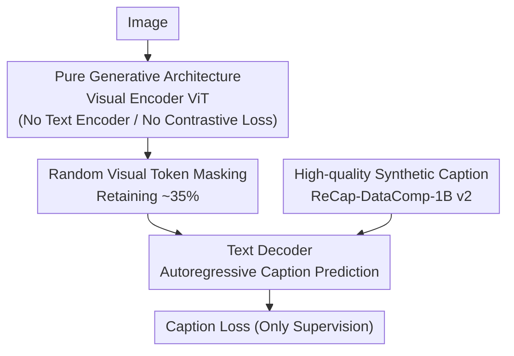

# OpenVision 2: A Family of Generative Pretrained Visual Encoders for Multimodal Learning

**Conference**: CVPR 2026  
**Paper**: [CVF Open Access](https://openaccess.thecvf.com/content/CVPR2026/html/Liu_OpenVision_2_A_Family_of_Generative_Pretrained_Visual_Encoders_for_CVPR_2026_paper.html)  
**Code**: https://github.com/UCSC-VLAA/OpenVision  
**Area**: Self-supervised / Representation Learning  
**Keywords**: Visual encoder pretraining, generative pretraining, caption-only, token masking, multimodal

## TL;DR
OpenVision 2 removes the text encoder and contrastive loss from the previous generation (OpenVision), retaining only the "image encoder + text decoder" for pure generative caption-only pretraining. By randomly masking approximately 2/3 of visual tokens, it reduces ViT-L/14 training time by ~1.5× and memory usage by ~1.8× with almost no performance degradation, while enabling scaling the visual encoder up to 1 billion parameters.

## Background & Motivation
**Background**: Multimodal foundation models have long relied on visual components from non-fully open-source solutions like OpenAI CLIP or Google SigLIP. The previous OpenVision provided a fully open-source alternative—using only public data and code to train a competitive family of visual encoders ranging from 5.9M to 632M parameters.

**Limitations of Prior Work**: The recipe for OpenVision is significantly **heavier** than original CLIP. It assigns two captions (web-crawled + synthetic) to each image for a "dual contrastive loss," doubling the text encoder's workload, and adds an extra text decoder for autoregressive prediction of synthetic captions (generative loss). Although CLIPA-style low-resolution pretraining followed by high-resolution fine-tuning hides some costs, the multi-branch structure of **text encoder + dual contrastive + extra decoder** remains expensive in terms of FLOPs and memory, restricting standard users and hindering further scaling.

**Key Challenge**: The community has long believed that "CLIP-style contrastive learning is indispensable for training scalable general visual encoders," yet the contrastive branch is the primary source of computational bottlenecks. Can a strong encoder be trained relying **solely on generative signals**?

**Goal**: Based on OpenVision, find a simpler and more efficient training recipe that maintains downstream multimodal performance while significantly reducing costs and scaling to billion-parameter sizes.

**Key Insight**: Following prior works such as CapPa and AIMv2 that use "caption as supervision," as well as modern multimodal designs like LLaVA where the "encoder feeds directly into the decoder," the authors bet on a minimalist hypothesis—**completely remove the text encoder** and the associated image-text contrastive loss.

**Core Idea**: Collapse the multi-branch pipeline into two modules: an "image encoder + text decoder," learning visual representations purely via caption loss. Further reduce costs by randomly masking most visual tokens, proving that a pure generative, caption-only objective is sufficient to rival contrastive methods.

## Method

### Overall Architecture
The training loop of OpenVision 2 is extremely streamlined: an image passes through the visual encoder to produce a sequence of visual tokens, which are **randomly masked by approximately 2/3**. The remaining ~1/3 are directly concatenated into a text decoder, which autoregressively predicts the synthetic caption corresponding to the image. The entire supervisory signal comes from this caption loss, with no text encoder or contrastive loss. This structure is deliberately aligned with downstream multimodal fine-tuning (e.g., LLaVA), eliminating the objective mismatch of "pretraining with contrastive, fine-tuning with generation," which theoretically benefits smooth knowledge transfer.

### Key Designs

**1. Pure Generative Caption-only Architecture: Removing Text Encoder and Contrastive Loss**

This is the core simplification of OpenVision 2. To utilize synthetic captions, the previous generation carried two burdens: the text encoder processed two captions per image for dual contrastive objectives, and a text decoder performed autoregressive prediction—both significantly increased training FLOPs and GPU memory. OpenVision 2 **drops the text encoder and the entire image-text contrastive loss**, leaving only a two-step cycle: "encoder produces visual tokens → decoder predicts caption." This saves computation and aligns the pretraining structure with LLaVA-style fine-tuning. Unlike CapPa, it uses higher-quality synthetic captions, simple concatenation instead of cross-attention, and pure autoregressive decoding. Unlike AIMv2, it uses only text generation signals without pixel reconstruction and uses standard ViT backbones rather than prefix-ViT.

**2. Random Visual Token Masking: Retaining ~35% Tokens for Efficiency and Regularization**

On top of the generative architecture, the authors add an efficiency tweak—**randomly masking about 2/3 of visual tokens** during pretraining, feeding only the remaining ~1/3 to the text decoder. While intuitively meant to reduce decoder load, ablations show it **improves multimodal performance**: a keep ratio of 25%–35% is optimal, performing better than 100% (no masking) or 10% (too aggressive). The reason is that moderate masking forces the model to generate captions using fewer, more informative visual tokens, thereby strengthening local semantic representations. The default is set to 35% keep.

**3. High-quality Synthetic Caption Data (ReCap-DataComp-1B v2): Providing Dense Supervision**

Since caption-only methods rely entirely on caption quality, data is critical. Instead of noisy web alt-text, the authors use Llama-3-driven LLaVA to rewrite DataComp-1B into synthetic captions and further enhance them: the captioner is **conditioned on the original alt-text** and uses weighted top-k sampling to produce longer, more grounded, and diverse descriptions, named ReCap-DataComp-1B v2. Ablations show caption quality has a massive impact: compared to alt-text, synthetic captions improve TextVQA by +5.1 and OCR-Bench by +53. v2 is stronger on OCR tasks and is set as the default.

### Loss & Training
- **Only Loss**: Autoregressive (next-token) caption loss from the text decoder on synthetic captions, with a loss weight of 2.
- **Multi-stage Curriculum**: 84px long pretraining (10,000 ImageNet-scale epochs) → 224px fine-tuning (800 epochs) → optional 336/448px high-resolution expansion (200 epochs each).
- **Optimization**: AdamW ($\beta_1{=}0.9, \beta_2{=}0.95$, weight decay 0.2) + cosine schedule, with learning rate linearly scaled with global batch size; mixed precision (float32 parameters + bfloat16 optimizer states); captions truncated/padded to 128 tokens; default 35% token keep ratio.

## Key Experimental Results

### Main Results
Multimodal downstream tasks were evaluated under the LLaVA-1.5 and Open-LLaVA-Next frameworks. The table below shows a comparison under the LLaVA-1.5 framework with the ViT-L/14 setting (OCR. refers to OCR-Bench; MME includes perception/cognition; higher is better):

| Method | Resolution | TextVQA | ChartQA | OCR. | SEED | POPE |
|------|--------|---------|---------|------|------|------|
| OpenAI-CLIP L/14 | 224 | 56.1 | 13.2 | 177 | 66.0 | 85.0 |
| OpenVision L/14 | 224 | 57.7 | 13.9 | 315 | 69.5 | 86.4 |
| **OpenVision 2 L/14** | 224 | **59.0** | 13.7 | **327** | 69.3 | **87.1** |
| OpenVision L/14 | 336 | 61.2 | 15.7 | 339 | 70.5 | 87.2 |
| **OpenVision 2 L/14** | 336 | **63.0** | 14.5 | **357** | 70.1 | **87.7** |

Overall, OpenVision 2 matches or slightly exceeds OpenVision, with **notable improvements in OCR-related tasks** (due to synthetic captions + token masking enhancing fine-grained recognition). It scales stably to SoViT-400M, H/14, and g/14 (1.01B parameters).

### Ablation Study

| Dimension | Configuration | Key Metric | Description |
|------|------|----------|------|
| Training Efficiency | OpenVision → OV2 (L/14@224) | 83h → 57h; 24.5GB → 13.8GB | ~1.5× speedup, ~1.8× memory saving, batch 2k→8k |
| Training Efficiency | OpenVision → OV2 (SoViT-400M@384) | 241h → 121h; 27.4GB → 14.5GB | ~2× speedup; OV OOMs at batch 1k |
| Component Analysis | CapPa → +Mask → +CLIPA → Both | 217h → 190h → 67h → 55h | CLIPA and masking are individually effective; combined is optimal |
| Caption Type | alt-text / ReCap / ReCap v2 | TextVQA 51.8 / 56.9 / 56.5 | Synthetic captions significantly outperform alt-text |
| Token Keep Ratio | 100% / 35% / 10% | OCR 254 / 291 / 276 | 25–35% is optimal; over-masking or no masking is worse |

### Key Findings
- **Masking saves computation and improves performance**: A keep ratio of 25–35% outperforms both "full retention" and "10% retention" on OCR-Bench and TextVQA, suggesting masking acts as a regularizer.
- **Caption quality is the ceiling**: Switching from alt-text to synthetic captions improves OCR-Bench by +53, confirming that pure generative objectives are extremely sensitive to supervision quality.
- **Efficiency dividends can be reinvested into scaling**: Given equal computation, the priority for improvement is "Resolution > Training Duration > Model Size," with resolution offering the highest gains.
- **Contrastive loss is not mandatory**: A pure caption-only objective can rival CLIP-style contrastive methods, challenging the consensus that contrastive learning is indispensable.

## Highlights & Insights
- **Efficiency through subtraction**: Removing the text encoder and contrastive loss to collapse the architecture into two modules is a powerful engineering decision—proving "less is more" in visual encoder pretraining.
- **Pretraining-Downstream Alignment**: The caption-only architecture naturally fits LLaVA-style downstream fine-tuning, eliminating objective mismatch. This "structural alignment" is transferable to other scenarios requiring consistency.
- **Masking as regularization**: The finding that dropping visual tokens improves representation quality is highly reusable in generative visual pretraining.
- **Scaling to 1 billion parameters**: Computational savings allowed the push to g/14 (1.01B), setting a new baseline for fully open-source large visual backbones.

## Limitations & Future Work
- **Preliminary Results**: Many conclusions are noted as preliminary; whether the pure generative paradigm remains robust at even larger scales or longer training requires further validation.
- **Evaluation Bias**: benchmarks still lean toward VQA/perception. While expanding on CapPa with MME and ChartQA, coverage of retrieval, fine-grained localization, and compositional reasoning remains limited.
- **Dependence on Synthetic Pipelines**: The performance ceiling is locked by the quality of ReCap-DataComp-1B v2; the method may fail in domains with poor caption quality.
- **Future Directions**: Investigating the impact of caption length/diversity, making masking ratios adaptive, and testing the scalability boundaries on massive datasets.

## Related Work & Insights
- **vs. OpenVision (v1)**: v1 used dual-contrastive + generative branches and was heavier; v2 is a "slimmed-down" successor that drops the text encoder and contrastive loss while maintaining/improving performance.
- **vs. CapPa**: Both take a caption-only path, but v2 uses higher-quality synthetic captions, concatenation instead of cross-attention, random token masking, pure autoregressive decoding, and scales to 1.01B parameters.
- **vs. AIMv2**: AIMv2 performs pixel reconstruction + text generation using prefix-ViT; v2 uses only text generation with standard ViT, masking ~2/3 of tokens for efficiency and performance.
- **vs. CLIP / SigLIP**: As a fully open-source generative alternative, it outperforms these contrastive closed/semi-open solutions on several OCR-related benchmarks.

## Rating
- Novelty: ⭐⭐⭐⭐ Not a brand-new paradigm, but the combination of "no contrastive + masking as regularization + high-quality synthetic captions" is clean and effective.
- Experimental Thoroughness: ⭐⭐⭐⭐ Comprehensive primary experiments across frameworks and scales, plus detailed efficiency/masking ablations; however, task coverage is skewed toward VQA.
- Writing Quality: ⭐⭐⭐⭐ Motivation and simplification logic are clear, and comparisons with prior work are well-structured.
- Value: ⭐⭐⭐⭐⭐ Fully open-source, affordable to train, and scalable to 1B parameters; extremely useful for visual encoder research with limited compute.

<!-- RELATED:START -->

## Related Papers

- [\[CVPR 2026\] GM-R²: Generative Matching Learning for Unsupervised Geometric Representation and Registration](gm-r2_generative_matching_learning_for_unsupervised_geometric_representation_and.md)
- [\[CVPR 2026\] Residual Connections Harm Generative Representation Learning](residual_connections_harm_generative_representation_learning.md)
- [\[CVPR 2026\] Exploring Visual Pretraining for Learning Language Intelligence](exploring_visual_pretraining_for_learning_language_intelligence.md)
- [\[CVPR 2026\] Learning to See Through a Baby's Eyes: Early Visual Diets Enable Robust Visual Intelligence in Humans and Machines](learning_to_see_through_a_babys_eyes_early_visual_diets_enable_robust_visual_int.md)
- [\[CVPR 2026\] Stabilizing Feature Geometry in Noisy Pretrained Models for Robust Downstream Tasks](stabilizing_feature_geometry_in_noisy_pretrained_models_for_robust_downstream_ta.md)

<!-- RELATED:END -->
