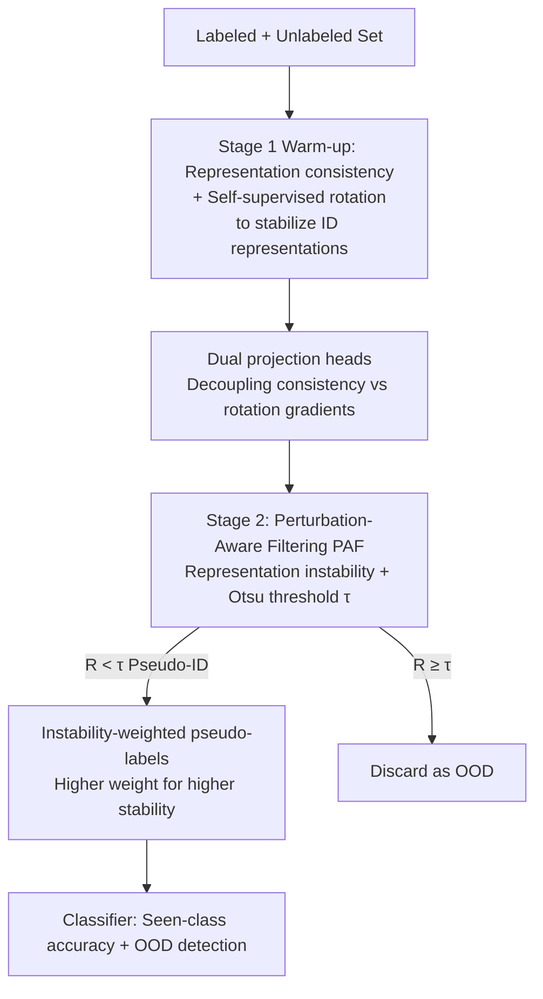

# PAF: Perturbation-Aware Filtering for Open-Set Semi-Supervised Learning

**Conference**: CVPR 2026  
**Paper**: [CVF Open Access](https://openaccess.thecvf.com/content/CVPR2026/html/Han_PAF_Perturbation-Aware_Filtering_for_Open-Set_Semi-Supervised_Learning_CVPR_2026_paper.html)  
**Code**: https://github.com/njustkmg/CVPR26-PAF  
**Area**: Self-Supervised / Semi-Supervised Learning  
**Keywords**: Open-Set Semi-Supervised Learning, OOD Detection, Representation Instability, Consistency Regularization, Pseudo-labeling  

## TL;DR
PAF distills the phenomenon that "OOD samples exhibit more unstable representations under semantic-preserving perturbations" into a representation-level filtering signal. It employs Otsu's adaptive thresholding to dynamically exclude open-set (OOD) samples from unlabeled data. Combined with a two-stage training framework, it achieves SOTA performance in both seen-class classification accuracy and OOD detection AUC on benchmarks like MNIST, CIFAR, and TinyImageNet.

## Background & Motivation
**Background**: Semi-supervised learning (SSL) leverages a small amount of labeled data and large amounts of unlabeled data to approach fully supervised performance, primarily via consistency regularization and pseudo-labeling. However, traditional SSL assumes that unlabeled and labeled data share the same category set.

**Limitations of Prior Work**: In practice, unlabeled data almost certainly contains "unseen categories" during training, i.e., OOD samples. These OOD samples pollute pseudo-labels and skew decision boundaries. The core of Open-Set Semi-Supervised Learning (OSSL) is to distinguish ID (in-distribution) samples from OOD samples in the unlabeled set. Existing OSSL methods—such as OVA decision boundaries (OpenMatch), adding an "unknown" class (IOMatch), or evidential/Bayesian uncertainty modeling—rely on **single-view prediction confidence**, which serves as a "static" criterion.

**Key Challenge**: The authors observe that ID and OOD samples exhibit different sensitivities to "semantic-preserving perturbations" (e.g., flipping, slight color jittering). Specifically, the maximum softmax confidence of OOD samples fluctuates violently, whereas ID samples remain relatively stable (a phenomenon previously identified as confidence mutation). However, confidence is merely a **shallow projection** of deep representation instability: while small representation changes lead to small confidence changes, the reverse is not necessarily true. Directly measuring confidence misses many subtle representation variations, leading to insufficient discriminative power. Preliminary experiments (Figure 1) quantify this: the separation score for ID/OOD samples based on confidence mutation is only 0.0462, whereas representation instability yields a score of 0.1386.

**Core Idea**: This work proposes using **representation-level instability** (the L2 change of the penultimate layer representation under multiple perturbed views) as the OOD filtering signal instead of confidence mutation. It applies Otsu's adaptive thresholding to dynamically bisect the unlabeled set into ID and OOD. Simultaneously, a two-stage training strategy is designed to first "train" the stability of ID representations against perturbations before utilizing this stability for filtering and weighting.

## Method

### Overall Architecture
The input to PAF consists of a small labeled set $\mathcal{D}_l$ and a large unlabeled set $\mathcal{D}_u$ containing OOD samples. The output is a classifier capable of accurately classifying seen classes and filtering OOD samples. The method follows a causal chain: to reliably use "representation instability" to determine OOD status, the model must first learn ID representations that are stable under semantic-preserving perturbations. Thus, training is divided into two stages.

- **Stage 1 (Warm-up)**: The model uses supervised cross-entropy $\mathcal{L}_{ce}$ on labeled data, while representation consistency regularization $\mathcal{L}_{con}$ "stabilizes" ID representations under perturbation. An additional self-supervised rotation prediction task $\mathcal{L}_{rot}$ is added to the backbone (WideResNet28-2) to supplement semantic structure. This stage does not involve filtering unlabeled data; it solely prepares a "stable representation" foundation for PAF.
- **Stage 2**: The checkpoint from Stage 1 is loaded. Every 20 epochs, PAF bisects the unlabeled set based on representation instability. For the filtered pseudo-ID subset $\mathcal{X}_u^{ID}$, an "instability-weighted pseudo-label" loss $\mathcal{L}_u$ is applied. $\mathcal{L}_{con}$ continues on pseudo-ID samples, and $\mathcal{L}_{rot}$ is applied to all samples.

To prevent gradient conflicts between the consistency loss (which aims to **align** representations of different views of the same image) and the rotation loss (which aims to **separate** representations of different rotation angles), two independent projection/classification heads are attached to the backbone, ensuring gradients do not interfere in their respective subspaces.

### Key Designs

**1. Perturbation-Aware Filtering (PAF): Using Representation Instability for OOD Detection**

This is the core of the paper. Addressing the limitation that confidence is a shallow projection of representation instability, PAF directly measures the sensitivity of samples to semantic-preserving perturbations in the penultimate representation space. Given an unlabeled sample $\mathbf{x}^u$, the perturbation operator $A$ (weak augmentation like flipping) generates $K_a$ views. Let $\varphi(\cdot)$ be the backbone representation and $\phi_{con}(\cdot)$ be the consistency projection head. Representation instability is defined as:

$$R(\mathbf{x}^u) = \frac{1}{K_a d}\sum_{k=1}^{K_a} \left\| \phi_{con}\bigl(\varphi(\mathbf{x}^u)\bigr) - \phi_{con}\bigl(\varphi(\mathbf{x}^u_{(k)})\bigr) \right\|_2^{2}$$

Where $d$ is the representation dimension and $\mathbf{x}^u_{(k)}$ is the $k$-th perturbed view (for efficiency, $K_a=1$). Instead of a manual threshold, **Otsu's criterion** automatically calculates an adaptive threshold $\tau$ based on the distribution of $R$ within the current batch to bisect the unlabeled set:

$$\mathcal{X}_u^{ID} = \{\mathbf{x}^u \mid R(\mathbf{x}^u) < \tau\},\quad \mathcal{X}_u^{OOD} = \{\mathbf{x}^u \mid R(\mathbf{x}^u) \ge \tau\}$$

**Mechanism**: The authors prove from a Lipschitz-margin perspective that perturbation-induced prediction variance decays exponentially with the decision margin $m(\mathbf{x})$ ($\mathrm{Var}_\delta[s(\mathbf{x}+\delta)] \le \beta^2(K-1)^2 e^{-2m(\mathbf{x})}\sigma^2$). ID samples with large margins are naturally stable, while OOD samples near the boundary are highly sensitive. Furthermore, confidence variation is bounded by representation variation ($|s(\mathbf{x})-s(\mathbf{x}')| \le \beta(K-1)e^{-m(\mathbf{x})}\|\varphi(\mathbf{x})-\varphi(\mathbf{x}')\|_2$). Thus, detecting representation instability is a **stricter** criterion than confidence, capturing subtle nuances invisible to confidence metrics.

**2. Representation Consistency Regularization: Pre-training Backbone Stability**

PAF relies on the model itself being invariant to perturbations. If even ID samples are unstable, the criterion fails. Thus, for an image $\mathbf{x}$, two weakly augmented views $\mathbf{x}'=A_1(\mathbf{x})$ and $\mathbf{x}''=A_2(\mathbf{x})$ are generated. The consistency head maps them to a compact embedding space, and the mean squared error is minimized:

$$\mathcal{L}_{con} = \frac{1}{d\,|\mathcal{D}_l|}\sum_{\mathbf{x}\in\mathcal{D}_l}\bigl\|\phi_{con}\bigl(\varphi(\mathbf{x}')\bigr) - \phi_{con}\bigl(\varphi(\mathbf{x}'')\bigr)\bigr\|_2^{2}$$

This is applied to labeled data in Stage 1 and to pseudo-ID samples in Stage 2. This step explicitly encodes the property that "representations should be stable under semantic-preserving perturbations" into the representation space, forming the basis for $R$ to distinguish ID/OOD.

**3. Instability-Weighted Pseudo-labeling: Reusing Filtering Signals for Training**

For the pseudo-ID subset filtered by PAF, the authors do not treat all samples equally. Instead, each sample's contribution is modulated by its perturbation instability $\delta(\mathbf{x}^u)$. For each $\mathbf{x}^u\in\mathcal{X}_u^{ID}$, weakly and strongly augmented views $x^w, x^s$ are generated with soft predictions $p^w, p^s$. Pseudo-labels are adopted only when $\max(p^w)\ge\alpha$, minimizing the weighted KL divergence:

$$\mathcal{L}_{u} = \frac{1}{|\mathcal{X}_u^{ID}|}\sum_{\mathbf{x}^u\in\mathcal{X}_u^{ID}}\bigl(1-\hat{\delta}(\mathbf{x}^u)\bigr)\,\mathds{1}\!\bigl[\max(p^w)\ge\alpha\bigr]\,\mathrm{KL}\bigl(p^w\,\Vert\,p^s\bigr)$$

Where $\hat{\delta}$ is the min-max normalized instability score. More stable samples ($\hat{\delta}\to0$) receive higher weights. This ensures that "confident and stable" samples dominate the decision boundary.

**4. Self-Supervised Rotation + Dual Projection Heads: Supplemental Semantics and Gradient Decoupling**

When labeled data is scarce, the backbone may not learn sufficiently discriminative representations. The authors introduce a rotation prediction task (predicting angles $\{0°, 90°, 180°, 270°\}$), applied to all samples in both stages:

$$\mathcal{L}_{rot} = -\frac{1}{4|\mathcal{D}_l\cup\mathcal{D}_u|}\sum_{\mathbf{x}}\sum_{r\in\pi}\log p(r\mid\phi_{rot}(\mathbf{x}^r))$$

However, the rotation task (aiming to **separate** different orientations) conflicts with the consistency task (aiming to **align** views of the same image). Sharing a projection space causes gradient interference. The authors provide a dedicated projection head/classification head for each branch, ensuring independent gradient flow. Ablation shows this as the most critical design (removing it drops performance by nearly 16%).

### Loss & Training
- **Stage 1 (50k iterations)**: $\mathcal{L} = \mathcal{L}_{ce} + \mathcal{L}_{con} + \mathcal{L}_{rot}$.
- **Stage 2 (200k iterations)**: $\mathcal{L} = \mathcal{L}_{ce} + \mathcal{L}_u + \mathcal{L}_{con} + \mathcal{L}_{rot}$, with re-filtering by PAF every 20 epochs.
- Backbone: 2-layer CNN for MNIST, WideResNet28-2 for others; SGD with initial learning rate 0.03, momentum 0.9, labeled/unlabeled batch sizes of 64/128. Results are averaged over three random seeds.

## Key Experimental Results

### Main Results
Seen-class classification accuracy (%) under internal OOD scenarios (unseen classes from the same dataset included in the unlabeled set; mismatch ratio = OOD proportion):

| Dataset (mismatch) | Ours | BDMatch | SCOMatch | ANEDL |
|------|------|---------|----------|-------|
| MNIST 0.3 / 0.6 | **99.4 / 99.2** | 99.1 / 99.1 | 99.0 / 99.0 | 98.9 / 98.6 |
| CIFAR-10 0.3 / 0.6 | **93.1 / 90.8** | 92.5 / 90.4 | 92.2 / 90.2 | 91.8 / 90.1 |
| CIFAR-100 0.3 / 0.6 | **77.7 / 75.9** | 75.9 / 73.7 | 75.3 / 73.5 | 75.4 / 73.8 |
| TinyImageNet 0.3 / 0.6 | **58.1 / 54.6** | 56.7 / 52.9 | 54.2 / 52.3 | 47.6 / 45.8 |

The improvement in OOD detection AUC (%) is even more significant, with larger gaps on harder datasets:

| Dataset (mismatch) | Ours | ProSub | OSP |
|------|------|--------|-----|
| CIFAR-10 0.3 / 0.6 | **96.1 / 93.6** | 89.1 / 84.5 | 88.3 / 83.6 |
| CIFAR-100 0.3 / 0.6 | **84.5 / 76.7** | 73.2 / 67.0 | 71.8 / 65.2 |
| TinyImageNet 0.3 / 0.6 | **64.8 / 61.1** | 56.2 / 52.0 | 54.4 / 50.1 |

In external OOD scenarios (CIFAR-10 as ID, TinyImageNet/LSUN/Noise as OOD), the method leads across almost all 12 configurations. PAF also shows plug-and-play capability with CLIP-driven frameworks like CFSG-CLIP.

### Ablation Study
CIFAR-100, mismatch 0.3:

| Configuration | Acc | AUC | Description |
|------|-----|-----|------|
| Full PAF | 77.7 | 84.5 | Full model |
| w/o PAF | 71.2 | 74.8 | Core PAF removed; Acc drops 6.5, AUC drops ~10 |
| w/o Independent Heads | 61.8 | 70.2 | Gradient conflict; drops ~16%, most critical |
| w/o $\mathcal{L}_{con}$ | 75.1 | 81.3 | Acc drops ~3 |
| w/o $\mathcal{L}_{rot}$ | 75.6 | 81.2 | Acc/AUC decrease synchronously |
| Confidence Filtering | 74.5 | 78.2 | Significantly worse than representation filtering |

### Key Findings
- **Independent heads are essential**: Removing them leads to a 16% drop, confirming the conflict between consistency and rotation gradients.
- **Representation Filtering > Confidence Filtering**: As a perturbation criterion, PAF outperforms confidence filtering in both Acc and AUC. On CIFAR-100, PAF's ID retention is +9.9% higher and OOD rejection is +12.2% higher than confidence-based methods.
- **Difficulty correlates with gain**: The AUC improvement is much larger on CIFAR-100 and TinyImageNet than on MNIST, suggesting representation-level signals are more valuable as separation becomes harder.

## Highlights & Insights
- **Upgrade from "Confidence Mutation" to "Representation Instability"**: The core insight is that confidence is bounded by representation variation. A representation-level criterion is stricter and captures finer details. This "deep vs. shallow signal" argument suggests that many detection tasks using logits could benefit from returning to the representation space.
- **Dynamic Bisection via Otsu's Threshold**: Adapting Otsu's method from image binarization to automatically set thresholds for instability distributions is a clever, adaptive trick that eliminates manual tuning.
- **Consistency in Signal Reuse**: Using instability $\delta$ for both filtering and training weights ensures consistency throughout the pipeline and avoids disjointed criteria.

## Limitations & Future Work
- Representation instability $R$ depends on Stage 1 stabilizing ID representations; if warm-up is insufficient or labels are extremely scarce, the criterion may be unreliable. The paper lacks boundary analysis for extremely low-label regimes.
- Efficiency relies on default $K_a=1$; whether multiple views further improve separation at a reasonable cost remains unexplored.
- Benchmarks are limited to standard datasets; robustness in larger-scale, real-world open environments (e.g., long-tail distributions combined with domain shift) requires further validation.

## Related Work & Insights
- **vs OpenMatch / IOMatch**: These rely on OVA boundaries or "unknown" classes and static single-view confidence; PAF utilizes dynamic instability under perturbation and provides theoretical proof of its superiority.
- **vs Confidence Mutation [48]**: Previous work identified OOD confidence fluctuations but remained at the confidence level. This work moves to the representation space, increasing the separation score from 0.0462 to 0.1386.
- **vs UDA**: This work extends UDA by weighting unlabeled sample contributions based on stability rather than treating all samples equally.

## Rating
- Novelty: ⭐⭐⭐⭐ Upgrading confidence mutation to representation instability with Lipschitz-margin theory is a motivated and clear extension.
- Experimental Thoroughness: ⭐⭐⭐⭐⭐ Comprehensive coverage across internal/external OOD, multiple datasets, and ablation studies.
- Writing Quality: ⭐⭐⭐⭐ Consistent chain of logic from observation to theory to method.
- Value: ⭐⭐⭐⭐ Solid SOTA performance on OSSL with plug-and-play potential for other frameworks.

<!-- RELATED:START -->

## Related Papers

- [\[ICLR 2026\] FedOpenMatch: Towards Semi-Supervised Federated Learning in Open-Set Environments](../../ICLR2026/self_supervised/fedopenmatch_towards_semi-supervised_federated_learning_in_open-set_environments.md)
- [\[AAAI 2026\] Let the Void Be Void: Robust Open-Set Semi-Supervised Learning via Selective Non-Alignment](../../AAAI2026/self_supervised/let_the_void_be_void_robust_open-set_semi-supervised_learning_via_selective_non-.md)
- [\[CVPR 2026\] SECOS: Semantic Capture for Rigorous Classification in Open-World Semi-Supervised Learning](secos_semantic_capture_for_rigorous_classification_in_open-world_semi-supervised.md)
- [\[CVPR 2026\] GaussianMatch: Semi-Supervised Regression with Pseudo-Label Filtering via Multi-View Gaussian Consistency](gaussianmatch_semi-supervised_regression_with_pseudo-label_filtering_via_multi-v.md)
- [\[ICLR 2026\] Adversarial Encoding Perturbation and Synthesis for Set Representation Auxiliary Learning](../../ICLR2026/self_supervised/adversarial_encoding_perturbation_and_synthesis_for_set_representation_auxiliary.md)

<!-- RELATED:END -->
