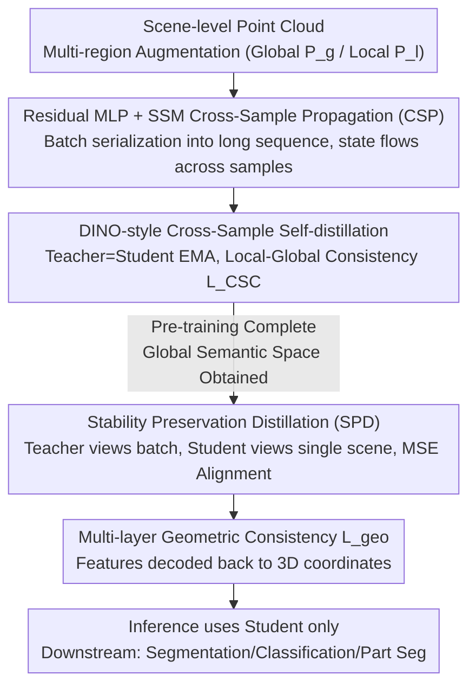

# PointCSP: Cross-Sample Semantic Propagation and Stability Preservation in Self-Supervised Point Cloud Learning

**Conference**: CVPR 2026  
**Paper**: [CVF Open Access](https://openaccess.thecvf.com/content/CVPR2026/html/Yu_PointCSP_Cross-Sample_Semantic_Propagation_and_Stability_Preservation_in_Self-Supervised_Point_CVPR_2026_paper.html)  
**Code**: To be confirmed  
**Area**: Self-supervised Learning  
**Keywords**: Point cloud self-supervision, State Space Models, Cross-sample propagation, Self-distillation, Semantic consistency

## TL;DR
Addressing the issue of "semantic inconsistency across scenes caused by sample-independent modeling" in scene-level point cloud self-supervision, PointCSP utilizes State Space Models to serialize samples within a batch into long sequences for **Cross-Sample Semantic Propagation (CSP)** to establish a globally consistent semantic space. It then employs an asymmetric teacher-student **Stability Preservation Distillation (SPD)** to eliminate batch-dependency shifts during single-scene testing, achieving new SOTA results across S3DIS, 3DSES, ScanObjectNN, ModelNet40, and ShapeNetPart.

## Background & Motivation
**Background**: Scene-level point cloud self-supervised learning (PC-SSL) is the dominant paradigm for learning transferable geometric/semantic representations from raw 3D data. Existing methods follow three main trajectories—multi-view aggregation (PointContrast, SSPL), contextual reconstruction (MSP, MSC), and contrastive learning—all focusing on enhancing local geometry and view-level alignment.

**Limitations of Prior Work**: Nearly all these methods are built on the **sample-independent** assumption, where each scene is encoded in isolation with no semantic interaction between samples. Consequently, the **same semantic categories** in different scenes (e.g., "chairs" or "walls" in two different rooms) are scattered across disconnected regions in the embedding space (t-SNE in Fig.1a shows a failure to cluster identical categories across scenes), hindering the construction of a unified, transferable global semantic space and limiting cross-scene generalization.

**Key Challenge**: Scene-level point clouds present two inherent difficulties: (1) significant spatial/semantic variance across scenes leading to fragmented feature distributions; (2) a lack of explicit semantic continuity or dependency between samples. A naive solution would be scaling data to smooth differences, but acquisition and labeling of scene-level point clouds are expensive and inefficient. The problem becomes: **how to establish coherent global semantics even with limited/imbalanced data**.

**Goal**: (1) Explicitly model inter-sample semantic dependencies during pre-training to establish a globally consistent semantic space; (2) Resolve the structural misalignment and semantic drift caused by "batch dependency" when migrating from pre-training batch sequences to downstream single-scene testing.

**Key Insight**: The authors leverage the long-sequence modeling capabilities of State Space Models (SSM / Mamba). Since SSMs can recursively propagate hidden states along a sequence, multiple samples in a batch are **serialized into one long sequence** and fed into the SSM. This allows hidden states to flow across samples, transforming "sample-independent" modeling into "cross-sample continuous propagation."

**Core Idea**: Use SSM for Cross-Sample Semantic Propagation (CSP) to build a global semantic space during pre-training, then use asymmetric Stability Preservation Distillation (SPD) during fine-tuning to stabilize these semantics for single-scene inference, bridging the gap between pre-training and downstream applications.

## Method

### Overall Architecture
PointCSP is built on a DINO-style self-distillation framework, divided into pre-training and fine-tuning stages, centered on two mechanisms:

- **Pre-training (CSP)**: Concatenates feature sequences $\mathbf{F}_i$ of $B$ point cloud samples in a batch into a single unified long sequence $\mathbf{F}'$. This is fed into an SSM, allowing hidden states to propagate recursively across the serialized dimension, where each state encodes both intra-scene context and cross-sample semantic associations. This is combined with multi-region augmentation and DINO-style teacher-student modules (teacher as EMA of student), trained with a local-to-global semantic consistency loss.
- **Fine-tuning (SPD)**: Pre-training uses batch serialization; direct migration to single-scene testing causes semantic drift due to the lack of batch-level context. SPD allows the **teacher** to continue processing serialized batches to maintain the global semantic topology established during pre-training, while the **student** processes standard single-scene inputs and aligns with the teacher through feature matching. Only the student is used during inference, requiring no batch context.

The pipeline is a serial process of "two stages + two mechanisms":

### Key Designs

**1. Cross-Sample Semantic Propagation (CSP): Serializing batches into long sequences for inter-sample flow**

This mechanism directly addresses the "fragmented semantic space" caused by independent modeling. Given feature sequences $\mathbf{F}_i = [\mathbf{f}_{i,1},\dots,\mathbf{f}_{i,L}] \in \mathbb{R}^{L\times C}$ for each sample in a batch, CSP reshapes the entire batch into a unified sequence $\mathbf{F}' = [\mathbf{f}_{1,1},\dots,\mathbf{f}_{1,L},\mathbf{f}_{2,1},\dots,\mathbf{f}_{B,L}] \in \mathbb{R}^{(B\times L)\times C}$. The SSM maintains a hidden state $\mathbf{h}_t$ that evolves recursively: $\mathbf{h}_t = f_\theta(\mathbf{A}\mathbf{h}_{t-1} + \mathbf{B}\mathbf{f}'_t),\ \mathbf{y}_t = \mathbf{C}\mathbf{h}_t$, where $\mathbf{A}, \mathbf{B}, \mathbf{C}$ are learnable projections. As the sequence spans multiple samples, the hidden state carries semantics from "previous samples" to "subsequent samples," upgrading "local instance alignment" to "global contextual reasoning." Notably, each SSM block processes **randomly shuffled** tokens, forcing the model to learn semantic dependencies independent of spatial priors.

**2. DINO-style CSP + Multi-region Augmentation: A stable shell for self-supervised training**

For the self-supervised objective, multi-region augmentation constructs views: from the input, $\sim 60\%$ of candidate regions $P^r$ are selected. Then, $n$ global sub-regions $P^g$ (coverage $\sim [40\%, 80\%]$) and $m$ local sub-regions $P^l$ (coverage $\sim [10\%, 30\%]$) are sampled. The student processes $P^g$ and $P^l$, while the teacher processes only $P^g$. Using a local-to-global semantic consistency loss:

$$\mathcal{L}_{\text{CSC}} = -\frac{1}{n(m+n)}\sum_{i=1}^{n}\sum_{j=1}^{(m+n)} \mathbf{p}_i^t \cdot \log \mathbf{p}_j^s$$

This "multi-scale view + teacher-student consistency" allows CSP to learn hierarchical semantics under stable supervision via the EMA teacher.

**3. Stability Preservation Distillation (SPD): Closing the "Batch Pre-training vs. Single-scene Inference" gap**

While CSP establishes semantic continuity, batch serialization introduces **cross-sample structural dependencies**. Direct migration to single-scene testing leads to structural degradation and representation drift. SPD uses an asymmetric design: the teacher network aggregates batch-level features to preserve the global semantic distribution, while the student learns to reconstruct these structures under standard single-scene inputs using an MSE alignment loss:

$$\mathcal{L}_{\text{SPD}} = \frac{1}{N}\sum_{i=1}^{N}\|\mathbf{f}_i^s - \mathbf{f}_i^t\|_2^2$$

The teacher is updated via EMA to act as a "temporally smooth semantic anchor," while the student optimizes for downstream tasks. This asymmetric structure allows batch-level semantics to migrate successfully to inference without batch context.

**4. Multi-layer Geometric Consistency: Maintaining geometric reversibility from shallow to deep features**

To enhance geometric reversibility across semantic depths, feature subsets $\{f_k^{(l)}\}$ are randomly sampled from multiple encoding layers and decoded back to 3D coordinates $\hat{\mathbf{x}}_k^{(l)} = D_\phi^{(l)}(f_k^{(l)})$ via lightweight decoders. The layer-wise constraint is defined as $\mathcal{L}_{\text{geo}}^{(l)} = \frac{1}{K_s^{(l)}}\sum_k \|\hat{\mathbf{x}}_k^{(l)} - \mathbf{x}_k^{(l)}\|_2^2$, with weighted aggregation $\mathcal{L}_{\text{geo}} = \sum_l \alpha_l \mathcal{L}_{\text{geo}}^{(l)}$. This forces both shallow and deep features to retain geometric consistency with the original 3D structure.

### Loss & Training
The pre-training objective combines semantic consistency and multi-layer geometric constraints: $\mathcal{L}_{\text{pretrain}} = \mathcal{L}_{\text{CSC}} + \lambda_{\text{geo}}\mathcal{L}_{\text{geo}}$. The fine-tuning objective integrates task loss, SPD, and geometric constraints: $\mathcal{L}_{\text{fine-tune}} = \mathcal{L}_{\text{task}} + \lambda_{\text{SPD}}\mathcal{L}_{\text{SPD}} + \lambda_{\text{geo}}\mathcal{L}_{\text{geo}}$. Pre-training is conducted on ScanNetV2 (1513 scenes). The backbone uses Gated DeltaNet (an enhanced Mamba2). AdamW optimizer with cosine decay and warm-up is used. Inference is performed on single scenes to prevent information leakage.

## Key Experimental Results

### Main Results
Validated across 5 datasets. Semantic Segmentation (mIoU):

| Dataset | Protocol/Metric | PointCSP | Prev. SOTA | Gain |
|--------|----------|----------|----------|------|
| S3DIS | Area5 mIoU | **88.2** | CamPoint 83.3 | +4.9 |
| S3DIS | 6-fold mIoU | **93.1** | Sonata 82.3 | +10.8 |
| 3DSES Silver | OA (Pseudo) | **96.41** | Swin3D 93.46 | +2.95 |
| 3DSES Silver | OA (True) | **95.78** | PointNeXt-S 94.63 | +1.15 |

Instance-level Tasks (Classification OA / Part Seg Ins.mIoU):

| Dataset | Metric | PointCSP | Prev. SOTA |
|--------|------|----------|----------|
| ScanObjectNN (PB_T50_RS) | OA | **92.8** | CamPoint 92.1 |
| ModelNet40 | OA | **93.9** | PointSD 93.7 |
| ShapeNetPart | Ins. mIoU | **86.8** | Point-MoDE 86.5 |

The 93.1% mIoU on S3DIS 6-fold significantly outperforms previous methods.

### Ablation Study
Component ablation on S3DIS (Baseline = backbone only, no propagation/distillation):

| Configuration | mIoU | mAcc | OA | Description |
|------|------|------|----|------|
| Baseline | 84.7 | 87.7 | 96.8 | Backbone only |
| + CSP | 86.8 | 89.1 | 97.8 | Cross-sample propagation +2.1 |
| + SPD | 87.8 | 90.3 | 97.5 | Stability preservation distillation +3.1 |
| + CSP + SPD (Full) | **88.2** | **90.6** | **98.1** | Full Model |

Universality of SPD (integrated into CamPoint):

| Method | mIoU | mAcc | OA |
|------|------|------|----|
| CamPoint | 83.3 | 86.9 | 96.0 |
| CamPoint + SPD | 85.3(+2.0) | 87.9(+1.0) | 96.2(+0.2) |

### Key Findings
- **Synergy of CSP and SPD**: CSP facilitates semantic continuity during pre-training, while SPD preserves this structure during fine-tuning. The combination achieves 88.2% mIoU.
- **Plug-and-play SPD**: Integrating SPD into CamPoint yielded a 2.0% mIoU increase, proving SPD provides a general benefit independent of the primary backbone.
- **Batch Size Insensitivity**: Fine-tuning is highly stable across batch sizes (Fig.5), showing SPD successfully decouples the model from the batch dependency of pre-training.
- **Robustness to Token Shuffling**: SSMs effectively learn dependencies even with shuffled point tokens, proving propagation relies on semantics rather than spatial ordering.

## Highlights & Insights
- **Batch-as-Sequence**: Propagating hidden states along a concatenated long sequence via SSM is a novel break from the sample-independent assumption.
- **Asymmetric SPD**: The "Teacher guards global topology, Student adapts to single scene" design is a robust solution for discrepancies between pre-training and deployment.
- **Geometric Reversibility**: Multi-layer geometric constraints ensure that representations at different depths remain structurally coherent.
- **Cross-Scene Clustering**: t-SNE visualizations show semantic categories becoming tightly clustered across different scenes, validating the unified semantic space.

## Limitations & Future Work
- **Computational/Memory Cost**: Serializing a batch into a sequence of length $B \times L$ may lead to memory constraints with very large batch sizes.
- **Backbone Dependency**: The mechanisms are tied to SSM-based backbones (Gated DeltaNet/Mamba2); performance on pure Transformer backbones is unverified.
- **Baseline Inconsistency**: There is a minor discrepancy in baseline mIoU values (84.7 vs 83.8) between the ablation table and text.
- **Alpha Tuning**: Layer weights for geometric loss may require task-specific tuning.

## Related Work & Insights
- **vs. Scene-level PC-SSL (PointContrast/SSPL/MSP)**: Existing methods are sample-independent. PointCSP builds inter-sample dependencies via CSP to establish global semantics.
- **vs. Point Mamba Series**: While previous works focus on intra-sample long-range geometric dependencies, this work applies SSMs to the **cross-sample** dimension for semantic consistency.
- **vs. DINO**: Inherits the teacher-student framework but introduces CSP for consistency and SPD to solve the newly introduced batch-dependency shift.

## Rating
- Novelty: ⭐⭐⭐⭐⭐ (Breaking the sample-independent assumption via batch serialization is highly innovative)
- Experimental Thoroughness: ⭐⭐⭐⭐ (Extensive testing and universality validation, though lacks detailed training overhead analysis)
- Writing Quality: ⭐⭐⭐⭐ (Clear logic and complete formulations)
- Value: ⭐⭐⭐⭐ (Provides a practical paradigm for consistent scene-level semantics)

<!-- RELATED:START -->

## Related Papers

- [\[CVPR 2026\] VideoSSR: Video Self-Supervised Reinforcement Learning](videossr_video_self-supervised_reinforcement_learning.md)
- [\[CVPR 2026\] SECOS: Semantic Capture for Rigorous Classification in Open-World Semi-Supervised Learning](secos_semantic_capture_for_rigorous_classification_in_open-world_semi-supervised.md)
- [\[CVPR 2026\] DDSF: Robust Few-Shot Learning via Disentangled Subspaces with Determinantal Point Process](ddsf_robust_few-shot_learning_via_disentangled_subspaces_with_determinantal_poin.md)
- [\[CVPR 2026\] Progressive Mask Distillation for Self-supervised Video Representation](progressive_mask_distillation_for_self-supervised_video_representation.md)
- [\[ECCV 2024\] SCPNet: Unsupervised Cross-modal Homography Estimation via Intra-modal Self-supervised Learning](../../ECCV2024/self_supervised/scpnet_unsupervised_cross-modal_homography_estimation_via_intra-modal_self-super.md)

<!-- RELATED:END -->
