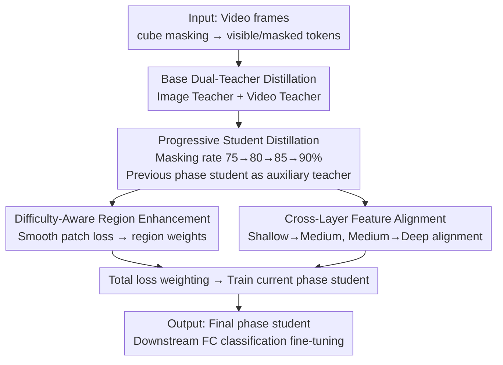

# Progressive Mask Distillation for Self-supervised Video Representation

**Conference**: CVPR 2026  
**Paper**: [CVF Open Access](https://openaccess.thecvf.com/content/CVPR2026/html/Wu_Progressive_Mask_Distillation_for_Self-supervised_Video_Representation_CVPR_2026_paper.html)  
**Code**: To be confirmed  
**Area**: Self-supervised Learning / Video Understanding  
**Keywords**: Self-supervised video representation, masked video modeling, progressive distillation, dynamic masking rate, knowledge distillation

## TL;DR
PMD addresses the issue where "a single masking rate cannot fully capture complex semantics" in masked video self-supervision. It employs four students with progressively increasing masking rates (75%→80%→85%→90%) for progressive distillation. Low-masking-rate students learn low-level semantics first and then serve as auxiliary teachers to guide high-masking-rate students in learning high-level semantics. Supplemented by difficulty-aware region enhancement and cross-layer feature alignment, it achieves SOTA on SSv2/K400/UCF-101/HMDB-51.

## Background & Motivation
**Background**: Masked visual modeling is a self-supervised task that does not depend on annotations—it learns representations by reconstructing masked patches from visible patches. Mainstream approaches use a fixed high masking rate (e.g., VideoMAE's tube masking at 90%) or use distillation with multi-scale/image-video/asymmetric masked teachers (DMAE, MVD, AMD).

**Limitations of Prior Work**: Under a fixed masking rate, the number of visible patches is constant, yet different semantics require different amounts of contextual patches for accurate reconstruction. High masking rates (90%) force the model to infer high-level semantics from extremely few patches. Consequently, reconstruction errors for certain critical local regions (e.g., a thrown object) remain high, preventing the model from interpreting object states and damaging the discriminative power for downstream action recognition.

**Key Challenge**: A single masking rate cannot balance "low-level details (requiring multi-patch neighborhoods)" and "high-level semantics (requiring strong inference from few patches)." Existing distillation methods ignore the **impact of semantic granularity on representation learning**, leading to insufficient semantic depth in the learned representations.

**Goal**: To allow semantic learning to unfold "from easy to difficult" while addressing two concurrent defects: insufficient modeling of key regions and semantic inconsistency between shallow and deep layers of the network.

**Key Insight**: The authors start from the intuition of "curriculum learning"—learning simple low-level semantics first with low masking rates and using this knowledge as a scaffold to guide the learning of difficult high-level semantics under high masking rates.

**Core Idea**: To extend the single masking rate into multi-phase dynamic masking rates, allowing the student from the previous phase to act as an additional teacher for the subsequent phase, thereby achieving progressive distillation.

## Method

### Overall Architecture
PMD is built upon the MVD-style masked video distillation framework: a masked video student is supervised by dual paths involving an image teacher and a video teacher (Base loss $\mathcal{L}_{base}=\mathcal{L}^{img}_{base}+\mathcal{L}^{vid}_{base}$, defined as the L2 distance between the decoded features of the student and teachers). On top of this, PMD incorporates three modules to address semantic insufficiency from single masking rates, insufficient modeling of key regions, and cross-layer semantic inconsistency. Training is conducted serially in four phases, with the masking rate increasing per phase. Each subsequent phase student is initialized with parameters from the previous phase and receives additional guidance from that student. Within each phase, epochs are divided into stages to smoothly estimate region losses. The final output is the student network from the last phase.

### Key Designs

**1. Progressive Student Distillation (PSD): Guiding high-level semantics with low-level semantics through phased masking rates**

The limitation is that when fixed high masking rates mask out critical patches, teachers cannot provide accurate representations, as complex semantics often depend on context from more visible patches. PMD uses a sequence of students with masking rates increasing from low to high to cover different semantic granularities: early phases use low masking rates to retain more visible patches for learning low-level neighborhood semantics (e.g., edges); later phases use high masking rates to remove redundant patches and learn high-level semantics from limited patches. To ensure an "easy-to-hard" transition, **later phase students are initialized with pre-trained parameters from earlier phases** to inherit low-level semantics. Beyond the original masked teachers, **students from previous phases serve as additional teachers** to guide the later phases. The first phase has no predecessor, so the progressive loss is 0; subsequent phases use the decoded features $\{x^{ph-1}_p\}$ of the student from phase $ph-1$ to supervise the current student:
$$\mathcal{L}_{pg}=\begin{cases}0 & ph=1\\ \frac{1}{N_M}\sum_{p\in M}\lVert x^{ph-1}_p-x^{st}_p\rVert_2^2 & ph>1\end{cases}$$
This allows high-masking-rate students to retain details via the low-level semantics of earlier phases while learning high-level semantics, reducing reconstruction errors in key regions. The implementation uses four phases (100 epochs each), with rates of 75%→80%→85%→90%.

**2. Difficulty-Aware Region Enhancement (DARE): Identifying and weighted learning of "difficult regions" via reconstruction loss**

Critical patches often possess complex semantics and high reconstruction losses. However, because masking is random per epoch, it is difficult to directly estimate the reconstruction accuracy of a specific patch based on a single instance. DARE first smooths the patch loss (L2 distance between student and teacher decoded features for masked patches, initialized to 0 for visible patches) across epochs using an Exponential Moving Average—locating the earliest epoch $i'$ where the patch was last masked and updating it as $\hat{L}^{img}_{i,p}=\alpha L^{img}_{i,p}+(1-\alpha)\hat{L}^{img}_{i',p}$ (where $\alpha=0.95$) to suppress noise. Epochs are then divided into stages (e.g., one stage every 32 epochs), and patch weights $w^{img}_{s,p}=\dfrac{\exp(\hat{L}^{img}_{s-1,p}/\tau)}{\sum_k \exp(\hat{L}^{img}_{s-1,k}/\tau)}$ are learned via softmax from the smoothed loss at the end of the previous stage ($\tau=0.5$, weights for the first stage are initialized uniformly as $1/N_M$). Overly difficult regions receive higher weights, and the region loss is the sum of calculations for both teachers:
$$\mathcal{L}_{df}=\mathcal{L}^{img}_{df}+\mathcal{L}^{vid}_{df},\quad \mathcal{L}^{img}_{df}=\frac{1}{N_M}\sum_{p\in M} w^{img}_{s,p}\,\hat{L}^{img}_{i,p}$$
This shifts the optimization focus toward key regions that are "consistently difficult to learn."

**3. Cross-Layer Feature Alignment (CLFA): Bridging shallow-to-deep semantic gaps with hierarchical supervision**

In base distillation, teachers typically only guide the deep layers of the student. While deep layers reflect high-level semantic patterns, shallow layers often lack multi-layer guidance, learning only low-level semantics that are insufficient for supporting high-level semantic interpretations. CLFA segment the Transformer encoder into shallow, medium, and deep sections based on semantics (e.g., 12 layers for ViT-S/B are split as 1–4/5–8/9–12; 24 layers for ViT-L as 1–8/9–16/17–24). It performs **hierarchical cross-alignment instead of direct shallow-deep alignment** (to avoid excessive semantic gaps): an FC layer with non-shared parameters projects student features from layer $n_s$ to the teacher dimension $\hat{z}^{n_s}_p=\text{FC}(z^{n_s}_p)$. The student's shallow layers align with the teacher's medium layers, and the student's medium layers align with the teacher's deep layers, with the pair difference defined as:
$$d^{H\to M}_p=\frac{1}{N_H N_M}\sum_{n_s\in H}\sum_{n_t\in M}\lVert\hat{z}^{n_s}_p-z^{n_t}_p\rVert_2^2$$
Using both image and video teachers, the total alignment loss is $\mathcal{L}_{al}=\mathcal{L}^{img}_{al}+\mathcal{L}^{vid}_{al}$, summing $d^{H\to M}_p+d^{M\to D}_p$ over masked patches. This allows shallow layers to absorb deep semantic information, reducing inter-layer semantic variance and ensuring more consistent representations.

### Loss & Training
The total pre-training loss is a weighted sum of four terms: $\mathcal{L}_{total}=\lambda_{base}\mathcal{L}_{base}+\lambda_{pg}\mathcal{L}_{pg}+\lambda_{df}\mathcal{L}_{df}+\lambda_{al}\mathcal{L}_{al}$, with $\lambda_{base}=1,\lambda_{pg}=0.05,\lambda_{df}=1,\lambda_{al}=1$. Following Algorithm 1: the student is initialized for each phase, smoothed patch losses are calculated per stage, and the student for the current phase is trained using $\mathcal{L}_{total}$ and then output as the initialization for the next phase. The final student is fine-tuned using a single FC classification head with cross-entropy. Dual teachers consist of an ImageNet-1K pre-trained image teacher and a K400 pre-trained video teacher; students are pre-trained on K400.

## Key Experimental Results

### Main Results
Comparison with SOTA self-supervised video representation methods on SSv2 and K400 (Top-1 accuracy; GFLOPs reported as multi-clip×multi-crop):

| Dataset | Backbone | Method | Top-1(%) |
|--------|----------|------|----------|
| SSv2 | ViT-S | AMD800e | 70.2 |
| SSv2 | ViT-S | **PMD400e (Ours)** | **70.7** |
| SSv2 | ViT-B | MVD400e | 72.5 |
| SSv2 | ViT-B | AMD800e | 73.3 |
| SSv2 | ViT-B | **PMD400e (Ours)** | **73.7** |
| SSv2 | ViT-L | MVD400e | 76.1 |
| SSv2 | ViT-L | **PMD400e (Ours)** | **76.4** |
| K400 | ViT-B | MVD400e | 82.7 |
| K400 | ViT-B | SMILE800e | 83.1 |
| K400 | ViT-B | **PMD400e (Ours)** | **83.3** |
| K400 | ViT-L | MVD400e | 86.0 |
| K400 | ViT-L | **PMD400e (Ours)** | **86.3** |

Notably, PMD achieves better results in 400 epochs (400e) than AMD and SMILE in 800 epochs. Regarding transferability (K400 pre-training then fine-tuning), PMD (IN1K+K400 dual teachers) reaches 97.6/78.6 on UCF101/HMDB51, consistently outperforming MVD (97.0/76.4).

### Ablation Study
Module ablation (SSv2, ViT-B, K400 pre-trained):

| Configuration | Top-1(%) | Description |
|------|----------|------|
| Base | 72.5 | Dual-teacher base loss only |
| Base+PSD | 73.0 | Added Progressive Student Distillation (+0.5) |
| Base+DARE | 72.8 | Added Region Enhancement only |
| Base+CLFA | 72.7 | Added Cross-Layer Alignment only |
| Base+PSD+DARE | 73.5 | — |
| Base+PSD+CLFA | 73.1 | — |
| **Base+PSD+DARE+CLFA (PMD)** | **73.7** | Optimal synergy of three modules |

Ablation of masking rate phases (Total 400 epochs):

| Masking rates per phase | Epoch Allocation | Top-1(%) |
|--------------|------------|----------|
| 90% (Single phase) | 400 | 73.1 |
| 75%→90% | 200+200 | 73.4 |
| 75%→80%→90% | 100+100+200 | 73.6 |
| 75%→85%→90% | 100+100+200 | 73.5 |
| **75%→80%→85%→90%** | 100×4 | **73.7** |

### Key Findings
- **Smoother progressive phases yield better results**: A single 90% masking rate gives 73.1%, whereas two phases yield 73.4%, and four phases (75%→80%→85%→90%) give 73.7%. This indicates that finer "easy-to-hard" semantic transitions provide more stable connections between low-level and high-level features.
- **PSD is the primary driver, but collaboration is essential**: Adding DARE or CLFA individually results in only 72.8% or 72.7%. PSD must first establish the progressive semantic structure; DARE and CLFA then reinforce key regions and inter-layer consistency respectively. Together, they provide a +1.2% Gain (72.5→73.7) with only ~14% additional FLOPs.
- **Dual-modality teachers are complementary**: A ViT-S student trained with both image and video teachers (73.7%) outperforms those trained with only image (73.1%) or only video (73.4%) teachers.
- **Both steps of DARE are necessary**: Smoothed patch loss (SPL) alone yields 73.2%, and region weighting (RW) alone yields 73.4%. Combining both reaches 73.7%, demonstrating that denoising via smoothing is required to accurately identify difficult regions.

## Highlights & Insights
- **Repurposing the "previous phase student" as an auxiliary teacher** is a clever design: it reuses the knowledge from the previous phase without introducing new models, essentially embedding low-level semantics into the high-level learning phase. This constitutes the core mechanism of progressive distillation.
- **Inferring "difficult regions" via reconstruction loss**: Using the magnitude of patch reconstruction loss as a proxy for semantic difficulty and applying EMA + cross-stage smoothing to resolve masking randomness is a robust strategy. This "loss implies difficulty" logic could be transferred to sample/region weighting in other masked self-supervised tasks.
- **Staggered shallow-medium-deep alignment**: Instead of forcing shallow layers to align with deep ones (where the gap is too wide), the method builds bridges (Shallow→Medium, Medium→Deep) to provide shallow layers with the semantic supervision they inherently lack.

## Limitations & Future Work
- Serial multi-phase training splits a single pre-training run into four segments. Although the FLOPs increase by only 14%, the GPU-hours and wall-clock time increase (e.g., from 321h to 360h compared to MVD), resulting in higher training costs.
- The absolute gain is relatively small: on SSv2/K400, the improvement over strong baselines is approximately +0.4~+0.5 percentage points; the added complexity of multi-phase training requires careful trade-off analysis.
- The parameter space is large (three modules, four phases, multiple hyperparameters like $\alpha, \tau$, stage lengths, and four $\lambda$ values). Optimal sequences may vary across datasets/backbones and have not been validated for other modalities.
- The method remains heavily dependent on an MVD-style dual-teacher base (image + video teachers). Its performance without pre-trained teachers is unknown.

## Related Work & Insights
- **vs MVD (Image-Video Masked Distillation)**: PMD uses MVD as a base but expands its single-masking-rate, single-phase training into multi-phase progressive distillation with region enhancement and layer alignment, outperforming it on the same backbone and epochs (e.g., 72.5→73.7 for ViT-B on SSv2).
- **vs AMD (Asymmetric Masking) / DMAE (Multi-scale Teachers)**: These improve masking or teacher structures but do not utilize progressive learning. PMD achieves better results in 400e than they do in 800e, proving that semantic curricula are more efficient than simply stacking teachers.
- **vs VideoMAE V1/V2 (Fixed Tube/Running-cell Masking)**: These use fixed masking rates. PMD demonstrates that a single rate cannot balance low-level details with high-level semantics, identifying dynamic multi-phased rates as a critical improvement.
- **vs SMILE (Synthetic Motion Augmentation)**: SMILE relies on synthetic data; PMD achieves 83.3 on K400 ViT-B (surpassing SMILE's 83.1) purely through the masking curriculum and alignment without extra data.

## Rating
- Novelty: ⭐⭐⭐⭐ The "dynamic masking rate + previous student as auxiliary teacher" approach is a fresh take on progressive distillation.
- Experimental Thoroughness: ⭐⭐⭐⭐⭐ Comprehensive testing across four datasets and three backbones, with detailed ablations on phases, stages, and costs.
- Writing Quality: ⭐⭐⭐⭐ Clear mapping between challenges and modules; formulas are complete.
- Value: ⭐⭐⭐⭐ provides a reusable "phased masking curriculum" paradigm for video self-supervision, although absolute gains come at some training cost.

<!-- RELATED:START -->

## Related Papers

- [\[CVPR 2026\] TrackMAE: Video Representation Learning via Track, Mask, and Predict](trackmae_video_representation_learning_via_track_mask_and_predict.md)
- [\[CVPR 2026\] VideoSSR: Video Self-Supervised Reinforcement Learning](videossr_video_self-supervised_reinforcement_learning.md)
- [\[CVPR 2026\] Towards Stable Self-Supervised Object Representations in Unconstrained Egocentric Video](towards_stable_self-supervised_object_representations_in_unconstrained_egocentri.md)
- [\[CVPR 2026\] HAD: Heterogeneity-Aware Distillation for Lifelong Heterogeneous Learning](had_heterogeneity-aware_distillation_for_lifelong_heterogeneous_learning.md)
- [\[ECCV 2024\] Self-supervised Video Copy Localization with Regional Token Representation](../../ECCV2024/self_supervised/self-supervised_video_copy_localization_with_regional_token_representation.md)

<!-- RELATED:END -->
