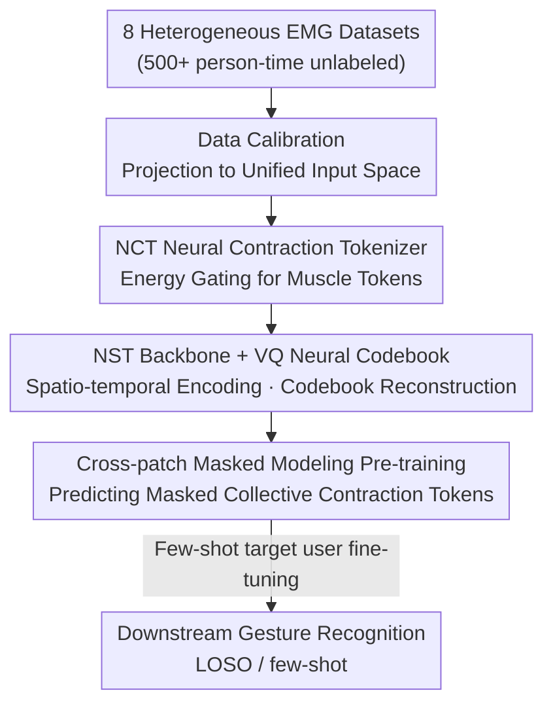

# Reading Your Actions: Learning Generalizable Action Representations via Pre-training AEMG

**Conference**: CVPR 2026  
**Paper**: [CVF Open Access](https://openaccess.thecvf.com/content/CVPR2026/html/Huang_Reading_Your_Actions_Learning_Generalizable_Action_Representations_via_Pre-training_AEMG_CVPR_2026_paper.html)  
**Code**: https://github.com/AEMG-series/AEMG  
**Area**: Self-Supervised / Representation Learning (Physiological Signal EMG Foundation Model)  
**Keywords**: Surface Electromyography (sEMG), Self-Supervised Pre-training, Vector Quantization, Masked Modeling, Cross-Subject Generalization

## TL;DR
AEMG treats surface electromyography (EMG) as a "language"—utilizing an energy-driven tokenizer to segment muscle contractions into "words" and multi-channel coordination into "sentences." By applying vector quantization (VQ) codebooks and masked reconstruction for self-supervised pre-training, it yields a universal EMG foundation model across devices, subjects, and tasks. In the rigorous Zero-shot Leave-One-Subject-Out (LOSO) gesture recognition task, it outperforms six SOTA methods by an average of 5.79–9.25%.

## Background & Motivation

**Background**: Surface electromyography (sEMG) is a core signal source for decoding human movement intentions and developing EMG-based human-computer interfaces (prosthetic control, rehabilitation robotics, gesture diagnosis). An EMG segment can be abstracted as a real-valued matrix $I \in \mathbb{R}^{C \times T}$, where $C$ is the device-dependent number of electrode channels and $T$ is the number of sampling points. Over the past decade, deep learning has achieved high accuracy in single-dataset gesture recognition (often >95%).

**Limitations of Prior Work**: These high accuracies are mostly inflated under "random split / intra-subject split" scenarios—once replaced by the strict Leave-One-Subject-Out Cross-Validation (LOSO-CV), accuracy often drops below 50%. Models severely overfit to task-irrelevant individual or acquisition variables, failing when applied to new users. Subsequent Unsupervised Domain Adaptation (UDA) methods attempt to align source and target domain distributions but yield limited results when significant conceptual drift exists across subjects.

**Key Challenge**: EMG data exhibits triple heterogeneity: ① Significant differences in acquisition hardware (electrode types, channel counts, topological layouts, and sampling rates); ② Signal non-stationarity with severe drift across subjects and sessions; ③ Lack of a standard method to parse raw streams into "physiologically meaningful and semantically coherent" discrete primitives. Existing methods rely on "fixed-window, fixed-stride" sliding window slicing, which fragment continuous muscle contraction events, destroying semantic integrity and introducing inherent ambiguity into the feature space.

**Goal**: To develop a universal EMG foundation model through self-supervised pre-training on large-scale multi-source EMG data, enabling "train once, apply anywhere" capabilities and solving generalization and few-shot adaptation across devices, subjects, and tasks.

**Key Insight**: Borrowing from the self-supervised pre-training paradigm of LLMs—since Transformers combined with reconstruction/masking can learn general representations from massive text, can the concept of "reconstruction" be transferred to EMG? A key observation is that although sEMG is highly individualized, the underlying neuromuscular recruitment strategies for the same action share a basic topology. Thus, it can be modeled as a language.

**Core Idea**: "EMG as Language"—using energy-driven gating to segment asynchronous muscle activation bursts into semantic "words" and multi-channel coordination into "sentences," constructing the largest cross-subject EMG vocabulary to date, and learning a universal "EMG grammar" via VQ codebooks and masked reconstruction.

## Method

### Overall Architecture
AEMG (Any Electromyography) is a self-supervised pre-training framework for multi-source heterogeneous EMG. The pipeline consists of five stages: first, projecting 8 highly heterogeneous public datasets into a unified input space via data calibration; next, using the Neural Contraction Tokenizer (NCT) to segment continuous signals based on energy into "muscle tokens" ("words" of EMG, where multi-channel coordination forms "sentences"); feeding these into the Neuro-Syntax Transformer (NST) backbone to encode spatio-temporal and semantic relationships; discretizing tokens into a shared neural codebook via vector quantization for reconstruction training; and finally, pre-training on large-scale unlabeled data using cross-patch masked modeling. After pre-training, the model can be transferred to downstream gesture recognition with minimal fine-tuning on target user data.

### Key Designs

**1. "EMG as Language" Paradigm and Unified Input Space: Resolving Non-stationarity and Heterogeneity via Linguistic Perspective**

To address the fundamental pain points of hardware heterogeneity and signal non-stationarity, AEMG replaces traditional sliding window heuristics with a linguistic perspective oriented toward voluntary muscle contractions. It treats asynchronous muscle activation bursts as semantic "words" and multi-channel coordination as "sentences," building the largest cross-subject EMG vocabulary to date. This paradigm is effective because muscle contraction events are inherently discrete units with starts and ends; segmenting by these units naturally handles sEMG non-stationarity and links surface morphology with complex gesture syntax. The accompanying data calibration pipeline projects 8 datasets—varying wildly in frequency bands, electrode types, channel counts, and sampling rates (totaling 500+ person-time unlabeled data)—into a unified space by reordering inconsistent channel layouts into a predefined topology using a fixed mapping function $R(\cdot)$. This allows large-scale, diverse, unlabeled EMG to be aggregated for pre-training for the first time.

**2. NCT Neural Contraction Tokenizer: Energy Gating to Segment Continuous Signals into Physiological "Muscle Tokens"**

This is the core solution to the semantic integrity destruction caused by "blind slicing." NCT draws inspiration from ECG QRS detection, using sliding window energy detection to identify muscle contraction activities. The window energy is defined as:

$$E_w = \frac{1}{L_w}\sum_{t=1}^{L_w}\sum_{c=1}^{C_i} X_i(c,t)^2$$

A segment is classified as a valid muscle contraction when $E_w > \theta$, with the threshold $\theta$ adaptively set based on the resting-state noise level of each subject during a brief calibration period. Each valid segment becomes a neural token $\mathbf{U}^{(k)} \in \mathbb{R}^{C_i \times L_k}$. To suppress inter-subject and inter-channel variations, z-score intra-segment normalization is applied: $\hat{U}^{(k)}(c,t) = \frac{U^{(k)}(c,t) - \mu^{(k)}(c)}{\sigma^{(k)}(c) + \epsilon}$. Compared to "fixed-window, fixed-stride" blind slicing, each NCT token corresponds to a complete, physiologically meaningful contraction event, preventing the mixing of valid contractions, resting noise, and inter-action transitions, which is the root of the high-quality codebook learning.

**3. NST Backbone + VQ Neural Codebook: Mapping Individualized Signals to 8192 Shared "Motor Primitives"**

Contraction units segmented by NCT are still biased by individual physiology and acquisition conditions. The NST (Neuro-Syntax Transformer) backbone first projects raw multi-channel tokens into a latent semantic space using 1-D convolutions: $\mathbf{I}_t = \text{GELU}(\mathbf{W}_{\text{conv}} * \mathbf{X} + \mathbf{b}_{\text{conv}})$. It then dynamically injects a joint spatio-temporal condition space—explicitly encoding anatomical source (electrode layout), activation phase, and temporal order—which are linearly fused and processed by Transformer self-attention to capture long-range neuromuscular correlations. Vector quantization discretizes the continuous latent states $p_i$ by finding the nearest neighbor in the EMG codebook $V = \{v_i\}_{i=1}^{k} \in \mathbb{R}^{k \times d}$ based on L2 distance $z_i = \|l_2(p_i) - l_2(v_j)\|_2^2$, followed by a decoder $f_d$ to reconstruct the EMG sentence. The VQ process is driven by three losses (using Exponential Moving Average for stable updates):

$$\mathcal{L}_{VQ} = \sum_{l \in \mathcal{D}} \sum_{i=1}^{l} \Big( \underbrace{\\|\hat{I}_i - I_i\|_2^2}_{\text{Reconstruction}} + \underbrace{\\|\text{sg}(l_2(p_i)) - l_2(v_{z_i})\|_2^2}_{\text{Vocabulary Learning}} + \underbrace{\\|l_2(p_i) - \text{sg}(l_2(v_{z_i}))\|_2^2}_{\text{Encoder Commitment}} \Big)$$

where $\text{sg}$ is the stop-gradient operator. By forcing diverse inputs into this shared physiological prototype, the model is compelled to extract generalizable representations. The final codebook converges to 8192 standard motor primitives: observations show that indices strictly cluster into morphologically consistent contractions (e.g., Index 332 specifically captures transient high-amplitude bursts for explosive flexor recruitment), and NST dynamically assigns different tokens to segments with nearly identical waveforms but different spatio-temporal contexts, reflecting "context-dependent semantic polysemy."

**4. Cross-patch Masked Modeling Pre-training: Predicting Collective Contraction Tokens via Context**

Building upon the codebook and reconstruction, the pre-training stage masks individual muscle contraction tokens in an EMG sentence, requiring the model to predict the corresponding "collective muscle contraction tokens" (the discrete prototypes in the codebook) based on the unmasked context. This step forces the model to explicitly model spatio-temporal dependencies across electrode positions and underlying muscle synergies. Interestingly, ablation studies show that the mask prediction accuracy under the NCT perspective is lower than that of traditional blind slicing—because blind slicing produces many zero-padded or easily predictable static noise tokens, simplifying the pre-training task. NCT forces the model to understand real, complex temporal semantics and muscle synergies, and it is this "harder" self-supervised task that leads to more robust and generalizable representations.

### Loss & Training
The VQ stage utilizes $\mathcal{L}_{VQ}$ (MSE for reconstruction, vocabulary learning, and encoder commitment), with the codebook updated via EMA. The pre-training stage utilizes the cross-patch masked modeling objective (predicting collective contraction tokens for masked positions). Downstream evaluation uses the LOSO-CV paradigm: each subject serves as the target domain in turn while all other subjects are aggregated for the source domain, providing the strictest standard for cross-subject generalization. AEMG is provided in AEMG-Base and AEMG-Large variants.

## Key Experimental Results

**Metric Definitions**: **LOSO-CV** (Leave-One-Subject-Out Cross-Validation) = Testing on all data of one subject while training on all others; **Intra-Subject** = Upper bound reference for within-subject training; **FT-X%** = Few-shot accuracy after fine-tuning with X% of target user data.

### Main Results: Zero-Shot LOSO Gesture Recognition
Comparison of AEMG against six SOTA methods across four benchmarks (Accuracy %, higher is better):

| Method | ULB-MLG | EMG-EPN | Ninapro DB4 | Toro-Ossaba | Average |
|------|---------|---------|-------------|-------------|------|
| Cross-Subject (No Adaptation) | 62.35 | 77.06 | 48.50 | 82.05 | 67.49 |
| Normalization | 80.33 | 84.73 | 75.83 | 86.93 | 81.96 |
| MDD | 82.67 | 88.97 | 64.67 | 87.13 | 80.86 |
| CDEM | 83.00 | 86.95 | 81.33 | 84.55 | 83.96 |
| SCDEM (Prev. SOTA) | 82.82 | 86.75 | 82.33 | 84.17 | 84.02 |
| **AEMG-Base (Ours)** | 88.52 | 87.10 | 81.21 | 89.13 | 86.49 |
| **AEMG-Large (Ours)** | **91.50** | **88.32** | **88.10** | **91.30** | **89.81** |
| Intra-Subject (Upper Bound) | 93.36 | 98.11 | 90.50 | 88.82 | 92.70 |

AEMG-Large achieves an average of 89.81%, which is 5.79% higher than the strongest baseline SCDEM (84.02) and 9.25% higher than VADA+DIRT-T (80.56); it even surpasses the intra-subject upper bound on Toro-Ossaba (91.30 vs 88.82).

### Few-shot Adaptation (AEMG-Large)

| Fine-tuning Data Amount | ULB-MLG | Ninapro DB4 |
|-----------|---------|-------------|
| FT-5% | 88.50 | 85.18 |
| FT-20% | 89.40 | 86.15 |
| FT-40% | 90.72 | 87.30 |
| FT-80% | 91.00 | 88.05 |

With only 5% of target user data, AEMG-Large reaches approximately 90% of full fine-tuning performance—indicating that fine-tuning serves to adapt the model, which already "understands the EMG language," to user-specific habits rather than learning from scratch.

### Ablation Study: NCT vs. Traditional Blind Slicing
Removing NCT's energy gating and using fixed-size/fixed-stride blind slicing while keeping other components (VQ reconstruction, masked pre-training, downstream evaluation) the same: Blind slicing yields 82.15%, significantly lower than the NCT approach (≈89.81%). Notably, even with sub-optimal blind slicing, the AEMG architecture still reaches 82.15%, outperforming or matching most SOTA methods.

### Key Findings
- **Counter-intuitive "Hard Task = Better Representation"**: Masked prediction accuracy is lower under the NCT perspective, but downstream accuracy is higher—the low prediction accuracy reflects a harder pre-training task (understanding real temporal semantics rather than reconstructing noise), resulting in more robust representations.
- **NCT Lowers Reconstruction Loss in VQ**: Since contraction tokens carry clear physiological semantics, they facilitate the training of high-quality, meaningful EMG vocabularies; blind slicing introduces noise and transitions, increasing vocabulary ambiguity.
- **Codebook Interpretability**: 8192 primitives exhibit strict physiological clustering (e.g., explosive flexor vs. sustained low-amplitude extensor) and support context-dependent polysemy.

## Highlights & Insights
- **Effective Paradigm Shift to "Signals as Language"**: Adapting the LLM's "tokenization + codebook + masked reconstruction" to physiological signals is not a simple copy; using energy gating to align tokenization with physiological events makes the linguistic metaphor functional.
- **Transferability of Energy Gated Tokenization**: This can be applied to other physiological/sensor signals (ECG, IMU, EEG)—any signal with "event-based bursts" may benefit from event-based segmentation over fixed windows to learn cleaner discrete representations.
- **Diagnostic Signal of "Harder Pre-training, Better Downstream"**: Using mask prediction accuracy to inversely judge self-supervised task difficulty is a practical sanity check.
- **Engineering Foundation**: The combination of a unified input space and channel mapping allows for the aggregation of heterogeneous device data, a necessary step for building foundation models.

## Limitations & Future Work
- Evaluation is focused on gesture classification (4 datasets), lacking coverage for regression-based EMG tasks like proportional prosthetic control or continuous motion estimation; the breadth of the "universal foundation model" remains to be verified.
- The energy threshold $\theta$ depends on a per-subject resting calibration period, requiring a brief calibration during deployment. Sensitivity analysis for threshold settings and calibration duration is not fully provided.
- The codebook size of 8192 is an empirical value; it is unclear if this will be sufficient or saturated as frequency bands and subject distributions expand.
- Individual ablations for parts of NST's "spatio-temporal condition space" (anatomical source, phase, order) are missing, making it difficult to judge individual contributions to fusion weights.

## Related Work & Insights
- **vs. Traditional Single-dataset Deep Models**: Those achieve high intra-subject accuracy but fail (<50%) in LOSO, essentially being scene-specific; AEMG learns general representations via large-scale self-supervised pre-training for zero/few-shot cross-subject use.
- **vs. Unsupervised Domain Adaptation (UDA: MDD, CDEM, SCDEM, VADA)**: UDA performs distribution alignment in fixed-window feature spaces where semantic integrity is already destroyed; AEMG eliminates ambiguity at the source by using NCT for physiologically semantic tokens and then learning a universal vocabulary and motor grammar.
- **vs. Large-scale Data Paradigms (e.g., CTRL-labs)**: While also drawing from NLP foundation model ideas, AEMG follows a more cost-effective and scalable path by aggregating multiple heterogeneous public datasets.

## Rating
- Novelty: ⭐⭐⭐⭐⭐ "EMG as Language" + Energy Gated Tokenization + VQ Codebook + Masked Reconstruction; a paradigm-level innovation for physiological signals.
- Experimental Thoroughness: ⭐⭐⭐⭐ Solid LOSO and few-shot results across four datasets, though lacking regression tasks and ablation of independent spatio-temporal conditions.
- Writing Quality: ⭐⭐⭐⭐ Clear chain from motivation to paradigm to method; consistent linguistic metaphor, though some formula noise and appendix details exist.
- Value: ⭐⭐⭐⭐⭐ A key step toward "train once, use anywhere" EMG foundation models, highly significant for the deployment of EMG-based human-computer interfaces; fully open-sourced.

<!-- RELATED:START -->

## Related Papers

- [\[CVPR 2026\] Chain-of-Models Pre-Training: Rethinking Training Acceleration of Vision Foundation Models](com_pt_chain_of_models_pretraining.md)
- [\[ICML 2026\] NITP: Next Implicit Token Prediction for LLM Pre-training](../../ICML2026/self_supervised/nitp_next_implicit_token_prediction_for_llm_pre-training.md)
- [\[CVPR 2026\] Decouple Your Discovery and Memory in Continual Generalized Category Discovery](decouple_your_discovery_and_memory_in_continual_generalized_category_discovery.md)
- [\[ECCV 2024\] Efficient Image Pre-Training with Siamese Cropped Masked Autoencoders](../../ECCV2024/self_supervised/efficient_image_pre-training_with_siamese_cropped_masked_autoencoders.md)
- [\[CVPR 2026\] Suppressing Non-Semantic Noise in Masked Image Modeling Representations](suppressing_non-semantic_noise_in_masked_image_modeling_representations.md)

<!-- RELATED:END -->
