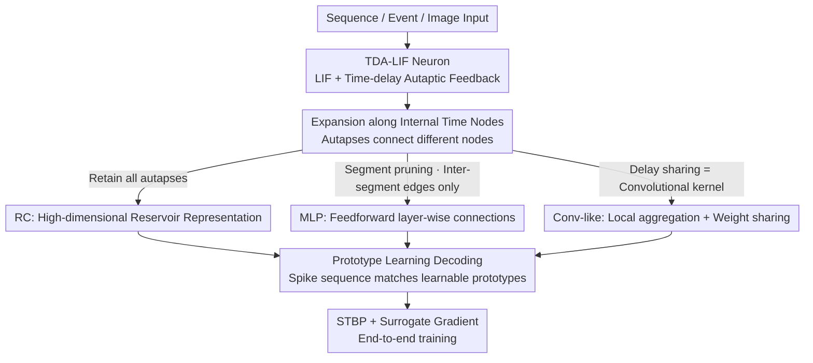

# Reconstructing Spiking Neural Networks Using a Single Neuron with Autapses

**Conference**: CVPR 2026  
**Paper**: [CVF Open Access](https://openaccess.thecvf.com/content/CVPR2026/html/Cai_Reconstructing_Spiking_Neural_Networks_Using_a_Single_Neuron_with_Autapses_CVPR_2026_paper.html)  
**Code**: None  
**Area**: Spiking Neural Networks  
**Keywords**: Spiking Neural Networks, Autapses, Time-delay feedback, Single-neuron computing, Spatio-temporal multiplexing

## TL;DR
Inspired by the autaptic self-feedback of cerebellar Purkinje cells, this paper introduces a set of "Time-Delay Autapses" to LIF neurons (TDA-LIF). By expanding a **single** spiking neuron in the temporal dimension and applying specific pruning/sharing strategies to the autapses, the authors equivalently reconstruct three SNN architectures: Reservoir Computing (RC), Multilayer Perceptron (MLP), and Convolution-like structures. This approach achieves accuracy comparable to standard SNNs of equivalent scale while reducing the number of neurons per layer to 1 and state VRAM from 8 KB to 4 Bytes, increasing single-neuron information density by orders of magnitude at the cost of temporal latency in extreme single-neuron settings.

## Background & Motivation

**Background**: Spiking Neural Networks (SNNs) are considered third-generation neural networks. Due to their event-driven nature, low power consumption, and rich temporal dynamics, they serve as the foundation for brain-inspired and neuromorphic computing. However, current high-performance SNNs mostly adopt the "dense multi-layer" structure of ANNs, involving many neurons, extensive inter-layer communication, and significant state storage.

**Limitations of Prior Work**: This dense structure leads to high **spatial overhead**: the number of neurons grows squarely or linearly with network scale, and internal states (e.g., membrane potentials) must be stored per neuron, complicating deployment on resource-constrained neuromorphic hardware. Existing works to enhance "single-neuron expressivity" (e.g., dendritic computing, intrinsic plasticity, lateral inhibition, heterogeneous neurons, multi-compartment modeling) enhance non-linearity but still rely **primarily on instantaneous inputs**, lacking the capacity for long-term information retention and recursive computation.

**Key Challenge**: There is a trade-off between stacking many neurons for expressivity (spatially expensive) or using a single neuron restricted to instantaneous information (computationally weak). Biological systems provide a solution: Purkinje cells achieve self-feedback through **autapses** (synaptic connections from a neuron to itself), allowing them to perceive past firing and modulate current states, naturally injecting "temporal memory" into a single neuron. Existing single-neuron delay loops (folded-in-time deep networks, single-node reservoirs) confirm that "a single node possesses strong temporal processing capabilities," but these use continuous values and rely on non-biological hardware, differing fundamentally from spiking/event-driven mechanisms.

**Goal**: To treat "delay" as an intrinsic autaptic property of neurons, enabling a **single** spiking neuron expanded over time to simulate "network-level" temporal computation while maintaining spike interpretability and improving long-range temporal modeling.

**Core Idea**: Incorporate time-delay autapses into LIF neurons to create TDA-LIF neurons, transforming **spatial spatial connections into intra-neuron temporal dependencies**. By selectively retaining, pruning, or sharing autapses across expanded temporal nodes, RC, MLP, and convolution-like structures are unified, trading "spatial compactness" for "temporal multiplexing."

## Method

### Overall Architecture

The methodology centers on the **TDA-LIF neuron**: a standard LIF neuron equipped with a set of autapses with varying delays $d$. Spikes emitted by the neuron feed back into its dendrites after $d$ internal nodes. Expanding this neuron along "internal time nodes" yields a trajectory of nodes where autapses serve as directed edges between them. Three network types are derived by **manipulating these autaptic edges**: retaining all autapses → Reservoir Computing (RC); pruning by segments to retain only inter-segment edges → feedforward MLP; and sharing autaptic weights across spatial output nodes → Convolution-like. Finally, **prototype learning** matches output spike sequences to learnable prototypes for classification, trained end-to-end using STBP (Spatio-Temporal Backpropagation) and surrogate gradients.

Two timescales are distinguished: $t$ is the index for **internal time nodes** (position on the expanded trajectory), and $T$ is the external data time window (for sequence/event inputs). TDA-SNN maps spatial neuron functions into the timeline of a single neuron.

### Key Designs

**1. TDA-LIF: Injecting memory into a single neuron via time-delay autapses**

The state of a standard LIF depends only on the current input. This work adds a "delayed autaptic current" to the membrane potential iteration: spikes emitted at node $t$ return to the dendrite after a delay of $d$ nodes. The membrane potential update is:

$$v_t = \tau v_{t-1}(1 - s_{t-1}) + I_t + I_t^{\text{autapse}}, \qquad I_t^{\text{autapse}} = \sum_{d \in D_t} w_a^{d}\, s_{t-d},$$

where $\tau$ is the membrane time constant, $s_{t-1}$ is the spike at the previous node (implementing soft reset via $(1-s_{t-1})$), $D_t=\{d\in\mathbb{N}\mid d<t\}$ is the set of valid delays at node $t$, and $w_a^{d}$ is the autaptic weight for delay $d$. Including external input, this becomes $v_t = \tau v_{t-1}(1-s_{t-1}) + W x_t + \sum_{d\in D} w_a^{d}(t)\, s_{t-d}$, where $W\in\mathbb{R}^{N\times N_{in}}$ maps input to $N$ nodes. Crucially, assigning different weights to different delays allows past spikes to modulate future membrane potential trajectories, evolving the **internal state of a single neuron into a high-dimensional temporal representation**.

**2. Temporal Expansion + Autaptic Selection: RC / MLP / Conv-like reconstruction**

The three architectures are defined by **restricting autaptic edges on the expanded trajectory**:

- **RC (Reservoir Computing)**: All delayed autapses are retained. The evolution across $N$ nodes forms an expanded temporal graph where signals propagate forward and delayed feedback perturbs hidden dynamics, creating high-dimensional representations.
- **MLP**: The expanded trajectory is **segmented** (e.g., via a threshold). "Intra-segment" autapses are pruned, while "inter-segment" autapses are retained to simulate feedforward layers. The potential for the second segment is $v_t = \tau v_{t-1}(1-s_{t-1}) + W x_t + \sum_{d\in D_{FC}} w_a^{d}(t)\, s_{t-d}$ where $D_{FC}=\{d\mid d\le t,\ t-d<t_s\}$, effectively mapping spatial layer connections to specific delays.
- **Conv-like**: Building on the MLP topology, multiple spatial output nodes share the same set of delayed autaptic weights. **These shared weights act as convolutional kernels**, where different delay sets provide the temporal implementation of local spatial aggregation.

**3. Prototype Learning + Expanded STBP Training**

For decoding, the authors use **Spatio-Temporal Prototype Learning** instead of static decoding. Learnable binary prototypes $K\in\{0,1\}^{C\times T}$ are defined for $C$ classes. Similarity is measured via negative Euclidean distance $d_i(x) = -\|f(x;\theta)-k_i\|_2^2$:

$$\mathcal{L} = -\log \frac{e^{d_i(x)}}{\sum_{j=1}^{C} e^{d_j(x)}} - \lambda\, d_i(x),$$

where $\lambda=0.001$ is a regularizer. Training uses STBP with an arctangent surrogate gradient for the non-differentiable firing function: $s_t \approx \frac{1}{\pi}\arctan\!\big[\frac{\pi}{2}\alpha(v_t - v_{th})\big] + \frac{1}{2}$. The gradient at node $t$ is determined by both the successor node $t+1$ and all future nodes $t+d$ receiving its delayed spikes:

$$\nabla_{v_t}\mathcal{L} = \nabla_{v_{t+1}}\mathcal{L}\cdot \tau(1-s_{t-1}) + \sum_{d\in D}\Big(\nabla_{v_{t+d}}\mathcal{L}\cdot w_a^{d}\cdot \frac{\partial s_t}{\partial v_t}\Big).$$

### Loss & Training
The classification loss follows the prototype learning objective (Cross-Entropy + $\lambda d_i$ regularization). The Adam optimizer is used with cosine learning rate decay for 100 epochs. RC/MLP experiments are averaged over 10 runs; Conv-like experiments use 5 runs. TDA-SNN is compared against standard SNNs (STD-SNN) with aligned training protocols and structural scales.

## Key Experimental Results

RC was tested on DEAP and SHD; MLP on MNIST, fMNIST, and DVS Gesture; Conv-like on DVS Gesture and CIFAR-10. STD-SNN reservoir/layer sizes were aligned to the number of internal nodes in TDA-SNN.

### Main Results: Comparison of RC / MLP with equivalent STD-SNN

| Structure | Dataset | Nodes | STD-SNN | TDA-SNN |
|-----------|---------|-------|---------|---------|
| RC | DEAP | 16 | 81.21±1.00 | 77.59±1.24 |
| RC | DEAP | 256 | 79.92±0.54 | **88.65±0.48** |
| RC | SHD | 256 | 77.63±2.53 | **80.04±0.51** |
| MLP | MNIST | 256 | — | 98.23±0.09 |
| MLP | fMNIST | 256 | — | 89.16±0.12 |
| MLP | DVS Gesture | 256 | — | 72.95±2.02 |

**Key Findings**: TDA-SNN is slightly inferior to STD-SNN at low node counts (e.g., 16 nodes) but catches up or surpasses it as the number of nodes increases, as the temporal expansion allows autaptic dynamics to flourish.

### Ablation Study: Autaptic selection strategy and quantity (Table 1 excerpt)

| Dataset | Strategy | 1 Delay | 8 Delays | 64 Delays |
|---------|----------|----------|-----------|-----------|
| DEAP | MC | 83.52 | 83.91 | 84.47 |
| SHD | RD | 78.55 | 78.58 | 80.42 |
| DVS Gesture | RD | 45.45 | 55.31 | 59.55 |

The **quantity of autapses is the dominant factor**; more connections improve stability. Specific selection strategies (Random Delay RD / Max Connection MC) only show significant differences at very low delay counts.

### Efficiency and Single-Neuron Information Density (Table 2 excerpt)

| Model | Structure | $N_{Neu}$ | Information per neuron $S$ (bit) |
|-------|-----------|-----------|----------------------------------|
| STD-SNN | RC | $N$ | 489.91 |
| TDA-SNN | RC | **1** | **32096.37** |
| STD-SNN | MLP | $N_{out}$ | 3113.89 |
| TDA-SNN | MLP | **1** | **199237.63** |

TDA-SNN reduces the neurons per layer to **1**, increasing information density by dozens to hundreds of times. Spatial complexity (e.g., $N^2 T$ for RC) is converted into temporal dependency ($\sum_d N_d T$).

### Key Findings
- **Space-time trade-off**: Training speeds for RC are comparable, but MLP and Conv structures show significant temporal overhead. The advantage lies in spatial compactness, not necessarily overall speed.
- **Convolution as proof-of-concept**: Performance on CIFAR-10 (37.64%) lagged behind STD-SNN (47.31%), suggesting that autaptic feedback interferes with hierarchical spatio-temporal feature aggregation in single-neuron setups.
- **Parallelism**: Increasing the number of parallel neurons reduces latency. For CIFAR-10, 512 parallel neurons reduced training overhead from 178x to 46x and inference time to 0.92x of STD-SNN, while keeping state VRAM minimal (4 Bytes per neuron).

## Highlights & Insights
- **Unified Perspective**: Reconstructing RC/MLP/Conv as varying "autaptic selection rules" is elegant and backed by constructive proofs.
- **Folding Space into Time**: Using "delay as an intrinsic property" allows spatial layer information to be multiplexed into a single node's timeline, a concept applicable to any memory-constrained event-driven model.
- **Expanded STBP**: Accounting for gradients through future nodes ($t+d$) is essential for stable end-to-end training of models with internal delay loops.

## Limitations & Future Work
- **Temporal Latency**: In extreme single-neuron settings, the serial nature of temporal expansion creates significant delay.
- **Convolutional Efficiency**: Current Conv-like results are primarily conceptual; balancing spatial representation with temporal recursion requires further exploration.
- **Scaling**: Future work should investigate adaptive/learnable delay selection to optimize the efficiency-accuracy trade-off.

## Related Work & Insights
- **vs. Dendritic/Intrinsic Plasticity**: Unlike existing methods that enhance single-neuron non-linearity but rely on instantaneous inputs, TDA-LIF injects explicit temporal memory.
- **vs. Folded-in-time Networks**: While similar in "single node + delay loop" concepts, those utilize continuous values. TDA-SNN operates in the spiking domain, maintaining event-driven interpretability.
- **vs. Standard SNNs**: STD-SNN uses dense spatial connections; TDA-SNN reallocates these into temporal dependencies, drastically reducing VRAM and neuron counts at the expense of time.

## Rating
- Novelty: ⭐⭐⭐⭐⭐ 
- Experimental Thoroughness: ⭐⭐⭐⭐ 
- Writing Quality: ⭐⭐⭐⭐ 
- Value: ⭐⭐⭐⭐ 

<!-- RELATED:START -->

## Related Papers

- [\[CVPR 2026\] Robust Spiking Neural Networks by Temporal Mutual Information](robust_spiking_neural_networks_by_temporal_mutual_information.md)
- [\[CVPR 2026\] On the Role of Temporal Granularity in the Robustness of Spiking Neural Networks](on_the_role_of_temporal_granularity_in_the_robustness_of_spiking_neural_networks.md)
- [\[AAAI 2026\] Spikingformer: A Key Foundation Model for Spiking Neural Networks](../../AAAI2026/self_supervised/spikingformer_a_key_foundation_model_for_spiking_neural_networks.md)
- [\[ICLR 2026\] PredNext: Explicit Cross-View Temporal Prediction for Unsupervised Learning in Spiking Neural Networks](../../ICLR2026/self_supervised/prednext_explicit_cross-view_temporal_prediction_for_unsupervised_learning_in_sp.md)
- [\[CVPR 2026\] Temporal Interaction in Spiking Transformers with Multi-Delay Mixer](temporal_interaction_in_spiking_transformers_with_multi-delay_mixer.md)

<!-- RELATED:END -->
