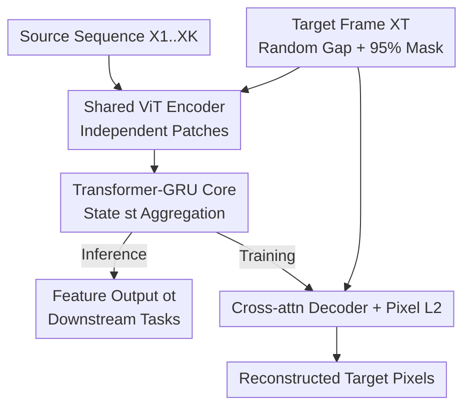

# Recurrent Video Masked Autoencoders

**Conference**: CVPR 2026  
**Paper**: [CVF Open Access](https://openaccess.thecvf.com/content/CVPR2026/html/Zoran_Recurrent_Video_Masked_Autoencoders_CVPR_2026_paper.html)  
**Code**: None (Project page: https://rvm-paper.github.io)  
**Area**: Self-Supervised Learning / Video Representation  
**Keywords**: Video Masked Autoencoder, Recurrent Network, GRU, Asymmetric Masking, General Vision Encoder

## TL;DR
RVM utilizes a "Transformer + GRU hybrid recurrent core" to aggregate video features frame-by-frame. Trained solely on an asymmetric pixel reconstruction objective—where unmasked past frames reconstruct a 95% masked future frame—it yields a general-purpose encoder proficient in both spatiotemporal tasks (action recognition, point/object tracking) and dense spatial tasks (depth, segmentation correspondence). Furthermore, small models achieve competitive performance without distillation, offering up to $30\times$ parameter efficiency compared to existing Video MAEs.

## Background & Motivation
**Background**: Two mainstream paradigms in video self-supervised learning are Masked Autoencoding (VideoMAE) and Latent Space Prediction (V-JEPA). These typically employ "early-fusion spatiotemporal encoders" where an entire clip is processed via spatiotemporal attention with uniform random masking across the sequence.

**Limitations of Prior Work**: Such designs treat time as a **uniform and symmetric** dimension, ignoring temporal causality and directionality. The "offline block" architecture limits processing to short clips, fails to maintain consistent representations over long horizons, and is unsuitable for online/streaming scenarios like robotics. Conversely, image models (e.g., DINOv2) provide strong spatial semantics but lack motion understanding. While SiamMAE introduced temporal asymmetry, it remains an **image encoder** that fails to capture true temporal dependencies.

**Key Challenge**: Strong spatial features and strong temporal/motion features are currently partitioned between two separate model classes; no single model excels at both. Achieving this is hindered by how time is modeled—symmetric spatiotemporal attention is computationally expensive (quadratic complexity) and lacks directionality.

**Goal**: To create a **general-purpose** vision encoder that rivals video SOTA in spatiotemporal tasks and image SOTA in dense spatial tasks. It must maintain stable features over long videos, exhibit linear computational complexity, and produce strong small-scale models without relying on distillation.

**Key Insight**: Given that time is directional, **explicitly model time using recurrence**. Similar to an RNN, the model "absorbs, discards, and refines" information frame-by-frame, propagating state forward. This ensures that long-range dependencies are handled with linear cost.

**Core Idea**: Upgrade the temporal asymmetric masking concept from SiamMAE into a "recurrent video encoder." Use a Transformer-GRU hybrid recurrent core for frame-to-frame aggregation, trained with a simple pixel-level L2 reconstruction loss.

## Method

### Overall Architecture
RVM processes video sequentially: each frame $X_t$ is divided into patches, independently encoded into tokens by a **weight-shared ViT**, and fed into a **recurrent core (RNN core)**. The core maintains a state $s_{t-1}$ from the previous step, fuses it with current tokens to produce an updated state $s_t$, which serves both as the feature output $o_t$ for downstream tasks and the state for the next frame. By processing frame-by-frame, the model incrementally integrates information with **linear** computational and memory scaling relative to sequence length.

During training, a **future target frame** $X_T$ is sampled (at a random interval $\Delta t \in [4, 48]$ frames from the last source frame). This target is **heavily masked** (default 95%) and encoded by the same ViT. A cross-attention decoder then reconstructs the target pixels based solely on the source features $o_t$, minimizing an L2 loss. Note: **The target frame and decoder are not used during inference; the recurrent state alone serves as the feature.**

### Key Designs

**1. Asymmetric "Past-to-Future" Masking: Embedding Directionality into the Objective**
To address the "symmetric time" issue in VideoMAE/V-JEPA, RVM reinforces the asymmetric approach: source frames (past) are **virtually unmasked**, while the target frame (future) is **95% masked**. This forces the model to "look at the past to predict the future." Two key aspects: First, the target frame is sampled at a **random future interval** $\Delta t \in [4, 48]$ frames ($\approx 0.15$ to $10$ seconds), forcing the model to propagate information across various timescales. Second, training utilizes 4 contiguous source frames to reconstruct 4 independently sampled target frames. This asymmetric setup provides a strong inductive bias for learning "frame-to-frame correspondence"—a property more naturally aligned with the sequential nature of video than symmetric random masking, explaining RVM's superiority in dense tasks like tracking and segmentation.

**2. Transformer-GRU Hybrid Recurrent Core: Gated Memory Management**
This is the central module ("The Rise of GRU"). It solves how to aggregate information over time while leveraging Transformer-based token interactions. It wraps a GRU gating mechanism around a Transformer block: the current frame encoding $\hat e_t$ acts as the query, while the previous state $s_{t-1}$ acts as the key/value:

$$u_t = \sigma(W^u_e \hat e_t + W^u_s s_{t-1}), \quad r_t = \sigma(W^r_e \hat e_t + W^r_s s_{t-1})$$
$$\hat h_t = \mathrm{Tx}(q=\hat e_t,\; kv = r_t \odot s_{t-1}), \quad s_t = (1-u_t)\odot s_{t-1} + u_t \odot \hat h_t,\quad o_t = s_t$$

Where $\sigma$ is the sigmoid function and $\mathrm{Tx}$ is a multi-layer Transformer block with cross/self-attention. The **reset gate $r_t$** modulates the old state before it enters the attention mechanism (deciding what to discard), and the **update gate $u_t$** performs a weighted fusion between the "old state" and the "new attention output" (deciding what to absorb). The recurrent core has **linear complexity** and outperforms pure self-attention aggregators on motion-heavy tasks like SSv2.

**3. Cross-Attention Decoder + Pure Pixel L2: Simplified Objective**
To keep the method dependent only on "pixel reconstruction" (without contrastive learning, distillation, or momentum encoders), RVM uses a cross-attention decoder. Unmasked target tokens are placed in their grid positions, masked positions are filled with learnable `[MASK]` tokens, and Fourier positional encodings are added. Each block performs: 1) Cross-attention (target tokens as query, concatenated source features $o_t$ as key/value), 2) Feed-forward MLP, and 3) Self-attention. The loss is the pixel-wise **L2** difference between the reconstruction and the target, without patch normalization.

### Loss & Training
- **Objective**: Pixel-wise L2 loss (no patch normalization).
- **Data**: ~8.4M web videos (mixture of HowTo100M, Kinetics700, SSv2, YTBB, YT8M). 64-frame clips sampled; 4 source + 4 future target frames at $256 \times 256$ resolution.
- **Optimization**: AdamW, cosine decay, 1M steps (250k for ablations), 2048 global batch, 256 TPU-v6. **No distillation used.**

## Key Experimental Results

### Main Results
Evaluation across 8 benchmarks for both "spatiotemporal" and "spatial" tasks. **Normalized Avg.** represents general performance:

| Model | Params (M) | SSv2 Acc↑ | PT AJ↑ | DAVIS J&F↑ | VIP mIoU↑ | Norm. Avg↑ |
|-------|------------|-----------|--------|------------|-----------|------------|
| DINOv2-L (Image, Distilled) | 303 | 52.2 | 36.6 | 61.7 | 40.6 | 82.5 |
| VideoMAE-L (Video) | 305 | 62.7 | 78.3 | 54.3 | 18.9 | 82.2 |
| V-JEPA2-L (Video) | 307 | 67.5 | 73.7 | 47.5 | 17.2 | 78.8 |
| **Ours (RVM-L)** | 375 | 66.7 | 77.3 | **66.0** | **38.0** | **94.4** |
| **Ours (RVM-H)** | 743 | 68.7 | 78.3 | 65.6 | 37.3 | **94.9** |

Takeaway: DINOv2 is strong in spatial tasks but weak in tracking (36.6). Video models are strong in spatiotemporal tasks but weak in VIP correspondence (<20). **Only RVM excels at both**, outperforming competitors even with $1.5 \sim 3 \times$ fewer parameters than giant models.

Small models (No distillation):

| Model | Params (M) | SSv2↑ | Kinetics↑ | Norm. Avg↑ |
|-------|------------|-------|-----------|------------|
| SiamMAE-S | 27 | 40.0 | 41.2 | 80.8 |
| DINOv2-S (Distilled) | 21 | 48.3 | 57.1 | 84.4 |
| VideoMAE-B | 87 | 52.3 | 38.9 | 80.4 |
| **Ours (RVM-S)** | 34 | **59.7** | 49.6 | **96.1** |

### Ablation Study
(S-sized model, 500M samples)

| Config | SSv2↑ | Kinetics↑ | ScanNet AbsRel↓ | Description |
|--------|-------|-----------|-----------------|-------------|
| Source Frames=1 | 41.0 | 39.3 | 1.60 | Equivalent to SiamMAE baseline |
| Source Frames=4 | 52.3 | 39.7 | 1.50 | More frames improve performance |
| Aggregator=Self-Attn | 49.1 | 39.6 | 1.51 | More expensive and less accurate |
| Aggregator=RNN (Ours) | **52.3** | 39.7 | 1.50 | Efficient and accurate |
| 2B Samples | **57.2** | **47.7** | **1.20** | Small models scale with data without overfitting |

### Key Findings
- **Recurrent Core vs. Self-Attention**: Under fair comparison (same params, patch size), the RNN core is not only more computationally efficient but also more accurate on motion-sensitive tasks like SSv2.
- **Long-range Stability**: RVM exhibits significantly slower performance decay on long DAVIS videos compared to baselines. Although trained on 4-frame horizons, it generalizes to long sequences with linear latency scaling.
- **Small Model Gains**: Unlike DINOv2, which requires massive teacher distillation to perform at small scales, RVM-S achieves high normalized accuracy via training from scratch.

## Highlights & Insights
- **Breaking the Dichotomy**: RVM positions itself on the Pareto frontier of both spatial and spatiotemporal tasks, challenging the need for separate models like DINO and VideoMAE.
- **The GRU Comeback**: Wrapping GRU gates around Transformer blocks successfully combines token-level interaction with linear long-range aggregation—a template for streaming video encoders.
- **Minimalist Supervision**: Relying solely on pixel L2 loss (no contrastive features or momentum encoders) allows for extremely long training schedules that continue to yield performance gains.
- **Linear-Cost Online Properties**: The "recurrence + 4-frame training" setup allows stable generalization to long sequences moves toward real-time robotics and streaming applications.

## Limitations & Future Work
- Training uses only 4 source frames; higher-order dynamics (like acceleration) may be difficile to model within such short horizons.
- High training cost (256 TPU-v6, 2B samples) presents a significant barrier to reproduction.
- Performance in end-to-end fine-tuning scenarios and further scaling comparisons against V-JEPA2 remain to be fully explored.

## Related Work & Insights
- **vs. SiamMAE**: RVM evolves SiamMAE by adding a recurrent core to move from an image encoder to a **video encoder**.
- **vs. VideoMAE / V-JEPA2**: Replaces symmetric spatiotemporal attention (quadratic, offline) with recurrence (linear, online, directional), leading to better long-range stability and spatial task performance.
- **vs. VideoMamba (SSMs)**: While SSMs aim for long-sequence efficiency, they often flatten video into tokens, losing spatial structure. RVM maintains spatial grids per frame via its recurrent state.

## Rating
- Novelty: ⭐⭐⭐⭐⭐ 
- Experimental Thoroughness: ⭐⭐⭐⭐⭐ 
- Writing Quality: ⭐⭐⭐⭐ 
- Value: ⭐⭐⭐⭐⭐

<!-- RELATED:START -->

## Related Papers

- [\[ECCV 2024\] ViC-MAE: Self-Supervised Representation Learning from Images and Video with Contrastive Masked Autoencoders](../../ECCV2024/self_supervised/vic-mae_self-supervised_representation_learning_from_images_and_video_with_contr.md)
- [\[CVPR 2026\] VideoSSR: Video Self-Supervised Reinforcement Learning](videossr_video_self-supervised_reinforcement_learning.md)
- [\[ICLR 2026\] HiMAE: Hierarchical Masked Autoencoders Discover Resolution-Specific Structure in Wearable Time Series](../../ICLR2026/self_supervised/himae_hierarchical_masked_autoencoders_discover_resolution-specific_structure_in.md)
- [\[CVPR 2026\] Suppressing Non-Semantic Noise in Masked Image Modeling Representations](suppressing_non-semantic_noise_in_masked_image_modeling_representations.md)
- [\[ECCV 2024\] Efficient Image Pre-Training with Siamese Cropped Masked Autoencoders](../../ECCV2024/self_supervised/efficient_image_pre-training_with_siamese_cropped_masked_autoencoders.md)

<!-- RELATED:END -->
