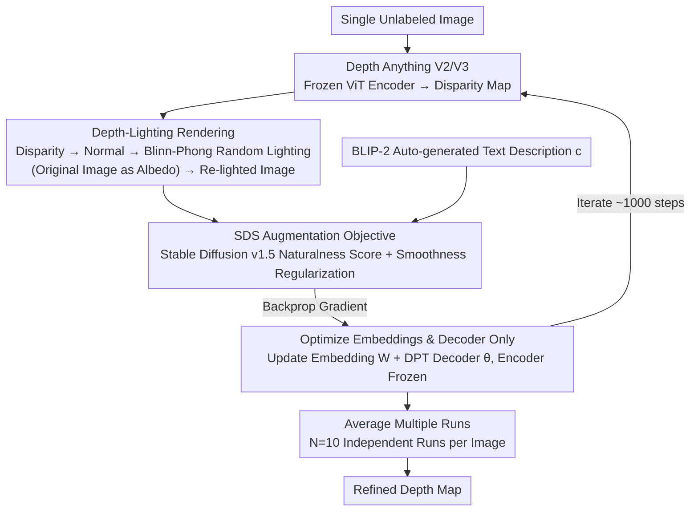

# Re-Depth Anything: Test-Time Depth Refinement via Self-Supervised Re-lighting

**Conference**: CVPR 2026 Findings  
**arXiv**: [2512.17908](https://arxiv.org/abs/2512.17908)  
**Authors**: Ananta R. Bhattarai, Helge Rhodin (Bielefeld University)  
**Code**: [GitHub](https://github.com/anantarb/Re-Depth-Anything)  
**Area**: Self-supervised  
**Keywords**: Monocular Depth Estimation, Test-Time Optimization, Score Distillation Sampling, Re-lighting, Depth Anything

## TL;DR

Proposes Re-Depth Anything, which refines depth predictions of Depth Anything V2/3 without labels by performing test-time re-lighting augmentation on predicted depth maps and utilizing SDS loss from 2D diffusion models for self-supervised optimization.

## Background & Motivation

Foundation models like Depth Anything V2 (DA-V2) exhibit excellent performance but still produce errors on real-world images with significant distribution shifts (e.g., lighting bias causing loss of micro-structures or pseudo-noise in flat regions). Existing test-time adaptation methods either require multi-frame temporal information or depend on specific external priors (3D meshes/sparse points). Meanwhile, large-scale 2D diffusion models have learned rich physical world priors that have not been fully exploited for test-time depth refinement.

## Core Problem

How to utilize 2D diffusion model priors for **unlabeled** depth map test-time refinement on a **single image**?

## Method

### Overall Architecture

This paper addresses the following: taking a pre-trained monocular depth model (Depth Anything V2/V3) and correcting its depth predictions at **inference time** given only **a single unlabeled image**. The core idea is an indirect approach—since no ground truth depth exists for direct supervision, the predicted depth is treated as geometry, rendered into a "re-lighted image" with random light sources, and then evaluated by a pre-trained 2D diffusion model: does this image look natural? If the re-lighted image feels unnatural (e.g., unexpected bumps on a flat wall or flattened spheres), it indicates issues with the underlying depth, and the diffusion model's gradient backpropagates to push the depth toward a reasonable shape. The entire pipeline is "Depth → Normal → Blinn-Phong Re-lighting → Diffusion Score (SDS) → Backpropagation to Correct Depth," where every step is differentiable, and it converges after ~1000 iterations per image.

### Key Designs

**1. Re-lighting instead of photometric reconstruction: Using augmentation to replace inverse rendering to avoid ill-posedness**

The most natural idea is using diffusion priors to reconstruct the lighting and material of the input image itself to back-infer depth—but this is equivalent to inverse rendering, where lighting, albedo, and geometry are coupled, which is famously ill-posed and prone to degenerate solutions. This paper takes a different angle: instead of recovering true lighting, it **actively applies random new lighting to the depth map**, overlays the results on the original image to get an augmented image, and lets the diffusion model judge "whether this re-lighted image is physically reasonable." This way, the diffusion model provides a "soft constraint" on naturalness without needing to explain the original image precisely. Geometric flaws "illuminated" by the lighting are exposed and corrected, avoiding the ill-posed nature of inverse rendering.

**2. Depth-Lighting Rendering: Converting disparity maps into differentiable re-lighted images**

To let the diffusion model "see" the geometry, the depth must be rendered into an image. Surface normals $\mathbf{N}$ are calculated from the predicted disparity map $\hat{D}_{\text{disp}}$, and then re-lighted using the Blinn-Phong shading model:

$$\hat{\mathbf{I}} = \tau\left(\beta_1 \max(\mathbf{N} \cdot \mathbf{l}, 0) \odot \tau^{-1}(\mathbf{I}) + \beta_2 \max(\mathbf{N} \cdot \mathbf{h}, 0)^\alpha\right)$$

Where $\mathbf{l}$ is a randomly sampled light direction, $\beta_1, \beta_2$ control diffuse and specular intensity, $\tau(\cdot)=(\cdot)^{1/\gamma}$ is tone mapping ($\gamma=2.2$), and the input image $\mathbf{I}$ is treated as an approximation of the diffuse albedo—bypassing material estimation. A practical issue is that DA-V2 outputs **normalized relative disparity** rather than absolute depth; however, since normals depend only on local gradients and are scale-invariant, it suffices to optimize an offset parameter $b=0.1$ in practice.

**3. SDS Augmentation Objective: Scoring the "naturalness" of re-lighted images using a diffusion model**

At each step, light parameters $\mathbf{l}$, $\beta_1$, $\beta_2$, and $\alpha$ are re-sampled to render a new augmented image, and naturalness is measured using the Score Distillation Sampling loss:

$$\mathcal{L} = \mathcal{L}_{\text{SDS}}(\hat{\mathbf{I}}, c) + \frac{\lambda_1}{hw} \sum_{i,j} \|\Delta \hat{D}_{\text{disp}}^{i,j}\|^2$$

The first term is provided by Stable Diffusion v1.5, evaluating the naturalness of the re-lighted image and backpropagating gradients to the depth. The second term is a smoothness regularizer to suppress depth noise. The text condition $c$ is automatically generated from the input image using BLIP-2. Randomizing the light direction is key: constantly changing the light is equivalent to "scanning" the geometry from all angles, exposing flaws that might be hidden under a single light source.

**4. Optimize Embeddings and Decoder Only: Preserving geometric priors in the encoder**

Directly optimizing the depth tensor as a free variable or fine-tuning the full model leads to collapse—the former lacks structural constraints, while the latter destroys pre-trained geometric knowledge. This paper optimizes only the intermediate embedding $\mathbf{W}$ and the DPT decoder weights $\theta$, while freezing the ViT encoder:

$$\mathbf{W}^*, \theta^* = \arg\min_{\mathbf{W}, \theta} \mathcal{L}(\hat{\mathbf{I}}, c, \hat{D}_{\text{disp}})$$

Freezing the encoder preserves strong learned geometric priors, while opening the decoder weights allows for structural adjustments, and optimizing embeddings provides per-image customization flexibility.

**5. Averaging Multiple Runs: Offsetting SDS randomness**

SDS loss has high variance, causing single optimization results to jitter due to random lighting and diffusion sampling. By running $N=10$ independent optimizations for the same image and averaging the results, noise is cancelled out, leaving stable structural improvements. In practice, 3 runs capture most of the gains.

### Loss & Training

The optimization uses AdamW for 1000 iterations. Learning rate for embeddings is $10^{-3}$, and $2\times10^{-6}$ for DPT weights (slower to avoid destroying priors). Smoothness weight $\lambda_1=1.0$. A single run takes ~80 seconds on an RTX 5000.

## Key Experimental Results

| Dataset | Method | AbsRel ↓ | RMSE ↓ | SI log ↓ | SqRel ↓ |
|--------|------|---------|--------|---------|---------|
| KITTI | DA-V2 | 0.305 | 7.01 | 33.6 | 2.49 |
| | **Ours + DA-V2** | **0.283** | **6.71** | **30.7** | **2.20** |
| | Gain | 7.10% | 4.29% | 8.51% | 11.4% |
| ETH3D | DA-V2 | 0.113 | 0.955 | 15.1 | 0.391 |
| | **Ours + DA-V2** | **0.104** | **0.875** | **14.1** | **0.347** |
| | Gain | 8.30% | 8.39% | 6.22% | 11.1% |

| Dataset | Method | AbsRel ↓ | SqRel ↓ | Normal MSE ↓ |
|--------|------|---------|---------|-------------|
| CO3D | DA3 | 0.00251 | 0.000317 | 0.000479 |
| | **Ours + DA3** | **0.00238** | **0.000294** | **0.000409** |
| | Gain | 4.83% | 7.39% | **14.65%** |

*Consistent improvements are achieved on DA3, with normal error reduction up to 14.7%.*

## Highlights & Insights

- **Re-lighting over reconstruction**: Cleverly avoids the ill-posedness of inverse rendering by using diffusion priors for naturalness checks via augmentation.
- **No labels, multi-views, or extra data required**: Purely single-image self-supervision.
- **Backbone agnostic**: Effective on both DA-V2 and DA3.
- **Significant detail enhancement**: Improves spherical textures, balcony railings, etc., and removes pseudo-noise on flat surfaces.
- **Elegant theory**: Transfers the SfS+SDS paradigm of DreamFusion from text-to-3D to depth refinement.

## Limitations & Future Work

- Occasional hallucinated edges (e.g., stickers on trucks mistaken for geometry).
- Potential geometric errors in sky regions.
- Over-smoothing in dark regions (e.g., tree shadows).
- Time-consuming: ~13 minutes for 10 averaged runs, not suitable for real-time.
- Stable Diffusion v1.5 might no longer be the optimal prior.

## Related Work & Insights

- vs **DreamFusion/RealFusion**: Those methods perform full 3D and photometric reconstruction; Ours uses re-lighting augmentation to avoid strict photometric consistency.
- vs **Classic SfS**: SfS assumes constant albedo/known light; Ours replaces manual assumptions with diffusion priors.
- vs **Marigold**: Marigold performs direct depth estimation; Ours performs test-time optimization and is complementary to feed-forward methods.
- vs **Multi-frame TTA**: Our single-image solution does not require temporal info, offering broader applicability.

## Rating

- Novelty: ⭐⭐⭐⭐⭐ — Self-supervised depth refinement via re-lighting SDS is highly novel.
- Experimental Thoroughness: ⭐⭐⭐⭐ — Three datasets + DA-V2/DA3 backbones + detailed ablation.
- Writing Quality: ⭐⭐⭐⭐⭐ — Clear motivation, elegant method, and thorough analysis.
- Value: ⭐⭐⭐⭐ — Opens a new path for test-time refinement of foundation models.

<!-- RELATED:START -->

## Related Papers

- [\[ICLR 2026\] Test-Time Efficient Pretrained Model Portfolios for Time Series Forecasting](../../ICLR2026/self_supervised/test-time_efficient_pretrained_model_portfolios_for_time_series_forecasting.md)
- [\[CVPR 2026\] A Stitch in Time: Learning Procedural Workflow via Self-Supervised Plackett-Luce Ranking](a_stitch_in_time_learning_procedural_workflow_via_self_supervised_plackett_luce_r.md)
- [\[ICML 2025\] Update Your Transformer to the Latest Release: Re-Basin of Task Vectors](../../ICML2025/self_supervised/update_your_transformer_to_the_latest_release_re-basin_of_task_vectors.md)
- [\[ICML 2025\] Test-Time Canonicalization by Foundation Models for Robust Perception](../../ICML2025/self_supervised/test-time_canonicalization_by_foundation_models_for_robust_perception.md)
- [\[ICML 2026\] Mitigating Label Shift in Tabular In-Context Learning via Test-Time Posterior Adjustment](../../ICML2026/self_supervised/mitigating_label_shift_in_tabular_in-context_learning_via_test-time_posterior_ad.md)

<!-- RELATED:END -->
