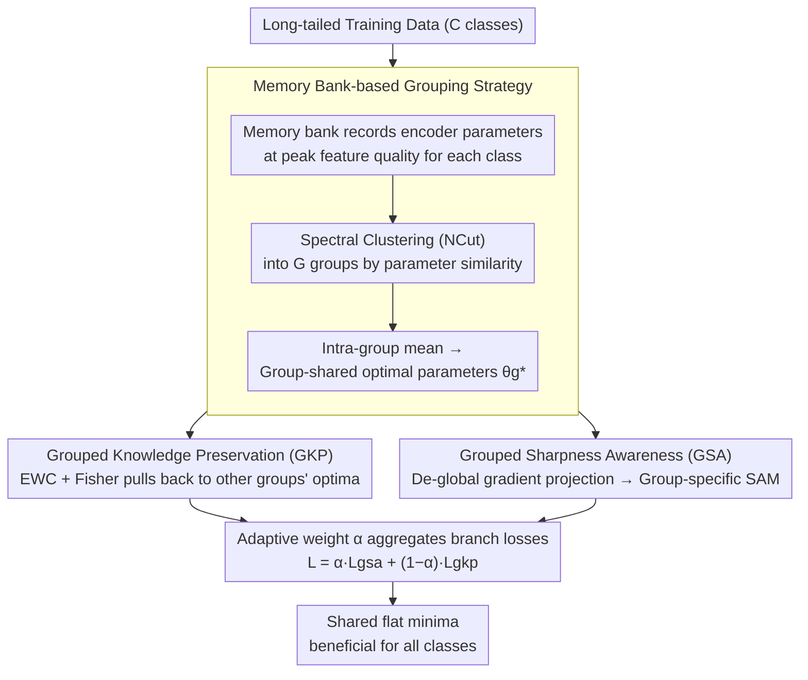

# Reframing Long-Tailed Learning via Loss Landscape Geometry

**Conference**: CVPR 2026  
**arXiv**: [2603.21217](https://arxiv.org/abs/2603.21217)  
**Code**: [https://gkp-gsa.github.io/](https://gkp-gsa.github.io/)  
**Area**: Self-supervised  
**Keywords**: Long-tailed learning, loss landscape, tail class degradation, continual learning, sharpness-aware minimization

## TL;DR
This paper revisits the head-tail seesaw dilemma in long-tailed learning from the perspective of loss landscape geometry. It reveals that the root cause of tail class degradation is optimization convergence to sharp regions far from the tail-class optima. A dual-module framework comprising Grouped Knowledge Preservation (GKP) and Grouped Sharpness Awareness (GSA), inspired by continual learning, is proposed. The method achieves SOTA on CIFAR-LT, ImageNet-LT, and iNat2018 without requiring external data.

## Background & Motivation

1. **Background**: Long-tailed learning (LTL) is a persistent challenge in computer vision. Existing methods generally fall into three categories: (1) class re-balancing (re-sampling/re-weighting), (2) information enhancement (data augmentation/synthesis), and (3) module improvement (specialized network designs). Recent trends involve introducing external data or large models, which may be unfeasible in privacy-sensitive scenarios like medicine.
2. **Limitations of Prior Work**: Almost all methods encounter a head-tail seesaw dilemma—improving tail performance inevitably hurts head performance and vice versa. Prior work has paid little attention to the underlying reasons for this trade-off.
3. **Key Challenge**: Visualization of the loss landscape reveals two key phenomena: (a) "Tail class performance degradation": the convergence point $\theta(t_2)$ of standard training is far from the tail-class optimum $\theta(t_1)$, as the model overfits the head classes and forgets the tail classes; (b) Convergence to sharp minima: compared to the flat regions reached when training solely on tail classes, standard long-tailed training converges to much sharper regions, leading to poor generalization.
4. **Goal**: (1) Prevent tail class knowledge from being forgotten during training; (2) Guide optimization toward flat minima to improve cross-class generalization.
5. **Key Insight**: Long-tailed learning is reformulated as a continual learning (CL) problem. When head-class gradients dominate training, tail-class knowledge is continuously "forgotten," similar to catastrophic forgetting in CL. EWC-style knowledge preservation is used to prevent forgetting, and SAM-style sharpness awareness is used to find flat regions.
6. **Core Idea**: Viewing long-tailed learning as a head-to-tail continual learning process, the method combines Grouped Knowledge Preservation to prevent forgetting with Grouped Sharpness Awareness to find flat solutions. These join together to guide optimization toward a shared flat minimum beneficial for all classes.

## Method

### Overall Architecture
The starting point is the reformulation of LTL as a CL problem where head gradients dominate, causing tail knowledge to be gradually "forgotten" while the optimization converges to sharp regions far from tail optima. Centered on the goals of "preventing forgetting" and "finding flat solutions," the method partitions all $C$ classes into $G$ groups via a memory-bank-based strategy before training. During training, it follows two complementary branches: the GKP branch uses an EWC-inspired constraint to prevent current optimization from erasing knowledge already learned by other groups, and the GSA branch uses grouped SAM to find flat minima for each group after filtering out head-dominant components. The losses from both branches are aggregated using an adaptive weight $\alpha$ scheduled by epoch.

### Key Designs

**1. Memory Bank-based Grouping Strategy: Constructing Task Boundaries for Continual Learning**
LTL lacks the explicit task boundaries found in CL. To treat it as a CL problem, one must first determine which classes should be optimized together as a "task." Instead of per-class preservation (computationally expensive and over-constrained) or simple head/tail bi-partitioning (too coarse, ignores intra-group variance), this paper observes "where each class converges." A memory bank $\mathcal{M}$ is maintained to dynamically record encoder parameters $\theta_{enc}^c$ for each class $c$ when it achieves its highest feature quality $Q$ (defined by inter-class separation and intra-class variance). Subsequently, Spectral Clustering (NCut) partitions these $C$ parameters into $G$ groups based on similarity, with the intra-group mean used as the group-shared optimal parameters:

$$\theta_g^* = \frac{1}{|\mathcal{G}^g|}\sum_{c \in \mathcal{G}^g} \theta_{enc}^c$$

Classes with similar converged parameters naturally have similar optimization requirements. This grouping is more aligned with the intrinsic optimization structure than a simple head/tail split and provides the operational unit for GKP and GSA.

**2. Grouped Knowledge Preservation (GKP): Preventing Head Gradients from Erasing Tail Optima**
In LTL, tail optima are gradually displaced by head-dominated gradients, mirroring catastrophic forgetting. GKP adopts the EWC paradigm: while training on group $g$, a penalty is applied to pull parameters back toward the historical optima $\theta_{j,i}^*$ of all other groups $j \neq g$:

$$\mathcal{L}_{gkp}^g = \frac{\lambda}{2}\sum_i \sum_{j \neq g} \frac{1}{|\mathcal{G}^j|} F_{j,i}(\theta_i - \theta_{j,i}^*)^2$$

Here, $F_{j,i}$ represents the diagonal elements of the Fisher Information Matrix for group $j$, measuring parameter importance, while $1/|\mathcal{G}^j|$ normalizes by group size. This ensures learning for the current group does not erase knowledge (especially for tail groups), explicitly suppressing forgetting.

**3. Grouped Sharpness Awareness (GSA): Reclaiming Flat-Solution Search Directions from the Head Classes**
To address sharp convergence and poor generalization, SAM is a natural choice; however, standard SAM's global perturbation is also dominated by head gradients, making it insensitive to high-sharpness tail regions. GSA's key innovation is gradient decomposition: it calculates the gradient for each group $\nabla_\theta \mathcal{L}_{D_g}(\theta)$ and subtracts its projection onto the global gradient:

$$\hat{\nabla}_\theta \mathcal{L}_{D_g}(\theta) = \nabla_\theta \mathcal{L}_{D_g}(\theta) - \text{Proj}_{\nabla_\theta \mathcal{L}_D(\theta)} \nabla_\theta \mathcal{L}_{D_g}(\theta)$$

This yields a group-specific direction free of head-dominant components. A group-specific SAM perturbation $\hat{\epsilon}_g^*(\theta) = \sqrt{d}\rho_g^* \frac{\hat{\nabla}_\theta \mathcal{L}_{D_g}(\theta)}{\|\hat{\nabla}_\theta \mathcal{L}_{D_g}(\theta)\|_2}$ is then calculated using a radius $\rho_g^*$ adjusted by group size. Consequently, each group searches for flat minima based on its own needs. Ablations show that using only the projection component (head-dominant direction) causes accuracy to drop significantly from 53.2 to 46.4.

### Loss & Training
- Total loss: $\mathcal{L} = \sum_{g=1}^G [\alpha \mathcal{L}_{gsa}^g + (1-\alpha)\mathcal{L}_{gkp}^g]$
- $\alpha$ is an adaptive parameter scheduled by training epochs.
- Default number of groups $G=4$.
- Architectures: ResNet-32 (CIFAR), ResNet-50/ResNeXt-50 (ImageNet-LT/iNat).
- Configuration: Batch size 256, NVIDIA 3090 GPU.

## Key Experimental Results

### Main Results - CIFAR100-LT

| Method | r=100 | r=50 | r=10 | Many | Med. | Few |
|------|-------|------|------|------|------|-----|
| CE Baseline | 38.3 | 43.9 | 55.7 | 65.2 | 37.1 | 9.1 |
| BCL (CVPR'22) | 51.9 | 56.6 | 64.9 | 67.2 | 53.1 | 32.9 |
| GBG (AAAI'24) | 52.3 | 57.2 | - | - | - | - |
| FeatRecon (ICLR'25) | 52.5 | 57.0 | 65.3 | - | - | - |
| LLM-AutoDA† | 51.0 | 54.8 | - | 66.6 | 50.6 | 33.1 |
| **Ours** | **53.2** | **57.6** | **68.7** | 67.3 | **54.9** | **34.9** |

### Main Results - ImageNet-LT & iNaturalist

| Method | ImageNet-LT (ResNet-50) | iNat2018 |
|------|-------------------------|----------|
| BCL | 56.0 | 71.8 |
| GBG | 57.6 | 71.9 |
| FeatRecon | 56.8 | 72.9 |
| LLM-AutoDA† | 57.5 | 74.2 |
| **Ours** | **57.9** | **74.4** |

### Ablation Study

| Configuration | Many | Med. | Few | All |
|------|------|------|-----|-----|
| BCL baseline | 67.2 | 53.1 | 32.9 | 51.9 |
| + GKP | 67.4 | 53.8 | 33.2 | 52.4 (+0.5) |
| + GSA | 67.3 | 54.0 | 34.1 | 52.7 (+0.8) |
| + GKP + GSA (Full) | 67.3 | **54.9** | **34.9** | **53.2** (+1.3) |

### Importance of Gradient Decomposition

| Perturbation Direction | Many | Med. | Few | All |
|----------|------|------|-----|-----|
| SAM (Global Gradient) | 66.3 | 53.0 | 34.5 | 52.1 |
| GSA-proj (Projection Only) | 64.7 | 43.8 | 28.1 | 46.4 |
| **GSA (De-globalized)** | **67.3** | **54.9** | **34.9** | **53.2** |

### Key Findings
- **GKP and GSA are Complementary**: GKP primarily improves Med classes (+0.7), while GSA primarily boosts Few classes (+1.2). Their combined effect exceeds individual uses, indicating that knowledge preservation and flattening address different issues.
- **Gradient Decomposition is Crucial**: Using only the projection component (head-dominant) for SAM perturbation leads to a performance crash (53.2 → 46.4), confirming that global gradients are harmful to tail optimization. Only group-specific components are beneficial.
- **Optimal G=4**: Too few groups (G=2) are too coarse, while too many (G=8+) increase GKP constraints and restrict optimization.
- **Superior to LLM-based Methods**: Outperforms LLM-AutoDA† (which relies on LLMs for data augmentation) by 2.2% on CIFAR100-LT, proving optimization-based solutions can succeed without external resources.
- **Gradient Similarity Validation**: While tail gradient similarity drops in the baseline (indicating forgetting), the proposed method maintains high similarity throughout training, directly verifying GKP's preservation effect.

## Highlights & Insights
- **Re-understanding LTL through Loss Landscape**: The paper shifts LTL from a data-level "imbalance" problem to an "optimization trajectory deviation" problem. This perspective allows the application of CL and SAM methodologies to LTL.
- **CL-to-LTL Analogy**: The analogy—head-class dominance overwriting tail knowledge ≈ new tasks overwriting old tasks—is highly accurate. The memory-based grouping strategy effectively constructs "pseudo-task boundaries" where none exist.
- **Gradient Decomposition Technique**: Removing global gradient projections to isolate group-specific perturbation directions is a simple yet powerful idea (+7.1% Gain vs. SAM-proj) that could be generalized to any multi-objective SAM scenario.

## Limitations & Future Work
- Memory bank overhead: Storing $\theta_{enc}^c$ for all classes can be memory-intensive for datasets with very large $C$.
- Grouping strategy dependency: The spectral clustering step introduces hyperparameters (choice of $G$, clustering timing).
- Fisher Matrix Approximation: Using a diagonal approximation may be imprecise; better importance estimation might further improve GKP.
- Task Breadth: Evaluation is currently limited to classification; generalizability to dense prediction tasks like long-tailed detection/segmentation remains unexplored.

## Related Work & Insights
- **vs. SAM/FriendlySAM**: Standard SAM is dominated by head classes; GSA achieves group-specific perturbation via gradient decomposition, representing a principled improvement for LTL.
- **vs. BCL**: BCL serves as the primary baseline; the proposed method improves upon BCL by 1.3% through optimization strategy alone, suggesting its improvements are orthogonal and additive.
- **vs. GBG (AAAI'24)**: While GBG also addresses gradient imbalance, this paper is more comprehensive by integrating loss landscape geometry and knowledge preservation.

## Rating
- Novelty: ⭐⭐⭐⭐ Innovative reformulation of LTL from a loss landscape and CL perspective.
- Experimental Thoroughness: ⭐⭐⭐⭐⭐ Comprehensive testing across 4 datasets, multiple backbones, and detailed analysis (feature quality, gradient similarity, landscape visuals).
- Writing Quality: ⭐⭐⭐⭐ Clear motivation, rich visualizations, and logical derivation.
- Value: ⭐⭐⭐⭐ Sets a new paradigm for LTL without external data; optimization-based insights are valuable to the community.

<!-- RELATED:START -->

## Related Papers

- [\[CVPR 2026\] Trust-calibrated Collaborative Learning for Long-Tailed Visual Recognition](trust-calibrated_collaborative_learning_for_long-tailed_visual_recognition.md)
- [\[CVPR 2026\] CUE: Concept-Aware Multi-Label Expansion to Mitigate Concept Confusion in Long-Tailed Learning](cue_concept-aware_multi-label_expansion_to_mitigate_concept_confusion_in_long-ta.md)
- [\[AAAI 2026\] BCE3S: Binary Cross-Entropy Based Tripartite Synergistic Learning for Long-tailed Recognition](../../AAAI2026/self_supervised/bce3s_binary_cross-entropy_based_tripartite_synergistic_learning_for_long-tailed.md)
- [\[NeurIPS 2025\] Long-Tailed Recognition via Information-Preservable Two-Stage Learning](../../NeurIPS2025/self_supervised/long-tailed_recognition_via_information-preservable_two-stage_learning.md)
- [\[CVPR 2026\] Geometry-driven OOD Detectors Are Class-Incremental Learners](geometry-driven_ood_detectors_are_class-incremental_learners.md)

<!-- RELATED:END -->
