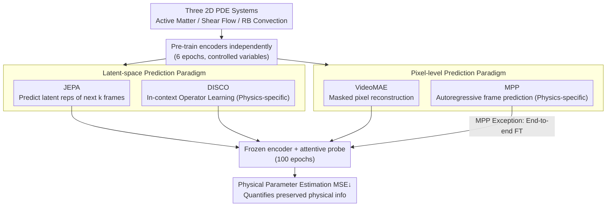

# Representation Learning for Spatiotemporal Physical Systems

**Conference**: CVPR 2026  
**arXiv**: [2603.13227](https://arxiv.org/abs/2603.13227)  
**Code**: [GitHub](https://github.com/helenqu/physical-representation-learning)  
**Area**: Self-supervised/Representation Learning  
**Keywords**: JEPA, Physical Systems, Representation Learning, Parameter Estimation, VICReg

## TL;DR

This work systematically compares four self-supervised/physical modeling methods across three PDE physical systems (Active Matter, Shear Flow, Rayleigh-Bénard Convection). It finds that latent-space prediction (JEPA) consistently outperforms pixel-level prediction (VideoMAE) in physical parameter estimation tasks—showing a relative MSE improvement of 28%~51%. Furthermore, JEPA with only 10% fine-tuning data surpasses VideoMAE trained on 100% of the data. Notably, methods specifically designed for physical modeling are not always the optimal choice.

## Background & Motivation

**Background**: The dominant approach for machine learning in spatiotemporal physical systems is "next-frame prediction" surrogate modeling, aimed at learning precise simulators of system evolution. Representative works include physics foundation models like MPP and Poseidon, as well as operator learning methods like DISCO.

**Limitations of Prior Work**: Autoregressive surrogate models are expensive to train and suffer from cumulative errors. More importantly, the actual needs of scientific research often involve estimating physical parameters (e.g., Reynolds number, Prandtl number) that determine the qualitative behavior of the system (e.g., laminar vs. turbulent flow), rather than frame-by-frame prediction. There is a lack of systematic research into which learning paradigm best preserves physically meaningful information.

**Key Challenge**: Pixel-level prediction (MAE / autoregressive models) pursues the reconstruction of exact visual details, but these low-level details may be irrelevant to high-level physical semantics. It remains unclear whether methods designed for physical modeling, despite introducing physical inductive biases, truly outperform general-purpose methods on downstream scientific tasks.

**Goal**: Compare the effectiveness of general self-supervised methods (JEPA vs. VideoMAE) and physical modeling methods (MPP vs. DISCO) in learning physics-related representations, using physical parameter estimation as a quantitative evaluation metric.

**Key Insight**: Physical parameters determine the temporal evolution of a system; thus, parameter estimation error directly quantifies the amount of physical information contained within a representation. This reflects "whether the model understands physics" more accurately than next-frame prediction error.

**Core Idea**: JEPA's latent-space prediction objective naturally filters out low-level visual details while preserving high-level dynamical structures, thereby learning superior physical representations compared to pixel-level prediction methods.

## Method

### Overall Architecture

This paper is essentially a "controlled variable competition" to answer: which learning paradigm learns representations that "understand physics" best on spatiotemporal physical systems? To make the answer quantifiable, the authors place all methods into the same evaluation protocol: first, pre-train an encoder on a physical system, then **freeze the encoder and only train an attentive probe** to estimate the system's physical parameters. Lower estimation error indicates more physical information is preserved in the representation. The competition takes place on three 2D PDE systems from The Well dataset: Active Matter (parameters $\alpha, \zeta$), Shear Flow (Reynolds, Schmidt numbers), and Rayleigh-Bénard (RB) Convection (Rayleigh, Prandtl numbers). The contenders are categorized into general self-supervised (JEPA, VideoMAE) and physics-specific (DISCO, MPP) methods, with the core difference being whether they predict in latent space or reconstruct/predict in pixel space.

### Key Designs

**1. JEPA Dynamics Version: Predicting the future in latent space instead of reconstructing pixels**

This is the central method of the paper, addressing the pain point that pixel-level objectives force models to waste capacity on visual textures, diluting physical semantics. Given $k$ context frames $x_{t:t+k}$, the goal is to predict what the subsequent $k$ frames $x_{t+k:t+2k}$ look like in the **representation space**. The prediction target is not pixels, but latent vectors output by the encoder. The architecture consists of an encoder $f:\mathcal{X}\to\mathcal{Z}$ (ConvNeXt) and a predictor $g:\mathcal{Z}\to\mathcal{Z}$ (Inverted Bottleneck CNN). During training, $g(f(x_i))$ is aligned with the target frame representation $f(x_{i+1})$. To prevent trivial solutions where both sides output constant vectors, it utilizes the VICReg loss:

$$\ell_{\text{VICReg}}\big(g(f(x_i)),\, f(x_{i+1})\big) = \lambda\, s + \mu\,[v(z_i)+v(z_{i+1})] + \nu\,[c(z_i)+c(z_{i+1})]$$

This manages three objectives: the invariance term $s$ aligns prediction and target, the variance term $v$ maintains variance in each dimension to prevent collapse, and the covariance term $c$ removes redundant correlations between dimensions (hyperparameters $\lambda=2, \mu=40, \nu=2$). Since the target is latent space, the encoder has no incentive to memorize textures and only preserves high-level structures necessary for "predicting future dynamics," which aligns strongly with physical parameters.

**2. VideoMAE Control Group: Pixel-level masked reconstruction representing "the alternative path"**

This serves as a control experiment to answer if pixel reconstruction is sufficient. It follows the classic masked autoencoding approach: randomly masking spatiotemporal blocks and reconstructing masked pixel values from visible parts. The backbone is ViT-tiny/16, using temporal tube masking (shared spatial mask across all frames), optimizing for pixel-level MSE reconstruction. The only critical difference from JEPA is "where the loss is calculated"—VideoMAE in pixel space vs. JEPA in latent space—allowing for a direct comparison between "reconstructing pixels" and "predicting representations."

**3. Physics-specific Baselines (DISCO and MPP): Verifying if "designed for physics" is truly stronger**

This group provides a "domain knowledge" reference frame. DISCO follows the latent-space operator learning path, combining Transformer's in-context learning with neural operator inductive biases to infer specific evolution operators from short context windows. MPP follows the pixel-level autoregressive foundation model path, pre-trained on massive physical data to predict physical fields frame-by-frame. Placing them alongside JEPA/VideoMAE allows the "Latent vs. Pixel" comparison to bridge both general and specialized methods.

### Loss & Training

JEPA and VideoMAE were pre-trained independently on each system for 6 epochs. Since publicly available MPP weights did not include these specific datasets, it utilized pre-trained weights followed by end-to-end fine-tuning. DISCO was pre-trained using The Well data. All models were fine-tuned for 100 epochs on downstream tasks using AdamW with a cosine schedule.

## Key Experimental Results

### Main Results

| Method | Active Matter MSE↓ | Shear Flow MSE↓ | RB Convection MSE↓ |
|------|-------------|------------|-------------|
| **JEPA** | **0.079** | **0.38** | **0.13** |
| VideoMAE | 0.160 | 0.67 | 0.18 |
| DISCO | 0.057 | 0.13 | 0.01 |
| MPP (End-to-end FT) | 0.230 | 0.59 | 0.08 |

### Data Efficiency Experiment (Shear Flow)

| Fine-tuning Data | JEPA | VideoMAE |
|-----------|------|---------|
| 10% (~3.2k) | 0.57 | 0.98 |
| 50% (~16k) | 0.40 | 0.75 |
| 100% (~32k) | 0.38 | 0.67 |

### Key Findings

- **JEPA is comprehensively superior to VideoMAE**: Relative improvements of 51% (Active Matter), 43% (Shear Flow), and 28% (RB Convection) demonstrate that latent-space prediction preserves physical information better than pixel reconstruction.
- **JEPA is highly data-efficient**: With only 10% of fine-tuning data (~3.2k samples), JEPA's MSE (0.57) already outperforms VideoMAE using 100% data (0.67), indicating higher physical information density in JEPA representations.
- **Latent-space methods consistently outperform pixel-level methods**: DISCO (latent operator learning) and JEPA (latent prediction) are the strongest in their categories, while MPP (pixel autoregression) and VideoMAE (pixel reconstruction) are weaker. This parallels findings in NLP where BERT (encoder-only) outperforms GPT (autoregressive) on non-generative tasks.
- **Specialized physical methods are not always optimal**: Despite being designed for physical modeling and end-to-end fine-tuning, MPP underperformed relative to the frozen encoder JEPA on two systems. This suggests autoregressive pixel targets may not align with downstream physics understanding tasks.
- **System Specificity**: DISCO performs exceptionally well on RB Convection (0.01), while JEPA's lead over VideoMAE is smallest in that same system (0.13 vs 0.18), suggesting different physical systems may require different inductive biases.

## Highlights & Insights

- **Shift in Evaluation Paradigm**: Transitioning from "predicting future frames" to "estimating physical parameters" to evaluate representation quality is a perspective shift with profound implications for scientific ML. It highlights that precise pixel prediction $\neq$ understanding physics.
- **Superiority of Latent-space Prediction**: JEPA's disregard for pixel accuracy allows it to learn better physical representations. Pixel-level objectives consume model capacity to encode visual textures, diluting high-level dynamical structures (e.g., convection patterns, vortex formation). Latent prediction forces the model to focus on "what is necessary to predict future dynamics."
- **VICReg Anti-collapse Design**: The combination of variance constraints (preventing dimensional collapse), covariance constraints (preventing redundancy), and invariance constraints (aligning prediction and target) provides a stable training signal for JEPA.

## Limitations & Future Work

- **Limited Evaluation Systems**: Only three 2D PDE systems were studied; 3D turbulence and multi-physics coupling were not addressed.
- **Lack of Direct Conditional Comparison with DISCO**: DISCO uses physical inductive biases while JEPA is general-purpose. Adding physical constraints to JEPA might bridge the remaining gap.
- **No Joint Pre-training**: JEPA and VideoMAE were pre-trained on single systems. The effect of cross-system joint pre-training (foundation model style) remains unknown.
- **Single Downstream Task**: Only parameter estimation was evaluated; qualitative tasks (e.g., transition detection) or anomaly detection were not included.
- **Restricted Encoder Architecture**: JEPA used ConvNeXt while VideoMAE used ViT-small; architectural differences might confound conclusions.

## Related Work & Insights

- **vs. VideoMAE**: VideoMAE reconstructs in pixel space, preserving low-level visual info but diluting physics. JEPA predicts in latent space, filtering details to retain pure physical structural info.
- **vs. MPP (Autoregressive Physics Foundation Model)**: While MPP is pre-trained on large datasets, its autoregressive objective is less effective for parameter estimation than JEPA, mirroring the BERT vs. GPT performance gap on understanding tasks.
- **vs. DISCO (Operator Learning)**: DISCO is strongest but requires physical inductive biases. JEPA, as a general method, approaches DISCO's performance, suggesting latent prediction may inherently capture some operator structure.

## Rating

- Novelty: ⭐⭐⭐⭐ First systematic comparison of self-supervised paradigms on physical parameter estimation.
- Experimental Thoroughness: ⭐⭐⭐ Three systems and four methods, though downstream tasks are limited.
- Writing Quality: ⭐⭐⭐⭐ Clear argumentation with insightful conclusions.
- Value: ⭐⭐⭐⭐ Important guidance for paradigm selection in scientific machine learning.

<!-- RELATED:START -->

## Related Papers

- [\[CVPR 2026\] TrackMAE: Video Representation Learning via Track, Mask, and Predict](trackmae_video_representation_learning_via_track_mask_and_predict.md)
- [\[CVPR 2026\] Franca: Nested Matryoshka Clustering for Scalable Visual Representation Learning](franca_nested_matryoshka_clustering_for_scalable_visual_representation_learning.md)
- [\[CVPR 2026\] Learning from Semantic Dictionaries: Discriminative Codebook Contrastive Learning for Unified Visual Representation and Generation](learning_from_semantic_dictionaries_discriminative_codebook_contrastive_learning.md)
- [\[CVPR 2026\] DiverseDiT: Towards Diverse Representation Learning in Diffusion Transformers](diversedit_towards_diverse_representation_learning_in_diffusion_transformers.md)
- [\[CVPR 2026\] Weight Space Representation Learning via Neural Field Adaptation](weight_space_representation_learning_via_neural_field_adaptation.md)

<!-- RELATED:END -->
