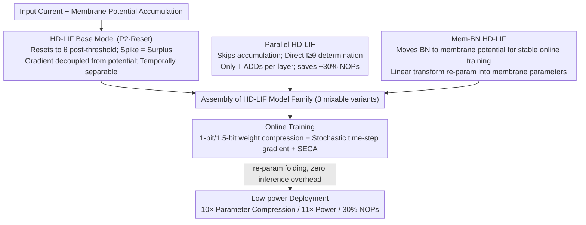

# Rethinking SNN Online Training and Deployment: Gradient-Coherent Learning via Hybrid-Driven LIF Model

**Conference**: CVPR 2026  
**arXiv**: [2410.07547](https://arxiv.org/abs/2410.07547)  
**Code**: [GitHub](https://github.com/hzc1208/HD_LIF)  
**Area**: Spiking Neural Networks / Model Compression  
**Keywords**: SNN, online training, LIF model, gradient separability, low-power inference

## TL;DR

This paper proposes the HD-LIF (Hybrid-Driven LIF) spiking neuron model family. By employing different spike calculation mechanisms above and below the threshold, it theoretically proves gradient separability and alignment, resolving the inconsistency between forward and backward propagation in SNN online training. It simultaneously achieves full-stage optimization of learning accuracy, memory complexity, and power consumption—reaching 78.61% accuracy on CIFAR-100 with 10× parameter compression, 11× power reduction, and 30% NOPs savings.

## Background & Motivation

**Background**: SNNs have gained attention due to their brain-like and energy-efficient characteristics. STBP (Spatio-Temporal Backpropagation) is the dominant training algorithm, which resolves the non-differentiability of spikes by introducing surrogate gradients, significantly improving SNN performance. However, STBP's backward propagation chain has temporal dependency, causing GPU memory to grow linearly with time steps, which severely limits SNN applications in complex scenarios and long sequences.

**Limitations of Prior Work**: Online training maintains constant GPU memory by truncating time-dependent gradients but faces two fundamental flaws: (1) The surrogate gradient function is coupled with membrane potential values (e.g., Triangle Function $\partial s / \partial m = \frac{1}{\gamma^2}\max(\gamma - |m - \theta|, 0)$), meaning gradient contribution weights $\epsilon[i,t]$ for each time step are different and unpredictable. Truncation leads to inconsistency between forward and backward propagation, causing accuracy degradation. (2) Existing online training methods only optimize training GPU memory; the inference stage offers no additional advantages over STBP-trained models (parameters, power, and computation remain the same), undermining practical application value.

**Key Challenge**: The core of online training is truncating temporal gradient dependency → but traditional LIF surrogate gradients are coupled with membrane potential values → truncation leads to gradient inconsistency → performance degradation. This contradiction has prevented online training from breaking the "convenient but poor performance" dilemma.

**Goal**: Design a spiking neuron model with naturally separable and aligned gradients (where truncation does not cause inconsistency) while providing additional advantages in parameter compression, power reduction, and computational optimization during inference.

**Key Insight**: Modify the spike firing mechanism—employ Precise-Positioning Reset (P2-Reset) in the region above the threshold to decouple surrogate gradients from membrane potential values, achieving natural separability of gradients across the temporal dimension.

**Core Idea**: Through hybrid-driven spike computation (retaining traditional LIF accumulation below the threshold and using P2-Reset above the threshold to decouple gradients from membrane potential), the problems of gradient inconsistency in online training and efficiency in inference deployment are solved simultaneously.

## Method

### Overall Architecture

The methodology centers on one core modification: splitting the spiking neuron's firing mechanism into two segments above and below the threshold, ensuring surrogate gradients no longer adhere to membrane potential values. Consequently, truncating temporal dependency during online training does not introduce forward-backward inconsistency. Specifically, HD-LIF retains standard LIF charging-leakage accumulation below the threshold, but switches to P2-Reset (Precise-Positioning Reset) once the potential exceeds the threshold: the potential is reset exactly to the threshold $\theta$, and the fired spike value is the surplus amount $s^* = m - \theta$, rather than the fixed $\theta$ of traditional LIF. Building upon this base neuron, two engineering optimizations are introduced: replacing a portion of neurons with a parallel version without accumulation to reduce inference cost, and moving Batch Normalization to the membrane potential to stabilize online training. This forms a family of three mixable HD-LIF variants (Vanilla, Parallel, Mem-BN), combined with 1-bit/1.5-bit weight compression and multi-bit spike quantization to cover the entire pipeline from training to deployment.

### Key Designs

**1. HD-LIF Base Model: Decoupling Gradient from Membrane Potential for "Free" Truncation**

Performance degradation in online training stems from traditional LIF surrogate gradients $\partial s / \partial m = f(m)$ depending on specific potential values, making temporal gradient weights $\epsilon[i,t] = \mathcal{F}(m_t, \dots, m_i)$ unpredictable and inseparable functions of membrane potentials. Truncating the temporal dimension causes a mismatch between forward accumulation and backward propagation. P2-Reset severs this coupling: post-firing, the potential resets precisely to $\theta$, and the spike value is linearly equal to the surplus. This ensures $\partial s^* / \partial m$ remains constant (1 or 0) in both threshold regions, independent of the potential value. The paper proves (Theorem 4.2) that HD-LIF temporal gradient weights reduce to a product of constant values from a finite set $\epsilon[i,t] = \chi[i,i] \prod_{j=t+1}^{i} \chi[j,j-1]$, where $\chi[i,i] \in \{0,1\}$ and $\chi[j,j-1] \in \{0, \lambda_j\}$ ($\lambda_t$ and $\theta_t$ are learnable parameters per time step).

$$\epsilon[i,t] = \chi[i,i] \prod_{j=t+1}^{i} \chi[j,j-1], \quad \chi[i,i]\in\{0,1\},\ \chi[j,j-1]\in\{0,\lambda_j\}$$

Because these weights no longer contain potential values, online training with truncated temporal gradients can seamlessly approximate STBP gradients (explicitly stated in Theorem 4.2(i)). Furthermore, since no non-differentiability exists between $s$ and $m$ during firing, gradients in the spatial dimension are naturally aligned. This distinguishes it from numerical approximation schemes like SLTT: it prevents inconsistency from occurring at the neuron level rather than mitigating it post-facto.

**2. Parallel HD-LIF: Reducing Inference Cost from NOPs**

While vanilla HD-LIF solves gradient issues, inference still requires full charging-leakage accumulation, requiring T MUL + 2T ADD per layer, which offers no NOPs advantage over standard LIF. The Parallel version skips accumulation, directly determining $s_t^* := (I_t \geq \theta_t)$, leaving only T ADD per layer. Mixing this with vanilla blocks at a ~50% ratio preserves the representational power of static accumulation while halving neuron computation. This saves approximately 30% NOPs with a minor accuracy drop from 80.16% to 78.82% (CIFAR-100), offering a high performance-to-cost ratio.

**3. Mem-BN HD-LIF: Zero-Overhead Inference BN on Membrane Potential**

Online training discards temporal gradient terms, meaning controlling input current distribution alone is insufficient; membrane potential accumulation distributions can still drift. Traditional BN placed after convolutional layers only monitors input current. Mem-BN moves normalization directly to the membrane potential: $\hat{m}_t = \alpha_t \cdot m_t + \beta_t \cdot \text{BN}_t(m_t)$. Learnable $\alpha_t, \beta_t$ adjust normalization strength, retreating to vanilla HD-LIF as a lower bound when $\alpha_t{=}1, \beta_t{=}0$. Crucially, since BN is a linear transformation, it can be folded into membrane parameters through re-parameterization—$\hat{\lambda}_t = \alpha_t^* \lambda_t$, $\hat{I}_t = \alpha_t^* I_t - \beta_t^*$—achieving the stability benefits of BN during training with zero additional computation during deployment.

### Loss & Training

Synaptic weights are compressed using 1-bit ($\{-1,+1\}$) or 1.5-bit ($\{0,\pm 1\}$), where 1.5-bit further promotes sparsity and reduces power via zero-weights. Training employs stochastic time-step gradient updates: only one random time step is selected for backward propagation per batch, further reducing constant memory overhead. Additionally, a lightweight SECA (Spike-Efficient Channel Attention, based on ECA-Net) is migrated: GAP → 1D Conv → Sigmoid → Channel Weighting. Its parameter count $O(K)$ and computation $O(KC)$ are negligible, and spike sequences share the same weights across the temporal dimension to fit SNN settings.

## Key Experimental Results

### Main Results

| Dataset | Method | Network | Param (MB) | Training | Time Steps | Accuracy (%) |
|--------|------|------|---------|---------|--------|---------|
| CIFAR-10 | GLIF (STBP) | ResNet-18 | 44.66 | STBP | 4,6 | 94.67, 94.88 |
| CIFAR-10 | SLTT (Online) | ResNet-18 | 44.66 | Online | 6 | 94.44 |
| CIFAR-10 | **Ours** | ResNet-18 | **2.82** | Online | 4 | **95.59** |
| CIFAR-100 | GLIF (STBP) | ResNet-18 | 44.84 | STBP | 4,6 | 76.42, 77.28 |
| CIFAR-100 | SLTT (Online) | ResNet-18 | 44.84 | Online | 6 | 74.38 |
| CIFAR-100 | **Ours** | ResNet-18 | **3.00** | Online | 4 | **78.45** |
| ImageNet-1k | SLTT (Online) | ResNet-34 | 87.12 | Online | 6 | 66.19 |
| ImageNet-1k | **Ours** | ResNet-34 | **10.06** | Online | 4 | **69.77** |
| DVS-CIFAR10 | NDOT (Online) | VGG-SNN | 37.05 | Online | 10 | 77.50 |
| DVS-CIFAR10 | **Ours** | VGG-SNN | **2.49** | Online | 10 | **83.00** |

### Ablation Study (CIFAR-100, ResNet-18)

| Configuration | Param (MB) | Accuracy (%) | SOPs (M) | NOPs (M) | Power (mJ) |
|------|---------|---------|---------|---------|---------|
| LIF baseline | 44.84 | 71.75 | 273.02 | 6.59 | 0.25 |
| HD-LIF | 4.40 | 80.16 | 284.49 | 6.59 | 0.26 |
| HD-LIF + 4bit Quant | 4.40 | 79.62 | 233.84 | 6.59 | 0.03 |
| HD-LIF + 50% Parallel | 4.40 | 78.82 | 254.08 | 4.62 | 0.23 |
| **HD-LIF + 4bit + 50% Parallel** | **4.40** | **78.61** | **190.13** | **4.62** | **0.02** |

### SECA Ablation

| Method | CIFAR-10 | CIFAR-100 | DVS-CIFAR10 |
|------|---------|----------|-------------|
| HD-LIF | 95.59% | 78.45% | 81.70% |
| HD-LIF + Mem-BN + SECA | **95.91** (+0.32) | **79.33** (+0.88) | **83.50** (+1.80) |

### Key Findings

- HD-LIF improves accuracy by 8.41 points over the LIF baseline (71.75→80.16%) while compressing parameters by ~10×—gradient separability is the root cause of performance gains.
- The full configuration (HD-LIF + 4bit + 50% Parallel) maintains 78.61% accuracy while achieving 10× parameter compression, 11× power reduction (0.25→0.02 mJ), and 30% NOPs savings.
- On DVS-CIFAR10, HD-LIF outperforms Dspike by 6.30% and NDOT by 5.50%, proving effectiveness on neuromorphic data.
- HD-LIF approaches SOTA with a single time step on static datasets (ANN-like behavior) and shows increasing accuracy with time steps on neuromorphic data (SNN temporal scaling), demonstrating hybrid-driven duality.

## Highlights & Insights

- Fundamentally solves the gradient inconsistency problem in online training—not by mitigating it with numerical approximations or regularization, but by redesigning the spike mechanism to make gradients naturally separable. Theoretical guarantees in Theorem 4.2 provide a solid mathematical foundation.
- The "Training+Deployment Integration" optimization perspective is novel—previous online training only focused on reducing training memory while inference remained identical to STBP; HD-LIF’s P2-Reset, weight compression, and parallel computation yield significant inference benefits.
- Mem-BN's re-parameterization design is elegant—benefiting from BN stability during training and adding zero cost during inference through parameter fusion.

## Limitations & Future Work

- Experiments are limited to classification tasks; downstream tasks like detection and segmentation remain unvalidated.
- Parallel HD-LIF entirely skips membrane potential accumulation, potentially making it unsuitable for tasks requiring heavy temporal modeling (e.g., time-series prediction).
- 1-bit/1.5-bit weight compression is aggressive; scalability on larger models and more complex tasks needs verification.
- SECA’s channel attention shares weights across the temporal dimension, which might limit modeling capacity for temporal dynamic features.

## Related Work & Insights

- **vs SLTT/OTTT**: Traditional online training directly truncates temporal gradients, leading to inherent accuracy degradation. HD-LIF solves gradient separability at the neuron level, making truncation "free," outperforming SLTT by 4.07% on CIFAR-100.
- **vs GLIF**: GLIF uses STBP to train LIF variants with learnable gates, offering high accuracy but linear GPU memory growth. HD-LIF maintains constant memory with higher accuracy (78.45% vs 77.28%) and only 1/15th the parameter count.
- **vs Reversible Training**: Reversible training ensures gradient consistency but requires bidirectional computation of all intermediate variables, doubling cost. HD-LIF avoids reversible computation, resulting in lower training overhead.

## Rating

- Novelty: ⭐⭐⭐⭐ P2-Reset mechanism and gradient separability theory are novel; model family design is comprehensive.
- Experimental Thoroughness: ⭐⭐⭐⭐ 5 datasets + detailed ablation + multi-metric comparison, though missing non-classification tasks.
- Writing Quality: ⭐⭐⭐⭐ Clear theoretical derivation with a rigorous Definition→Theorem structure.
- Value: ⭐⭐⭐⭐ Provides a fundamental solution for SNN online training; integrated training/deployment approach offers broad impact.

<!-- RELATED:START -->

## Related Papers

- [\[CVPR 2026\] Chain-of-Models Pre-Training: Rethinking Training Acceleration of Vision Foundation Models](com_pt_chain_of_models_pretraining.md)
- [\[CVPR 2026\] An Optimal Transport-driven Approach for Cultivating Latent Space in Online Incremental Learning](an_optimal_transport_driven_approach_for_cultivating_latent_space_in_online_incr.md)
- [\[CVPR 2026\] The Devil Is in Gradient Entanglement: Energy-Aware Gradient Coordinator for Robust Generalized Category Discovery](the_devil_is_in_gradient_entanglement_energy-aware_gradient_coordinator_for_robu.md)
- [\[CVPR 2026\] Beyond Myopic Alignment: Lookahead Optimization for Online Class-Incremental Learning](beyond_myopic_alignment_lookahead_optimization_for_online_class-incremental_lear.md)
- [\[CVPR 2026\] DGS: Dual Gradient and Semantic-Shift Guided Low-Rank Adaptation for Class Incremental Learning](dgs_dual_gradient_and_semantic-shift_guided_low-rank_adaptation_for_class_increm.md)

<!-- RELATED:END -->
