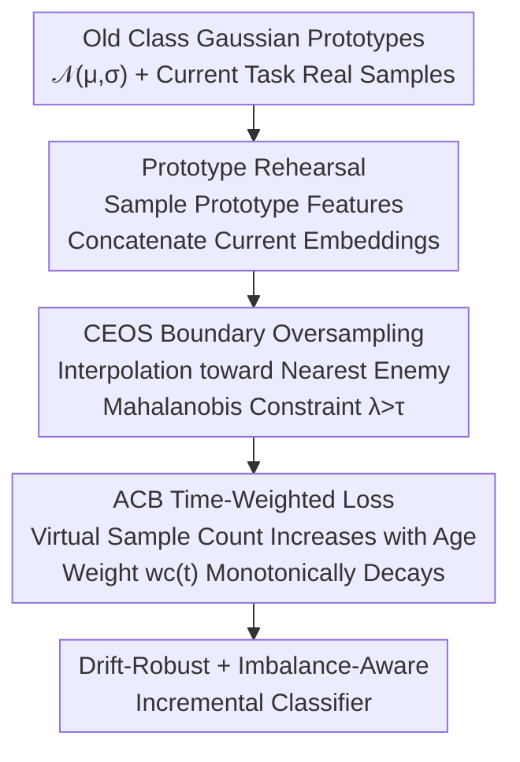

# Revisiting Prototype Rehearsal for Exemplar-Free Continual Learning: Manifold-Aware Boundary Sampling with Adaptive Class-Balanced Loss

**Conference**: CVPR 2026 (Findings)  
**arXiv**: [2606.05695](https://arxiv.org/abs/2606.05695)  
**Code**: https://github.com/HXuSz11/ACB_CEOS_CVPR2026_Findings  
**Area**: Continual Learning / Class-Incremental Learning / Representation Learning  
**Keywords**: Exemplar-Free Class-Incremental Learning, Prototype Rehearsal, Manifold Oversampling, Class Imbalance, Drift Compensation

## TL;DR
Addressing the phenomenon where prototype rehearsal is outperformed by drift compensation in Exemplar-Free Class-Incremental Learning (EFCIL), this paper suggests the issue lies not in rehearsal itself but in how it is instantiated (Gaussian sampling being off-manifold + implicit imbalance of old classes). The authors propose CEOS oversampling, which performs boundary-aware interpolation toward nearest enemy classes, and the ACB loss with class-age-decaying weights. This allows prototype rehearsal to match or surpass SOTA drift compensation methods.

## Background & Motivation
**Background**: Exemplar-Free Class-Incremental Learning (EFCIL) requires models to learn new classes continuously without storing original old data, relying on a compact "prototype" for each class (feature mean $\bm{\mu}_c=\frac{1}{|\mathcal{D}_c|}\sum_x F(x)$) to maintain history. This field is divided into: **prototype rehearsal**, which samples synthetic features around old prototypes to train with current tasks, and **drift compensation**, which realigns outdated prototypes into the evolving feature space without generating samples.

**Limitations of Prior Work**: Recent benchmarks consistently show that drift compensation (e.g., ADC, LDC) significantly outperforms prototype rehearsal (e.g., PASS, PRAKA, EFC), leading the community to believe prototype rehearsal is inherently weaker.

**Key Challenge**: The authors argue against this conclusion—the performance gap stems not from the principle of rehearsal, but from its **instantiation**. Existing rehearsal methods have two blind spots: (i) treating prototypes as isolated class summaries and sampling independently, **completely ignoring the geometric information of nearest enemy classes**, which define the decision boundaries; (ii) ignoring an **implicit imbalance that accumulates over time**—each old class has only a few synthetic points around a single prototype, while each new class brings hundreds of real features. Even if the data stream is globally balanced, this mismatch in effective sample counts pulls the classifier toward recent tasks. Furthermore, as the encoder drifts, samples from fixed spherical Gaussians become increasingly "off-manifold."

**Goal + Key Insight**: Re-evaluate prototype rehearsal from "manifold-aware" and "imbalance-aware" perspectives. The paper formalizes these risks with two theorems: Theorem 1 proves that under extreme imbalance (old class $m\ll K$), the softmax posterior as $T\to\infty$ is $p_{W_T}(y=c\mid x)\to 0$; Theorem 2 proves that as drift $\delta_t\to\infty$, the logit alignment between Gaussian synthetic samples and classifier weights $\mathbb{E}[W_{T,c}^\top\tilde{x}]\to 0$.

**Core Idea**: Use "constrained interpolation toward the nearest enemy class" instead of "Gaussian noise" to generate boundary-aware old class samples. Utilize "time-weighted cross-entropy that decays with class age" instead of "static weights" to correct the evolutionary imbalance between old and new classes.

## Method
### Overall Architecture
The method performs three steps per task $t$ while strictly adhering to a zero-exemplar budget. The **input** consists of real samples from the current task and historically maintained class-wise Gaussian prototypes $\{\mathcal{N}(\mu_{t-1},\sigma_{t-1})\}$. The **output** is a classifier robust to old classes and not overwhelmed by new ones. Specifically: first, a batch of features is randomly sampled from the prototype set and concatenated with current task embeddings from the backbone $F_t$ (Prototype Rehearsal). Next, for each old prototype feature, its $k$ nearest enemy class features are identified, and interpolation with boundary constraints is performed to create synthetic minority class samples that "expand to the boundary without crossing it" (CEOS). Finally, training uses a time-weighted cross-entropy scheduled by class age—newly generated prototypes have higher weights that gradually decay to near uniformity (ACB Loss). These modules are complementary: CEOS changes "what samples to create," while ACB changes "how much weight these samples hold in the loss."

### Key Designs

**1. CEOS (Constrained Expansion Oversampling): Keeping synthetic samples on the boundary without crossing it**

To address the issue where Gaussian sampling clusters around prototypes and fails to cover decision boundaries while ignoring enemy geometry, CEOS moves away from isotropic noise. It performs convex interpolation between each minority class prototype $\mathbf{p}$ and its nearest enemy class feature $\mathbf{e}$ (a sample from a different class) in the current mini-batch:

$$\tilde{\mathbf{x}}=\lambda\,\mathbf{p}+(1-\lambda)\,\mathbf{e},\qquad \lambda\in(\tau,1),\ \tau>\tfrac{1}{2}$$

Synthetic points carry the hard label of the prototype. The constraint $\lambda>\tfrac{1}{2}$ ensures the synthetic point falls on the segment $\mathbf{p}\!\to\!\mathbf{e}$ and remains closer to $\mathbf{p}$ than $\mathbf{e}$, thus expanding the support region "toward the boundary without crossing it." Crucially, $\tau$ is not chose heuristically: the authors define the local decision boundary using Mahalanobis distance $d_M(\mathbf{x},\mathbf{p})=\sqrt{(\mathbf{x}-\mathbf{p})^\top\Sigma^{-1}(\mathbf{x}-\mathbf{p})}$ (where $\Sigma$ is estimated from the current batch). They require the synthetic point to satisfy $d_M(\tilde{\mathbf{x}},\mathbf{p})<d_M(\tilde{\mathbf{x}},\mathbf{e})$ (remaining on the prototype-dominant side), analytically solving for the lower bound of $\lambda$:

$$\lambda>\frac{1}{2}+\frac{\Delta^\top\Sigma^{-1}\delta}{2\,\delta^\top\Sigma^{-1}\delta},\quad \Delta=\mathbf{e}-\mathbf{p},\ \delta=\tilde{\mathbf{x}}-\mathbf{p}$$

A local safety lower bound $\tau_{(\mathbf{p},\mathbf{e})}$ is computed for each pair $(\mathbf{p},\mathbf{e})$, then $\lambda$ is sampled from $\mathcal{U}(\tau_{(\mathbf{p},\mathbf{e})},1)$ (adaptive mixing coefficient). This ensures class consistency while preserving boundary margins—more stable than PRAKA’s "random old prototype pairing," which often pushes points into the neighborhood of other closer prototypes.

**2. ACB Loss (Adaptive Class-Balanced Loss): Letting new prototypes exert influence before yielding to real data**

To address cumulative implicit imbalance, ACB assigns each class a **virtual sample count that grows with class age**, which inversely scales the loss weight. For class $c$ first appearing at task $t_c$, its virtual sample count at task $t\geq t_c$ is:

$$N_c(t)=\min\Bigl\{N_{\max},\,N_{\min}+(N_{\max}-N_{\min})\bigl(\tfrac{t-t_c}{T}\bigr)^{\gamma}\Bigr\}$$

The corresponding class-balanced weight follows the effective-number form $w_c(t)=\frac{1-\beta}{1-\beta^{N_c(t)}}$ ($0<\beta<1$; as $\beta\to1, w_c\approx1/N_c(t)$), which is monotonically decreasing with $N_c(t)$. The intuition is clear: when a prototype is first generated (low class age, low $N_c$, high weight), it is most representative of the current decision boundary and should drive the loss; as the class ages and subsequent tasks provide richer real supervision, its virtual count rises, its weight decays, and its influence is gently annealed. The final loss is weighted cross-entropy $\mathcal{L}_{\text{ACB}}(t)=-\frac{1}{|\mathcal{B}|}\sum_{(x,y)\in\mathcal{B}}w_y(t)\log p_y(x)$, where $\mathcal{B}$ contains both prototype features and current samples. This turns the "stability vs. plasticity" trade-off into a principled temporal schedule.

### Loss & Training
Total Loss = Prototype Rehearsal Cross-Entropy (Eq 4: one term for new classes $\mathcal{C}_t$, one for rehearsing all seen classes $\mathcal{C}_{\leq t}$) + ACB time weighting. ResNet-18 is trained from scratch. CIFAR-100 / TinyImageNet: Adam, lr $1\times10^{-4}$, weight decay $2\times10^{-4}$, 100 epochs. ImageNet-100 / CUB-200: backbone lr $1\times10^{-5}$, head lr $1\times10^{-4}$. Dual batches of 64 real and 64 prototype samples are used. Virtual sample bounds: $N_{\min}=100$, $N_{\max}=500$. CEOS uses $k=1$ enemy class per prototype, injecting 64 synthetic samples per batch starting from the second task.

## Key Experimental Results

### Main Results
Evaluation across four benchmarks, backbone trained from scratch, mean ± std of five runs. Metrics are last task average accuracy $A_{\text{last}}$ and average incremental accuracy $A_{\text{inc}}$.

| Dataset / Split | Metric | Ours | Prev. SOTA | Gain (pp) |
|--------------|------|------|----------|------|
| CIFAR-100 T=10 | $A_{\text{last}}$/$A_{\text{inc}}$ | **46.9 / 60.2** | LDC 45.4 / 59.5 | +1.5 / +0.7 |
| TinyImageNet T=20 | $A_{\text{last}}$/$A_{\text{inc}}$ | **31.8 / 44.3** | LDC 24.9 / 38.2 | +6.9 / +6.1 |
| TinyImageNet T=40 | $A_{\text{last}}$/$A_{\text{inc}}$ | **23.2 / 36.3** | LDC 15.3 / 29.7 | +7.9 / +6.6 |
| ImageNet-100 T=10 | $A_{\text{last}}$/$A_{\text{inc}}$ | **52.7 / 65.1** | EFC 50.9 / 61.3 | +1.8 / +3.8 |
| CUB-200 T=20 | $A_{\text{last}}$/$A_{\text{inc}}$ | **48.1 / 61.0** | EFC 46.1 / 59.3 | +2.0 / +1.7 |

Key Observation: Although part of the prototype rehearsal family, this method **surpasses** drift compensation SOTA in most splits. The advantage becomes more pronounced as task length increases (TinyImageNet T=20 leads LDC by up to 6.9/6.1 pp). While slightly trailing LDC's reported values in a few splits, the authors re-ran LDC's code on ImageNet-100 T=10 and achieved only 41.7/58.7, suggesting LDC's reported numbers might be optimistic.

### Ablation Study
TinyImageNet results for components (Table 3) and sampling strategy comparisons (Table 4):

| Configuration | T=10 $A_{\text{last}}$/$A_{\text{inc}}$ | T=20 $A_{\text{last}}$/$A_{\text{inc}}$ | Description |
|------|------|------|------|
| Baseline (EFC) | 34.5 / 47.9 | 28.4 / 42.1 | No CEOS, no ACB |
| + CEOS | 35.1 / 48.7 | 30.4 / 43.0 | Boundary oversampling only |
| + $\mathcal{L}_{\text{acb}}$ | 35.4 / 48.5 | 30.9 / 43.8 | Time-weighting only |
| + Focal loss | 34.9 / 48.2 | 29.4 / 42.7 | Standard imbalance fix; inferior to ACB |
| CEOS + $\mathcal{L}_{\text{acb}}$ (Full) | **35.8 / 49.0** | **31.8 / 44.3** | Optimal synergy |

| Sampling Method (N) | T=10 $A_{\text{last}}$/$A_{\text{inc}}$ | T=20 $A_{\text{last}}$/$A_{\text{inc}}$ | Description |
|------|------|------|------|
| Gaussian (64) | 34.5 / 47.9 | 28.4 / 42.1 | Baseline |
| Gaussian (128) | 34.0 / 47.6 | 27.9 / 41.8 | Accuracy drops with more samples |
| Gaussian (256) | 33.3 / 47.8 | 27.2 / 41.4 | Continues to drop |
| Bi-interpolate (64, PRAKA) | 32.8 / 47.2 | 26.7 / 41.0 | Random prototype pairing; worst |
| CEOS (64) | **35.1 / 48.7** | **30.4 / 43.0** | Best performance with manifold samples |

### Key Findings
- **More Gaussian samples are useless or harmful**: Increasing N from 64 to 256 for Gaussian rehearsal led to a monotonic decrease in $A_{\text{last}}$. This suggests the bottleneck is not just the count imbalance but "how samples fill the space." CEOS outperforms them with only 64 manifold samples, proving boundary alignment is critical.
- **Nearest enemy $k=1$ is optimal**: Contrary to static imbalance tasks where more enemies help, in EFCIL, multi-enemy interpolation introduces blurry, overlapping features leading to task confusion. $k=1$ anchors samples to the boundary while maintaining semantic consistency.
- **ACB outperforms Focal Loss**: Focal loss focuses on task difficulty but misses the "cumulative long tail" over time. ACB’s temporal schedule addresses the root cause in CIL.
- **Nearly zero extra overhead**: Built on the lightweight EFC, the method is slightly slower than LwF but significantly faster than LDC (which requires 30 extra projection head training epochs, >260 seconds per task). Despite lacking explicit drift compensation, measured prototype drift is actually smaller.

## Highlights & Insights
- **"Problem is not with the principle, but the instantiation" is a compelling narrative**: By using two asymptotic theorems to formalize why rehearsal weakens, the authors provide a complete logical loop.
- **Analytical $\tau$ via Mahalanobis distance is a solid guarantee**: Unlike mixup which relies on empirical thresholds, each prototype-enemy pair here calculates a safe lower bound to theoretically ensure synthetic points remain on the correct side of the boundary.
- **Virtual sample counts + effective-number weights**: Encoding the intuition that "newly generated prototypes are most credible" into a decay weight provides a universal stability-plasticity scheduler applicable to other rehearsal methods.
- **Counter-intuitive "Aha" moment**: In Continual Learning, the "more is better" rule for oversampling fails. A few boundary-aligned samples are vastly superior to massive amounts of spherical noise, highlighting that manifold geometry matters more than sample quantity.

## Limitations & Future Work
- The method assumes prototypes remain "sufficiently informative" after feature drift and relies on finding meaningful enemy neighbors for boundary enhancement. In highly non-stationary or sparse regions, interpolation might produce ambiguous samples.
- Evaluation is limited to ResNet-18 trained from scratch; performance on Transformer or large pre-trained backbones is unverified.
- Mahalanobis distance for $\tau$ relies on batch-wise covariance estimation, which might be unstable in high dimensions or small batches.
- Performance on ImageNet-100 $A_{\text{inc}}$ still trails the reported values of LDC (though the authors question its reproducibility).

## Related Work & Insights
- **vs Drift Compensation (SDC / ADC / LDC)**: While these methods explicitly align outdated prototypes, the proposed work achieves similar or better results by improving sample generation and addressing imbalance at a lower cost.
- **vs Gaussian Rehearsal (PASS / EFC)**: This work argues that spherical Gaussian sampling is off-manifold and demonstrates that increasing such samples is harmful. CEOS provides a manifold-aware alternative.
- **vs PRAKA (bi-interpolate)**: PRAKA uses random prototype pairing for interpolation, which can push points into neighboring classes. CEOS's nearest enemy + Mahalanobis constraint ensures better separability.

## Rating
- Novelty: ⭐⭐⭐⭐ The combination of manifold formalization, constrained interpolation, and temporal weighting is technically sound and logically justified.
- Experimental Thoroughness: ⭐⭐⭐⭐ Covers four benchmarks, multi-task lengths, and various ablations, though backbones are limited.
- Writing Quality: ⭐⭐⭐⭐ Clear motivation, intuitive diagrams, and a good balance between theory and empirics.
- Value: ⭐⭐⭐⭐ Provides a high-performance, low-overhead SOTA solution for the rehearsal family.

<!-- RELATED:START -->

## Related Papers

- [\[CVPR 2026\] Exemplar-Free Class Incremental Learning via Preserving Class-Discriminative Structure](exemplar-free_class_incremental_learning_via_preserving_class-discriminative_str.md)
- [\[CVPR 2026\] HyCal: A Training-Free Prototype Calibration Method for Cross-Discipline Few-Shot Class-Incremental Learning](hycal_training_free_prototype_calibration_for_cross_discipline_fscil.md)
- [\[AAAI 2026\] Expandable and Differentiable Dual Memories with Orthogonal Regularization for Exemplar-free Continual Learning](../../AAAI2026/self_supervised/expandable_and_differentiable_dual_memories_with_orthogonal_regularization_for_e.md)
- [\[ECCV 2024\] Exemplar-Free Continual Representation Learning via Learnable Drift Compensation](../../ECCV2024/self_supervised/exemplar-free_continual_representation_learning_via_learnable_drift_compensation.md)
- [\[ECCV 2024\] Revisiting Supervision for Continual Representation Learning](../../ECCV2024/self_supervised/revisiting_supervision_for_continual_representation_learning.md)

<!-- RELATED:END -->
