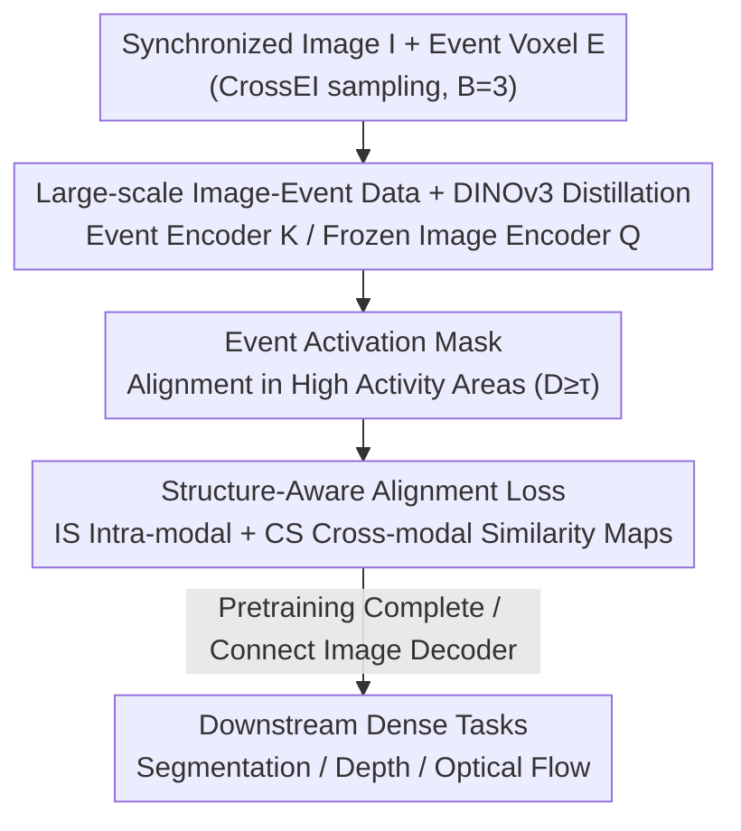

# Scaling Dense Event-Stream Pretraining from Visual Foundation Models

**Conference**: CVPR 2026  
**Paper**: [CVF Open Access](https://openaccess.thecvf.com/content/CVPR2026/html/Chen_Scaling_Dense_Event-Stream_Pretraining_from_Visual_Foundation_Models_CVPR_2026_paper.html)  
**Code**: https://github.com/zhiwen-xdu/ScaleEvent  
**Area**: Self-Supervised Representation Learning / Event Camera  
**Keywords**: Event-stream pretraining, Cross-modal knowledge distillation, Visual Foundation Models, Structure-aware alignment, Density perception

## TL;DR
ScaleEvent treats Visual Foundation Models (VFM) such as DINOv3 as frozen teachers to perform large-scale cross-modal dense distillation on approximately 500,000 synchronized "image-event" pairs. By using an "Event Activation Mask + Structure-Aware Loss" to correct semantic collapse caused by differences in sparsity and granularity between images and events, it obtains fine-grained event representations transferable to segmentation, depth, and optical flow, reducing downstream RMSE by up to ~58%.

## Background & Motivation
**Background**: Event cameras are known for ultra-low latency, high dynamic range, and low power consumption, making them powerful sensors for dense scene understanding. However, performing dense tasks such as semantic segmentation, depth estimation, and optical flow requires learning high-quality, fine-grained event representations first. The mainstream approach involves fully supervised training using dense event annotations.

**Limitations of Prior Work**: Event streams are asynchronous, sparse, and irregular point sets. Dense annotations are extremely expensive and difficult to scale. Semi-supervised/weakly supervised methods are limited by the quality of pseudo-labels. Although event self-supervision (masked modeling, contrastive learning, self-distillation) draws on image-domain paradigms, the scarcity, discreteness, and sparsity of event data make it difficult to scale models and design pretext tasks that can stably mine dense patterns.

**Key Challenge**: Cross-modal knowledge distillation (letting an event student imitate an image teacher) could bypass pretext task design and directly inherit strong semantic priors. However, images are dense and texture-rich, while events are sparse, providing signals only at dynamic edges—the two fundamentally **mismatch in sparsity and granularity**. Directly using rigid correspondence losses at the pixel/patch or superpixel level leads to over-coupling of features that should not be tied together, resulting in **semantic collapse** of event representations, which worsens as resolution increases.

**Goal**: To "scale up" event representation pretraining without any annotations, while simultaneously addressing semantic collapse at high resolutions.

**Key Insight**: Observations show that within a single patch, event edge fragments appear cluttered; however, when the receptive field is enlarged, these fragments aggregate into semantically coherent wholes. VFMs (DINOv3) **intrinsically provide** a "semantic structure map" characterizing the similarity between all token pairs, encoding both local affinity and global dependencies.

**Core Idea**: Instead of hard-aligning the fragile correspondence of "this event patch ↔ that image patch," the distillation target is **elevated to the semantic structure level**. By forcing the similarity map of the event feature space to approximate the similarity map of VFM image features, a wider receptive field provides stronger and more stable supervision.

## Method

### Overall Architecture
ScaleEvent is a cross-modal distillation framework consisting of a "frozen image teacher + trainable event student." The goal is to pretrain an event encoder $F_{\theta_e}$ such that its fine-grained tokens align with DINOv3 image features. Input consists of synchronized images $I\in\mathbb{R}^{H\times W\times 3}$ and event streams; the event stream is first processed via CrossEI's motion-adaptive sampling and aggregated into voxels $E\in\mathbb{R}^{H\times W\times B}$ ($B=3$) for compatibility with VFM inputs. Images pass through a frozen DINOv3 encoder $G_{\theta_i}$ to obtain teacher features $Q$, while events pass through an event encoder with the same architecture (initialized with DINOv3 weights) to obtain student features $K$.

Distillation is not a simple token-wise pull: an **Event Activation Mask** $M$ is first used to focus alignment on high-activity regions where signals are concentrated, followed by the application of a **Structure-Aware Loss** (intra-modal + cross-modal) to align the event similarity geometry with the image semantic structure. After pretraining, the event encoder is directly connected to existing image-domain decoders (EoMT for segmentation / DAv2 for depth / SEA-RAFT for optical flow) for transfer to downstream dense tasks.

### Key Designs

**1. Large-scale Synchronized Image-Event Data + DINOv3 Cross-modal Distillation Baseline: Establishing Scale and Teacher Presence**

The primary bottleneck for event self-supervision is insufficient data scale and the reliance on pretext tasks to mine dense patterns. The authors abandon the event-only route in favor of constructing a synchronized image-event collection spanning various conditions (static vs. ego-motion, indoor vs. outdoor, real vs. simulation, different sensors, and resolutions). Aggregated from over 10 datasets and VID2E simulations, unified to $640\times480$ via scaling/cropping, the final set contains ~500,000 image-event pairs. The SOTA Visual Foundation Model DINOv3 (ViT-S/B/L, patch=16, frozen) is selected as the teacher, while the event branch uses the same architecture initialized with DINOv3 weights. Naive distillation uses an L1 loss $\mathcal{L}_{l1}(K,Q)=\frac{1}{N}\sum_n \lVert K_n-Q_n\rVert_1$, making event tokens directly imitate image tokens. The value of this step lies in the student "directly inheriting" strong image-domain semantic priors without elaborate pretext tasks, enabling large-scale training—though L1 alone collapses at high resolutions, leading to the next two designs.

**2. Event Activation Mask: Supervising Only Where Signals Exist**

Event voxels contain many patches with almost no events and void textures; rigidly aligning these blank areas introduces misleading supervision. The authors construct a binary mask to focus distillation on "high activity" regions. Specifically, events within a patch are counted along the temporal axis to generate a density map $D(\mu,\nu)=\sum_{b=1}^{B}\sum_{(i,j)\in P(\mu,\nu)}\phi(E(i,j,b))$, where $\phi(\cdot)$ maps activation to non-negative counts (e.g., using absolute values); this is then binarized using a threshold $\tau$: $D(\mu,\nu)\ge\tau$ is set to 1, otherwise 0 (with $\tau=64$). Masked features are denoted as $K^*=K\odot M$ and $Q^*=Q\odot M$. This ensures supervision falls only on regions with concentrated signals and clear motion textures, suppressing background noise and strengthening the shared semantic structure for cross-modal alignment.

**3. Structure-Aware Alignment Loss: Raising Targets from "Patch-wise" to "Similarity Map-wise"**

This is the core of the paper. Instead of forcing event features to be pointwise equal to image features, the authors require their **similarity maps** to be consistent. A similarity map is an undirected weighted graph where nodes are feature anchors and edges are token-to-token affinities. It includes two components: the Intra-modal Structure Loss (ISL), which penalizes differences between the event's own similarity matrix and the image's own similarity matrix, $\mathcal{L}_{is}=\frac{1}{N}\sum_n\lVert (K^*_n)(K^*_n)^{\top}-(Q^*_n)(Q^*_n)^{\top}\rVert_1$; and the Cross-modal Structure Loss (CSL), which encourages the "event → image" affinity distribution to approximate the "image → image" affinity distribution, $\mathcal{L}_{cs}=\frac{1}{N}\sum_n\lVert (K^*_n)(Q^*_n)^{\top}-(Q^*_n)(Q^*_n)^{\top}\rVert_1$. This forces the similarity profile of each event feature relative to all image features to mirror the profile of its paired image anchor.

$$\mathcal{L}_{dis}=\mathcal{L}_{l1}(K^*,Q^*)+\lambda_{is}\mathcal{L}_{is}(K^*,Q^*)+\lambda_{cs}\mathcal{L}_{cs}(K^*,Q^*),\quad \lambda_{is}=10,\ \lambda_{cs}=4.$$

Why it works: Similarity maps naturally provide a wider receptive field. Individual edge fragments may lack semantics at the patch level, but they are restored as coherent structures within the "who am I similar to" graph. Using VFM's existing semantic structure as a bridge avoids rigid mismatches caused by image/event sparsity differences and suppresses semantic collapse at high resolutions, thereby preserving the local discriminability of event representations.

### Loss & Training
Pretraining uses AdamW with an initial learning rate of $5\times10^{-6}$, momentum 0.9, and weight decay $1\times10^{-4}$. The event encoder is fully fine-tuned for 10 epochs (~100k image-event pairs per epoch) on 4 A6000 GPUs. No data augmentation is used during pretraining. For downstream transfer, all decoders are initialized from their respective publicly released pretrained weights.

## Key Experimental Results

### Main Results
On semantic segmentation (DDD17-Seg / DSEC-Semantic, Full supervision setting, mIoU %) and depth estimation (DSEC-Depth, RMSE), ScaleEvent comprehensively outperforms event pretraining SOTA:

| Task / Dataset | Metric | Prev. SOTA | Ours (ViT-L/16) | Gain |
|--------------|------|-----------|-----------------|------|
| Segmentation DSEC-Semantic | mIoU ↑ | STP 62.05 | 69.65 | +7.6 |
| Segmentation DDD17-Seg | mIoU ↑ | STP 63.29 | 65.08 | +1.8 |
| Depth DSEC-Depth | RMSE ↓ | DepthAnyEvent-R 8.880 | 3.694 (ViT-S reduces to 4.564) | ↓ ~58% |
| Depth DSEC-Depth | $\delta_3$ ↑ | — | 0.997 | — |

Under the same backbone (ViT-S/16), it slashes DepthAnyEvent-R's DSEC-Depth RMSE from 8.880 to 4.564. Under linear probing (frozen encoder), segmentation mIoU reaches 58.42%, surpassing the best RGB-transfer method KWYAF (57.75%).

### Ablation Study
Table 5 shows a step-by-step addition of components (ViT-L/16, segmentation mIoU and depth RMSE):

| Configuration | DSEC-Sem mIoU ↑ | DSEC-Depth RMSE ↓ | Description |
|------|------------------|--------------------|------|
| (a) Image-domain weights only | 64.31 | 4.424 | Starting point without event distillation |
| (b) + Cross-modal Distill (L1) | 66.17 | 4.063 | Baseline; large-scale distillation is effective |
| (c) + Activation Mask | 66.54 | 4.025 | Focusing on high-activity areas, slight gain |
| (d) (c) + IS Loss | 69.20 | 3.792 | Intra-modal structure loss contributes most |
| (e) (c) + CS Loss (w/o IS) | 68.68 | 3.870 | Cross-modal structure loss is effective alone |
| (f) Full (IS+CS) | 69.65 | 3.694 | Optimal configuration |

### Key Findings
- **Structure-aware loss is the primary driver of performance**: Adding IS Loss from (c) to (d) increases DSEC-Semantic mIoU from 66.54 to 69.20 (+2.66), the largest single-step gain. This indicates that semantic collapse is indeed the core bottleneck in event distillation, and structure-level alignment hits the target.
- **IS and CS are complementary**: Using IS (d) or CS (e) individually yields gains, but using both simultaneously (f) achieves the best results, as the two structural constraints regulate the "internal event geometry" and "event-to-image geometry," respectively.
- **Higher resolution exacerbates semantic collapse**: Figure 4 shows that as resolution increases from $\times1$ to $\times4$, patch-level distillation PCA/similarity maps become increasingly blurred, while adding masking + structural regularization preserves local discriminability.
- **Strong data efficiency**: With only 1% annotation fine-tuning, DSEC-Depth RMSE reaches 4.983; with 5% annotations, segmentation mIoU reached 62.82%, exceeding fully supervised OpenESS (57.21%).

## Highlights & Insights
- **Shifting the distillation target from "features" to "similarity maps"**: This is the most elegant move—it bypasses the inevitable sparsity/density mismatch of cross-modal pointwise correspondence by replacing rigid alignment with structural consistency. This logic is transferable to any "sparse modality ↔ dense modality" distillation (e.g., Point Cloud ↔ Image, Radar ↔ Image).
- **Leveraging VFM's existing semantic structure as free supervision**: DINOv3's token similarity already encodes local and global dependencies. The authors use it as a "wider receptive field teacher" without training any additional components, effectively magnifying supervision signals at near-zero cost.
- **Activation masking is simple but critical for the event domain**: "Empty area supervision" is a hidden poison for sparse modalities. Filtering alignment regions before Discussing structural alignment is a pragmatic and effective engineering insight.

## Limitations & Future Work
- The teacher is heavily dependent on DINOv3; semantic biases or failure modes of the VFM itself will be distilled into the event representation. Method gains might shrink with weaker teachers (this was not fully explored).
- Requires ~500,000 pairs of **synchronized** image-event data. Real-world synchronized data is costly to acquire, and a large proportion relies on VID2E simulation; the impact of the simulation-to-real gap on the final representation was not analyzed in depth.
- Hyperparameter settings such as $\tau=64$, $\lambda_{is}=10$, and $\lambda_{cs}=4$ lack sensitivity analysis in the paper; it remains uncertain if re-tuning is needed across different datasets ⚠️.
- The method targets dense perception; whether it remains robust in high-speed/high-dynamic range extreme scenarios (motion blur, extremely dark) where event cameras excel requires more specialized evaluation.

## Related Work & Insights
- **vs. Event Self-Supervision (DMM/MEM/ECDDP/STP, etc.)**: These rely on pretext tasks like masked modeling and contrastive learning to mine dense patterns from event-only data, limited by data scale and pretext design. Ours uses cross-modal distillation to directly inherit VFM semantic priors, offering better scale and granularity.
- **vs. OpenESS (Superpixel-level distillation)**: OpenESS combines SAM+CLIP for superpixel-level multi-modal alignment, but superpixel grouping itself is ambiguous and can amplify misguidance. This paper elevates alignment to the semantic structure level, where similarity maps are more stable than superpixels.
- **vs. EventSAM / DepthAnyEvent (Task-specific distillation)**: The former distills SAM for patch-level semantic-agnostic features, and the latter distills DAv2 for depth-aware features. Both are tied to specific tasks and hard to scale. This paper provides a unified dense pretraining framework where one encoder transfers to segmentation, depth, and optical flow.
- **Insight**: The principle of "aligning second-order similarity structures rather than first-order features when distilling a sparse modality from a dense one" is applicable to almost any cross-modal pretraining with significant sparsity differences.

## Rating
- Novelty: ⭐⭐⭐⭐⭐ Upgrading the distillation target from feature alignment to similarity structure alignment cleanly solves semantic collapse under cross-modal sparsity mismatch.
- Experimental Thoroughness: ⭐⭐⭐⭐⭐ Covers three tasks (Seg/Depth/Flow), three protocols (LP/Few-shot/Full), and three scales (ViT-S/B/L), with clear component-wise ablation.
- Writing Quality: ⭐⭐⭐⭐ Solid motivation derivation and intuitive diagrams, though some hyperparameter selections lack sensitivity analysis.
- Value: ⭐⭐⭐⭐⭐ Significantly advances the SOTA in event representation pretraining with high data efficiency; the framework has universal applicability for other sparse-dense cross-modal distillation tasks.

<!-- RELATED:START -->

## Related Papers

- [\[CVPR 2026\] Scaling Parallel Sequence Models to Vision Foundation Models](scaling_parallel_sequence_models_to_vision_foundation_models.md)
- [\[CVPR 2026\] Franca: Nested Matryoshka Clustering for Scalable Visual Representation Learning](franca_nested_matryoshka_clustering_for_scalable_visual_representation_learning.md)
- [\[CVPR 2026\] Chain-of-Models Pre-Training: Rethinking Training Acceleration of Vision Foundation Models](com_pt_chain_of_models_pretraining.md)
- [\[CVPR 2026\] Harnessing the Power of Foundation Models for Accurate Material Classification](harnessing_the_power_of_foundation_models_for_accurate_material_classification.md)
- [\[CVPR 2026\] UPLiFT: Efficient Pixel-Dense Feature Upsampling with Local Attenders](uplift_efficient_pixel-dense_feature_upsampling_with_local_attenders.md)

<!-- RELATED:END -->
