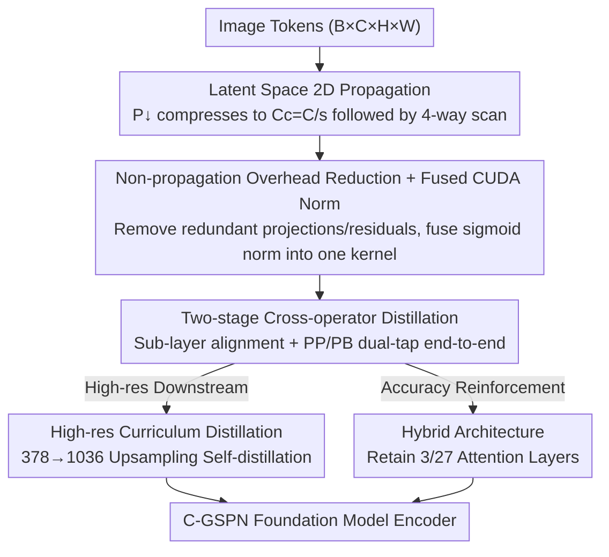

# Scaling Parallel Sequence Models to Vision Foundation Models

**Conference**: CVPR 2026  
**Paper**: [CVF Open Access](https://openaccess.thecvf.com/content/CVPR2026/html/Jiang_Scaling_Parallel_Sequence_Models_to_Vision_Foundation_Models_CVPR_2026_paper.html)  
**Code**: None  
**Area**: Vision Foundation Models / Self-supervised Representation Learning  
**Keywords**: Sub-quadratic operators, Spatial Propagation Network, Cross-operator distillation, High-resolution encoder, CLIP pre-training  

## TL;DR
This paper transforms the linear-complexity 2D Spatial Propagation Network (GSPN) into a compressed latent space version (C-GSPN) and uses two-stage cross-operator distillation to transfer knowledge from an attention-based teacher. It marks the first successful push of sub-quadratic operators to CLIP-level vision foundation model pre-training—achieving 2× faster block-level latency than FlashAttention at 1K resolution, a 2.1% improvement in segmentation, and zero-shot accuracy approaching attention baselines.

## Background & Motivation
**Background**: Vision foundation models (such as CLIP/SigLIP) rely on self-attention for contrastive pre-training on massive image-text pairs to obtain general encoders capable of wide zero-shot transfer. However, self-attention has $O(N^2)$ complexity relative to the number of tokens. As resolution increases, token counts explode, and memory/latency become dominated by attention.

**Limitations of Prior Work**: To make attention sub-quadratic, three main paths exist: sparse/local windows (Longformer, Swin), kernel-approximated linear attention (Performer, Linformer), and State Space Models (S4, Mamba). The first two flatten images into structure-agnostic 1D token sequences, losing critical inductive biases like 2D spatial coherence. 1D sequence operators like Mamba require additional 2D biases or hierarchical designs to fit high-resolution vision. Most critically, none of these operators have been **scaled to foundation model data and model sizes**—training a SigLIP-v2 from scratch requires 40 billion image-text pairs and 2048 TPUs; no one had verified if sub-quadratic operators could support CLIP-level pre-training.

**Key Challenge**: GSPN (Generalized Spatial Propagation Network) was an ideal candidate—it performs line-scan propagation along four directions on a 2D grid with linear complexity and no need for positional encodings. However, it has a hardware-level flaw: GSPN propagates independently across channels. With limited blocks and registers on each SM, increasing the batch or channel count causes extra slices to be serialized. Theoretical parallelism fails, leading to latency spikes (e.g., latency jumps 11.57× when $C$ increases from 288 to 576). Consequently, "linear complexity" becomes slower than attention at scale.

**Goal**: (1) Maintain flat latency for GSPN under large batch/channel sizes; (2) transfer knowledge from existing attention teachers to propagation operators instead of training from scratch; (3) scale this system to foundation model sizes while preserving zero-shot capabilities.

**Core Idea**: Move propagation into a **compressed latent space** to bypass the GPU concurrency wall (C-GSPN), then use **two-stage cross-operator distillation** to transfer representations from an attention teacher. This saves compute while maintaining accuracy, creating the first CLIP-level encoder using sub-quadratic operators.

## Method

### Overall Architecture
The goal of C-GSPN is to replace the attention sub-layer in ViT with a fast and accurate 2D spatial propagation sub-layer, trained to foundation model scale via distillation. The pipeline consists of two main parts: **Operator Modification** (making single-layer propagation extremely fast at high resolution/large batch) and **Distillation Training** (transfer from attention teachers + high-resolution curriculum transfer).

First, the background operator: GSPN propagates row-by-row along a grid for an input $x \in \mathbb{R}^{H \times W \times C}$, with all positions within a row updated in parallel. Taking top-down propagation as an example, the recurrence for channel $c$ at row $i$ is:

$$h_{i,:,c} = w_{i,c} \, h_{i-1,:,c} + \mathrm{Diag}(\lambda_{i,:,c}) \, x_{i,:,c}, \qquad y_{i,:,c} = u_{i,:,c} \odot h_{i,:,c}$$

Where $\lambda, w, u$ are input-dependent parameters. $w$ must be row-stochastic (normalized per row to sum to 1) to satisfy stability-context conditions: $w_{i,c}(j,k) = \sigma(\tilde w_{i,c}(j,k)) / \sum_{k' \in N(j)} \sigma(\tilde w_{i,c}(j,k'))$. Four directions (top-down, bottom-up, left-right, right-left) are scanned. Each pixel requires only three coefficients per pass (tridiagonal neighborhood). A single row scan involves $O(H)$ sequential steps with $W$ elements in parallel; scanning both rows and columns results in an effective sequential depth of $O(\sqrt{N})$.

C-GSPN improves upon this with three operator modifications and two distillation strategies:

### Key Designs

**1. Latent Space 2D Propagation: Bypassing the GPU Concurrency Wall**

GSPN's bottleneck is hardware concurrency, not algorithmic complexity—as channel dimension $C$ grows, propagation slices are serialized by the SM. C-GSPN addresses this directly: it uses a point-wise $1 \times 1$ convolution $P_\downarrow: \mathbb{R}^C \to \mathbb{R}^{C_c}$ to compress channels to $C_c = \lfloor C/s \rfloor$ (compression factor $s > 1$). All propagation parameters $u, \lambda, \tilde w$ are **generated directly in the latent channel space** (predicted by $1 \times 1$ convolutions). The four-way scan runs entirely on $C_c$ channels, and a final $P_\uparrow: \mathbb{R}^{C_c} \to \mathbb{R}^C$ up-projection is applied: $y_c = \mathrm{Prop2D}(x_c; u, \lambda, w), \ y = P_\uparrow(y_c)$.

This reduces the effective propagation grid from $B \times C$ to $B \times C_c$, drastically reducing SM pressure and preventing serialization. At 1K resolution, latent space propagation is 54.46× faster than the original spatial kernel for $C=1152$, and 55.74× faster for $B=32$, with latency staying nearly flat across channels/batches. An additional benefit: since $\tilde w$ is defined in the latent space, the row-stochastic normalization (Sigmoid + local norm) is calculated over $C_c$ instead of $C$, yielding a further 38.9× speedup in weight normalization. Total layer-wise speedup reaches nearly 10× without accuracy loss.

**2. Non-propagation Overhead Reduction + Fused CUDA Normalization Kernel**

Once propagation is accelerated, the bottleneck shifts. The authors found that for medium-low resolutions, total GSPN latency was dominated by **non-propagation parts**—at 1K, these "shells" were 9.6× more expensive than the propagation kernel itself. These shells are redundant structures inherited from attention templates: (i) inner residual paths, (ii) linear projections, and (iii) intermediate up-sampling projections that expand channels before propagation. Removing these one by one reduced shell latency by ~5.5× (removing linear projections caused almost no accuracy loss, while removing channel expansion projections caused the most).

Another optimization target was normalization: row-stochastic normalization originally involved a sequence of Sigmoid → Local Reduce → Clamp → Division, with each step moving data in and out of memory. The authors fused these into **a single custom CUDA kernel**, reducing intermediate memory traffic and kernel launch overhead, making it 2.15× faster than the PyTorch baseline. Combined with latent space compression (reducing $C=1152$ to $C_c=64$), total normalization costs at 1K dropped by 83.68×. Together, these three modifications make the C-GSPN layer 13.7× faster than the original GSPN at 1K.

**3. Two-stage Cross-operator Distillation: Transferring via Dual-tap PP/PB**

Training foundation models from scratch is impractical, so knowledge is distilled from pretrained attention teachers (SigLIP-v2 / OpenCLIP). However, cross-operator transfer is difficult: attention relies on explicit pair-wise interactions to mix all tokens simultaneously, while GSPN relies on sequential local propagation. Their feature distributions differ, so attention weights cannot be directly copied. The authors use a progressive two-stage approach:

**Stage 1: Sub-layer Pre-training**—Aligning C-GSPN propagation sub-layers block-by-block to the teacher's attention sub-layers. Both teacher and student in block $i$ receive the **same** output $h^{t,(i-1)}$ from the teacher's previous block. They calculate the propagation output $F^{s,(i)}$ and attention output $F^{t,(i)}$, minimizing $L^{(i)}_{prop} = \lVert F^{s,(i)} - F^{t,(i)} \rVert_2^2$. The teacher is frozen, and blocks are trained independently without inter-block backpropagation, allowing each propagation sub-layer to learn the representation patterns of its paired attention sub-layer as a strong initialization.

**Stage 2: End-to-end Distillation**—Two **taps** are attached to each block: Post-Propagation (PP) after the sub-layer and Post-Block (PB) after the entire block (including MLP+norm). Each tap uses MSE for feature alignment and KL for distribution alignment: $L_{PP} = \mathrm{MSE}(\hat V^s_{PP}, V^{t}_{PP}) + \lambda_1 \mathrm{KL}(P(\hat V^s_{PP}) \Vert P(V^{t}_{PP}))$. The total loss is $L_{total} = \alpha L_{PP} + \beta L_{PB}$. The intuition is to decompose the task: PB supervision preserves block-level transformations (MLP architectures are mostly isomorphic between teacher and student), while PP supervision **forces the GSPN sub-layer to learn attention-style mixing**, preventing the MLP from "absorbing" the operator mismatch. Adding the PP tap yielded a 3.1% accuracy gain. A lightweight MLP **adapter** is inserted before each tap as a learnable bridge ($V^s_{PP} \to \hat V^s_{PP}$) because the feature space gap is too large for direct comparison; this stabilizes training for the PP tap.

**4. High-resolution Curriculum Distillation + Hybrid Attention**

C-GSPN requires no positional encodings, so increasing resolution only requires training adjustments rather than architecture changes. This allows single-pass high-resolution inference, avoiding tiling artifacts and global context loss. However, jumping directly from 378 to 756 resolution is ineffective. The authors use **curriculum learning + upsampling self-distillation**: resolution is increased in stages (378→518→756→1036). At each stage, the previous stage's checkpoint is frozen as a teacher, and its PP/PB features are **bilinearly upsampled** to the current resolution $\tilde V^{t,(k)} = \mathrm{Up}(V^{t,(k-1)})$ to supervise the student. Using only 3M samples (1/200th of the full training set), this approach achieves high performance on dense tasks at 1036 resolution, training 2.40× faster than ViT-Distill.

Inspired by MaTVLM, the authors also preserve a small number of attention layers (3 out of 27, or a 1/9 ratio hybrid architecture). A few attention layers inject long-range pair-wise mixing while the rest maintain efficient propagation, staying on the optimal cost-quality frontier (still ~3.9× faster than full attention at 2K).

### Loss & Training
- **Stage 1**: Independent block-wise sub-layer feature MSE alignment (teacher frozen, no inter-block backprop) for initialization.
- **Stage 2**: End-to-end, dual-tap PP/PB using MSE + KL, $L_{total} = \alpha L_{PP} + \beta L_{PB}$, with adapters before taps.
- **High-resolution**: Curriculum resolution scaling + upsampling self-distillation, $L_{hr} = \alpha L_{module} + \beta L_{block}$.
- **Teacher**: OpenCLIP ViT-SO/14@378 (Main) / SigLIP-v2 (Ablation); Data: 600M image-text pairs.

## Key Experimental Results

### System Efficiency (A100, B=32, C=1152)

| Resolution | Metric | Attention | FlashAttention | GSPN | C-GSPN (Ours) |
| :--- | :--- | :--- | :--- | :--- | :--- |
| 1036 | Sub-layer Latency (ms) | 205.90 | 32.81 | 9.95 | **0.18** |
| 2058 | Sub-layer Latency (ms) | OOM | 504.73 | OOM | **0.46** |
| 1036 | Block Latency (ms) | 238.18 | 68.93 | 133.12 | **36.60** |
| 2058 | Block Latency (ms) | OOM | 631.63 | OOM | **147.52** |
| 2058 | Throughput (img/s) | OOM | 1.81 | OOM | **6.91** |

At the sub-layer level, Ours is up to 1097× faster than dot-product attention and 55.3×–86.9× faster than original GSPN. At the block level at 2K, Ours is 4.28× faster than FlashAttention, with 1.67×/3.82× higher throughput at 1K/2K respectively.

### Main Results (Teacher OpenCLIP SO/14@378, 600M pairs)

| Method | Params | Top-1 | ADE20K | COCO | Macro Avg |
| :--- | :--- | :--- | :--- | :--- | :--- |
| OpenCLIP SO/14 (Teacher) | 427M | 84.1 | 45.8 | 47.7 | 64.6 |
| ViT-Distill | 427M | 82.2 | 45.5 | 45.8 | 63.5 |
| GSPN | 477M | 80.5 | 45.3 | 44.3 | 62.7 |
| **C-GSPN (Ours)** | **365M** | 81.3 | **46.0** | 45.0 | 63.3 |

C-GSPN matches the ViT→ViT baseline (63.3 vs 63.5) with 15% fewer parameters, significantly outperforms the original GSPN (62.7), and even exceeds the teacher in segmentation (ADE20K +0.2%).

### Ablation Study

| Configuration | Observation | Explanation |
| :--- | :--- | :--- |
| Contrastive Loss only | Worst | Pure CL is insufficient under compute constraints |
| +PB | Moderate | Block-level supervision only (prior methods) |
| +PB+PP | +3.1% | PP directly supervises propagation sub-layers (largest gain) |
| w/ Adapter | Constant gain | Cross-operator bridge; crucial at PP tap |
| Comp. Ratio 12/18/72 | 18 Optimal | Balance between accuracy and efficiency |
| High-res w/o KD → w/ KD | 1036 mIoU 43.5→45.8 | Upsampling self-distillation, 2.40× faster training |
| Hybrid 3/27 Attention | Consistent gain | Small amount of attention recovers long-range mixing |

### Key Findings
- **The PP tap is the game-changer**: Traditional distillation only supervises at the block level (PB), allowing the MLP to absorb operator mismatches. Direct supervision on the GSPN output forces the propagation sub-layer to truly learn attention-style mixing (+3.1%).
- **Bottlenecks shift**: After accelerating propagation, latency becomes dominated by the "non-propagation shell + weight normalization." One must prune the shell (5.5×) and use fused CUDA kernels (2.15×) to achieve the 13.7× layer-level speedup.
- **Removing channel expansion projections hurts the most**: Among the pruning steps, this caused the largest accuracy drop, which is why a 1/9 attention hybrid is used to recover capacity without sacrificing speed.
- **Curriculum learning is essential for high-res transfer**: Jumping from 378 to 756 resolution directly yielded only 70.2% accuracy; the progressive 378→518→756 path reached 80.4% with the same sample budget.

## Highlights & Insights
- **Distinguishing "Algorithmic Complexity" from "Hardware Concurrency"**: GSPN's failure at large scales was due to the SM concurrency wall, not FLOPs. Latent space compression is not just for reducing compute, but for pushing the number of propagation slices below the concurrency threshold—an optimization perspective for hardware rather than just complexity.
- **Dual-tap Decomposition for Cross-operator Distillation**: Using PP for sub-layers and PB for whole blocks, paired with adapters for soft alignment, provides a reusable recipe for distilling attention knowledge into non-attention operators (e.g., Mamba/SSM).
- **No Positional Encoding = Architecture-free Resolution Scaling**: Native 2D grid propagation allows resolution increases via training only (curriculum + upsampling self-distillation), avoiding tiling and boundary artifacts, making it practical for dense prediction.
- Scaling sub-quadratic operators to CLIP-level using 600M samples (vs 40B for SigLIP-v2) proves distillation is a viable path to avoid the prohibitive costs of training from scratch.

## Limitations & Future Work
- The authors admit that while attention sub-layers were replaced, **MLPs remain untouched**—at resolutions $\ge 512$ and $B=32$, MLPs account for 52% of block latency; they are the next bottleneck for compression or kernel fusion.
- A strong attention teacher is still required; the performance of C-GSPN trained entirely from scratch was not verified to the same quality level, and its upper bound is constrained by the teacher.
- ⚠️ Latency figures are hardware-specific (A100) and config-specific ($B=32, C=1152$). Concurrency thresholds vary by hardware, so speedup ratios may not be directly extrapolatable.
- The 1/9 attention layer retention means the quadratic cost is reduced, not entirely eliminated.

## Related Work & Insights
- **vs FlashAttention**: FlashAttention optimizes constant factors via IO-awareness, but latency still grows quadratically (504ms for 2K sub-layer). C-GSPN replaces the operator with linear propagation (0.46ms for 2K sub-layer), a structural rather than constant-level improvement.
- **vs Original GSPN**: Both use 4-way 2D propagation, but original GSPN runs in the raw channel space with redundant projections, failing at large batch/channel sizes due to the concurrency wall. C-GSPN's latent space + pruned shell + fused kernels make it 13.7× faster at the layer level.
- **vs Mamba/SSMs**: SSMs are 1D sequence operators requiring extra 2D biases for vision. C-GSPN propagates natively on a 2D grid without positional encodings, offering more natural spatial coherence.
- **vs DeiT / Isomorphic ViT Distillation**: DeiT performs same-operator distillation; this work tackles cross-operator (Attention → Propagation) distillation using the PP/PB dual-tap method to handle feature distribution gaps.

## Rating
- Novelty: ⭐⭐⭐⭐⭐ First to push sub-quadratic operators (GSPN) to CLIP-level foundation model pre-training; latent space propagation and cross-operator distillation recipes are highly novel.
- Experimental Thoroughness: ⭐⭐⭐⭐ Coverage of system efficiency, multi-task, high-res, and five ablation groups is strong, though limited to A100 and a single teacher.
- Writing Quality: ⭐⭐⭐⭐ Clear logic from motivation to bottleneck to solution; rich tables and diagrams.
- Value: ⭐⭐⭐⭐⭐ Provides a practical, distillable engineering path for high-resolution vision encoders to escape the quadratic cost of attention.

<!-- RELATED:START -->

## Related Papers

- [\[CVPR 2026\] Scaling Dense Event-Stream Pretraining from Visual Foundation Models](scaling_dense_event-stream_pretraining_from_visual_foundation_models.md)
- [\[CVPR 2026\] Chain-of-Models Pre-Training: Rethinking Training Acceleration of Vision Foundation Models](com_pt_chain_of_models_pretraining.md)
- [\[CVPR 2026\] TALO: Pushing 3D Vision Foundation Models Towards Globally Consistent Online Reconstruction](talo_pushing_3d_vision_foundation_models_towards_globally_consistent_online_reco.md)
- [\[CVPR 2026\] Harnessing the Power of Foundation Models for Accurate Material Classification](harnessing_the_power_of_foundation_models_for_accurate_material_classification.md)
- [\[CVPR 2026\] How Much 3D Do Video Foundation Models Encode?](how_much_3d_do_video_foundation_models_encode.md)

<!-- RELATED:END -->
## Related Papers

- [\[CVPR 2026\] Scaling Dense Event-Stream Pretraining from Visual Foundation Models](scaling_dense_event-stream_pretraining_from_visual_foundation_models.md)
- [\[CVPR 2026\] Robustness of Vision Foundation Models to Common Perturbations](robustness_of_vision_foundation_models_to_common_perturbations.md)
- [\[CVPR 2026\] Chain-of-Models Pre-Training: Rethinking Training Acceleration of Vision Foundation Models](com_pt_chain_of_models_pretraining.md)
- [\[CVPR 2026\] TALO: Pushing 3D Vision Foundation Models Towards Globally Consistent Online Reconstruction](talo_pushing_3d_vision_foundation_models_towards_globally_consistent_online_reco.md)
- [\[CVPR 2026\] Harnessing the Power of Foundation Models for Accurate Material Classification](harnessing_the_power_of_foundation_models_for_accurate_material_classification.md)

<!-- RELATED:END -->
