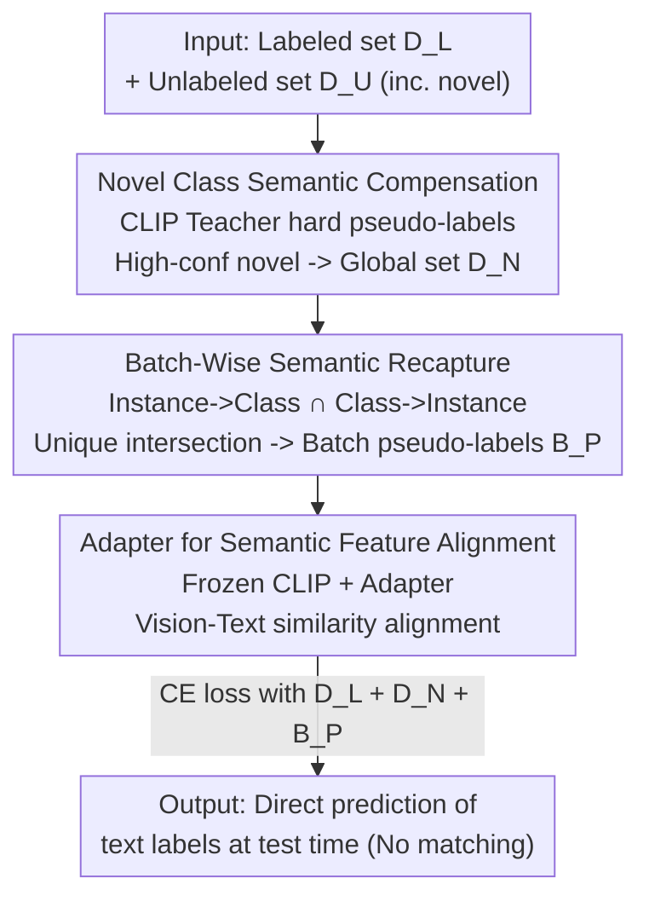

# SECOS: Semantic Capture for Rigorous Classification in Open-World Semi-Supervised Learning

**Conference**: CVPR 2026  
**arXiv**: [2604.27596](https://arxiv.org/abs/2604.27596)  
**Code**: https://github.com/ganchi-huanggua/OSSL-Classification (Available)  
**Area**: Self-Supervised / Open-World Semi-Supervised / Generalized Category Discovery  
**Keywords**: Open-world Semi-supervised Learning, Generalized Category Discovery, CLIP, Semantic Alignment, Pseudo-labeling

## TL;DR
Addressing the issue where Open-World Semi-Supervised Learning (OWSSL) only performs "clustering" and relies on Hungarian matching for accuracy, SECOS utilizes a frozen CLIP to "ground" visual features of novel class samples to candidate textual labels. It generates reliable pseudo-labels through two stages (Global Compensation + In-batch Recapture) and aligns visual-semantic spaces using adapters. This allows **direct prediction of textual labels during testing without any post-processing**, outperforming competitors by up to 5.4% on 7 datasets even when they use Hungarian matching.

## Background & Motivation

**Background**: In Open-World Semi-Supervised Learning (OWSSL, also known as Generalized Category Discovery, GCD), the setting involves a training set with labeled known class samples + a pile of unlabeled samples. The unlabeled samples contain both known classes and **entirely new classes never seen during training**. The model must correctly classify known classes while organizing novel class samples into semantically consistent clusters. Current mainstream approaches leverage priors from pre-trained models (DINO, CLIP) and utilize clustering or pseudo-labeling strategies for novel samples.

**Limitations of Prior Work**: The authors point out that these methods do not perform "rigorous classification." They focus solely on clustering/contrastive learning of visual features during training, ignoring the latent semantic information in novel samples. During evaluation, they rely almost entirely on **Hungarian matching** to align predicted pseudo-labels with ground truth post-hoc. This step is highly unstable; even if many samples in a batch are misclassified, reordering can produce artificially high accuracy. More critically, in real deployment, there is no labeled test set to perform matching, rendering these methods ineffective. In other words, there is **no semantic correspondence** between their outputs and candidate textual labels; they are essentially clustering, not classification.

**Key Challenge**: The authors name the desired task **RC-OWSSL (Rigorous Classification in OWSSL)**—requiring the model to directly pick the most semantically relevant label for each sample from a candidate label set (containing both known and novel class labels), consistent with standard classification tasks and without post-processing. The fundamental reasons existing methods fail are two-fold: novel samples **lack explicit supervision signals** during training, and the methods **lack mechanisms to mine the latent semantic information** of novel classes.

**Goal**: The authors break this down into two research questions. ① What is the core missing component in existing methods? The answer is **semantic grounding**—the ability to associate visual features of a novel class with its linguistic meaning. ② How can semantics be captured when novel classes are completely unsupervised? The answer lies in using models with vision-text priors (CLIP) to calculate semantic similarity between novel samples and candidate labels to achieve effective "semantic capture" through cross-modal alignment.

**Core Idea**: Use frozen CLIP as "external knowledge" to map visual features of unlabeled samples (especially novel ones) to candidate textual labels, creating pseudo-labels with semantic correspondence as explicit supervision. Then, use a lightweight adapter to align the visual feature space with the semantic feature space, enabling the model to directly output textual labels during testing without Hungarian matching.

## Method

### Overall Architecture
SECOS addresses the problem where novel samples lack supervision while known classes are labeled, causing logits to be heavily biased toward known classes. The strategy is to "first generate credible supervision for novel classes, then align the visual space with the semantic space." The inputs are a labeled known set $D_L$ and an unlabeled set $D_U$ (containing known + novel). The backbone is a frozen CLIP, and the output is the direct prediction of candidate textual labels for each image during testing.

The workflow consists of three stages: First, **Novel Class Semantic Compensation** uses a frozen CLIP teacher to assign hard pseudo-labels to $D_U$, selecting high-confidence novel samples to form a global pseudo-labeled novel set $D_N$ ($|D_N| \approx |D_L|$) to balance supervision at a global level. Second, **Batch-Wise Semantic Recapture** uses "instance-to-class" and "class-to-instance" complementary confidence views for cross-validation within each batch, capturing fine-grained semantics for samples with unique semantic clarity to form pseudo-labels $B_P$. Finally, the **Adapter for Semantic Feature Alignment** inserts lightweight adapters into the frozen CLIP visual encoder to project visual features into the semantic space for similarity calculation with textual label embeddings. Training is performed using cross-entropy with all signals ($D_L, D_N, B_P$) to establish explicit "visual structure ↔ semantic meaning" correspondence.

### Key Designs

**1. Novel Class Semantic Compensation: Balancing supervision with global high-confidence pseudo-labels**

This step targets the core pain point—$D_L$ only contains known labels, while novel class signals are buried in $D_U$, leading to severe supervision imbalance. SECOS uses a frozen CLIP teacher $\mathcal{T}$ to assign hard pseudo-labels $\hat{y}_i$ to each sample $u_i \in D_U$. Samples are grouped into $k+n$ subsets $P_c$ based on these labels, keeping **only the subsets belonging to novel classes $C_N$**. For each novel class, the top $\phi\%$ highest-confidence samples are added to the global set $D_N$. By setting $\phi$ such that $|D_N| \approx |D_L|$, the supervision intensity for novel and known classes is balanced globally, suppressing logit bias from the source.

To improve pseudo-label accuracy, descriptive prompts are generated by an LLM for each class (rather than using short words like "cat"). These are encoded by CLIP and averaged to obtain richer refined semantic representations for "grounding."

**2. Batch-Wise Semantic Recapture: Dual-view cross-validation for semantic clarity**

The previous stage is coarse-grained and focused only on novel classes. This step retrieves fine-grained semantics at the batch level. For each sample $u_i$ in a batch, two label sets are defined: the **intra-instance set $C_i^{intra}$** (sample perspective) and the **inter-instance set $C_i^{inter}$** (class perspective). $C_i^{intra}$ is formed by accumulating class confidence in descending order until a threshold $\tau$ (the $\alpha$-quantile of max batch confidence) is met. $C_i^{inter}$ is formed by collecting classes $c$ where $u_i$'s confidence for $c$ exceeds a class-specific threshold $\theta_c$ (expressed as the $\beta$-quantile of all batch samples for class $c$).

The core criterion is: **Select only samples where $|C_i^{intra} \cap C_i^{inter}| = 1$**, using the unique intersection $\hat{y}_i = C_i^{intra} \cap C_i^{inter}$ as the pseudo-label for $B_P$. This ensures the sample's semantics are both "self-assured" and "prominent among the group." This strict filtering suppresses semantic ambiguity even if it reduces the sample count.

**3. Adapter for Semantic Feature Alignment: Aligning visual space to textual space**

The final step is to align the visual feature space with the semantic space using a CLIP backbone. The **textual encoder is frozen** to encode candidate class descriptions into semantic representations $[E_{c_1}, \dots, E_{c_{k+n}}]$. The **original visual encoder parameters are frozen**, and lightweight adapters are **inserted in parallel** after each attention block and before the MLP. The visual forward pass is:

$$f^{(t+1)}(x)=h^{(t)}+\text{MLP}(h^{(t)})+\text{Adapter}(h^{(t)}),\quad h^{(t)}=f^{(t)}(x)+\text{Attention}(f^{(t)}(x))$$

Visual features are projected to semantic dimensions via $V_x = \text{Projector}(f^{(S)}(x))$. The adapter uses a bottleneck structure: $\text{Adapter}(z)=\gamma_{\text{param}}\cdot\mathcal{P}_u(\sigma(\mathcal{P}_d(\text{LayerNorm}(z))))$. Only adapters and the projector are updated during training.

### Loss & Training
Similarity is calculated as the dot product between $V_x$ and $E_{c_i}$. Cross-entropy loss is applied to ground truth or hard pseudo-labels:

$$\mathcal{L}(x,y)=-\sum_{i=1}^{k+n}\mathbb{I}_{[i=y]}\log\big(\exp(\epsilon)\cdot\langle V_x,E_{c_i}\rangle\big)$$

The final loss is the sum of cross-entropy over $(x,y) \in B_L \cup B_N \cup B_P$. Strong/weak augmentation views are used. Training runs for 100 epochs using AdamW (lr 1e-4) with a bottleneck dimension of 10 on a single RTX 3090.

## Key Experimental Results

### Main Results
The evaluation protocol is crucial: competitors use **Hungarian matching** for clustering accuracy $ACC_{cluster} = \frac{1}{|D_{test}|}\sum\mathbb{I}(y_i=W(\bar{y}_i))$, while SECOS uses direct classification accuracy $ACC_{classify} = \frac{1}{|D_{test}|}\sum\mathbb{I}(y_i=\bar{y}_i)$. Since $ACC_{cluster} \geq ACC_{classify}$ for any algorithm, SECOS outperforms competitors even under a **stricter evaluation protocol**.

Generic Datasets (CLIP backbone):

| Dataset | Metric | SECOS | Runner-up | Note |
| :--- | :--- | :--- | :--- | :--- |
| CIFAR100 | N (Novel) | **82.6** | 79.5 (SimGCD-CLIP) | Large lead in novel classes |
| CIFAR100 | A (All) | **84.7** | 81.6 (SimGCD-CLIP) | +3.1 Gain |
| ImageNet100 | N | **89.8** | 86.8 (TP-OWSSL) | +3.0 Gain |
| ImageNet100 | A | **91.7** | 88.0 (TextGCD) | +3.7 Gain |

Fine-grained Datasets (All Accuracy):

| Dataset | SECOS | Runner-up |
| :--- | :--- | :--- |
| CUB | **78.6** | 76.6 (TextGCD/TP-OWSSL) |
| Stanford Cars | **92.3** | 90.7 (TP-OWSSL) |
| Oxford Flowers | **90.0** | 87.3 (TP-OWSSL) |

In generic datasets, SECOS shows Gains of up to 5.35% (All) over TextGCD and TP-OWSSL.

### Ablation Study
Ablation of semantic capture (N: Global Compensation, B: In-batch Recapture):

| Configuration | CIFAR100 N | CIFAR100 A | CUB N | CUB A |
| :--- | :--- | :--- | :--- | :--- |
| $D_L$ only baseline | 14.4 | 50.7 | 22.6 | 51.2 |
| + N | 80.4 | 83.9 | 74.5 | 77.5 |
| + N + B (Full) | **82.6** | **84.7** | **75.1** | **78.6** |

The results show that Global Compensation (N) provides the most significant boost to novel class performance.

### Key Findings
- **Compensation (N) is the most critical**: Accuracy for novel classes jumps from 14.4% to 80.4% on CIFAR100, proving that lack of novel supervision is the bottleneck.
- **Pseudo-label density trade-off**: Setting $\phi \approx 50$ (where $|D_N| \approx |D_L|$) balances known and novel class supervision effectively.
- **Adapter dimension robustness**: Scaling the bottleneck dimension from 2 to 64 shows minimal accuracy variance (<2%), making it cost-effective at 10.
- **Strong Self-learning**: Replacing the teacher with an EMA student results in only a ~0.83% drop, indicating the method's power comes from utilizing CLIP's internal semantics.

## Highlights & Insights
- **Redefining the task is more impactful than beating benchmarks**: Identifying that current OWSSL "relies on Hungarian matching" as an unrealistic setup is a major contribution. RC-OWSSL brings the task closer to production.
- **Strict vs. Loose Evaluation**: Demonstrating that SECOS wins even while using a stricter metric ($ACC_{classify}$) compared to competitors' $ACC_{cluster}$ solidifies its superiority.
- **Dual-view filtering**: The intersection approach for pseudo-labels uses orthogonal perspectives to reject ambiguous samples, a strategy applicable to various semi-supervised tasks.
- **LLM prompt expansion**: Using LLM-generated descriptions instead of short labels is a low-cost trick to improve CLIP's zero-shot grounding quality.

## Limitations & Future Work
- **Reliance on CLIP**: Performance is inherently capped by CLIP's pre-training quality. It may struggle in domains CLIP hasn't seen (e.g., specific medical or industrial defect images).
- **Clean Dataset Assumption**: The method assumes no OOD (Out-Of-Distribution) samples in the unlabeled set. Real-world scenarios with noise or multi-label samples would introduce challenges.
- **Known-class knowledge**: The method assumes the number of novel classes $n$ is known.

## Related Work & Insights
- **vs. Traditional OWSSL (GCD, SimGCD, OwMatch)**: These methods output labels without semantic correspondence and rely on post-hoc matching. SECOS performs "true classification."
- **vs. TextGCD / TP-OWSSL**: While they also use CLIP, they still rely on Hungarian matching for evaluation. SECOS achieves superior results under a stricter protocol by balancing supervision.
- **vs. Standard Adapters**: SECOS uses parallel adapters to preserve CLIP's generalization while training them on the supervision signals generated by the two-stage semantic capture.

## Rating
- Novelty: ⭐⭐⭐⭐ (Redefining RC-OWSSL and identifying the "Hungarian Matching" flaw is insightful.)
- Experimental Thoroughness: ⭐⭐⭐⭐⭐ (Tested on 7 datasets with extensive ablations.)
- Writing Quality: ⭐⭐⭐⭐ (Clear motivation and logic.)
- Value: ⭐⭐⭐⭐ (Practical, single-GPU reproducible, and shifts the field toward real-world deployment.)

<!-- RELATED:START -->

## Related Papers

- [\[CVPR 2026\] PAF: Perturbation-Aware Filtering for Open-Set Semi-Supervised Learning](paf_perturbation-aware_filtering_for_open-set_semi-supervised_learning.md)
- [\[ICLR 2026\] FedOpenMatch: Towards Semi-Supervised Federated Learning in Open-Set Environments](../../ICLR2026/self_supervised/fedopenmatch_towards_semi-supervised_federated_learning_in_open-set_environments.md)
- [\[AAAI 2026\] Let the Void Be Void: Robust Open-Set Semi-Supervised Learning via Selective Non-Alignment](../../AAAI2026/self_supervised/let_the_void_be_void_robust_open-set_semi-supervised_learning_via_selective_non-.md)
- [\[CVPR 2026\] Semantic-Guided Global-Local Collaborative Prompt Learning for Few-Shot Class Incremental Learning](semantic-guided_global-local_collaborative_prompt_learning_for_few-shot_class_in.md)
- [\[ICLR 2026\] PRISM: Progressive Robust Learning for Open-World Continual Category Discovery](../../ICLR2026/self_supervised/prism_progressive_robust_learning_for_open-world_continual_category_discovery.md)

<!-- RELATED:END -->
