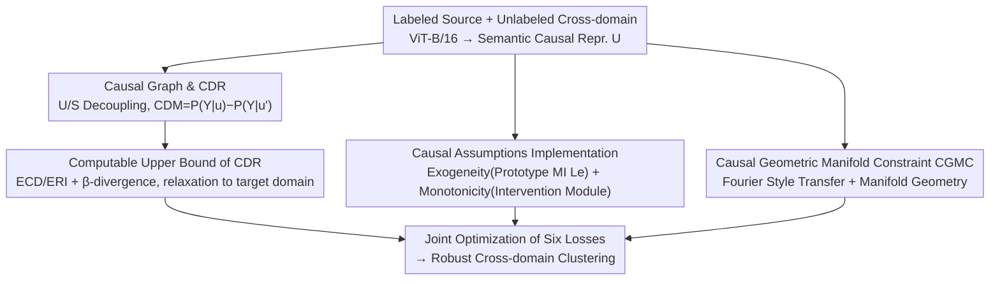

# Seeing Through the Shift: Causality-Inspired Robust Generalized Category Discovery

**Conference**: CVPR 2026  
**Paper**: [CVF Open Access](https://openaccess.thecvf.com/content/CVPR2026/html/Feng_Seeing_Through_the_Shift_Causality-Inspired_Robust_Generalized_Category_Discovery_CVPR_2026_paper.html)  
**Code**: None  
**Area**: Self-supervised / Representation Learning  
**Keywords**: Generalized Category Discovery, Cross-domain Generalization, Causal Inference, Counterfactual Risk, Manifold Constraint

## TL;DR
CausalGCD remodels "Cross-Domain Generalized Category Discovery" as a structural causal problem: it suppresses domain-related spurious shortcuts using Causal Dependence Risk (CDR) and locks the cross-domain invariant geometric relationships between known and novel classes using Causal Geometric Manifold Constraint (CGMC). It consistently outperforms SOTA methods like FREE and HiLo by approximately 2 percentage points on SSB-C and DomainNet benchmarks containing domain shifts.

## Background & Motivation
**Background**: Generalized Category Discovery (GCD) aims to cluster unlabeled data containing both known and unseen novel classes, given labels for only a subset of known classes. This line of research has matured significantly, evolving from early two-stage optimizations (GCD) to single-stage parameterized classifiers (SimGCD, SPTNet, RLCD).

**Limitations of Prior Work**: Almost all GCD methods assume that the labeled and unlabeled sets originate from the same distribution. In reality (e.g., medical imaging, cross-camera recognition), unlabeled data often comes from different devices or environments, leading to severe domain shift. Feeding such shifted samples into models can collapse their accuracy even on known domains. Existing cross-domain attempts like HiLo rely on heuristic semantic-domain decoupling with PatchMix, while CDAD-Net uses adversarial alignment. Neither addresses the underlying causal mechanism of domain shift, making them fragile to independence assumptions and adversarial instability.

**Key Challenge**: Domain shift causes two detrimental effects: ① It introduces domain-related spurious cues that distort the invariant "semantic feature $\to$ label" causal path, causing the model to learn unstable shortcuts; ② It acts as a confounder that disrupts the relationship structure (denoted as $R$ in the paper) between known and unknown classes, which is crucial for discovering novel classes. Existing methods treat these issues as standard distribution alignment problems, which fails to address the root cause.

**Key Insight**: The authors construct a causal graph for cross-domain GCD, decomposing latent representations into a semantic causal factor $U$ and a domain-specific factor $S$, assuming $S \perp U$ and $S \perp Y \mid U$. "Domain shift" is then modeled as an intervention on $S$ (changing data distribution while keeping $P(Y\mid U)$ invariant), and "novel class emergence" as a significant intervention on $U$. The confounding relationship $R \leftarrow S$ explains why known-unknown relationships are disrupted by domain shifts.

**Core Idea**: This work presents the first Structural Causal Model for cross-domain GCD. It uses a computable "Causal Dependence Risk" to force the model to rely only on stable causal semantics under counterfactuals, and employs manifold constraints to preserve invariant cross-domain geometric relationships between known/unknown classes, turning "seeing through domain shift" into an optimizable, evaluable, and identifiable objective.

## Method

### Overall Architecture
The input to CausalGCD includes labeled source domain data $D_l$ and unlabeled data $D_u$ (containing mixed known/novel classes and potential domain shifts), outputting robust clustering for $D_u$. The backbone is a DINO pre-trained ViT-B/16 (fine-tuning only the last transformer block), with the backbone features serving as the semantic causal representation $U$. An MLP intervention module (modeled as a Gaussian with learnable mean/variance following VIB principles) generates an intervened $u'$. Both are fed into a **Causal Dependence Risk Estimator** to measure "how predictions change before and after intervention," relaxing the target domain risk (which is not directly computable) into an upper bound. In parallel, prototype-level mutual information maximization implements the **exogeneity/monotonicity** causal assumptions during training, while **CGMC** constructs cross-domain samples via Fourier style transfer to constrain cross-domain consistency of the known-novel geometric relationship. Optimization is performed jointly via six loss terms.

### Key Designs

**1. Causal Graph and Causal Dependence Risk (CDR): Measuring model reliance on stable causal semantics via counterfactual differences**

To address the issue of domain-related spurious cues distorting the semantic-to-label path, the authors define a causal dependence measure in a counterfactual sense: $\text{CDM} = P(Y=y\mid u) - P(Y=y\mid u')$, where $u$ is the pre-intervention invariant causal representation and $u'$ is the post-intervention representation. A large CDM indicates strong dependence on causal variables, while a small CDM suggests weak dependence or reliance on shortcuts. The Causal Dependence Risk is defined as $\text{CDR}_Q(u,u') = -\text{CDM} := O_Q(u) - I_Q(u')$, decomposed into observational correlation risk $O_Q(u)$ and intervention correlation risk $I_Q(u')$:

$$O_Q(u) = \mathbb{E}_{(x,y)\sim Q}\big[\mathbb{E}_{u\sim P_Q(U\mid X=x)}\, P^g(Y\neq y\mid U=u)\big],\quad I_Q(u') = \mathbb{E}_{(x,y)\sim Q}\big[\mathbb{E}_{u'\sim P_Q(U'\mid X=x)}\, P^g(Y\neq y\mid U'=u')\big].$$

$O_Q$ is the prediction risk under the observed distribution, and $I_Q$ is the risk after semantic intervention. Their difference measures model sensitivity to causal interventions. Minimizing $\text{CDR}_Q(u,u')$ aligns observed and intervened predictions, suppressing domain-specific spurious correlations and pushing representations toward domain-invariant causal forms that remain stable under intervention. This is the core of the paper—it avoids standard distribution alignment by directly defining "dependence on causal semantics" via counterfactual differences.

**2. Computable Upper Bound of CDR: Relaxing target domain risk into an optimizable proxy**

The challenge is that $\text{CDR}_Q$ is defined on the target domain distribution $Q$, where labels are missing, making the expected risk uncomputable. The authors derive a computable proxy through three steps. First (Theorem 1), target CDR is decomposed into $\pi_{Q\wedge P}$ (risk for known classes) and $\pi_{Q\setminus P}$ (risk for novel class discovery). Then, two quantities independent of target labels are introduced: Expected Collaborative Bias (ECD) $\varepsilon_Q(u)=\mathbb{E}_{g_1,g_2}\mathbb{E}_{(x,y)\sim Q}\mathbb{I}[g_1(u)\neq y]\,\mathbb{I}[g_2(u)\neq y]$ (correlated prediction errors) and Expected Relationship Inconsistency (ERI) $\delta_Q(u)=\mathbb{E}_{g_1,g_2}\mathbb{E}_{x\sim Q}\mathbb{I}[g_1(u)\neq g_2(u)]$ (hypothesis space disagreement). By using $\beta$-divergence to characterize distribution mismatch and Hölder’s inequality, they derive (Theorem 2) an upper bound using computable source domain quantities and cross-domain divergence. Finally (Corollary 1), using variational inference and Hoeffding/Markov/Jensen inequalities, the gap between expected and empirical risk is bounded by a representation variation index $L_{KL} = -\log(\sigma_U) + \log(\sigma_{U'})$. A smaller KL ensures empirical $\text{CDR}_{D_u}$ faithfully approximates expected $\text{CDR}_Q$.

**3. Implementing Causal Assumptions: Exogeneity via Prototype MI and Monotonicity via Intervention Module**

Identifiability depends on two causal assumptions implemented as trainable objectives. **Exogeneity** requires that the domain factor $S$ does not confound $U\to Y$, i.e., $P(Y\mid U,S)=P(Y\mid U)$. A sufficient condition is maximizing mutual information between source and target prototypes $\max_G I(e^k_P, e^k_Q)$. In practice, target prototypes are estimated via soft-assignment weighted averages $e^k_Q=\frac{\sum_i p_{i,k} G(x_i)}{\sum_i p_{i,k}}$, and a prototype alignment loss $L_e$ pulls same-class prototypes together while pushing different/novel prototypes apart, thereby increasing $I(e^k_P,e^k_Q)$ and suppressing domain noise. **Monotonicity** requires that interventions should not increase confidence in the original label ($\max P(Y=y\mid u)-P(Y=y\mid u')$), which the authors note is naturally satisfied when minimizing CDR. A separation loss $L_{sep}=\kappa - \|u-u'\|_2^2$ provides a lower bound for intervention intensity, forcing a semantic gap between $u$ and $u'$ to avoid collapse and unstable training.

**4. Causal Geometric Manifold Constraint (CGMC): Locking cross-domain invariant known-novel relationships**

Even if features are causally invariant, discovering novel classes relies on the relationship structure between known and unknown classes, which domain shift can distort. CGMC uses Fourier style transfer to create cross-domain samples: $\tilde{x}^u_i = \mathcal{F}^{-1}(A^l_i \cdot e^{jP^u_i})$, combining source domain amplitudes (domain style) $A^l_i$ with target unlabeled phase (semantics) $P^u_i$ to produce style-swapped samples with preserved semantics. Covariance matrices $\Sigma_Z=\frac{1}{n}ZZ^\top$ are computed for original and style-transferred embeddings. The top $m$ eigenvectors form class geometric manifolds $C_G=\{\xi_1,\dots,\xi_m\}$, and geometric correlation between known class $k$ and unknown class $r$ is defined as $\text{Sim}_d(k,r)=\sum_{i=1}^m \langle \xi^k_{i,d}, \xi^r_{i,d}\rangle$. Stability of semantic structure implies $\text{Sim}_P(k,r)\approx\text{Sim}_Q(k,r)$, so the constraint $L_{cgmc}=\sum_{k\in Y_l}\sum_{r\in Y^{novel}_u}\big|\text{Sim}_P(k,r)-\text{Sim}_Q(k,r)\big|$ minimizes geometric discrepancy across domains, ensuring novel class discovery relies on stable causal geometry.

### Loss & Training
The overall objective is a weighted combination: $L = L_P + \lambda_1 L_Q + \lambda_2 L_{KL} + \lambda_3 L_e + \lambda_4 L_{cgmc} + \lambda_5 L_{sep}$. Here, $L_P$ computes empirical CDR using source labels, $L_Q$ estimates CDR via target pseudo-labels, $L_{KL}$ bridges expected/empirical risk gaps, $L_e$ ensures exogeneity, $L_{cgmc}$ is the manifold constraint, and $L_{sep}$ ensures separability. Hyperparameters used: $\lambda_{1\sim4}=0.5$, $\lambda_5=0.3$, $m=5$, $\kappa=0.5$. The DINO ViT-B/16 is fine-tuned (last block) for 200 epochs using SGD with cosine annealing (0.1 to 1e-4), batch size of 128 on 8×RTX-4090. Results are averaged over three seeds.

## Key Experimental Results

### Main Results
Evaluations are conducted on SSB-C (SSB with 9 types of corruptions × 5 intensities; clean as source, corrupted as target) and DomainNet (Real as source, other 5 domains as target). Metrics are clustering ACC after Hungarian alignment, reported as All/Old/New. Selection of results for DomainNet (All) and SSB-C (Corrupted-All) follows (%):

| Setting | Metric | HiLo | FREE | CausalGCD |
|------|------|------|------|-----------|
| Real+Painting | Painting-All | 42.1 | 45.6 | **48.0** |
| Real+Sketch | Sketch-All | 19.4 | 22.5 | **24.3** |
| Real+Clipart | Clipart-All | 27.7 | 29.3 | **31.2** |
| CUB-C | Corrupted-All | 52.0 | 55.7 | **57.8** |
| Scars-C | Corrupted-All | 35.6 | 38.9 | **41.5** |
| FGVC-C | Corrupted-All | 31.2 | 35.0 | **37.2** |

Ours demonstrates that while most existing methods degrade significantly under domain shift, CausalGCD outperforms FREE by +2.1/+2.6/+2.2 on CUB-C/Scars-C/FGVC-C, respectively. Improvements are also observed on clean domains.

### Ablation Study
Ablation on DomainNet (Real→Painting) by removing loss terms (%):

| Configuration | Real-All | Painting-All | Description |
|----------|----------|--------------|------|
| w/o $L_P$ | 63.4 | 42.8 | Removing source CDR causes largest drop |
| w/o $L_Q$ | 64.5 | 42.4 | Target CDR removal drops New class to 38.1 |
| w/o $L_e$ | 65.5 | 44.6 | Removing exogeneity hurts known class ID |
| w/o $L_{KL}$ | 66.7 | 45.8 | Decouples empirical and expected risk |
| w/o $L_{cgmc}$ | 67.6 | 45.0 | Manifold removal hurts novel class discovery |
| w/o $L_{sep}$ | 68.2 | 46.3 | Separation removal leads to training instability |
| **Full** | **69.9** | **48.0** | Full model |

### Key Findings
- The two CDR losses ($L_P$/$L_Q$) are the most significant contributors; removing either drops Painting-All to around 42%, proving causal risk optimization is the backbone.
- $L_e$ (exogeneity) mainly affects known class identification—removing it decreases Old accuracy.
- $L_{cgmc}$ primarily impacts novel class discovery, validating the role of geometric consistency.
- Distance correlation analysis using object regions extracted via IS-Net shows CausalGCD representations correlate more highly with causal factors than FREE across all non-Real domains, suggesting it successfully ignores spurious correlations.

## Highlights & Insights
- **Formalizing "seeing through shift" as counterfactual differences**: CDM/CDR provides the first optimizable and identifiable causal objective for cross-domain GCD, moving beyond heuristic alignment.
- **Complete Theoretical Chain**: Theorem 1 (splitting risk) $\to$ Theorem 2 (deriving upper bound) $\to$ Corollary 1 (controlling empirical gap via $L_{KL}$) provides a principled way to relax uncomputable risks.
- **Reusable Geometric Manifold Constraint**: Fourier style transfer for cross-domain augmentation combined with manifold eigenvector inner products offers a lightweight, interpretable measure of "relational invariance" potentially applicable beyond GCD.

## Limitations & Future Work
- The framework involves six losses and several hyperparameters ($\lambda$, $m$, $\kappa$), leading to a large search space. While weights are mostly 0.5, tuning costs for new datasets remain high.
- Monotonicity is a theoretical claim rather than an explicit constraint; its validity throughout all training phases requires further verification.
- CDR estimation for the target domain relies on pseudo-labels ($L_Q$); the impact of pseudo-label noise on bound tightness and error propagation was not deeply analyzed.
- Evaluations are limited to classification benchmarks; performance in more open or extreme fine-grained scenarios remains to be tested.

## Related Work & Insights
- **vs HiLo**: HiLo uses heuristic semantic-domain decoupling and PatchMix, which introduces noise. CausalGCD replaces this with SCM-based modeling, viewing domain shift as a formal intervention.
- **vs CDAD-Net / FREE**: CDAD-Net relies on adversarial learning, which is inherently unstable. FREE uses frequency-domain perturbation. CausalGCD outperforms FREE by ~2% and exhibits better focus on causal regions via distance correlation analysis.
- **vs IRM / Causal Domain Generalization**: While previous works applied causal SCMs to domain generalization in closed-set settings, this is the first to bridge the gap for "unlabeled with novel classes" in cross-domain GCD.

## Rating
- Novelty: ⭐⭐⭐⭐⭐ First to establish an SCM for cross-domain GCD with a computable CDR bound.
- Experimental Thoroughness: ⭐⭐⭐⭐ Solid across two benchmarks with comprehensive ablations and causal factor analysis.
- Writing Quality: ⭐⭐⭐⭐ Clear causal narrative and full theoretical derivation, though notation is dense.
- Value: ⭐⭐⭐⭐ Significant bridging of causal inference and open-world category discovery.

<!-- RELATED:START -->

## Related Papers

- [\[CVPR 2026\] The Devil Is in Gradient Entanglement: Energy-Aware Gradient Coordinator for Robust Generalized Category Discovery](the_devil_is_in_gradient_entanglement_energy-aware_gradient_coordinator_for_robu.md)
- [\[CVPR 2026\] Learning Like Humans: Analogical Concept Learning for Generalized Category Discovery](learning_like_humans_analogical_concept_learning_for_generalized_category_discov.md)
- [\[CVPR 2026\] TAR: Token-Aware Refinement for Fine-grained Generalized Category Discovery](tar_token-aware_refinement_for_fine-grained_generalized_category_discovery.md)
- [\[CVPR 2026\] Decouple Your Discovery and Memory in Continual Generalized Category Discovery](decouple_your_discovery_and_memory_in_continual_generalized_category_discovery.md)
- [\[CVPR 2026\] OmniGCD: Abstracting Generalized Category Discovery for Modality Agnosticism](omnigcd_abstracting_generalized_category_discovery_for_modality_agnosticism.md)

<!-- RELATED:END -->
